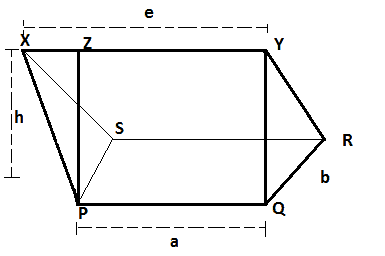

# 求矩形右楔的体积

> 原文:[https://www . geeksforgeeks . org/find-the-volume-of-直角楔/](https://www.geeksforgeeks.org/find-the-volume-of-rectangular-right-wedge/)

右楔是有平行边三角形的楔。它有两个侧底座 **a** 和 **b** ，顶边 **e** 和高度 **h** 。任务是找到给定的直角三角形的体积。



**例:**

> **输入:** a = 2，b = 5，e = 5，h = 6
> **输出:**体积= 45.0
> **输入:** a = 5，b = 4，e = 4，h = 6
> **输出:**体积= 56.0

**进场:**


Va 是三棱锥的体积即 **Va = (1 / 3) *三角形的面积*(e–a)**
三角形的面积= (1 / 2) * b * h
即**Va =(1/3)*((1/2)*(b * h *(e–a))**
Vb 是三棱柱的体积即 **Vb =截面面积*长度(边)**
即

> 总体积= va+VB
> =(1/3)*(1/2)*(b * h *(e-a))+(1/2)*(b * h * a)
> =(1/6)*(b * h *(e-a))+(1/2)*(b * h * a)
> =(b * h)*(e-a)+3 * b * h * a)/6
> =(b * h * e–b * h * a+3 * b * h * a)/6
> =(b * h * e+2 * b * h * a)/6
> =(b * h/6)*(2 * a+e)

矩形右楔的体积= (b * h / 6) * (2 * a + e)其中 a 和 b 是侧基，e 是顶边，h 是矩形右楔的高度。
以下是上述方法的实现:

## C++

```
// CPP program to find volume of rectangular right wedge
#include <bits/stdc++.h>
using namespace std;

// function to return volume
//of rectangular right wedge
double volumeRec(double a,double b,double e,double h)
{

    return (((b * h )/ 6)*(2 * a + e));
}

// Driver code
int main()
{
    double a = 2;
    double b = 5;
    double e = 5;
    double h = 6;
    printf("Volume = %.1f",volumeRec(a, b, e, h));
    return 0;
}

// This code contributed by nidhiva
```

## Java 语言(一种计算机语言，尤用于创建网站)

```
// Java implementation of the approach
class GFG {

    // Function to return the volume
    // of the rectangular right wedge
    static double volumeRec(double a, double b, double e, double h)
    {
        return (((b * h) / 6) * (2 * a + e));
    }

    // Driver code
    public static void main(String[] args) throws java.lang.Exception
    {
        double a = 2, b = 5, e = 5, h = 6;
        System.out.print("Volume = " + volumeRec(a, b, e, h));
    }
}
```

## 蟒蛇 3

```
# Python3 implementation of the approach

# Function to return the volume
# of the rectangular right wedge
def volumeRec(a, b, e, h) :

    return (((b * h) / 6) * (2 * a + e));

# Driver code
if __name__ == "__main__" :

    a = 2; b = 5; e = 5; h = 6;

    print("Volume = ",volumeRec(a, b, e, h));

# This code is contributed by AnkitRai01
```

## C#

```
// C# implementation of the approach
using System;

class GFG
{

    // Function to return the volume
    // of the rectangular right wedge
    static double volumeRec(double a, double b,
                            double e, double h)
    {
        return (((b * h) / 6) * (2 * a + e));
    }

    // Driver code
    public static void Main()
    {
        double a = 2, b = 5, e = 5, h = 6;
        Console.WriteLine("Volume = " + volumeRec(a, b, e, h));
    }
}

// This code is contributed by vt_m.
```

## java 描述语言

```
<script>
// javascript program to find volume of rectangular right wedge

// function to return volume
//of rectangular right wedge
function volumeRec( a, b, e, h)
{

    return (((b * h )/ 6)*(2 * a + e));
}

// Driver code
    let a = 2;
    let b = 5;
    let e = 5;
    let h = 6;

    document.write("Volume = "+volumeRec(a, b, e, h).toFixed(1));

// This code is contributed by Rajput-Ji

</script>
```

**Output:** 

```
Volume = 45.0
```