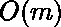

# 在矩阵

中求 M 次运算后、易的权重

> 原文:[https://www . geeksforgeeks . org/find-the-weight-at-Xi-yi-after-m-operations-in-a-matrix/](https://www.geeksforgeeks.org/find-the-weight-at-xi-yi-after-m-operations-in-a-matrix/)

给定笛卡尔平面上的 **n x n** 点，任务是在 **m** 次操作后找到 **(x <sub>i</sub> 、y <sub>j</sub> )** 处的重量。 **x <sub>i</sub> ，y <sub>j</sub> ，w** 表示在线条 **x = x <sub>i</sub> 和 y = y <sub>j</sub>** 上的所有点上添加重量 **w** 的操作。

**示例:**

> **输入:** n = 3，m = 2
> 0 0 1
> 1 1 2
> x = 1，y = 0
> **输出:** 3
> **说明:**最初，第一次操作
> 2 1 1
> 1 0
> 1 0
> 第二次操作
> 2 后，权重为
> 0 0 0 0 0
> 0 0 0
> 
> **输入:** n = 2，m = 2
> 0 1 1
> 1 0 2
> x = 1，y = 1
> T6】输出: 3

**简单方法:**
考虑一个二维数组 arr[n][n] = {0}并执行给定的操作，然后在 **(x <sub>i</sub> ，y <sub>j</sub> )** 处检索权重。这种方式需要 **O(n*m)** 时间。

**有效方法:**

*   考虑数组 arrX[n] = arrY[n] = {0}。
*   将操作 x <sub>i</sub> ，y <sub>j</sub> ，w 重新定义为

    ```
    arrX[i] += w 
    and
    arrY[j] += w

    ```

*   Find weight at (x<sub>i</sub>, y<sub>j</sub>) using

    ```
    w = arrX[i] + arrY[j]
    ```

    以下是上述方法的实现:

    ## C++

    ```
    // C++ program to find the
    // weight at xi and yi

    #include <bits/stdc++.h>
    using namespace std;

    // Function to calculate weight at (xFind, yFind)
    int findWeight(vector<vector<int> >& operations,
                   int n, int m,
                   int xFind, int yFind)
    {
        int row[n] = { 0 };
        int col[n] = { 0 };

        // Loop to perform operations
        for (int i = 0; i < m; i++) {

            // Updating row
            row[operations[i][0]]
                += operations[i][2];

            // Updating column
            col[operations[i][0]]
                += operations[i][2];
        }

        // Find weight at (xi, yj) using
        // w = arrX[i] + arrY[j]
        int result = row[xFind] + col[yFind];

        return result;
    }

    // Driver code
    int main()
    {
        vector<vector<int> > operations
            = {
                { 0, 0, 1 },
                { 1, 1, 2 }
              };
        int n = 3,
            m = operations.size(),
            xFind = 1,
            yFind = 0;
        cout << findWeight(operations,
                           n, m, xFind,
                           yFind);
        return 0;
    }
    ```

    ## 蟒蛇 3

    ```
    # Python3 program to find the
    # weight at xi and yi

    # Function to calculate weight at (xFind, yFind)
    def findWeight(operations, n, m, xFind, yFind) :

        row = [ 0 ] * n
        col = [ 0 ] * n

        # Loop to perform operations
        for i in range(m) :

            # Updating row
            row[operations[i][0]]+= operations[i][2]

            # Updating column
            col[operations[i][0]]+= operations[i][2]

        # Find weight at (xi, yj) using
        # w = arrX[i] + arrY[j]
        result = row[xFind] + col[yFind]

        return result

    # Driver code
    operations = [[ 0, 0, 1 ],[ 1, 1, 2 ]]
    n = 2
    m = len(operations)
    xFind = 1
    yFind = 0
    print(findWeight(operations,n, m, xFind, yFind))

    # This code is contributed by divyamohan123
    ```

    **Output:**

    ```
    3
    ```

    **时间复杂度:** 其中 m 为运算次数