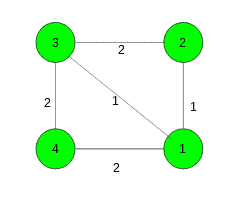

# 求最小生成树的权重

> 原文:[https://www . geesforgeks . org/find-最小生成树的权重/](https://www.geeksforgeeks.org/find-the-weight-of-the-minimum-spanning-tree/)

给定一个有 **N 个节点**和 **M 条边**的连通无向加权图。任务是执行给定的查询并找到最小生成树的权重。查询有三种类型:

1.  **查询(1)** - >找到最小生成树的权重。
2.  **查询(2，x，y)** - >将节点 **x** 和 **y** 之间的边的权重改为 **0** 。
3.  **查询(3，x，y)** - >将节点 **x** 和 **y** 之间的边的权重恢复为其**原始权重**。

**例:**

> **输入:**
> 
> 
> 
> 查询(2，1，2)、
> 查询(1)、
> 查询(3，1，2)、
> 查询(1)
> **输出:**
> 2
> 3
> **输入:**
> 
> 
> 
> 查询(1)、
> 查询(2、3、4)、
> 查询(1)
> **输出:**
> 4
> 2

**方法:**在执行任何查询之前，让我们首先计算初始图的 MST，并让 T 成为这个 MST。关键的观察是，在处理查询的任何时候，当前图的 MST 的权重都可以通过在该点的权重为零的边和 T 的边上运行[克鲁斯卡尔算法](https://www.geeksforgeeks.org/kruskals-minimum-spanning-tree-algorithm-greedy-algo-2/)来计算。因此，在数据结构中保持权重为零的边，并且在类型 2 和类型 3 的查询之后，计算最小生成树的权重。
以下是上述方法的实施:

## C++

```
// C++ implementation of the approach
#include <bits/stdc++.h>
using namespace std;
#define N 2005

// To store vertices, edges
// and the required answer
int n, m, ans;

// To store parent and rank
int par[N], Rank[N];

// To store edges and the edges in MST
vector<pair<int, pair<int, int> > > edges, mst;

// To store the edges with weight zero
queue<pair<int, int> > zeros;

// Function for initialize
void initialize()
{
    for (int i = 0; i <= n; i++) {
        par[i] = i;
        Rank[i] = 0;
    }
}

// Function to add edges
void Add_edge(int u, int v, int weight)
{
    edges.push_back({ weight, { u, v } });
}

// Utility function to find set of an element i
// (uses path compression technique)
int find(int x)
{
    if (par[x] != x)
        par[x] = find(par[x]);

    return par[x];
}

// Function that performs union of two sets x and y
// (uses union by rank)
void Union(int x, int y)
{
    int xroot = find(x);
    int yroot = find(y);

    if (Rank[xroot] < Rank[yroot])
        par[xroot] = yroot;
    else if (Rank[xroot] > Rank[yroot])
        par[yroot] = xroot;
    else {
        par[yroot] = xroot;
        Rank[xroot]++;
    }
}

// Function to compute minimum spanning tree
void compute_MST()
{
    // Sort edges in increasing order of weight
    sort(edges.begin(), edges.end());

    // Go through all the edges
    for (int i = 0; i < m; i++) {
        int u = find(edges[i].second.first);
        int v = find(edges[i].second.second);

        if (u == v)
            continue;

        // Build minimum spanning tree
        // and store minimum cost
        mst.push_back(edges[i]);
        ans += edges[i].first;
        Union(u, v);
    }
}

// Function to find the cost of minimum
// spanning tree
void Modified_Kruskal(pair<int, int> x)
{
    initialize();

    // Make answer zero
    ans = 0;
    int sz = zeros.size();

    // Keep the edges which only have zero weights
    // and remove all the other edges
    for (int i = 0; i < sz; i++) {
        pair<int, int> Front = zeros.front();
        zeros.pop();

        if (Front.first == x.first
            and Front.second == x.second)
            continue;

        // Make union between the vertices of
        // edges which have weight zero and keep
        // them in queue
        Union(Front.first, Front.second);
        zeros.push(Front);
    }

    // Find the cost of the minimum spanning tree
    for (int i = 0; i < mst.size(); i++) {
        int u = find(mst[i].second.first);
        int v = find(mst[i].second.second);

        if (u == v)
            continue;

        ans += mst[i].first;
        Union(u, v);
    }
}

// Function to handle different queries
void query(int type, int u = 0, int v = 0)
{

    // Update edge weight to 0
    if (type == 2) {
        // push edge in zeros
        zeros.push({ u, v });
        Modified_Kruskal({ -1, -1 });
    }

    // Restore edge weight to original value
    else if (type == 3) {
        // push edge in zeros
        zeros.push({ u, v });
        Modified_Kruskal({ u, v });
    }
    else
        cout << ans << endl;
}

// Driver code
int main()
{

    // Number of nodes and edges
    n = 4, m = 4;
    initialize();

    // Add edges
    Add_edge(1, 2, 1);
    Add_edge(2, 3, 1);
    Add_edge(3, 4, 1);
    Add_edge(4, 1, 1);

    // Build the minimum spanning tree
    compute_MST();

    // Execute queries
    query(2, 1, 2);
    query(1);
    query(3, 1, 2);
    query(1);

    return 0;
}
```

## 蟒蛇 3

```
# Python3 implementation of the approach
from collections import deque

N = 2005

# To store vertices, edges
# and the required answer
n, m, ans = 0, 0, 0

# To store parent and rank
par = [0] * N
Rank = [0] * N

# To store edges and the edges in MST
edges, mst = [], []

# To store the edges with weight zero
zeroes = deque()

# Function for initialize
def initialize():
    for i in range(n + 1):
        par[i] = i
        Rank[i] = 0

# Function to add edges
def add_edge(u: int, v: int, weight: int):
    edges.append((weight, (u, v)))

# Utility function to find set of an element i
# (uses path compression technique)
def find(x: int) -> int:
    if par[x] != x:
        par[x] = find(par[x])
    return par[x]

# Function that performs union of two sets x and y
# (uses union by rank)
def union(x: int, y: int):
    xroot = find(x)
    yroot = find(y)

    if Rank[xroot] < Rank[yroot]:
        par[xroot] = yroot
    elif Rank[xroot] > Rank[yroot]:
        par[yroot] = xroot
    else:
        par[yroot] = xroot
        Rank[xroot] += 1

# Function to compute minimum spanning tree
def compute_MST():
    global ans

    # Sort edges in increasing order of weight
    edges.sort()

    # Go through all the edges
    for i in range(m):
        u = find(edges[i][1][0])
        v = find(edges[i][1][1])

        if u == v:
            continue

        # Build minimum spanning tree
        # and store minimum cost
        mst.append(edges[i])
        ans += edges[i][0]
        union(u, v)

# Function to find the cost of minimum
# spanning tree
def modified_kruskal(x):
    global ans
    initialize()

    # Make answer zero
    ans = 0
    sz = len(zeroes)

    # Keep the edges which only have zero weights
    # and remove all the other edges
    for i in range(sz):
        front = zeroes[0]
        zeroes.popleft()

        if front[0] == x[0] and front[1] == x[1]:
            continue

        # Make union between the vertices of
        # edges which have weight zero and keep
        # them in queue
        union(front[0], front[1])
        zeroes.append(front)

    # Find the cost of the minimum spanning tree
    for i in range(len(mst)):
        u = find(mst[i][1][0])
        v = find(mst[i][1][1])

        if u == v:
            continue
        ans += mst[i][0]
        union(u, v)

# Function to handle different queries
def query(type: int, u=0, v=0):
    global ans

    # Update edge weight to 0
    if type == 2:

        # push edge in zeros
        zeroes.append((u, v))
        modified_kruskal((-1, -1))

    # Restore edge weight to original value
    elif type == 3:

        # push edge in zeros
        zeroes.append((u, v))
        modified_kruskal((u, v))
    else:
        print(ans)

# Driver Code
if __name__ == "__main__":

    # Number of nodes and edges
    n = 4
    m = 4
    initialize()

    # Add edges
    add_edge(1, 2, 1)
    add_edge(2, 3, 1)
    add_edge(3, 4, 1)
    add_edge(4, 1, 1)

    # Build the minimum spanning tree
    compute_MST()

    # Execute queries
    query(2, 1, 2)
    query(1)
    query(3, 1, 2)
    query(1)

# This code is contributed by
# sanjeev2552
```

**Output:** 

```
2
3
```

**时间复杂度:**每个查询 O(N)，其中 N 是图中的节点总数。
**辅助空间:** O(N)