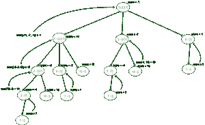

# 每回合从一堆石头中最多移除 3 块石头的游戏中找到赢家

> 原文:[https://www . geeksforgeeks . org/寻找每回合从一堆石头中最多移除 3 块石头的游戏赢家/](https://www.geeksforgeeks.org/find-the-winner-of-a-game-of-removing-at-most-3-stones-from-a-pile-in-each-turn/)

给定一个大小为 **N** 的[**arr【】**，表示分配给 **N** 石头的值，两个玩家**玩家 1** 和**玩家 2** 玩一个交替回合的游戏。在每一回合中，玩家可以从第一个剩余的石头中取出 **1、2、**或 **3** 块石头，所有移除的石头的值之和加到玩家的分数中。考虑到两个玩家都玩得最好，任务是打印游戏的赢家。如果双方以相同的分数结束比赛，打印**“平局”**。](https://www.geeksforgeeks.org/introduction-to-arrays/)

**示例:**

> **输入:** arr[] = {1，2，3，7}
> **输出:**玩家 2
> **说明:**玩家 1 在最优场景下总是会输。
> 
> **输入:** arr[] = {1，2，3，-9}
> **输出:** Player1
> **说明:** Player1 第一招必须选择全部三桩才能赢，给 Player2 留下负分。
> 如果玩家 1 只选择一颗石头，他的分数将为 1，下一步玩家 2 的分数将变为 5。
> 下一步玩家 1 将拿走价值= -9 的石头，输。
> 如果玩家 1 选择两堆，他的分数将为 3，下一步玩家 2 的分数将为 3。
> 玩家 1 下一步棋会拿走价值= -9 的石头，也会输。

**天真方法:**简单的方法是挑选宝石数量，使宝石的总价值最大化。当两个玩家都玩得最好，玩家 1 开始游戏时，玩家 1 选择 1 或 2 或 3 块石头，剩下的石头传给下一个玩家。因此，玩家 2 的分数必须从玩家 1 的分数中减去。想法是用[递归](https://www.geeksforgeeks.org/recursion/)来解决问题。让玩家 1 的最大得分为 **res** ，这是在递归调用之后获得的。

*   如果结果为 **res > 0** ，玩家 1 获胜
*   如果结果是 **res < 0** ，玩家 2 获胜
*   如果结果 **res == 0** ，那么就是平局。

[递归树](https://www.geeksforgeeks.org/recursion/)看起来是这样的，有些子问题重复很多次。



按照以下步骤解决问题:

*   声明一个[递归函数](https://www.geeksforgeeks.org/recursive-functions/)，比如说 **maxScore(i)** ，如果游戏从索引 **i** 开始计算 Player1 的最大得分
    *   如果 **i ≥** **n** 的值，返回 **0** 。
    *   初始化一个变量，说**得分**为 [INT_MIN](https://www.geeksforgeeks.org/int_max-int_min-cc-applications/) ，存储玩家 1 的最高得分
        *   挑 1 石:**分数=最大值(分数，arr[I]–最大分数(i + 1))**
        *   拾取 2 块石头，即 **(i + 1 < N)** : **分数=最大值(分数，arr[I]+arr[I+1]–最大分数(i + 2))**
        *   拾取 3 块石头，即 **(i + 2 < N)** : **得分=最大值(得分，arr[I]+arr[I+1]+arr[I+2]–最大得分(i + 3))**
    *   返回**得分**的值。
*   将**最大得分(0)** 的值存储在变量 **res** 中。
*   如果**的值为 res > 0** ，则打印**“球员 1”**，如果**的值为 res < 0** ，则打印**“球员 2”**，否则打印**“铁”**。

下面是上述方法的实现:

## C++

```
// C++ program for the above approach
#include <bits/stdc++.h>
using namespace std;

// Function to find the maximum score of Player1
int maximumStonesUtil(int* arr, int n, int i)
{
    // Base Case
    if (i >= n)
        return 0;

    // Variable to store maximum score
    int ans = INT_MIN;

    // Pick one stone
    ans = max(ans,
              arr[i] - maximumStonesUtil(arr, n, i + 1));

    // Pick 2 stones
    if (i + 1 < n)
        ans = max(ans,
                  arr[i] + arr[i + 1]
                      - maximumStonesUtil(arr, n, i + 2));

    // Pick 3 stones
    if (i + 2 < n)
        ans = max(ans,
                  arr[i] + arr[i + 1] + arr[i + 2]
                      - maximumStonesUtil(arr, n, i + 3));

    // Return the score of the player
    return ans;
}

// Function to find the winner of the game
string maximumStones(int* arr, int n)
{
    // Store the result
    int res = maximumStonesUtil(arr, n, 0);

    // Player 1 wins
    if (res > 0)
        return "Player1";

    // PLayer 2 wins
    else if (res < 0)
        return "Player2";

    // Tie
    else
        return "Tie";
}

// Driver Code
int main()
{
    // Given Input
    int arr[] = { 1, 2, 3, 7 };
    int n = sizeof(arr) / sizeof(arr[0]);

    // Function Call
    cout << maximumStones(arr, n);

    return 0;
}
```

## Java 语言(一种计算机语言，尤用于创建网站)

```
// Java program for the above approach
class GFG{

// Function to find the maximum score of Player1
static int maximumStonesUtil(int[] arr, int n,
                             int i)
{

    // Base Case
    if (i >= n)
        return 0;

    // Variable to store maximum score
    int ans = Integer.MIN_VALUE;

    // Pick one stone
    ans = Math.max(ans, arr[i] - maximumStonesUtil(
                     arr, n, i + 1));

    // Pick 2 stones
    if (i + 1 < n)
        ans = Math.max(ans, arr[i] + arr[i + 1] -
               maximumStonesUtil(arr, n, i + 2));

    // Pick 3 stones
    if (i + 2 < n)
        ans = Math.max(
            ans,
            arr[i] + arr[i + 1] + arr[i + 2]
                - maximumStonesUtil(arr, n, i + 3));

    // Return the score of the player
    return ans;
}

// Function to find the winner of the game
static String maximumStones(int[] arr, int n)
{

    // Store the result
    int res = maximumStonesUtil(arr, n, 0);

    // Player 1 wins
    if (res > 0)
        return "Player1";

    // PLayer 2 wins
    else if (res < 0)
        return "Player2";

    // Tie
    else
        return "Tie";
}

// Driver code
public static void main(String[] args)
{
    int arr[] = { 1, 2, 3, 7 };
    int n = arr.length;

    // Function Call
    System.out.println(maximumStones(arr, n));
}
}

// This code is contributed by abhinavjain194
```

## 蟒蛇 3

```
# Python3 program for the above approach
import sys

# Function to find the maximum score of Player1
def maximumStonesUtil(arr, n, i):

    # Base Case
    if (i >= n):
        return 0

    # Variable to store maximum score
    ans = -sys.maxsize-1;

    # Pick one stone
    ans = max(
        ans, arr[i] - maximumStonesUtil(
                       arr, n, i + 1))

    # Pick 2 stones
    if (i + 1 < n):
        ans = max(
            ans, arr[i] + arr[i + 1]- maximumStonesUtil(
                      arr, n, i + 2))

    # Pick 3 stones
    if (i + 2 < n):
        ans = max(
            ans, arr[i] + arr[i + 1] + arr[i + 2]-
                 maximumStonesUtil(arr, n, i + 3));

    # Return the score of the player
    return ans

# Function to find the winner of the game
def maximumStones(arr, n):

    # Store the result
    res = maximumStonesUtil(arr, n, 0)

    # Player 1 wins
    if (res > 0):
        return "Player1"

    # PLayer 2 wins
    elif(res < 0):
        return "Player2"

    # Tie
    else:
        return "Tie"

# Driver Code
if __name__ == '__main__':

    # Given Input
    arr = [ 1, 2, 3, 7 ]
    n = len(arr)

    # Function Call
    print(maximumStones(arr, n))

# This code is contributed by SURENDRA_GANGWAR
```

## C#

```
// C# program for the above approach
using System;

class GFG
{

// Function to find the maximum score of Player1
static int maximumStonesUtil(int[] arr, int n,
                             int i)
{

    // Base Case
    if (i >= n)
        return 0;

    // Variable to store maximum score
    int ans = Int32.MinValue;

    // Pick one stone
    ans = Math.Max(ans, arr[i] - maximumStonesUtil(
                     arr, n, i + 1));

    // Pick 2 stones
    if (i + 1 < n)
        ans = Math.Max(ans, arr[i] + arr[i + 1] -
               maximumStonesUtil(arr, n, i + 2));

    // Pick 3 stones
    if (i + 2 < n)
        ans = Math.Max(
            ans,
            arr[i] + arr[i + 1] + arr[i + 2]
                - maximumStonesUtil(arr, n, i + 3));

    // Return the score of the player
    return ans;
}

// Function to find the winner of the game
static String maximumStones(int[] arr, int n)
{

    // Store the result
    int res = maximumStonesUtil(arr, n, 0);

    // Player 1 wins
    if (res > 0)
        return "Player1";

    // PLayer 2 wins
    else if (res < 0)
        return "Player2";

    // Tie
    else
        return "Tie";
}

// Driver Code
public static void Main()
{
    int[] arr = { 1, 2, 3, 7 };
    int n = arr.Length;

    // Function Call
    Console.WriteLine(maximumStones(arr, n));

}
}

// This code is contributed by code_hunt.
```

## java 描述语言

```
<script>
    // Javascript program for the above approach

    // Function to find the maximum score of Player1
    function maximumStonesUtil(arr, n, i)
    {

        // Base Case
        if (i >= n)
            return 0;

        // Variable to store maximum score
        let ans = Number.MIN_VALUE;

        // Pick one stone
        ans = Math.max(ans, arr[i] - maximumStonesUtil(arr, n, i + 1));

        // Pick 2 stones
        if (i + 1 < n)
            ans = Math.max(ans, arr[i] + arr[i + 1] - maximumStonesUtil(arr, n, i + 2));

        // Pick 3 stones
        if (i + 2 < n)
            ans = Math.max(
                ans,
                arr[i] + arr[i + 1] + arr[i + 2]
                    - maximumStonesUtil(arr, n, i + 3));

        // Return the score of the player
        return ans;
    }

    // Function to find the winner of the game
    function maximumStones(arr, n)
    {

        // Store the result
        let res = maximumStonesUtil(arr, n, 0);

        // Player 1 wins
        if (res < 0)
            return "Player1";

        // PLayer 2 wins
        else if (res > 0)
            return "Player2";

        // Tie
        else
            return "Tie";
    }

    let arr = [ 1, 2, 3, 7 ];
    let n = arr.length;

    // Function Call
    document.write(maximumStones(arr, n));

// This code is contributed by rameshtravel07.
</script>
```

**Output:** 

```
Player2
```

***时间复杂度:**O(3<sup>N</sup>)*
***辅助空间:** O(N)*

**高效途径:**优化上述途径，思路是使用[动态规划](https://www.geeksforgeeks.org/dynamic-programming/)。给定问题有[最优子结构性质](https://www.geeksforgeeks.org/optimal-substructure-property-in-dynamic-programming-dp-2/)和[重叠子问题](https://www.geeksforgeeks.org/overlapping-subproblems-property-in-dynamic-programming-dp-1/)。通过创建一个 1D 表来使用[记忆](https://www.geeksforgeeks.org/memoization-1d-2d-and-3d/)，大小为 **N** 的 **dp** 来存储递归调用的结果。

下面是上述方法的实现:

## C++

```
// C++ program for the above approach
#include <bits/stdc++.h>
using namespace std;

// Function to find the maximum score of Player 1
int maximumStonesUtil(int* arr, int n, int i,
                      vector<int>& dp)
{
    // Base Case
    if (i >= n)
        return 0;

    int& ans = dp[i];

    // If the result is already computed, then
    // return the result
    if (ans != -1)
        return ans;

    // Variable to store maximum score
    ans = INT_MIN;

    // Pick one stone
    ans = max(
        ans, arr[i] - maximumStonesUtil(arr, n, i + 1, dp));

    // Pick 2 stones
    if (i + 1 < n)
        ans = max(ans, arr[i] + arr[i + 1]
                           - maximumStonesUtil(arr, n,
                                               i + 2, dp));

    // Pick 3 stones
    if (i + 2 < n)
        ans = max(ans, arr[i] + arr[i + 1] + arr[i + 2]
                           - maximumStonesUtil(arr, n,
                                               i + 3, dp));

    // Return the score of the player
    return ans;
}

// Function to find the winner of the game
string maximumStones(int* arr, int n)
{
    // Create a 1D table, dp of size N
    vector<int> dp(n, -1);

    // Store the result
    int res = maximumStonesUtil(arr, n, 0, dp);

    // Player 1 wins
    if (res > 0)
        return "Player1";

    // PLayer 2 wins
    else if (res < 0)
        return "Player2";

    // Tie
    else
        return "Tie";
}

// Driver Code
int main()
{
    // Given Input
    int arr[] = { 1, 2, 3, 7 };
    int n = sizeof(arr) / sizeof(arr[0]);

    // Function Call
    cout << maximumStones(arr, n);

    return 0;
}
```

## Java 语言(一种计算机语言，尤用于创建网站)

```
// Java program for the above approach
import java.util.*;
class GFG
{
    static int ans = 0;

// Function to find the maximum score of Player 1
static int maximumStonesUtil(int[] arr, int n, int i,
                      int[] dp)
{
    // Base Case
    if (i >= n)
        return 0;

    ans = dp[i];

    // If the result is already computed, then
    // return the result
    if (ans != -1)
        return ans;

    // Variable to store maximum score
    ans = Integer.MIN_VALUE;

    // Pick one stone
    ans = Math.max(
        ans, arr[i] - maximumStonesUtil(arr, n, i + 1, dp));

    // Pick 2 stones
    if (i + 1 < n)
        ans = Math.max(ans, arr[i] + arr[i + 1]
                           - maximumStonesUtil(arr, n,
                                               i + 2, dp));

    // Pick 3 stones
    if (i + 2 < n)
        ans = Math.max(ans, arr[i] + arr[i + 1] + arr[i + 2]
                           - maximumStonesUtil(arr, n,
                                               i + 3, dp));

    // Return the score of the player
    return ans;
}

// Function to find the winner of the game
static String maximumStones(int []arr, int n)
{
    // Create a 1D table, dp of size N
    int []dp = new int[n];
    Arrays.fill(dp, -1);

    // Store the result
    int res = maximumStonesUtil(arr, n, 0, dp);

    // Player 1 wins
    if (res > 0)
        return "Player1";

    // PLayer 2 wins
    else if (res < 0)
        return "Player2";

    // Tie
    else
        return "Tie";
}

// Driver Code
public static void main(String[] args)
{
    // Given Input
    int arr[] = { 1, 2, 3, 7 };
    int n = arr.length;

    // Function Call
    System.out.print(maximumStones(arr, n));

}
}

// This code is contributed by Amit Katiyar
```

## 蟒蛇 3

```
# Python program for the above approach

# Function to find the maximum score of Player 1
def maximumStonesUtil(arr, n, i, dp):

    # Base Case
    if (i >= n):
        return 0

    ans = dp[i]

    # If the result is already computed, then
    # return the result
    if (ans != -1):
        return ans

    # Variable to store maximum score
    ans = -2**31

    # Pick one stone
    ans = max( ans, arr[i] - maximumStonesUtil(arr, n, i + 1, dp))

    # Pick 2 stones
    if (i + 1 < n):
        ans = max(ans, arr[i] + arr[i + 1] - maximumStonesUtil(arr, n, i + 2, dp))

    # Pick 3 stones
    if (i + 2 < n):
        ans = max(ans, arr[i] + arr[i + 1] + arr[i + 2] - maximumStonesUtil(arr, n, i + 3, dp))

    # Return the score of the player
    return ans

# Function to find the winner of the game
def maximumStones(arr, n):
    # Create a 1D table, dp of size N
    dp =[-1]*n

    # Store the result
    res = maximumStonesUtil(arr, n, 0, dp)

    # Player 1 wins
    if (res > 0):
        return "Player1"

    # PLayer 2 wins
    elif (res < 0):
        return "Player2"

    # Tie
    else:
        return "Tie"

# Driver Code

# Given Input
arr = [1, 2, 3, 7]
n = len(arr)

# Function Call
print(maximumStones(arr, n))

# This code is contributed by shivani
```

## C#

```
// C# program for the above approach
using System;

public class GFG
{
    static int ans = 0;

// Function to find the maximum score of Player 1
static int maximumStonesUtil(int[] arr, int n, int i,
                      int[] dp)
{
    // Base Case
    if (i >= n)
        return 0;

    ans = dp[i];

    // If the result is already computed, then
    // return the result
    if (ans != -1)
        return ans;

    // Variable to store maximum score
    ans = int.MinValue;

    // Pick one stone
    ans = Math.Max(
        ans, arr[i] - maximumStonesUtil(arr, n, i + 1, dp));

    // Pick 2 stones
    if (i + 1 < n)
        ans = Math.Max(ans, arr[i] + arr[i + 1]
                           - maximumStonesUtil(arr, n,
                                               i + 2, dp));

    // Pick 3 stones
    if (i + 2 < n)
        ans = Math.Max(ans, arr[i] + arr[i + 1] + arr[i + 2]
                           - maximumStonesUtil(arr, n,
                                               i + 3, dp));

    // Return the score of the player
    return ans;
}

// Function to find the winner of the game
static String maximumStones(int []arr, int n)
{
    // Create a 1D table, dp of size N
    int []dp = new int[n];
    for(int i = 0; i < n; i++)
        dp[i]=-1;

    // Store the result
    int res = maximumStonesUtil(arr, n, 0, dp);

    // Player 1 wins
    if (res > 0)
        return "Player1";

    // PLayer 2 wins
    else if (res < 0)
        return "Player2";

    // Tie
    else
        return "Tie";
}

// Driver Code
public static void Main(String[] args)
{
    // Given Input
    int []arr = { 1, 2, 3, 7 };
    int n = arr.Length;

    // Function Call
    Console.Write(maximumStones(arr, n));

}
}

// This code contributed by shikhasingrajput
```

**Output:** 

```
Player2
```

***时间复杂度:**O(N)*
T5**辅助空间:** O(N)