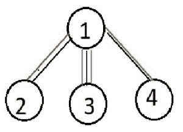

# 找到三元组，使得连接这些三元组的节点数量最大

> 原文:[https://www . geeksforgeeks . org/find-三元组-这样-连接这些三元组的节点数-最大值/](https://www.geeksforgeeks.org/find-triplet-such-that-number-of-nodes-connecting-these-triplets-is-maximum/)

给定一棵具有 **N** 个节点的树，任务是找到三个节点 **(a，b，c)** 使得连接这些节点的路径中覆盖的节点数量最大。(仅统计一次节点)。
**例:**

> **输入:** N = 4
> 边集:
> 1 2
> 1 3
> 1 4
> **输出:** (2，3，4)
> (2，3，4)因为(2，3)之间的路径覆盖节点 2，1，3，而(3，4)之间的路径覆盖节点 3，1，4。因此覆盖了所有节点。
> 
> 
> 
> 树中的红色路径表示 2 到 3 节点之间的路径，包括节点 1、2、3。绿色路径表示(3，4)之间的路径，覆盖节点 3，1，4。
> **输入:** N = 9
> 边集:
> 1 2
> 2 3
> 3 4
> 4 5
> 5 6
> 2 7
> 7 8
> 4 9
> **输出:** (6，8，1)

**进场:**

*   需要注意的一点是，三元组中的两个点必须是树直径的末端，以覆盖最大的点。
*   我们需要找到符合直径的最长树枝。
*   现在，对于第三个节点，将 DFS 应用于直径路径上的所有节点，同时保持每个节点的深度(除了所选直径路径之外的所有方向上的 DFS)，距离最远的节点将被视为第三个节点，因为它覆盖了最大节点，而不是直径已经覆盖的节点。[使用 DFS 的树木直径](https://www.geeksforgeeks.org/diameter-tree-using-dfs/)

以下是上述方法的实现:

## C++

```
// C++ implementation of the approach
#include <bits/stdc++.h>
#define ll long long int
#define MAX 100005
using namespace std;
vector<int> adjacent[MAX];
bool visited[MAX];

// To store the required nodes
int startnode, endnode, thirdnode;

int maxi = -1, N;

// Parent array to retrace the nodes
int parent[MAX];

// Visited array to prevent DFS
// in direction on Diameter path
bool vis[MAX];

// DFS function to find the startnode
void dfs(int u, int count)
{
    visited[u] = true;
    int temp = 0;
    for (int i = 0; i < adjacent[u].size(); i++) {
        if (!visited[adjacent[u][i]]) {
            temp++;
            dfs(adjacent[u][i], count + 1);
        }
    }

    if (temp == 0) {
        if (maxi < count) {
            maxi = count;
            startnode = u;
        }
    }
}

// DFS function to find the endnode
// of diameter and maintain the parent array
void dfs1(int u, int count)
{
    visited[u] = true;
    int temp = 0;
    for (int i = 0; i < adjacent[u].size(); i++) {
        if (!visited[adjacent[u][i]]) {
            temp++;
            parent[adjacent[u][i]] = u;
            dfs1(adjacent[u][i], count + 1);
        }
    }

    if (temp == 0) {
        if (maxi < count) {
            maxi = count;
            endnode = u;
        }
    }
}

// DFS function to find the end node
// of the Longest Branch to Diameter
void dfs2(int u, int count)
{
    visited[u] = true;
    int temp = 0;
    for (int i = 0; i < adjacent[u].size(); i++) {
        if (!visited[adjacent[u][i]]
            && !vis[adjacent[u][i]]) {
            temp++;
            dfs2(adjacent[u][i], count + 1);
        }
    }
    if (temp == 0) {
        if (maxi < count) {
            maxi = count;
            thirdnode = u;
        }
    }
}

// Function to find the required nodes
void findNodes()
{
    // To find start node of diameter
    dfs(1, 0);

    for (int i = 0; i <= N; i++)
        visited[i] = false;

    maxi = -1;

    // To find end node of diameter
    dfs1(startnode, 0);

    for (int i = 0; i <= N; i++)
        visited[i] = false;

    // x is the end node of diameter
    int x = endnode;
    vis[startnode] = true;

    // Mark all the nodes on diameter
    // using back tracking
    while (x != startnode) {
        vis[x] = true;
        x = parent[x];
    }

    maxi = -1;

    // Find the end node of longest
    // branch to diameter
    for (int i = 1; i <= N; i++) {
        if (vis[i])
            dfs2(i, 0);
    }
}

// Driver code
int main()
{
    N = 4;
    adjacent[1].push_back(2);
    adjacent[2].push_back(1);
    adjacent[1].push_back(3);
    adjacent[3].push_back(1);
    adjacent[1].push_back(4);
    adjacent[4].push_back(1);

    findNodes();

    cout << "(" << startnode << ", " << endnode
         << ", " << thirdnode << ")";

    return 0;
}
```

## Java 语言(一种计算机语言，尤用于创建网站)

```
// Java implementation of the approach
import java.util.*;

class GFG
{
static int MAX = 100005;
static Vector<Vector<Integer>> adjacent = new
       Vector<Vector<Integer>> ();
static boolean visited[] = new boolean[MAX];

// To store the required nodes
static int startnode, endnode, thirdnode;

static int maxi = -1, N;

// Parent array to retrace the nodes
static int parent[] = new int[MAX];

// Visited array to prevent DFS
// in direction on Diameter path
static boolean vis[] = new boolean[MAX];

// DFS function to find the startnode
static void dfs(int u, int count)
{
    visited[u] = true;
    int temp = 0;
    for (int i = 0; i < adjacent.get(u).size(); i++)
    {
        if (!visited[adjacent.get(u).get(i)])
        {
            temp++;
            dfs(adjacent.get(u).get(i), count + 1);
        }
    }

    if (temp == 0)
    {
        if (maxi < count)
        {
            maxi = count;
            startnode = u;
        }
    }
}

// DFS function to find the endnode
// of diameter and maintain the parent array
static void dfs1(int u, int count)
{
    visited[u] = true;
    int temp = 0;
    for (int i = 0; i < adjacent.get(u).size(); i++)
    {
        if (!visited[adjacent.get(u).get(i)])
        {
            temp++;
            parent[adjacent.get(u).get(i)] = u;
            dfs1(adjacent.get(u).get(i), count + 1);
        }
    }

    if (temp == 0)
    {
        if (maxi < count)
        {
            maxi = count;
            endnode = u;
        }
    }
}

// DFS function to find the end node
// of the Longest Branch to Diameter
static void dfs2(int u, int count)
{
    visited[u] = true;
    int temp = 0;
    for (int i = 0; i < adjacent.get(u).size(); i++)
    {
        if (!visited[adjacent.get(u).get(i)] &&
            !vis[adjacent.get(u).get(i)])
        {
            temp++;
            dfs2(adjacent.get(u).get(i), count + 1);
        }
    }
    if (temp == 0)
    {
        if (maxi < count)
        {
            maxi = count;
            thirdnode = u;
        }
    }
}

// Function to find the required nodes
static void findNodes()
{
    // To find start node of diameter
    dfs(1, 0);

    for (int i = 0; i <= N; i++)
        visited[i] = false;

    maxi = -1;

    // To find end node of diameter
    dfs1(startnode, 0);

    for (int i = 0; i <= N; i++)
        visited[i] = false;

    // x is the end node of diameter
    int x = endnode;
    vis[startnode] = true;

    // Mark all the nodes on diameter
    // using back tracking
    while (x != startnode)
    {
        vis[x] = true;
        x = parent[x];
    }

    maxi = -1;

    // Find the end node of longest
    // branch to diameter
    for (int i = 1; i <= N; i++)
    {
        if (vis[i])
            dfs2(i, 0);
    }
}

// Driver code
public static void main(String args[])
{
    for(int i = 0; i < MAX; i++)
    adjacent.add(new Vector<Integer>());

    N = 4;
    adjacent.get(1).add(2);
    adjacent.get(2).add(1);
    adjacent.get(1).add(3);
    adjacent.get(3).add(1);
    adjacent.get(1).add(4);
    adjacent.get(4).add(1);

    findNodes();

    System.out.print( "(" + startnode + ", " +
                            endnode + ", " +
                            thirdnode + ")");
}
}

// This code is contributed by Arnab Kundu
```

## 蟒蛇 3

```
# Python3 implementation of the approach

MAX = 100005
adjacent = [[] for i in range(MAX)]
visited = [False] * MAX

# To store the required nodes
startnode = endnode = thirdnode = None
maxi, N = -1, None

# Parent array to retrace the nodes
parent = [None] * MAX

# Visited array to prevent DFS
# in direction on Diameter path
vis = [False] * MAX

# DFS function to find the startnode
def dfs(u, count):

    visited[u] = True
    temp = 0
    global startnode, maxi

    for i in range(0, len(adjacent[u])):
        if not visited[adjacent[u][i]]:
            temp += 1
            dfs(adjacent[u][i], count + 1)

    if temp == 0:
        if maxi < count:
            maxi = count
            startnode = u

# DFS function to find the endnode of
# diameter and maintain the parent array
def dfs1(u, count):

    visited[u] = True
    temp = 0
    global endnode, maxi

    for i in range(0, len(adjacent[u])):
        if not visited[adjacent[u][i]]:
            temp += 1
            parent[adjacent[u][i]] = u
            dfs1(adjacent[u][i], count + 1)

    if temp == 0:
        if maxi < count:
            maxi = count
            endnode = u

# DFS function to find the end node
# of the Longest Branch to Diameter
def dfs2(u, count):

    visited[u] = True
    temp = 0
    global thirdnode, maxi

    for i in range(0, len(adjacent[u])):
        if (not visited[adjacent[u][i]] and
            not vis[adjacent[u][i]]):
            temp += 1
            dfs2(adjacent[u][i], count + 1)

    if temp == 0:
        if maxi < count:
            maxi = count
            thirdnode = u

# Function to find the required nodes
def findNodes():

    # To find start node of diameter
    dfs(1, 0)
    global maxi

    for i in range(0, N+1):
        visited[i] = False

    maxi = -1

    # To find end node of diameter
    dfs1(startnode, 0)

    for i in range(0, N+1):
        visited[i] = False

    # x is the end node of diameter
    x = endnode
    vis[startnode] = True

    # Mark all the nodes on diameter
    # using back tracking
    while x != startnode:
        vis[x] = True
        x = parent[x]

    maxi = -1

    # Find the end node of longest
    # branch to diameter
    for i in range(1, N+1):
        if vis[i]:
            dfs2(i, 0)

# Driver code
if __name__ == "__main__":

    N = 4
    adjacent[1].append(2)
    adjacent[2].append(1)
    adjacent[1].append(3)
    adjacent[3].append(1)
    adjacent[1].append(4)
    adjacent[4].append(1)

    findNodes()

    print("({}, {}, {})".format(startnode, endnode, thirdnode))

# This code is contributed by Rituraj Jain
```

## C#

```
// C# implementation of the approach
using System;
using System.Collections.Generic;
class GFG {

    static int MAX = 100005;
    static List<List<int>> adjacent = new List<List<int>>();
    static bool[] visited = new bool[MAX];

    // To store the required nodes
    static int startnode, endnode, thirdnode;

    static int maxi = -1, N;

    // Parent array to retrace the nodes
    static int[] parent = new int[MAX];

    // Visited array to prevent DFS
    // in direction on Diameter path
    static bool[] vis = new bool[MAX];

    // DFS function to find the startnode
    static void dfs(int u, int count)
    {
        visited[u] = true;
        int temp = 0;
        for (int i = 0; i < adjacent[u].Count; i++)
        {
            if (!visited[adjacent[u][i]])
            {
                temp++;
                dfs(adjacent[u][i], count + 1);
            }
        }

        if (temp == 0)
        {
            if (maxi < count)
            {
                maxi = count;
                startnode = u;
            }
        }
    }

    // DFS function to find the endnode
    // of diameter and maintain the parent array
    static void dfs1(int u, int count)
    {
        visited[u] = true;
        int temp = 0;
        for (int i = 0; i < adjacent[u].Count; i++)
        {
            if (!visited[adjacent[u][i]])
            {
                temp++;
                parent[adjacent[u][i]] = u;
                dfs1(adjacent[u][i], count + 1);
            }
        }

        if (temp == 0)
        {
            if (maxi < count)
            {
                maxi = count;
                endnode = u;
            }
        }
    }

    // DFS function to find the end node
    // of the Longest Branch to Diameter
    static void dfs2(int u, int count)
    {
        visited[u] = true;
        int temp = 0;
        for (int i = 0; i < adjacent[u].Count; i++)
        {
            if (!visited[adjacent[u][i]] &&
                !vis[adjacent[u][i]])
            {
                temp++;
                dfs2(adjacent[u][i], count + 1);
            }
        }
        if (temp == 0)
        {
            if (maxi < count)
            {
                maxi = count;
                thirdnode = u;
            }
        }
    }

    // Function to find the required nodes
    static void findNodes()
    {
        // To find start node of diameter
        dfs(1, 0);

        for (int i = 0; i <= N; i++)
            visited[i] = false;

        maxi = -1;

        // To find end node of diameter
        dfs1(startnode, 0);

        for (int i = 0; i <= N; i++)
            visited[i] = false;

        // x is the end node of diameter
        int x = endnode;
        vis[startnode] = true;

        // Mark all the nodes on diameter
        // using back tracking
        while (x != startnode)
        {
            vis[x] = true;
            x = parent[x];
        }

        maxi = -1;

        // Find the end node of longest
        // branch to diameter
        for (int i = 1; i <= N; i++)
        {
            if (vis[i])
                dfs2(i, 0);
        }
    }

  static void Main() {
    for(int i = 0; i < MAX; i++)
        adjacent.Add(new List<int>());

    N = 4;
    adjacent[1].Add(2);
    adjacent[2].Add(1);
    adjacent[1].Add(3);
    adjacent[3].Add(1);
    adjacent[1].Add(4);
    adjacent[4].Add(1);

    findNodes();

    Console.WriteLine( "(" + startnode + ", " +
                            endnode + ", " +
                            thirdnode + ")");
  }
}

// This code is contributed by divyeshrabadiya07.
```

## java 描述语言

```
<script>

    // JavaScript implementation of the approach

    let MAX = 100005;
    let adjacent = [];
    let visited = new Array(MAX);

    // To store the required nodes
    let startnode, endnode, thirdnode;

    let maxi = -1, N;

    // Parent array to retrace the nodes
    let parent = new Array(MAX);

    // Visited array to prevent DFS
    // in direction on Diameter path
    let vis = new Array(MAX);

    // DFS function to find the startnode
    function dfs(u, count)
    {
        visited[u] = true;
        let temp = 0;
        for (let i = 0; i < adjacent[u].length; i++)
        {
            if (!visited[adjacent[u][i]])
            {
                temp++;
                dfs(adjacent[u][i], count + 1);
            }
        }

        if (temp == 0)
        {
            if (maxi < count)
            {
                maxi = count;
                startnode = u;
            }
        }
    }

    // DFS function to find the endnode
    // of diameter and maintain the parent array
    function dfs1(u, count)
    {
        visited[u] = true;
        let temp = 0;
        for (let i = 0; i < adjacent[u].length; i++)
        {
            if (!visited[adjacent[u][i]])
            {
                temp++;
                parent[adjacent[u][i]] = u;
                dfs1(adjacent[u][i], count + 1);
            }
        }

        if (temp == 0)
        {
            if (maxi < count)
            {
                maxi = count;
                endnode = u;
            }
        }
    }

    // DFS function to find the end node
    // of the Longest Branch to Diameter
    function dfs2(u, count)
    {
        visited[u] = true;
        let temp = 0;
        for (let i = 0; i < adjacent[u].length; i++)
        {
            if (!visited[adjacent[u][i]] &&
                !vis[adjacent[u][i]])
            {
                temp++;
                dfs2(adjacent[u][i], count + 1);
            }
        }
        if (temp == 0)
        {
            if (maxi < count)
            {
                maxi = count;
                thirdnode = u;
            }
        }
    }

    // Function to find the required nodes
    function findNodes()
    {
        // To find start node of diameter
        dfs(1, 0);

        for (let i = 0; i <= N; i++)
            visited[i] = false;

        maxi = -1;

        // To find end node of diameter
        dfs1(startnode, 0);

        for (let i = 0; i <= N; i++)
            visited[i] = false;

        // x is the end node of diameter
        let x = endnode;
        vis[startnode] = true;

        // Mark all the nodes on diameter
        // using back tracking
        while (x != startnode)
        {
            vis[x] = true;
            x = parent[x];
        }

        maxi = -1;

        // Find the end node of longest
        // branch to diameter
        for (let i = 1; i <= N; i++)
        {
            if (vis[i])
                dfs2(i, 0);
        }
    }

    for(let i = 0; i < MAX; i++)
        adjacent.push([]);

    N = 4;
    adjacent[1].push(2);
    adjacent[2].push(1);
    adjacent[1].push(3);
    adjacent[3].push(1);
    adjacent[1].push(4);
    adjacent[4].push(1);

    findNodes();

    document.write( "(" + startnode + ", " +
                            endnode + ", " +
                            thirdnode + ")");

</script>
```

**Output:** 

```
(2, 3, 4)
```