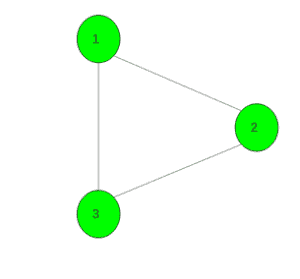

# 在给定图

中找到两个不相交的良好顶点集

> 原文： [https://www.geeksforgeeks.org/find-two-disjoint-good-sets-of-vertices-in-a-given-graph/](https://www.geeksforgeeks.org/find-two-disjoint-good-sets-of-vertices-in-a-given-graph/)

给定具有`N`个顶点和`M`边的无向非加权图。 任务是找到两个不相交的良好顶点集。 如果对于图中的每个边 UV，至少一个端点属于 X（即，U 或 V 或 U 和 V 都属于 X），则集合 X 被称为良好。

如果无法进行此类设置，则打印-1。

**范例**：

> **输入**：
> 
> 
> 
> **输出**：{1 3 4 5}，{2 6}
> 一个不相交的善意集合包含顶点{1、3、4、5}，而另一个包含{2、6}。
> **输入**：
> 
> 
> 
> **输出**：-1

**方法**：

观察结果之一是，没有 U 和 V 在同一集合中的边 UV。两个好的集合构成了图的二等分，因此该图必须是二分的 。 而且两党也足够。 在上阅读有关分区[的信息。

以下是上述方法的实现：](https://www.geeksforgeeks.org/bipartite-graph/) 

## C++

```cpp

// C++ program to find two disjoint
// good sets of vertices in a given graph
#include <bits/stdc++.h>
using namespace std;
#define N 100005

// For the graph
vector<int> gr[N], dis[2];
bool vis[N];
int colour[N];
bool bip;

// Function to add edge
void Add_edge(int x, int y)
{
    gr[x].push_back(y);
    gr[y].push_back(x);
}

// Bipartie function
void dfs(int x, int col)
{
    vis[x] = true;
    colour[x] = col;

    // Check for child vertices
    for (auto i : gr[x]) {

        // If it is not visited
        if (!vis[i])
            dfs(i, col ^ 1);

        // If it is already visited
        else if (colour[i] == col)
            bip = false;
    }
}

// Function to find two disjoint
// good sets of vertices in a given graph
void goodsets(int n)
{
    // Initially assume that graph is bipartie
    bip = true;

    // For every unvisited vertex call dfs
    for (int i = 1; i <= n; i++)
        if (!vis[i])
            dfs(i, 0);

    // If graph is not bipartie
    if (!bip)
        cout << -1;
    else {

        // Differentiate two sets
        for (int i = 1; i <= n; i++)
            dis[colour[i]].push_back(i);

        // Print vertices belongs to both sets

        for (int i = 0; i < 2; i++) {

            for (int j = 0; j < dis[i].size(); j++)
                cout << dis[i][j] << " ";
            cout << endl;
        }
    }
}

// Driver code
int main()
{
    int n = 6, m = 4;

    // Add edges
    Add_edge(1, 2);
    Add_edge(2, 3);
    Add_edge(2, 4);
    Add_edge(5, 6);

    // Function call
    goodsets(n);
}

```

## Java

```java

// Java program to find two disjoint 
// good sets of vertices in a given graph 
import java.util.*;

class GFG 
{

    static int N = 100005;

    // For the graph
    @SuppressWarnings("unchecked")
    static Vector<Integer>[] gr = new Vector[N], 
                            dis = new Vector[2];
    static
    {
        for (int i = 0; i < N; i++)
            gr[i] = new Vector<>();
        for (int i = 0; i < 2; i++)
            dis[i] = new Vector<>();
    }
    static boolean[] vis = new boolean[N];
    static int[] color = new int[N];
    static boolean bip;

    // Function to add edge
    static void add_edge(int x, int y)
    {
        gr[x].add(y);
        gr[y].add(x);
    }

    // Bipartie function
    static void dfs(int x, int col) 
    {
        vis[x] = true;
        color[x] = col;

        // Check for child vertices
        for (int i : gr[x])
        {

            // If it is not visited
            if (!vis[i])
                dfs(i, col ^ 1);

            // If it is already visited
            else if (color[i] == col)
                bip = false;
        }
    }

    // Function to find two disjoint
    // good sets of vertices in a given graph
    static void goodsets(int n)
    {
        // Initially assume that graph is bipartie
        bip = true;

        // For every unvisited vertex call dfs
        for (int i = 1; i <= n; i++)
            if (!vis[i])
                dfs(i, 0);

        // If graph is not bipartie
        if (!bip)
            System.out.println(-1);
        else
        {

            // Differentiate two sets
            for (int i = 1; i <= n; i++)
                dis[color[i]].add(i);

            // Print vertices belongs to both sets

            for (int i = 0; i < 2; i++)
            {
                for (int j = 0; j < dis[i].size(); j++)
                    System.out.print(dis[i].elementAt(j) + " ");
                System.out.println();
            }
        }
    }

    // Driver Code
    public static void main(String[] args)
    {
        int n = 6, m = 4;

        // Add edges
        add_edge(1, 2);
        add_edge(2, 3);
        add_edge(2, 4);
        add_edge(5, 6);

        // Function call
        goodsets(n);
    }
}

// This code is contributed by
// sanjeev2552

```

## Python

```py

# Python 3 program to find two disjoint
# good sets of vertices in a given graph
N = 100005

# For the graph
gr = [[] for i in range(N)]
dis = [[] for i in range(2)]
vis = [False for i in range(N)]
colour = [0 for i in range(N)]
bip = 0

# Function to add edge
def Add_edge(x, y):
    gr[x].append(y)
    gr[y].append(x)

# Bipartie function
def dfs(x, col):
    vis[x] = True
    colour[x] = col

    # Check for child vertices
    for i in gr[x]:

        # If it is not visited
        if (vis[i] == False):
            dfs(i, col ^ 1)

        # If it is already visited
        elif (colour[i] == col):
            bip = False

# Function to find two disjoint
# good sets of vertices in a given graph
def goodsets(n):

    # Initially assume that 
    # graph is bipartie
    bip = True

    # For every unvisited vertex call dfs
    for i in range(1, n + 1, 1):
        if (vis[i] == False):
            dfs(i, 0)

    # If graph is not bipartie
    if (bip == 0):
        print(-1)
    else:

        # Differentiate two sets
        for i in range(1, n + 1, 1):
            dis[colour[i]].append(i)

        # Print vertices belongs to both sets
        for i in range(2):
            for j in range(len(dis[i])):
                print(dis[i][j], end = " ") 
            print('\n', end = "")

# Driver code
if __name__ == '__main__':
    n = 6
    m = 4

    # Add edges
    Add_edge(1, 2)
    Add_edge(2, 3)
    Add_edge(2, 4)
    Add_edge(5, 6)

    # Function call
    goodsets(n)

# This code is contributed
# by Surendra_Gangwar

```

## C#

```cs

// C# program to find two 
// disjoint good sets of 
// vertices in a given graph 
using System;
using System.Collections.Generic;
class GFG{

static int N = 100005;

// For the graph
static List<int>[] gr = 
            new List<int>[N], 
            dis = new List<int>[2];  
static bool[] vis = new bool[N];
static int[] color = new int[N];
static bool bip;

// Function to add edge
static void add_edge(int x, 
                     int y)
{
  gr[x].Add(y);
  gr[y].Add(x);
}

// Bipartie function
static void dfs(int x, 
                int col) 
{
  vis[x] = true;
  color[x] = col;

  // Check for child vertices
  foreach (int i in gr[x])
  {
    // If it is not visited
    if (!vis[i])
      dfs(i, col ^ 1);

    // If it is already visited
    else if (color[i] == col)
      bip = false;
  }
}

// Function to find two disjoint
// good sets of vertices in a 
// given graph
static void goodsets(int n)
{
  // Initially assume that 
  // graph is bipartie
  bip = true;

  // For every unvisited
  // vertex call dfs
  for (int i = 1; i <= n; i++)
    if (!vis[i])
      dfs(i, 0);

  // If graph is not bipartie
  if (!bip)
    Console.WriteLine(-1);
  else
  {
    // Differentiate two sets
    for (int i = 1; 
             i <= n; i++)
      dis[color[i]].Add(i);

    // Print vertices belongs 
    // to both sets
    for (int i = 0; i < 2; i++)
    {
      for (int j = 0; 
               j < dis[i].Count; j++)
        Console.Write(dis[i][j] + " ");
      Console.WriteLine();
    }
  }
}

// Driver Code
public static void Main(String[] args)
{
  int n = 6, m = 4;

  for (int i = 0; i < N; i++)
    gr[i] = new List<int>();

  for (int i = 0; i < 2; i++)
    dis[i] = new List<int>();

  // Add edges
  add_edge(1, 2);
  add_edge(2, 3);
  add_edge(2, 4);
  add_edge(5, 6);

  // Function call
  goodsets(n);
}
}

// This code is contributed by shikhasingrajput

```

**Output:** 

```
1 3 4 5 
2 6

```


* * *

* * *

如果您喜欢 GeeksforGeeks 并希望做出贡献，则还可以使用 [tribution.geeksforgeeks.org](https://contribute.geeksforgeeks.org/) 撰写文章，或将您的文章邮寄至 tribution@geeksforgeeks.org。 查看您的文章出现在 GeeksforGeeks 主页上，并帮助其他 Geeks。

如果您发现任何不正确的地方，请单击下面的“改进文章”按钮，以改进本文。