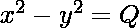
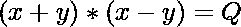
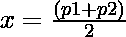

# 用给定的 GCD P 和给定的两个整数的平方差 Q 求两个整数 X 和 Y

> 原文:[https://www . geesforgeks . org/find-two-integer-x-and-y-with-given-gcd-p-and-given-squares-q/](https://www.geeksforgeeks.org/find-two-integers-x-and-y-with-given-gcd-p-and-given-difference-between-their-squares-q/)

给定两个整数 **P** 和 **Q** ，任务是找出任意两个整数的[最大公约数(GCD)](https://www.geeksforgeeks.org/c-program-find-gcd-hcf-two-numbers/) 为 **P** 和[它们的平方差](https://www.geeksforgeeks.org/find-two-numbers-such-that-difference-of-their-squares-equal-to-n/)为 Q，如果不存在这样的整数，则打印**-1】**。

**示例:**

> **输入:** P = 3，Q = 27
> **输出:** 6 3
> **说明:**
> 把这两个数字看成 6，3。现在，满足条件的 GCD(6，3) = 3 和 6 * 6–3 * 3 = 27。
> 
> **输入:** P = 1，Q = 100
> **输出:** -1

**方法:**基于以下观察，可以使用解决给定的问题:

给定的方程也可以写成:

> => 
> = > 

对于给定方程的积分解:

> (x+y)(x-y)永远是整数
> = > (x+y)(x-y)是 **Q**
> 的除数

设(x + y) = p1 和(x + y) = p2
为两个方程，其中 p1 & p2 为**Q**T3 的除数，使得 **p1 * p2 = Q** 。

求解上述两个方程，我们有:

> => 和

从上面的计算来看， **x 和 y** 要积分，那么除数之和必须是**偶数**。因为 x 和 y 的两个值有 4 个可能的值作为 **(+x，+y)、(+x，-y)、(-x，+y)和(-x，-y)** 。
因此可能解的总数由 **4*(偶数和的除数对)**给出。

现在在这些对中，找到 GCD 为 P 的对并打印该对。如果不存在这样的配对，请打印-1。

下面是上述方法的实现:

## C++

```
// C++ program for the above approach

#include <bits/stdc++.h>
using namespace std;

// Function to print a valid pair with
// the given criteria
int printValidPair(int P, int Q)
{

    // Iterate over the divisors of Q
    for (int i = 1; i * i <= Q; i++) {

        // check if Q is a multiple of i
        if (Q % i == 0) {

            // L = (A - B) <- 1st equation
            // R = (A + B) <- 2nd equation
            int L = i;
            int R = Q / i;

            // Calculate value of A
            int A = (L + R) / 2;

            // Calculate value of B
            int B = (R - L) / 2;

            // As A and B both are integers
            // so the parity of L and R
            // should be the same
            if (L % 2 != R % 2) {
                continue;
            }

            // Check the first condition
            if (__gcd(A, B) == P) {
                cout << A << " " << B;
                return 0;
            }
        }
    }

    // If no such A, B exist
    cout << -1;

    return 0;
}

// Driver Code
int main()
{
    int P = 3, Q = 27;
    printValidPair(P, Q);

    return 0;
}
```

## Java 语言(一种计算机语言，尤用于创建网站)

```
// Java program for the above approach
import java.util.*;

class GFG{

// Function to print a valid pair with
// the given criteria
static int printValidPair(int P, int Q)
{

    // Iterate over the divisors of Q
    for (int i = 1; i * i <= Q; i++) {

        // check if Q is a multiple of i
        if (Q % i == 0) {

            // L = (A - B) <- 1st equation
            // R = (A + B) <- 2nd equation
            int L = i;
            int R = Q / i;

            // Calculate value of A
            int A = (L + R) / 2;

            // Calculate value of B
            int B = (R - L) / 2;

            // As A and B both are integers
            // so the parity of L and R
            // should be the same
            if (L % 2 != R % 2) {
                continue;
            }

            // Check the first condition
            if (__gcd(A, B) == P) {
                System.out.print(A+ " " +  B);
                return 0;
            }
        }
    }

    // If no such A, B exist
    System.out.print(-1);
    return 0;

}
static int __gcd(int a, int b) 
{ 
    return b == 0? a:__gcd(b, a % b);    
}

// Driver Code
public static void main(String[] args)
{
    int P = 3, Q = 27;
    printValidPair(P, Q);
}
}

// This code is contributed by 29AjayKumar
```

## 蟒蛇 3

```
# python program for the above approach
import math

# Function to print a valid pair with
# the given criteria
def printValidPair(P, Q):

    # Iterate over the divisors of Q
    for i in range(1, int(math.sqrt(Q)) + 1):

        # check if Q is a multiple of i
        if (Q % i == 0):

            # L = (A - B) <- 1st equation
            # R = (A + B) <- 2nd equation
            L = i
            R = Q // i

            # Calculate value of A
            A = (L + R) // 2

            # Calculate value of B
            B = (R - L) // 2

            # As A and B both are integers
            # so the parity of L and R
            # should be the same
            if (L % 2 != R % 2):
                continue

            # Check the first condition
            if (math.gcd(A, B) == P):
                print(f"{A} {B}")
                return 0

    # If no such A, B exist
    print(-1)

    return 0

# Driver Code
if __name__ == "__main__":

    P = 3
    Q = 27
    printValidPair(P, Q)

    # This code is contributed by rakeshsahni
```

## C#

```
// C# program for the above approach
using System;
class GFG
{

    // Function to print a valid pair with
    // the given criteria
    static int printValidPair(int P, int Q)
    {

        // Iterate over the divisors of Q
        for (int i = 1; i * i <= Q; i++)
        {

            // check if Q is a multiple of i
            if (Q % i == 0)
            {

                // L = (A - B) <- 1st equation
                // R = (A + B) <- 2nd equation
                int L = i;
                int R = Q / i;

                // Calculate value of A
                int A = (L + R) / 2;

                // Calculate value of B
                int B = (R - L) / 2;

                // As A and B both are integers
                // so the parity of L and R
                // should be the same
                if (L % 2 != R % 2)
                {
                    continue;
                }

                // Check the first condition
                if (__gcd(A, B) == P)
                {
                    Console.Write(A + " " + B);
                    return 0;
                }
            }
        }

        // If no such A, B exist
        Console.Write(-1);
        return 0;

    }
    static int __gcd(int a, int b)
    {
        return b == 0 ? a : __gcd(b, a % b);
    }

    // Driver Code
    public static void Main()
    {
        int P = 3, Q = 27;
        printValidPair(P, Q);
    }
}

// This code is contributed by gfgking
```

## java 描述语言

```
<script>
       // JavaScript code for the above approach
       // Recursive function to return gcd of a and b
       function __gcd(a, b) {
           // Everything divides 0
           if (a == 0)
               return b;
           if (b == 0)
               return a;

           // base case
           if (a == b)
               return a;

           // a is greater
           if (a > b)
               return __gcd(a - b, b);
           return __gcd(a, b - a);
       }

       // Function to print a valid pair with
       // the given criteria
       function printValidPair(P, Q) {

           // Iterate over the divisors of Q
           for (let i = 1; i * i <= Q; i++) {

               // check if Q is a multiple of i
               if (Q % i == 0) {

                   // L = (A - B) <- 1st equation
                   // R = (A + B) <- 2nd equation
                   let L = i;
                   let R = Q / i;

                   // Calculate value of A
                   let A = (L + R) / 2;

                   // Calculate value of B
                   let B = (R - L) / 2;

                   // As A and B both are integers
                   // so the parity of L and R
                   // should be the same
                   if (L % 2 != R % 2) {
                       continue;
                   }

                   // Check the first condition
                   if (__gcd(A, B) == P) {
                       document.write(A + " " + B);
                       return 0;
                   }
               }
           }

           // If no such A, B exist
           document.write(-1);

           return 0;
       }

       // Driver Code
       let P = 3, Q = 27;
       printValidPair(P, Q);

 // This code is contributed by Potta Lokesh
   </script>
```

**Output:** 

```
6 3
```

***时间复杂度:** O(sqrt(Q))*
***辅助空间:** O(1)*