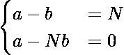
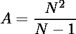
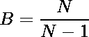

# 找出两个和 N 相同的差数和除法

> 原文:[https://www . geeksforgeeks . org/find-两个带差除的数字-两者同为-n/](https://www.geeksforgeeks.org/find-two-numbers-with-difference-and-division-both-same-as-n/)

给定一个**整数 N** ，任务是找到两个数字 a 和 b，使得 ***a / b = N*** 和***a–b = N***。如果没有可能的数字，打印**“否”**。
**示例:**

> **输入:** N = 6
> **输出:**
> a = 7.2
> b = 1.2
> **说明:**
> 对于给定的两个数字 a 和 b，a/b = 6 = N，a-b = 6 = N
> 
> **输入:** N = 1
> **输出:**否
> **说明:**
> 没有满足条件的 a 和 b 的值。

**方法:**要解决该问题，请观察以下公式:

> 

在同时求解上述方程时，我们得到:

> 
> 

因为分母是**N–1**，所以当 **N = 1** 时，答案是不可能的。对于所有其他情况，答案是可能的。因此分别求出 a 和 b 的值。
以下是上述办法的实施情况:

## C++

```
// C++ program for the above approach
#include <bits/stdc++.h>
using namespace std;

// Function to find two numbers with
// difference and division both as N
void findAandB(double N)
{
    // Condition if the answer
    // is not possible

    if (N == 1) {
        cout << "No";
        return;
    }

    // Calculate a and b
    double a = N * N / (N - 1);
    double b = a / N;

    // Print the values
    cout << "a = " << a << endl;
    cout << "b = " << b << endl;
}

// Driver Code
int main()
{
    // Given N
    double N = 6;

    // Function Call
    findAandB(N);
    return 0;
}
```

## Java 语言(一种计算机语言，尤用于创建网站)

```
// Java program for the above approach
class GFG{

// Function to find two numbers with
// difference and division both as N
static void findAandB(double N)
{

    // Condition if the answer
    // is not possible
    if (N == 1)
    {
        System.out.print("No");
        return;
    }

    // Calculate a and b
    double a = N * N / (N - 1);
    double b = a / N;

    // Print the values
    System.out.print("a = " + a + "\n");
    System.out.print("b = " + b + "\n");
}

// Driver Code
public static void main(String[] args)
{

    // Given N
    double N = 6;

    // Function call
    findAandB(N);
}
}

// This code is contributed by Rajput-Ji
```

## 蟒蛇 3

```
# Python3 program for the above approach

# Function to find two numbers with
# difference and division both as N
def findAandB(N):

    # Condition if the answer
    # is not possible
    if (N == 1):
        print("No")
        return

    # Calculate a and b
    a = N * N / (N - 1)
    b = a / N

    # Print the values
    print("a = ", a)
    print("b = ", b)

# Driver Code

# Given N
N = 6

# Function call
findAandB(N)

# This code is contributed by sanjoy_62
```

## C#

```
// C# program for the above approach
using System;

class GFG{

// Function to find two numbers with
// difference and division both as N
static void findAandB(double N)
{

    // Condition if the answer
    // is not possible
    if (N == 1)
    {
        Console.Write("No");
        return;
    }

    // Calculate a and b
    double a = N * N / (N - 1);
    double b = a / N;

    // Print the values
    Console.Write("a = " + a + "\n");
    Console.Write("b = " + b + "\n");
}

// Driver Code
public static void Main(String[] args)
{

    // Given N
    double N = 6;

    // Function call
    findAandB(N);
}
}

// This code is contributed by amal kumar choubey
```

## java 描述语言

```
<script>
// Javascript program for the above approach

    // Function to find two numbers with
    // difference and division both as N
    function findAandB( N) {

        // Condition if the answer
        // is not possible
        if (N == 1) {
            document.write("No");
            return;
        }

        // Calculate a and b
        let a = N * N / (N - 1);
        let b = a / N;

        // Prlet the values
        document.write("a = " + a + "<br/>");
        document.write("b = " + b + "<br/>");
    }

    // Driver Code

        // Given N
        let N = 6;

        // Function call
        findAandB(N);

// This code contributed by aashish1995
</script>
```

**Output:** 

```
a = 7.2
b = 1.2
```

***时间复杂度:**O(1)*
T5**辅助空间:** O(1)