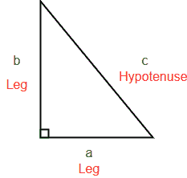

# 找出直角三角形的其他两条边

> 原文:[https://www . geesforgeks . org/find-双边-直角-三角形/](https://www.geeksforgeeks.org/find-two-sides-right-angle-triangle/)

给定直角三角形的一边，检查是否存在可能与三角形的任何其他两边成直角的三角形。如果可能的话打印其他两面的长度。
否则打印-1
注意:三角形的所有边必须是正整数

**例 1:**

```
Input : a = 3
Output : b = 4, c = 5
Explanation : a = 3, b = 4 and c = 5 form right 
angle triangle because 
32 + 42 = 9 + 16 = 25 = 52 => 32 + 42 = 52
```

**例 2:**

```
Input : a = 11
Output : b = 60, c = 61
Explanation : a = 11, b = 60 and c = 61 form 
right angle triangle because
112 + 602 = 121 + 3600 = 3721 = 612 => 112 + 602 = 612
```

为了解决这个问题，我们首先观察毕达哥拉斯方程。如果 a 和 b 是直角三角形的边长，c 是斜边的长度，那么边长的平方和等于斜边长度的平方。

这种关系由以下公式表示:

```
a2 + b2 = c2
```



*   **情况 1–a 是奇数:**给定 a，求 b 和 c

```
c2 - b2 = a2
OR
c = (a2 + 1)/2;
b = (a2 - 1)/2;
```

*   上述解决方案仅适用于 a 为奇数的情况，因为 a <sup>2</sup> + 1 只能被奇数 a 的 2 整除。
*   **情况 2–a 为偶数:**当 c-b 为 2 时& c+b 为(a <sup>2</sup> )/2

```
c-b = 2 & c+b = (a2)/2
Hence,
c = (a2)/4 + 1;
b = (a2)/4 - 1;
```

当为偶数时，此方法有效。

这种解决方案不适用于 a = 1 和 a = 2 的情况，因为没有任何直角三角形的 1 边或 2 边都是整数边。

## C++

```
// C++ program to print other two sides of right
// angle triangle given one side
#include <bits/stdc++.h>
using namespace std;

// Finds two sides of a right angle triangle
// if it exist.
void printOtherSides(int n)
{
    // if n is odd
    if (n & 1)
    {
        // case of n = 1 handled separately
        if (n == 1)
            cout << -1 << endl;
        else
        {
            int b = (n*n-1)/2;
            int c = (n*n+1)/2;
            cout << "b = " << b
                 << ", c = " << c << endl;
        }
    }
    else
    {
        // case of n = 2 handled separately
        if (n == 2)
            cout << -1 << endl;
        else
        {
            int b = n*n/4-1;
            int c = n*n/4+1;
            cout << "b = " << b
                 << ", c = " << c << endl;
        }
    }
}

// Driver program to test above function
int main()
{
    int a = 3;
    printOtherSides(a);
    return 0;
}
```

## Java 语言(一种计算机语言，尤用于创建网站)

```
// Java program to print other two 
// sides of right angle triangle 
// given one side

class GFG
{
    // Finds two sides of a right angle 
    // triangle if it they exist.
    static void printOtherSides(int n)
    {
        // if n is odd
        if (n % 2 != 0)
        {
            // case of n = 1 handled separately
            if (n == 1)
                System.out.println("-1");
            else
            {
                int b = (n * n -1) / 2;
                int c = (n *n  +1) / 2;
                System.out.println("b = "+ b +
                                   ", c = "+c);
            }
        }
        else
        {
            // case of n = 2 handled separately
            if (n == 2)
                System.out.println("-1");
            else
            {
                int b = n * n / 4 - 1;
                int c = n * n / 4 + 1;
                System.out.println("b = "+ b +
                                   ", c = "+c);
            }
        }
    } 

    // Driver code
    public static void main (String[] args)
    {
        int a = 3;
        printOtherSides(a);
    }
}

// This code is contributed by Anant Agarwal.
```

## 计算机编程语言

```
# Python program to print other 
# two sides of right angle 
# triangle given one side

# Finds two sides of a right angle
# triangle if it they exist.
def printOtherSides(n):

    # if n is odd
    if(n & 1):

        # case of n = 1 handled
        # separately
        if(n == 1):
            print(-1)
        else:
            b = (n * n - 1) // 2
            c = (n * n + 1) // 2
            print("b =", b, ", c =", c)
    else:

        # case of n = 2 handled
        # separately
        if(n == 2):
            print(-1)
        else:
            b = n * n // 4 - 1
            c = n * n // 4 + 1
            print("b =", b", c =", c)

# Driver Code
a = 3
printOtherSides(a)

# This code is contributed by
# Sanjit_Prasad
```

## C#

```
// C# program to print other two 
// sides of right angle triangle 
// given one side
using System;

class GFG {

    // Finds two sides of a right angle 
    // triangle if it they exist.
    static void printOtherSides(int n)
    {

        // if n is odd
        if (n % 2 != 0)
        {

            // case of n = 1 handled
            // separately
            if (n == 1)
            Console.WriteLine("-1");
            else
            {
                int b = (n * n - 1) / 2;
                int c = (n * n + 1) / 2;
                Console.Write("b = "+ b +
                              ", c = "+ c);
            }
        }
        else
        {

            // case of n = 2 handled
            // separately
            if (n == 2)
            Console.Write("-1");
            else
            {
                int b = n * n / 4 - 1;
                int c = n * n / 4 + 1;
                Console.Write("b = "+ b +
                              ", c = "+ c);
            }
        }
    } 

    // Driver code
    public static void Main ()
    {
        int a = 3;
        printOtherSides(a);
    }
}

// This code is contributed by Nitin Mittal.
```

## 服务器端编程语言（Professional Hypertext Preprocessor 的缩写）

```
<?php
// PHP program to print other two 
// sides of right angle triangle 
// given one side

// Finds two sides of a right angle
// triangle if it they exist.
function printOtherSides($n)
{

    // if n is odd
    if ($n & 1)
    {
        // case of n = 1 
        // handled separately
        if ($n == 1)
            echo -1 ;
        else
        {
            $b = ($n * $n - 1) / 2;
            $c = ($n * $n + 1) / 2;
            echo "b = " ,$b,", c = " ,$c ;
        }
    }
    else
    {

        // case of n = 2 
        // handled separately
        if ($n == 2)
            echo -1 ;
        else
        {
            $b = $n * $n / 4 - 1;
            $c = $n * $n / 4 + 1;
            echo "b = " ,$b, ", c = ", $c ;
        }
    }
}

    // Driver Code
    $a = 3;
    printOtherSides($a);
    return 0;

// This code is contributed by nitin mittal.
?>
```

## java 描述语言

```
<script>

// javascript program to print other two 
// sides of right angle triangle 
// given one side  

// Finds two sides of a right angle 
// triangle if it they exist.
function printOtherSides(n)
{
    // if n is odd
    if (n % 2 != 0)
    {
        // case of n = 1 handled separately
        if (n == 1)
            document.write("-1");
        else
        {
            var b = (n * n -1) / 2;
            var c = (n *n  +1) / 2;
            document.write("b = "+ b +
                               ", c = "+c);
        }
    }
    else
    {
        // case of n = 2 handled separately
        if (n == 2)
            document.write("-1");
        else
        {
            var b = n * n / 4 - 1;
            var c = n * n / 4 + 1;
            document.write("b = "+ b +
                               ", c = "+c);
        }
    }
} 

// Driver code
var a = 3;
printOtherSides(a);

// This code is contributed by 29AjayKumar 

</script>
```

输出:

```
b = 4, c = 5
```

本文由 [**普拉蒂克·查哈尔**](https://pratik-chhajer.github.io/) 供稿。如果你喜欢 GeeksforGeeks 并想投稿，你也可以使用[write.geeksforgeeks.org](https://write.geeksforgeeks.org)写一篇文章或者把你的文章邮寄到 review-team@geeksforgeeks.org。看到你的文章出现在极客博客主页上，帮助其他极客。
如果发现有不正确的地方，或者想分享更多关于上述话题的信息，请写评论。