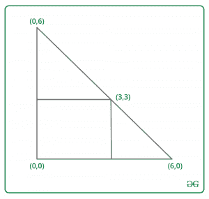
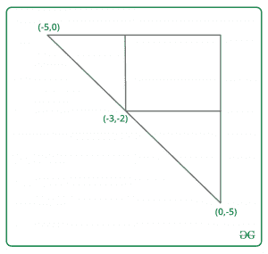

# 求一个等腰三角形的两个顶点，其中有一个对角为(0，0)和(X，Y)的矩形

> 原文:[https://www . geeksforgeeks . org/find-等腰三角形的两个顶点-其中有两个对角的矩形-0-0 和-x-y/](https://www.geeksforgeeks.org/find-two-vertices-of-an-isosceles-triangle-in-which-there-is-rectangle-with-opposite-corners-0-0-and-x-y/)

给定两个整数 **X** 和 **Y** 。任务是找到一个等腰三角形 ABC(在 B 处成直角)的两个顶点，该三角形在 B 点(0，0)处有一个顶点。还有一个长方形，两边是(0，0)和(X，Y)。这个矩形的所有点都位于三角形的内部或边界上。打印 4 个整数 x1，y1，x2，y2，其中 A(x1，y1)和 B(x2，y2)。
**例:**

> **输入:** X = 3，Y = 3
> T3】输出: 6 0 0 6
> 
> 
> 
> **输入:** X = -3，y = -2
> **输出:** -5 0 0 -5
> 
> 

**进场:**
让瓦尔= |x| + |y|。那么第一点是(Val *符号(x)，0)，第二点是(0，Val *符号(y))。
我们来看看 x > 0 和 y > 0 是如何工作的。其他案例也可以用类似的方式证明。
我们需要表明，(x，y)属于我们的三角形(包括它的边界)。事实上(x，y)属于线段，连接(x + y，0)和(0，x + y)。穿过(x + y，0)和(0，x + y)的直线是 Y =–X+X+Y，用这个方程中的坐标(X，Y)证明了我们的答案。
以下是上述方法的实施:

## C++

```
// C++ program to find two vertices of an
// isosceles triangle in which there is
// rectangle with opposite side (0, 0) and (x, y)
#include <bits/stdc++.h>
using namespace std;

// Function to find two vertices of an
// isosceles triangle in which there is
// rectangle with opposite side (0, 0) and (x, y)
int Vertices(int x, int y)
{
    // Required value;
    int val = abs(x) + abs(y);

    // print x1 and y1
    cout << val * (x < 0 ? -1 : 1) << " 0 ";

    // print x2 and y3
    cout << "0 " << val * (y < 0 ? -1 : 1);
}

// Driver code
int main()
{
    int x = 3, y = 3;

    // Function call
    Vertices(x, y);

    return 0;
}
```

## Java 语言(一种计算机语言，尤用于创建网站)

```
// Java program to find two vertices of an
// isosceles triangle in which there is
// rectangle with opposite side (0, 0) and (x, y)
class GFG
{

// Function to find two vertices of an
// isosceles triangle in which there is
// rectangle with opposite side (0, 0) and (x, y)
static void Vertices(int x, int y)
{
    // Required value;
    int val = Math.abs(x) + Math.abs(y);

    // print x1 and y1
    System.out.print(val * (x < 0 ? -1 : 1) + " 0 ");

    // print x2 and y3
    System.out.print("0 " + val * (y < 0 ? -1 : 1));
}

// Driver code
public static void main(String[] args)
{
    int x = 3, y = 3;

    // Function call
    Vertices(x, y);
}
}

// This code is contributed by Rajput-Ji
```

## 蟒蛇 3

```
# Python3 program to find two vertices of an
# isosceles triangle in which there is
# rectangle with opposite side (0, 0) and (x, y)

# Function to find two vertices of an
# isosceles triangle in which there is
# rectangle with opposite side (0, 0) and (x, y)
def Vertices(x, y) :

    # Required value;
    val = abs(x) + abs(y);

    # print x1 and y1
    if x < 0 :
        x = -1
    else :
        x = 1

    print(val * x,"0",end = " ");

    # print x2 and y3
    if y < 0 :
        y = -1
    else :
        y = 1

    print("0",val * y);

# Driver code
if __name__ == "__main__" :

    x = 3; y = 3;

    # Function call
    Vertices(x, y);

# This code is contributed by AnkitRai01
```

## C#

```
// C# program to find two vertices of an
// isosceles triangle in which there is
// rectangle with opposite side (0, 0) and (x, y)
using System;

class GFG
{

// Function to find two vertices of an
// isosceles triangle in which there is
// rectangle with opposite side (0, 0) and (x, y)
static void Vertices(int x, int y)
{
    // Required value;
    int val = Math.Abs(x) + Math.Abs(y);

    // print x1 and y1
    Console.Write(val * (x < 0 ? -1 : 1) + " 0 ");

    // print x2 and y3
    Console.Write("0 " + val * (y < 0 ? -1 : 1));
}

// Driver code
public static void Main(String[] args)
{
    int x = 3, y = 3;

    // Function call
    Vertices(x, y);
}
}

// This code is contributed by Rajput-Ji
```

## java 描述语言

```
<script>

// JavaScript program to find two vertices of an
// isosceles triangle in which there is
// rectangle with opposite side (0, 0) and (x, y)

// Function to find two vertices of an
// isosceles triangle in which there is
// rectangle with opposite side (0, 0) and (x, y)
function Vertices(x, y)
{
    // Required value;
    let val = Math.abs(x) + Math.abs(y);

    // print x1 and y1
    document.write(val * (x < 0 ? -1 : 1) + " 0 ");

    // print x2 and y3
    document.write("0 " + val * (y < 0 ? -1 : 1));
}

// Driver code

    let x = 3, y = 3;

    // Function call
    Vertices(x, y);

// This code is contributed by Surbhi Tyagi.

</script>
```

**Output:** 

```
6 0 0 6
```

**时间复杂度:** O(1)