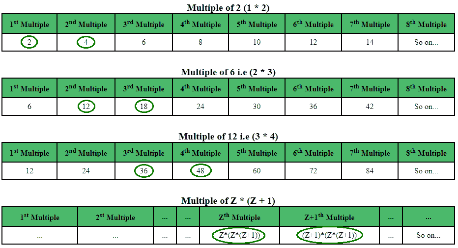

# 找到唯一的对，使得每个元素小于或等于 N

> 原文:[https://www . geesforgeks . org/find-unique-pairs-so-每个元素小于或等于 n/](https://www.geeksforgeeks.org/find-unique-pairs-such-that-each-element-is-less-than-or-equal-to-n/)

给定一个整数 N，找到并显示满足以下条件的对的数量:

*   这两个数之间距离的平方等于这两个数的 [LCM](https://www.geeksforgeeks.org/program-to-find-lcm-of-two-numbers/) 。
*   这两个数的 [GCD](https://www.geeksforgeeks.org/c-program-find-gcd-hcf-two-numbers/) 等于两个连续整数的乘积。
*   该对中的两个数字都应小于或等于 n

**注意:**只应显示同时符合上述两个条件的配对，这些数字必须小于或等于 n

**示例:**

```
Input: 10
Output: No. of pairs = 1
        Pair no. 1 --> (2, 4)

Input: 500
Output: No. of pairs = 7
        Pair no. 1 --> (2, 4)
        Pair no. 2 --> (12, 18)
        Pair no. 3 --> (36, 48)
        Pair no. 4 --> (80, 100)
        Pair no. 5 --> (150, 180)
        Pair no. 6 --> (252, 294)
        Pair no. 7 --> (392, 448)
```

**解释:**
下面的表格将给出一个清晰的视图:



上表显示了由两个连续数字及其对应倍数的乘积形成的 GCD，其中每个值对应一个唯一配对。每行中的绿色条目为相应的 GCD 形成一个唯一的对。
**注:**在上表中，

1.  对于第一个条目，GCD=2，2 的第一个和第二个倍数形成唯一对(2，4)
2.  类似地，对于第二个条目，GCD=6，6 的第二个和第三个倍数形成唯一对(12，18)
3.  类似地，继续，对于 Zth 条目，即对于 GCD = Z*(Z+1)，很明显唯一对将包括 Zth 和 GCD = Z*(Z+1)的(Z+1)倍。现在，GCD 的 Zth 倍数为 Z * (Z*(Z+1))，GCD 的(Z+1)倍将为(Z + 1) * (Z*(Z+1))。
4.  由于限制是 N，因此唯一对中的第二个数字必须小于或等于 N。因此，(Z+1)*(Z *(Z+1))<= N. Simplifying it further, the desired relation is derived Z<sup>3</sup>+(2 * Z<sup>2</sup>)+Z<= N

这形成了一种模式，并且从数学计算中，可以得出，对于给定的 N，这种唯一对的总数(比如 Z)将遵循如下所示的数学关系:

```
Z3 + (2*Z2) + Z <= N
```

以下是所需的实现:

## C

```
// C program for finding the required pairs
#include <stdio.h>
#include <stdlib.h>

// Finding the number of unique pairs
int No_Of_Pairs(int N)
{
    int i = 1;

    // Using the derived formula
    while ((i * i * i) + (2 * i * i) + i <= N)
        i++;

    return (i - 1);
}

// Printing the unique pairs
void print_pairs(int pairs)
{
    int i = 1, mul;
    for (i = 1; i <= pairs; i++) {
        mul = i * (i + 1);
        printf("Pair no. %d --> (%d, %d)\n",
               i, (mul * i), mul * (i + 1));
    }
}

// Driver program to test above functions
int main()
{
    int N = 500, pairs, mul, i = 1;
    pairs = No_Of_Pairs(N);

    printf("No. of pairs = %d \n", pairs);
    print_pairs(pairs);

    return 0;
}
```

## Java 语言(一种计算机语言，尤用于创建网站)

```
// Java program for finding
// the required pairs
import java.io.*;

class GFG
{

    // Finding the number
    // of unique pairs
    static int No_Of_Pairs(int N)
    {
        int i = 1;

        // Using the derived formula
        while ((i * i * i) +
               (2 * i * i) + i <= N)
            i++;

        return (i - 1);
    }

    // Printing the unique pairs
    static void print_pairs(int pairs)
    {
        int i = 1, mul;
        for (i = 1; i <= pairs; i++)
        {
            mul = i * (i + 1);
            System.out.println("Pair no. " + i + " --> (" +
                                         (mul * i) + ", " +
                                      mul * (i + 1) + ")");
        }
    }

    // Driver code
    public static void main (String[] args)
    {
        int N = 500, pairs, mul, i = 1;
        pairs = No_Of_Pairs(N);

        System.out.println("No. of pairs = " + pairs);
        print_pairs(pairs);
    }
}

// This code is contributed by Mahadev.
```

## 蟒蛇 3

```
# Python3 program for finding the required pairs

# Finding the number of unique pairs
def No_Of_Pairs(N):

    i = 1;

    # Using the derived formula
    while ((i * i * i) + (2 * i * i) + i <= N):
        i += 1;

    return (i - 1);

# Printing the unique pairs
def print_pairs(pairs):

    i = 1;
    mul = 0;
    for i in range(1, pairs + 1):
        mul = i * (i + 1);
        print("Pair no." , i, " --> (", (mul * i),
                        ", ", mul * (i + 1), ")");

# Driver Code
N = 500;
i = 1;
pairs = No_Of_Pairs(N);

print("No. of pairs = ", pairs);
print_pairs(pairs);

# This code is contributed
# by mits
```

## C#

```
// C# program for finding
// the required pairs
using System;

class GFG
{

// Finding the number
// of unique pairs
static int No_Of_Pairs(int N)
{
    int i = 1;

    // Using the derived formula
    while ((i * i * i) +
           (2 * i * i) + i <= N)
        i++;

    return (i - 1);
}

// Printing the unique pairs
static void print_pairs(int pairs)
{
    int i = 1, mul;
    for (i = 1; i <= pairs; i++)
    {
        mul = i * (i + 1);
        Console.WriteLine("Pair no. " + i + " --> (" +
                                    (mul * i) + ", " +
                                 mul * (i + 1) + ")");
    }
}

// Driver code
static void Main()
{
    int N = 500, pairs;
    pairs = No_Of_Pairs(N);

    Console.WriteLine("No. of pairs = " +
                                  pairs);
    print_pairs(pairs);
}
}

// This code is contributed by mits
```

## 服务器端编程语言（Professional Hypertext Preprocessor 的缩写）

```
<?php
// PHP program for finding
// the required pairs

// Finding the number
// of unique pairs
function No_Of_Pairs($N)
{
    $i = 1;

    // Using the
    // derived formula
    while (($i * $i * $i) +
            (2 * $i * $i) +
                $i <= $N)
        $i++;

    return ($i - 1);
}

// Printing the unique pairs
function print_pairs($pairs)
{
    $i = 1; $mul;
    for ($i = 1;
         $i <= $pairs; $i++)
    {
        $mul = $i * ($i + 1);
        echo "Pair no." ,
              $i, " --> (" ,
             ($mul * $i), ", ",
              $mul * ($i + 1),") \n";
    }
}

// Driver Code
$N = 500; $pairs;
$mul; $i = 1;
$pairs = No_Of_Pairs($N);

echo "No. of pairs = ",
        $pairs , " \n";
print_pairs($pairs);

// This code is contributed
// by Akanksha Rai(Abby_akku)
?>
```

## java 描述语言

```
<script>

// Javascript program for finding the
// required pairs

// Finding the number of unique pairs
function No_Of_Pairs(N)
{
    let i = 1;

    // Using the derived formula
    while ((i * i * i) +
           (2 * i * i) + i <= N)
        i++;

    return (i - 1);
}

// Printing the unique pairs
function print_pairs(pairs)
{
    let i = 1, mul;
    for(i = 1; i <= pairs; i++)
    {
        mul = i * (i + 1);
        document.write("Pair no. " + i +
                       " --> (" + (mul * i) +
                       ", " + mul * (i + 1) +
                       ")<br>");
    }
}

// Driver code
let N = 500, pairs, mul, i = 1;
pairs = No_Of_Pairs(N);

document.write("No. of pairs = " +
               pairs + "<br>");
print_pairs(pairs);

// This code is contributed by mohit kumar 29

</script>
```

**Output:** 

```
No. of pairs = 7 
Pair no. 1 --> (2, 4)
Pair no. 2 --> (12, 18)
Pair no. 3 --> (36, 48)
Pair no. 4 --> (80, 100)
Pair no. 5 --> (150, 180)
Pair no. 6 --> (252, 294)
Pair no. 7 --> (392, 448)
```