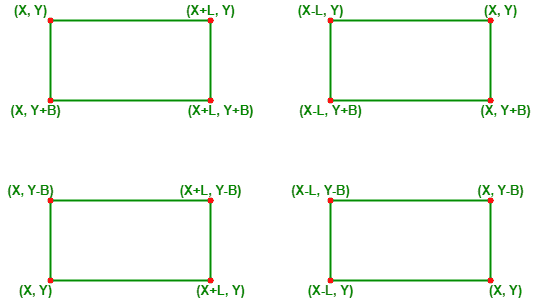
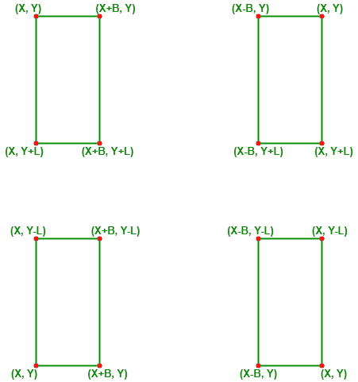

# 找到给定顶点和尺寸的所有可能矩形的顶点坐标

> 原文:[https://www . geesforgeks . org/find-给定顶点和维度的所有可能矩形的顶点坐标/](https://www.geeksforgeeks.org/find-vertex-coordinates-of-all-possible-rectangles-with-a-given-vertex-and-dimensions/)

给定两个整数 **L** 和 **B** 表示矩形的长度和宽度，以及一个坐标 **(X，Y)** 表示[笛卡尔平面](https://www.geeksforgeeks.org/cartesian-plane/)上的一个点，任务是找出顶点为给定尺寸的 **(X，Y)** 的所有矩形的坐标。

**示例:**

> **输入:** X=9，Y=9，L=5，B=3
> **输出:**
> (9，9)，(14，9)，(9，12)，(14，12)
> (4，9)，(9，9)，(4，12)，(9，12)
> (9，6)，(14，6)，(9，9)，(14，9)
> (4，6)，(9，6)，(4，9)，(9)，(9)，(9)
> ) (9，9)
> **解释:**有 8 个可能的矩形，它们的顶点之一是(9，9)，长度和宽度分别是 5 和 3，如上所述。
> 
> **输入:** X=2、Y=3、L=4、B=1
> **输出:**
> (2、3)、(6、3)、(2、4)、(6、4)
> (-2、3)、(2、3)、(-2、4)、(2、4)
> (2、2)、(6、2)、(2、3)、(6、3)
> (-2、2)、(2、2)、(2)、(2)、(3)、(-2、3)、(2、3)
> (2)

**方法:**可以观察到，对于给定的长度和宽度以及一个顶点 **(X，Y)** ，八个矩形是可能的，如下图所示:

 

如果给定的矩形长度和宽度相等，水平和垂直矩形将表示相同的坐标。因此，在图像 1 或图像 2 中只可能显示 4 个唯一的正方形。

下面是上述方法的实现:

## C++

```
// C++ code for the above approach
#include <bits/stdc++.h>
using namespace std;

void printHorizontal(int X, int Y, int L, int B)
{
    cout << '(' << X << ", " << Y << "), ";
    cout << '(' << X + L << ", " << Y << "), ";
    cout << '(' << X << ", " << Y + B << "), ";
    cout << '(' << X + L << ", " << Y + B << ")"
         << endl;
}

void printVertical(int X, int Y, int L, int B)
{
    cout << '(' << X << ", " << Y << "), ";
    cout << '(' << X + B << ", " << Y << "), ";
    cout << '(' << X << ", " << Y + L << "), ";
    cout << '(' << X + B << ", " << Y + L << ")"
         << endl;
}

// Function to find all possible rectangles
void findAllRectangles(int L, int B, int X, int Y)
{

    // First four Rectangles
    printHorizontal(X, Y, L, B);
    printHorizontal(X - L, Y, L, B);
    printHorizontal(X, Y - B, L, B);
    printHorizontal(X - L, Y - B, L, B);

    // If length and breadth are same
    // i.e, it is a square
    if (L == B)
        return;

    // Next four Rectangles
    printVertical(X, Y, L, B);
    printVertical(X - B, Y, L, B);
    printVertical(X, Y - L, L, B);
    printVertical(X - B, Y - L, L, B);
}

// Driver Code
int main()
{
    int L = 5, B = 3;
    int X = 9, Y = 9;

    findAllRectangles(L, B, X, Y);
}
```

## Java 语言(一种计算机语言，尤用于创建网站)

```
// Java code for the above approach
class GFG{

static void printHorizontal(int X, int Y, int L, int B)
{
    System.out.print("("+ X+ ", " +  Y+ "), ");
    System.out.print("("+ (X + L)+ ", " +  Y+ "), ");
    System.out.print("("+ X+ ", " +  (Y + B)+ "), ");
    System.out.print("("+ (X + L)+ ", " +  (Y + B)+ ")"
         +"\n");
}

static void printVertical(int X, int Y, int L, int B)
{
    System.out.print("("+ X+ ", " +  Y+ "), ");
    System.out.print("("+ (X + B)+ ", " +  Y+ "), ");
    System.out.print("("+ X+ ", " +  (Y + L)+ "), ");
    System.out.print("("+ (X + B)+ ", " +  (Y + L)+ ")"
         +"\n");
}

// Function to find all possible rectangles
static void findAllRectangles(int L, int B, int X, int Y)
{

    // First four Rectangles
    printHorizontal(X, Y, L, B);
    printHorizontal(X - L, Y, L, B);
    printHorizontal(X, Y - B, L, B);
    printHorizontal(X - L, Y - B, L, B);

    // If length and breadth are same
    // i.e, it is a square
    if (L == B)
        return;

    // Next four Rectangles
    printVertical(X, Y, L, B);
    printVertical(X - B, Y, L, B);
    printVertical(X, Y - L, L, B);
    printVertical(X - B, Y - L, L, B);
}

// Driver Code
public static void main(String[] args)
{
    int L = 5, B = 3;
    int X = 9, Y = 9;

    findAllRectangles(L, B, X, Y);
}
}

// This code is contributed by shikhasingrajput
```

## 蟒蛇 3

```
# python code for the above approach
def printHorizontal(X, Y, L, B):

    print(f"({X}, {Y}), ", end="")
    print(f"({X + L}, {Y}), ", end="")
    print(f"('{X}, {Y + B}), ", end="")
    print(f"({X + L}, {Y + B})")

def printVertical(X, Y, L, B):

    print(f"({X}, {Y}), ", end="")
    print(f"({X + B}, {Y}), ", end="")
    print(f"({X}, {Y + L}), ", end="")
    print(f"({X + B}, {Y + L})")

# Function to find all possible rectangles
def findAllRectangles(L, B, X, Y):

    # First four Rectangles
    printHorizontal(X, Y, L, B)
    printHorizontal(X - L, Y, L, B)
    printHorizontal(X, Y - B, L, B)
    printHorizontal(X - L, Y - B, L, B)

    # If length and breadth are same
    # i.e, it is a square
    if (L == B):
        return

    # Next four Rectangles
    printVertical(X, Y, L, B)
    printVertical(X - B, Y, L, B)
    printVertical(X, Y - L, L, B)
    printVertical(X - B, Y - L, L, B)

# Driver Code
if __name__ == "__main__":

    L = 5
    B = 3

    X = 9
    Y = 9

    findAllRectangles(L, B, X, Y)

    # This code is contributed by rakeshsahni
```

## C#

```
// C# code for the above approach
using System;

class GFG{

static void printHorizontal(int X, int Y, int L, int B)
{
    Console.Write("(" + X + ", " +  Y + "), ");
    Console.Write("(" + (X + L) + ", " +  Y + "), ");
    Console.Write("(" + X + ", " +  (Y + B) + "), ");
    Console.Write("(" + (X + L) + ", " +  (Y + B) + ")" + "\n");
}

static void printVertical(int X, int Y, int L, int B)
{
    Console.Write("(" + X + ", " +  Y + "), ");
    Console.Write("(" + (X + B) + ", " +  Y + "), ");
    Console.Write("(" + X + ", " +  (Y + L) + "), ");
    Console.Write("(" + (X + B) + ", " +  (Y + L) + ")" + "\n");
}

// Function to find all possible rectangles
static void findAllRectangles(int L, int B, int X, int Y)
{

    // First four Rectangles
    printHorizontal(X, Y, L, B);
    printHorizontal(X - L, Y, L, B);
    printHorizontal(X, Y - B, L, B);
    printHorizontal(X - L, Y - B, L, B);

    // If length and breadth are same
    // i.e, it is a square
    if (L == B)
        return;

    // Next four Rectangles
    printVertical(X, Y, L, B);
    printVertical(X - B, Y, L, B);
    printVertical(X, Y - L, L, B);
    printVertical(X - B, Y - L, L, B);
}

// Driver Code
public static void Main(String[] args)
{
    int L = 5, B = 3;
    int X = 9, Y = 9;

    findAllRectangles(L, B, X, Y);
}
}

// This code is contributed by shikhasingrajput
```

## java 描述语言

```
<script>

// JavaScript code for the above approach

function printHorizontal(X, Y, L, B)
{
    document.write('(' + X + ", " + Y + "), ");
    document.write('(' + (X + L) + ", " + Y + "), ");
    document.write('(' + X + ", " + (Y + B) + "), ");
    document.write('(' + (X + L) + ", " +
                         (Y + B) + ")" + '<br>');
}

function printVertical(X, Y, L, B)
{
    document.write('(' + X + ", " + Y + "), ");
    document.write('(' + (X + B) + ", " + Y + "), ");
    document.write('(' + X + ", " + (Y + L) + "), ");
    document.write('(' + (X + B) + ", " +
                         (Y + L) + ")" + '<br>');
}

// Function to find all possible rectangles
function findAllRectangles(L, B, X, Y)
{

    // First four Rectangles
    printHorizontal(X, Y, L, B);
    printHorizontal(X - L, Y, L, B);
    printHorizontal(X, Y - B, L, B);
    printHorizontal(X - L, Y - B, L, B);

    // If length and breadth are same
    // i.e, it is a square
    if (L == B)
        return;

    // Next four Rectangles
    printVertical(X, Y, L, B);
    printVertical(X - B, Y, L, B);
    printVertical(X, Y - L, L, B);
    printVertical(X - B, Y - L, L, B);
}

// Driver Code
let L = 5, B = 3;
let X = 9, Y = 9;

findAllRectangles(L, B, X, Y);

// This code is contributed by Potta Lokesh

</script>
```

**Output:** 

```
(9, 9), (14, 9), (9, 12), (14, 12)
(4, 9), (9, 9), (4, 12), (9, 12)
(9, 6), (14, 6), (9, 9), (14, 9)
(4, 6), (9, 6), (4, 9), (9, 9)
(9, 9), (12, 9), (9, 14), (12, 14)
(6, 9), (9, 9), (6, 14), (9, 14)
(9, 4), (12, 4), (9, 9), (12, 9)
(6, 4), (9, 4), (6, 9), (9, 9)
```

***时间复杂度:**O(1)*
T5**辅助空间:** O(1)