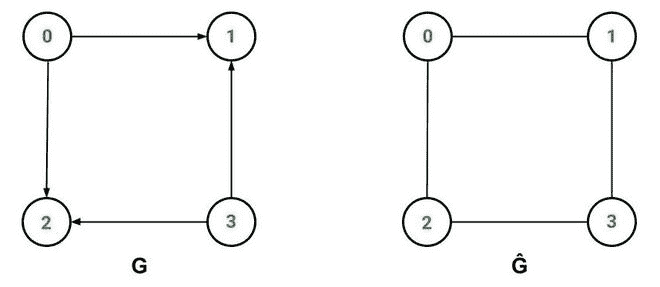
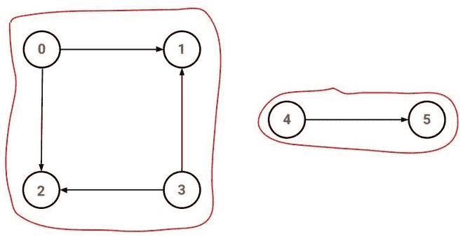

# 在有向图中寻找弱连通分量

> 原文:[https://www . geesforgeks . org/find-弱连接-有向图中的组件/](https://www.geeksforgeeks.org/find-weakly-connected-components-in-a-directed-graph/)

**<u>弱连通图:</u>**

A **有向图** ' **G =** ***(V，E)'*** 是 ***弱连通的*** 如果底层无向图***ĝ***是连通的。

> **底层的无向图**是图***ĝ=(v，ê)***其中***ê***表示通过从有向边移除箭头并使其在 ***G*** 中双向而获得的一组无向边。

**示例:**

> 
> 
> 上面的有向图 *G* 是弱连通的，因为它下面的无向图*ĝ*是连通的。

**<u>【弱连接组件:</u>**

给定一个有向图，一个**弱连通分支(WCC)** 是原始图的一个[子图](https://www.geeksforgeeks.org/graph-types-and-applications/)，其中**的所有顶点通过某种路径相互连接**，忽略边的方向。

> **示例:**
> 
> 
> 
> 在上面的有向图中，有两个弱连通分量:
> 
> *   [0, 1, 2, 3]
> *   [4, 5]

**寻找弱连通分量的算法:**

它使用算法来寻找无向图的[连通分量](https://www.geeksforgeeks.org/connected-components-in-an-undirected-graph/)。

*   构造给定有向图的基础无向图。
*   求无向图的所有[连通分量](https://www.geeksforgeeks.org/connected-components-in-an-undirected-graph/)。
*   无向图的连通分量将是有向图的弱连通分量。

**实施:**

下面是**弱连通分量**的代码，它以有向图 *DG* 为输入，返回输入图的所有弱连通分量 *WCC* 。

## Java 语言(一种计算机语言，尤用于创建网站)

```
// Java Code for the above algorithm
import java.util.ArrayList;

class Graph {
    int vertices;
    ArrayList<ArrayList<Integer> > adjacencyList;

    public Graph(int vertices)
    {
        this.vertices = vertices;
        adjacencyList = new ArrayList<>(vertices);

        for (int i = 0; i < this.vertices; i++)
            adjacencyList.add(new ArrayList<>());
    }

    public void addEdge(int u, int v)
    {
        // Use of noEdge(int, int)
        // prevents duplication of edges
        if (noEdge(u, v))
            adjacencyList.get(u).add(v);
    }

    // Returns true if there does NOT exist
    // any edge from u to v
    boolean noEdge(int u, int v)
    {
        for (int destination : adjacencyList.get(u))
            if (destination == v)
                return false;
        return true;
    }
}

class WCC {
    private final Graph directedGraph;

    public WCC(Graph directedGraph)
    {
        this.directedGraph = directedGraph;
    }

    // Finds all the connected components
    // of the given undirected graph
    private ArrayList<ArrayList<Integer> >
    connectedComponents(Graph undirectedGraph)
    {
        ArrayList<ArrayList<Integer> > connectedComponents
            = new ArrayList<>();
        boolean[] isVisited
            = new boolean[undirectedGraph.vertices];

        for (int i = 0; i < undirectedGraph.vertices; i++) {
            if (!isVisited[i]) {
                ArrayList<Integer> component
                    = new ArrayList<>();
                findConnectedComponent(i, isVisited,
                                       component,
                                       undirectedGraph);
                connectedComponents.add(component);
            }
        }

        return connectedComponents;
    }

    // Finds a connected component
    // starting from source using DFS
    private void
    findConnectedComponent(int src, boolean[] isVisited,
                           ArrayList<Integer> component,
                           Graph undirectedGraph)
    {
        isVisited[src] = true;
        component.add(src);

        for (int v :
             undirectedGraph.adjacencyList.get(src))
            if (!isVisited[v])
                findConnectedComponent(v, isVisited,
                                       component,
                                       undirectedGraph);
    }

    public ArrayList<ArrayList<Integer> >
    weaklyConnectedComponents()
    {
        // Step 1: Construct the
        // underlying undirected graph
        Graph undirectedGraph
            = new Graph(directedGraph.vertices);
        for (int u = 0; u < directedGraph.vertices; u++) {
            for (int v :
                 directedGraph.adjacencyList.get(u)) {
                undirectedGraph.addEdge(u, v);
                undirectedGraph.addEdge(v, u);
            }
        }

        // Step 2: Find the connected components
        // of the undirected graph
        return connectedComponents(undirectedGraph);
    }
}

public class WCCDemo {
    // Driver Code
    public static void main(String[] args)
    {
        Graph directedGraph = new Graph(6);

        directedGraph.addEdge(0, 1);
        directedGraph.addEdge(0, 2);
        directedGraph.addEdge(3, 1);
        directedGraph.addEdge(3, 2);
        directedGraph.addEdge(4, 5);

        ArrayList<ArrayList<Integer> >
            weaklyConnectedComponents
            = new WCC(directedGraph)
                  .weaklyConnectedComponents();

        int index = 1;
        for (ArrayList<Integer> component :
             weaklyConnectedComponents) {
            System.out.print("Component " 
                             + index++ + ": ");
            for (Integer i : component)
                System.out.print(i + " ");
            System.out.println();
        }
    }
}
```

**Output**

```
Component 1: 0 1 3 2 
Component 2: 4 5 
```

**时间复杂度:** O(V+E)