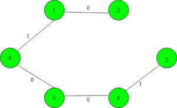

# 在边权重为 0 或 1 的完整图中找到最小二乘的权重

> 原文:[https://www . geeksforgeeks . org/find-带边权重的完整图中的 mst 权重-0 或-1/](https://www.geeksforgeeks.org/find-weight-of-mst-in-a-complete-graph-with-edge-weights-either-0-or-1/)

给定一个由 **N** 个顶点组成的无向加权完全[图](https://www.geeksforgeeks.org/graph-and-its-representations/)。正好有 **M** 条边权重为 1，其余所有可能的边权重为 0。[数组](https://www.geeksforgeeks.org/array-data-structure/) **arr[][]** 给出权重为 1 的边集。任务是计算这个[图](https://www.geeksforgeeks.org/graph-and-its-representations/)的[最小生成树](https://www.geeksforgeeks.org/prims-minimum-spanning-tree-mst-greedy-algo-5/)的总权重。

**示例:**

> **输入:** N = 6，M = 11，arr[][] = {(1 3)、(1 4)、(1 5)、(1 6)、(2 3)、(2 4)、(2 5)、(2 6)、(3 4)、(3 5)、(3 6) }
> **输出:** 2
> **解释:**
> 这是给定图的最小生成树:
> 
> 
> 
> **输入:** N = 3，M = 0，arr[][] { }
> **输出:** 0
> **说明:**
> 这是给定图的最小生成树:
> 
> 

**方法:**
对于给定的 **N** 节点的[图](https://www.geeksforgeeks.org/graph-and-its-representations/)为[连接组件](https://www.geeksforgeeks.org/connected-components-in-an-undirected-graph/)，我们需要精确的**1-权重**边的 **N-1** 边。以下是步骤:

1.  在[地图](http://www.geeksforgeeks.org/map-associative-containers-the-c-standard-template-library-stl/)中为权重 1 的所有边存储给定的[图形](https://www.geeksforgeeks.org/graph-and-its-representations/)。
2.  使用[设置](http://www.geeksforgeeks.org/set-in-cpp-stl/)来存储不包含在任何 **0 权重** [连接组件](https://www.geeksforgeeks.org/connected-components-in-an-undirected-graph/)中的顶点。
3.  对于当前存储在[集合](http://www.geeksforgeeks.org/set-in-cpp-stl/)中的每个顶点，执行一次 [DFS 遍历](https://www.geeksforgeeks.org/depth-first-search-or-dfs-for-a-graph/)，将组件数增加 1，并从[集合](http://www.geeksforgeeks.org/set-in-cpp-stl/)中移除 [DFS 遍历](https://www.geeksforgeeks.org/depth-first-search-or-dfs-for-a-graph/)期间访问的所有顶点。
4.  在 [DFS 遍历](https://www.geeksforgeeks.org/depth-first-search-or-dfs-for-a-graph/)期间，将 **0 权重**顶点包含在[向量](http://www.geeksforgeeks.org/vector-in-cpp-stl/)中，将 1 权重顶点包含在另一个[集合](http://www.geeksforgeeks.org/set-in-cpp-stl/)中。对包含在[向量](http://www.geeksforgeeks.org/vector-in-cpp-stl/)中的所有顶点运行 [DFS 遍历](https://www.geeksforgeeks.org/depth-first-search-or-dfs-for-a-graph/)。
5.  然后，最小生成树的总权重被赋予组件数–1。

下面是上述方法的实现:

## C++

```
// C++ Program to find weight of
// minimum spanning tree in a
// complete graph where edges
// have weight either 0 or 1
#include <bits/stdc++.h>
using namespace std;

// To store the edges of the given
// graph
map<int, int> g[200005];
set<int> s, ns;

// A utility function to perform
// DFS Traversal
void dfs(int x)
{
    vector<int> v;
    v.clear();
    ns.clear();

    // Check those vertices which
    // are stored in the set
    for (int it : s) {
        // Vertices are included if
        // the weight of edge is 0
        if (!g[x][it]) {
            v.push_back(it);
        }
        else {
            ns.insert(it);
        }
    }
    s = ns;
    for (int i : v) {
        dfs(i);
    }
}

// A utility function to find the
// weight of Minimum Spanning Tree
void weightOfMST(int N)
{
    // To count the connected
    // components
    int cnt = 0;

    // Inserting the initial vertices
    // in the set
    for (int i = 1; i <= N; ++i) {
        s.insert(i);
    }

    // Traversing vertices stored in
    // the set and Run DFS Traversal
    // for each vertices
    for (; s.size();) {

        // Incrementing the zero
        // weight connected components
        ++cnt;

        int t = *s.begin();
        s.erase(t);

        // DFS Traversal for every
        // vertex remove
        dfs(t);
    }

    cout << cnt - 1;
}

// Driver's Code
int main()
{
    int N = 6, M = 11;
    int edges[][M] = { { 1, 3 }, { 1, 4 },
                      { 1, 5 }, { 1, 6 },
                      { 2, 3 }, { 2, 4 }, 
                      { 2, 5 }, { 2, 6 }, 
                      { 3, 4 }, { 3, 5 }, 
                      { 3, 6 } };

    // Insert edges
    for (int i = 0; i < M; ++i) {
        int u = edges[i][0];
        int v = edges[i][1];
        g[u][v] = 1;
        g[v][u] = 1;
    }

    // Function call find the weight
    // of Minimum Spanning Tree
    weightOfMST(N);
    return 0;
}
```

## Java 语言(一种计算机语言，尤用于创建网站)

```
// Java Program to find weight of 
// minimum spanning tree in a 
// complete graph where edges 
// have weight either 0 or 1 
import java.util.*;

class GFG{

// To store the edges 
// of the given graph
static HashMap<Integer, 
               Integer>[] g = 
               new HashMap[200005];
static HashSet<Integer> s = 
               new HashSet<>();
static HashSet<Integer> ns = 
               new HashSet<>();

// A utility function to 
// perform DFS Traversal
static void dfs(int x) 
{
  Vector<Integer> v = new Vector<>();
  v.clear();
  ns.clear();

  // Check those vertices which
  // are stored in the set
  for (int it : s) 
  {
    // Vertices are included if
    // the weight of edge is 0
    if (g[x].get(it) != null) 
    {
      v.add(it);
    } 
    else 
    {
      ns.add(it);
    }
  }

  s = ns;

  for (int i : v) 
  {
    dfs(i);
  }
}

// A utility function to find the
// weight of Minimum Spanning Tree
static void weightOfMST(int N) 
{
  // To count the connected
  // components
  int cnt = 0;

  // Inserting the initial vertices
  // in the set
  for (int i = 1; i <= N; ++i) 
  {
    s.add(i);
  }

  Vector<Integer> qt = new Vector<>();

  for (int t : s)
    qt.add(t);

  // Traversing vertices stored in
  // the set and Run DFS Traversal
  // for each vertices
  while (!qt.isEmpty()) 
  {
    // Incrementing the zero
    // weight connected components
    ++cnt;
    int t = qt.get(0);
    qt.remove(0);

    // DFS Traversal for every
    // vertex remove
    dfs(t);
  }

  System.out.print(cnt - 4);
}

// Driver's Code
public static void main(String[] args) 
{
  int N = 6, M = 11;
  int edges[][] = {{1, 3}, {1, 4}, 
                   {1, 5}, {1, 6}, 
                   {2, 3}, {2, 4}, 
                   {2, 5}, {2, 6}, 
                   {3, 4}, {3, 5}, 
                   {3, 6}};

  for (int i = 0; i < g.length; i++)
    g[i] = new HashMap<Integer, 
                       Integer>();
  // Insert edges
  for (int i = 0; i < M; ++i) 
  {
    int u = edges[i][0];
    int v = edges[i][1];
    g[u].put(v, 1);
    g[v].put(u, 1);

  }

  // Function call find the weight
  // of Minimum Spanning Tree
  weightOfMST(N);
}
}

// This code is contributed by gauravrajput1
```

## 蟒蛇 3

```
# Python3 Program to find weight of
# minimum spanning tree in a
# complete graph where edges
# have weight either 0 or 1

# To store the edges of the given
# graph

g = [dict() for i in range(200005)]
s = set()
ns = set()

# A utility function to perform
# DFS Traversal
def dfs(x):
    global s, g, ns
    v = []
    v.clear();
    ns.clear();

    # Check those vertices which
    # are stored in the set
    for it in s:

        # Vertices are included if
        # the weight of edge is 0
        if (x in g and not g[x][it]):
            v.append(it);

        else:
            ns.add(it);

    s = ns;

    for i in v:

        dfs(i);

# A utility function to find the
# weight of Minimum Spanning Tree
def weightOfMST( N):

    # To count the connected
    # components
    cnt = 0;

    # Inserting the initial vertices
    # in the set
    for i in range(1,N + 1):

        s.add(i);

    # Traversing vertices stored in
    # the set and Run DFS Traversal
    # for each vertices
    while(len(s) != 0):

        # Incrementing the zero
        # weight connected components
        cnt += 1

        t = list(s)[0]
        s.discard(t);

        # DFS Traversal for every
        # vertex remove
        dfs(t);

    print(cnt)

# Driver's Code
if __name__=='__main__':

    N = 6
    M = 11;
    edges = [ [ 1, 3 ], [ 1, 4 ],
                      [ 1, 5 ], [ 1, 6 ],
                      [ 2, 3 ], [ 2, 4 ], 
                      [ 2, 5 ], [ 2, 6 ], 
                      [ 3, 4 ], [ 3, 5 ], 
                      [ 3, 6 ] ];

    # Insert edges
    for i in range(M):

        u = edges[i][0];
        v = edges[i][1];
        g[u][v] = 1;
        g[v][u] = 1;

    # Function call find the weight
    # of Minimum Spanning Tree
    weightOfMST(N);

# This code is contributed by pratham76
```

## C#

```
// C# Program to find weight of 
// minimum spanning tree in a 
// complete graph where edges 
// have weight either 0 or 1 
using System;
using System.Collections;
using System.Collections.Generic;
 class GFG{

// To store the edges 
// of the given graph
static Dictionary<int,int> [] g =  new Dictionary<int,int>[200005];
static HashSet<int> s = new HashSet<int>();
static HashSet<int> ns = new HashSet<int>();

// A utility function to 
// perform DFS Traversal
static void dfs(int x) 
{
  ArrayList v = new ArrayList();

  ns.Clear();

  // Check those vertices which
  // are stored in the set
  foreach (int it in s) 
  {
    // Vertices are included if
    // the weight of edge is 0
    if (g[x].ContainsKey(it)) 
    {
      v.Add(it);
    } 
    else
    {
      ns.Add(it);
    }
  }
  s = ns;   
  foreach(int i in v) 
  {
    dfs(i);
  }
}

// A utility function to find the
// weight of Minimum Spanning Tree
static void weightOfMST(int N) 
{
  // To count the connected
  // components
  int cnt = 0;

  // Inserting the initial vertices
  // in the set
  for (int i = 1; i <= N; ++i) 
  {
    s.Add(i);
  }

  ArrayList qt = new ArrayList();

  foreach(int t in s)
    qt.Add(t);

  // Traversing vertices stored in
  // the set and Run DFS Traversal
  // for each vertices
  while (qt.Count != 0) 
  {
    // Incrementing the zero
    // weight connected components
    ++cnt;
    int t = (int)qt[0];
    qt.RemoveAt(0);

    // DFS Traversal for every
    // vertex remove
    dfs(t);
  }

  Console.Write(cnt - 4);
}

// Driver's Code
public static void Main(string[] args) 
{
  int N = 6, M = 11;
  int [,]edges = {{1, 3}, {1, 4}, 
                   {1, 5}, {1, 6}, 
                   {2, 3}, {2, 4}, 
                   {2, 5}, {2, 6}, 
                   {3, 4}, {3, 5}, 
                   {3, 6}};

  for (int i = 0; i < 11; i++)
    g[i] = new Dictionary<int, int>();

  // Insert edges
  for (int i = 0; i < M; ++i) 
  {
    int u = edges[i, 0];
    int v = edges[i, 1];
    g[u][v] = 1;
    g[v][u] = 1; 
  }

  // Function call find the weight
  // of Minimum Spanning Tree
  weightOfMST(N);
}
}

// This code is contributed by rutvik_56
```

## java 描述语言

```
<script>

// Javascript program to find weight of
// minimum spanning tree in a
// complete graph where edges
// have weight either 0 or 1

// To store the edges
// of the given graph
let g = new Array(200005);
for(let i = 0; i < 200005; i++)
    g[i] = new Map();

let s = new Set();
let ns = new Set();

// A utility function to
// perform DFS Traversal
function dfs(x)
{
    let v = [];

    // Check those vertices which
    // are stored in the set
    for(let it of s.values())
    {

        // Vertices are included if
        // the weight of edge is 0
        if (g[x].get(it) != null)
        {
            v.push(it);
        }
        else
        {
            ns.add(it);
        }
    }

    s = ns;

    for(let i of v.values())
    {
        dfs(i);
    }
}

// A utility function to find the
// weight of Minimum Spanning Tree
function weightOfMST(N)
{

    // To count the connected
    // components
    let cnt = 0;

    // Inserting the initial vertices
    // in the set
    for(let i = 1; i <= N; ++i)
    {
        s.add(i);
    }

    let qt = []

    for(let t of s.values())
        qt.push(t);

    // Traversing vertices stored in
    // the set and Run DFS Traversal
    // for each vertices
    while (qt.length != 0)
    {

        // Incrementing the zero
        // weight connected components
        ++cnt;
        let t = qt[0];
        qt.shift();

        // DFS Traversal for every
        // vertex remove
        dfs(t);
    }
    document.write(cnt - 4);
}

// Driver's Code
let N = 6, M = 11;
let edges = [ [ 1, 3 ], [ 1, 4 ],
              [ 1, 5 ], [ 1, 6 ],
              [ 2, 3 ], [ 2, 4 ],
              [ 2, 5 ], [ 2, 6 ],
              [ 3, 4 ], [ 3, 5 ],
              [ 3, 6 ] ];

// Insert edges
for(let i = 0; i < M; ++i)
{
    let u = edges[i][0];
    let v = edges[i][1];
    g[u].set(v, 1);
    g[v].set(u, 1);
}

// Function call find the weight
// of Minimum Spanning Tree
weightOfMST(N);

// This code is contributed by unknown2108

</script>
```

**Output:** 

```
2
```

**时间复杂度:** O(N*log N + M)，其中 N 为顶点数，M 为边数。
**辅助空间:** O(N)