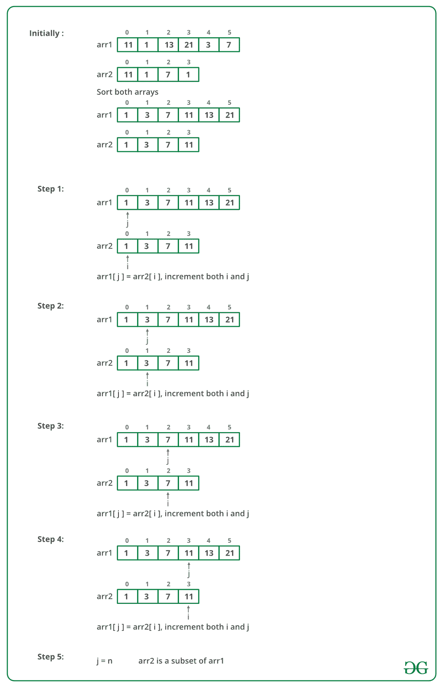

# 查找一个数组是否是另一个数组的子集 | 新增方法 3

> 原文： [https://www.geeksforgeeks.org/find-whether-an-array-is-subset-of-another-array-set-1/](https://www.geeksforgeeks.org/find-whether-an-array-is-subset-of-another-array-set-1/)

给定两个数组：`arr1[0..m-1]`和`arr2[0..n-1]`。 查找`arr2[]`是否是`arr1[]`的子集。 这两个数组均未排序。 可以假定两个数组中的元素都是不同的。

**示例**：

> 输入：`arr1[] = {11, 1, 13, 21, 3, 7}`，`arr2[] = {11, 3, 7, 1}`
> 
> 输出：`arr2[]`是`arr1[]`的子集
> 
> 输入：`arr1[] = {1, 2, 3, 4, 5, 6}`，`arr2[] = {1, 2, 4}`
> 
> 输出：`arr2[]`是`arr1[]`的子集
> 
> 输入：`arr1[] = {10, 5, 2, 23, 19}`，`arr2[] = {19, 5, 3}`
> 
> 输出：`arr2[]`不是`arr1[]`的子集

**方法 1（简单）**：

使用两个循环：外循环一个接一个地选取 arr2 []的所有元素。 内循环线性搜索外循环拾取的元素。 如果找到所有元素，则返回 1，否则返回 0。

## C++ 

```cpp

// C++ program to find whether an array 
// is subset of another array 
#include<bits/stdc++.h> 

/* Return 1 if arr2[] is a subset of  
arr1[] */
bool isSubset(int arr1[], int arr2[],  
                        int m, int n) 
{ 
    int i = 0; 
    int j = 0; 
    for (i = 0; i < n; i++) 
    { 
        for (j = 0; j < m; j++) 
        { 
            if(arr2[i] == arr1[j]) 
                break; 
        } 

        /* If the above inner loop was 
        not broken at all then arr2[i] 
        is not present in arr1[] */
        if (j == m) 
            return 0; 
    } 

    /* If we reach here then all 
    elements of arr2[] are present 
    in arr1[] */
    return 1; 
} 

// Driver code 
int main() 
{ 
    int arr1[] = {11, 1, 13, 21, 3, 7}; 
    int arr2[] = {11, 3, 7, 1}; 

    int m = sizeof(arr1)/sizeof(arr1[0]); 
    int n = sizeof(arr2)/sizeof(arr2[0]); 

    if(isSubset(arr1, arr2, m, n)) 
        printf("arr2[] is subset of arr1[] "); 
    else
        printf("arr2[] is not a subset of arr1[]");      

    getchar(); 
    return 0; 
} 

```

## Java

```java

// Java program to find whether an array 
// is subset of another array 

class GFG { 

    /* Return true if arr2[] is a subset  
    of arr1[] */
    static boolean isSubset(int arr1[],  
                int arr2[], int m, int n) 
    { 
        int i = 0; 
        int j = 0; 
        for (i = 0; i < n; i++) 
        { 
            for (j = 0; j < m; j++) 
                if(arr2[i] == arr1[j]) 
                    break; 

            /* If the above inner loop  
            was not broken at all then 
            arr2[i] is not present in 
            arr1[] */
            if (j == m) 
                return false; 
        } 

        /* If we reach here then all 
        elements of arr2[] are present 
        in arr1[] */
        return true; 
    } 

    // Driver code 
    public static void main(String args[]) 
    { 
        int arr1[] = {11, 1, 13, 21, 3, 7}; 
        int arr2[] = {11, 3, 7, 1}; 

        int m = arr1.length; 
        int n = arr2.length; 

        if(isSubset(arr1, arr2, m, n)) 
            System.out.print("arr2[] is "
                  + "subset of arr1[] "); 
        else
            System.out.print("arr2[] is "
             + "not a subset of arr1[]");  
    } 
} 

```

## Python 3

```py

# Python 3 program to find whether an array 
# is subset of another array 

# Return 1 if arr2[] is a subset of  
# arr1[]  
def isSubset(arr1, arr2, m, n): 
    i = 0
    j = 0
    for i in range(n): 
        for j in range(m): 
            if(arr2[i] == arr1[j]): 
                break

        # If the above inner loop was 
        # not broken at all then arr2[i] 
        # is not present in arr1[]  
        if (j == m): 
            return 0

    # If we reach here then all 
    # elements of arr2[] are present 
    # in arr1[]  
    return 1

# Driver code 
if __name__ == "__main__": 

    arr1 = [11, 1, 13, 21, 3, 7] 
    arr2 = [11, 3, 7, 1] 

    m = len(arr1) 
    n = len(arr2) 

    if(isSubset(arr1, arr2, m, n)): 
        print("arr2[] is subset of arr1[] ") 
    else: 
        print("arr2[] is not a subset of arr1[]") 

# This code is contributed by ita_c 

```

## C# 

```cs

// C# program to find whether an array 
// is subset of another array 
using System; 

class GFG { 

    /* Return true if arr2[] is a  
    subset of arr1[] */
    static bool isSubset(int []arr1,  
               int []arr2, int m, int n) 
    { 
        int i = 0; 
        int j = 0; 
        for (i = 0; i < n; i++) 
        { 
            for (j = 0; j < m; j++) 
                if(arr2[i] == arr1[j]) 
                    break; 

            /* If the above inner loop  
            was not broken at all then 
            arr2[i] is not present in 
            arr1[] */
            if (j == m) 
                return false; 
        } 

        /* If we reach here then all 
        elements of arr2[] are present 
        in arr1[] */
        return true; 
    } 

    // Driver function 
    public static void Main() 
    { 
        int []arr1 = {11, 1, 13, 21, 3, 7}; 
        int []arr2 = {11, 3, 7, 1}; 

        int m = arr1.Length; 
        int n = arr2.Length; 

        if(isSubset(arr1, arr2, m, n)) 
        Console.WriteLine("arr2[] is subset"
                           + " of arr1[] "); 
        else
        Console.WriteLine("arr2[] is not a "
                      + "subset of arr1[]"); 
    } 
} 

// This code is contributed by Sam007 

```

## PHP

```php

<?php 
// PHP program to find whether an array 
// is subset of another array 

/* Return 1 if arr2[] is a subset of  
arr1[] */
function isSubset($arr1, $arr2, $m, $n) 
{ 
    $i = 0; 
    $j = 0; 
    for ($i = 0; $i < $n; $i++) 
    { 
        for ($j = 0; $j < $m; $j++) 
        { 
            if($arr2[$i] == $arr1[$j]) 
                break; 
        } 

        /* If the above inner loop was 
        not broken at all then arr2[i] 
        is not present in arr1[] */
        if ($j == $m) 
            return 0; 
    } 

    /* If we reach here then all 
    elements of arr2[] are present 
    in arr1[] */
    return 1; 
} 

// Driver code 
    $arr1 = array(11, 1, 13, 21, 3, 7); 
    $arr2 = array(11, 3, 7, 1); 

    $m = count($arr1); 
    $n = count($arr2); 

    if(isSubset($arr1, $arr2, $m, $n)) 
        echo "arr2[] is subset of arr1[] "; 
    else
        echo "arr2[] is not a subset of arr1[]";      

// This code is contributed by anuj_67\. 
?> 

```

**输出**：

```
arr2[] is subset of arr1[] 

```

**时间复杂度**：`O(m * n)`。

**方法 2（使用[排序](http://www.geeksforgeeks.org/sorting-algorithms/)和[二分搜索](http://www.geeksforgeeks.org/binary-search/)）**：

*   对`arr1[]`进行排序，结果为`O(mLogm)`。

*   对于`arr2[]`的每个元素，请按排序的`arr1[]`进行二分搜索。

*   如果找不到该元素，则返回 0。

*   如果所有元素都存在，则返回 1。

## C++

```cpp

// C++ program to find whether an array 
// is subset of another array 
#include<bits/stdc++.h> 
using namespace std; 

/* Fucntion prototypes */
void quickSort(int *arr, int si, int ei); 
int binarySearch(int arr[], int low,  
                    int high, int x); 

/* Return 1 if arr2[] is a subset of arr1[] */
bool isSubset(int arr1[], int arr2[], 
                        int m, int n) 
{ 
    int i = 0; 

    quickSort(arr1, 0, m-1); 
    for (i=0; i<n; i++) 
    { 
        if (binarySearch(arr1, 0, m - 1, 
                        arr2[i]) == -1) 
        return 0; 
    } 

    /* If we reach here then all elements 
     of arr2[] are present in arr1[] */
    return 1; 
} 

/* FOLLOWING FUNCTIONS ARE ONLY FOR  
    SEARCHING AND SORTING PURPOSE */
/* Standard Binary Search function*/
int binarySearch(int arr[], int low, 
                    int high, int x) 
{ 
    if(high >= low) 
    { 
        int mid = (low + high)/2; /*low + (high - low)/2;*/

        /* Check if arr[mid] is the first occurrence of x. 
        arr[mid] is first occurrence if x is one of the following 
        is true: 
        (i) mid == 0 and arr[mid] == x 
        (ii) arr[mid-1] < x and arr[mid] == x    */
        if(( mid == 0 || x > arr[mid-1]) && (arr[mid] == x)) 
            return mid; 
        else if(x > arr[mid]) 
            return binarySearch(arr, (mid + 1), high, x); 
        else
            return binarySearch(arr, low, (mid -1), x); 
    } 
    return -1; 
}  

void exchange(int *a, int *b) 
{ 
    int temp; 
    temp = *a; 
    *a = *b; 
    *b = temp; 
} 

int partition(int A[], int si, int ei) 
{ 
    int x = A[ei]; 
    int i = (si - 1); 
    int j; 

    for (j = si; j <= ei - 1; j++) 
    { 
        if(A[j] <= x) 
        { 
            i++; 
            exchange(&A[i], &A[j]); 
        } 
    } 
    exchange (&A[i + 1], &A[ei]); 
    return (i + 1); 
} 

/* Implementation of Quick Sort 
A[] --> Array to be sorted 
si --> Starting index 
ei --> Ending index 
*/
void quickSort(int A[], int si, int ei) 
{ 
    int pi; /* Partitioning index */
    if(si < ei) 
    { 
        pi = partition(A, si, ei); 
        quickSort(A, si, pi - 1); 
        quickSort(A, pi + 1, ei); 
    } 
} 

/*Driver code */
int main() 
{ 
    int arr1[] = {11, 1, 13, 21, 3, 7}; 
    int arr2[] = {11, 3, 7, 1}; 

    int m = sizeof(arr1) / sizeof(arr1[0]); 
    int n = sizeof(arr2) / sizeof(arr2[0]); 

    if(isSubset(arr1, arr2, m, n)) 
        cout << "arr2[] is subset of arr1[] "; 
    else
        cout << "arr2[] is not a subset of arr1[] ";  

    return 0; 
} 

// This code is contributed by Shivi_Aggarwal 

```

## C

```c

// C program to find whether an array 
// is subset of another array 
#include<stdio.h> 
#include <stdbool.h> 
/* Fucntion prototypes */
void quickSort(int *arr, int si, int ei); 
int binarySearch(int arr[], int low, int high, int x); 

/* Return 1 if arr2[] is a subset of arr1[] */
bool isSubset(int arr1[], int arr2[], int m, int n) 
{ 
    int i = 0; 

    quickSort(arr1, 0, m-1); 
    for (i=0; i<n; i++) 
    { 
        if (binarySearch(arr1, 0, m-1, arr2[i]) == -1) 
           return 0; 
    } 

    /* If we reach here then all elements of arr2[]  
      are present in arr1[] */
    return 1; 
} 

/* FOLLOWING FUNCTIONS ARE ONLY FOR SEARCHING AND SORTING PURPOSE */
/* Standard Binary Search function*/
int binarySearch(int arr[], int low, int high, int x) 
{ 
  if(high >= low) 
  { 
    int mid = (low + high)/2;  /*low + (high - low)/2;*/

    /* Check if arr[mid] is the first occurrence of x. 
        arr[mid] is first occurrence if x is one of the following 
        is true: 
        (i)  mid == 0 and arr[mid] == x 
        (ii) arr[mid-1] < x and arr[mid] == x 
     */
    if(( mid == 0 || x > arr[mid-1]) && (arr[mid] == x)) 
      return mid; 
    else if(x > arr[mid]) 
      return binarySearch(arr, (mid + 1), high, x); 
    else
      return binarySearch(arr, low, (mid -1), x); 
  } 
 return -1; 
}   

void exchange(int *a, int *b) 
{ 
    int temp; 
    temp = *a; 
    *a   = *b; 
    *b   = temp; 
} 

int partition(int A[], int si, int ei) 
{ 
    int x = A[ei]; 
    int i = (si - 1); 
    int j; 

    for (j = si; j <= ei - 1; j++) 
    { 
        if(A[j] <= x) 
        { 
            i++; 
            exchange(&A[i], &A[j]); 
        } 
    } 
    exchange (&A[i + 1], &A[ei]); 
    return (i + 1); 
} 

/* Implementation of Quick Sort 
A[] --> Array to be sorted 
si  --> Starting index 
ei  --> Ending index 
*/
void quickSort(int A[], int si, int ei) 
{ 
    int pi;    /* Partitioning index */
    if(si < ei) 
    { 
        pi = partition(A, si, ei); 
        quickSort(A, si, pi - 1); 
        quickSort(A, pi + 1, ei); 
    } 
} 

/*Driver program to test above functions */
int main() 
{ 
    int arr1[] = {11, 1, 13, 21, 3, 7}; 
    int arr2[] = {11, 3, 7, 1}; 

    int m = sizeof(arr1)/sizeof(arr1[0]); 
    int n = sizeof(arr2)/sizeof(arr2[0]); 

    if(isSubset(arr1, arr2, m, n)) 
      printf("arr2[] is subset of arr1[] "); 
    else
      printf("arr2[] is not a subset of arr1[] ");       

    return 0; 
} 

```

## Java

```java

// Java program to find whether an array 
// is subset of another array 
class Main 
{ 
    /* Return true if arr2[] is a subset of arr1[] */
    static boolean isSubset(int arr1[], int arr2[], int m, int n) 
    { 
        int i = 0; 

        sort(arr1, 0, m-1); 
        for (i=0; i<n; i++) 
        { 
            if (binarySearch(arr1, 0, m-1, arr2[i]) == -1) 
               return false; 
        } 

        /* If we reach here then all elements of arr2[]  
          are present in arr1[] */
        return true; 
    } 

    /* FOLLOWING FUNCTIONS ARE ONLY FOR SEARCHING AND SORTING PURPOSE */
    /* Standard Binary Search function*/
    static int binarySearch(int arr[], int low, int high, int x) 
    { 
      if(high >= low) 
      { 
        int mid = (low + high)/2;  /*low + (high - low)/2;*/

        /* Check if arr[mid] is the first occurrence of x. 
            arr[mid] is first occurrence if x is one of the following 
            is true: 
            (i)  mid == 0 and arr[mid] == x 
            (ii) arr[mid-1] < x and arr[mid] == x 
         */
        if(( mid == 0 || x > arr[mid-1]) && (arr[mid] == x)) 
          return mid; 
        else if(x > arr[mid]) 
          return binarySearch(arr, (mid + 1), high, x); 
        else
          return binarySearch(arr, low, (mid -1), x); 
      } 
     return -1; 
    }   

    /* This function takes last element as pivot, 
       places the pivot element at its correct 
       position in sorted array, and places all 
       smaller (smaller than pivot) to left of 
       pivot and all greater elements to right 
       of pivot */
    static int partition(int arr[], int low, int high) 
    { 
        int pivot = arr[high];  
        int i = (low-1); // index of smaller element 
        for (int j=low; j<high; j++) 
        { 
            // If current element is smaller than or 
            // equal to pivot 
            if (arr[j] <= pivot) 
            { 
                i++; 

                // swap arr[i] and arr[j] 
                int temp = arr[i]; 
                arr[i] = arr[j]; 
                arr[j] = temp; 
            } 
        } 

        // swap arr[i+1] and arr[high] (or pivot) 
        int temp = arr[i+1]; 
        arr[i+1] = arr[high]; 
        arr[high] = temp; 

        return i+1; 
    } 

    /* The main function that implements QuickSort() 
      arr[] --> Array to be sorted, 
      low  --> Starting index, 
      high  --> Ending index */
    static void sort(int arr[], int low, int high) 
    { 
        if (low < high) 
        { 
            /* pi is partitioning index, arr[pi] is  
              now at right place */
            int pi = partition(arr, low, high); 

            // Recursively sort elements before 
            // partition and after partition 
            sort(arr, low, pi-1); 
            sort(arr, pi+1, high); 
        } 
    } 

    public static void main(String args[]) 
    { 
        int arr1[] = {11, 1, 13, 21, 3, 7}; 
        int arr2[] = {11, 3, 7, 1}; 

        int m = arr1.length; 
        int n = arr2.length; 

        if(isSubset(arr1, arr2, m, n)) 
          System.out.print("arr2[] is subset of arr1[] "); 
        else
          System.out.print("arr2[] is not a subset of arr1[]");   
    } 
} 

```

## Python3

```py

# Python3 program to find whether an array 
# is subset of another array 

# Return 1 if arr2[] is a subset of arr1[]  
def isSubset(arr1, arr2, m, n): 
    i = 0; 

    quickSort(arr1, 0, m-1); 
    for i in range(n): 
        if (binarySearch(arr1, 0, m - 1,arr2[i]) == -1): 
            return 0; 

    # If we reach here then all elements 
    # of arr2[] are present in arr1[]  
    return 1; 

# FOLLOWING FUNCTIONS ARE ONLY FOR  
# SEARCHING AND SORTING PURPOSE 
# Standard Binary Search function 
def binarySearch(arr, low, high, x): 
    if(high >= low): 
        mid = (low + high)//2; 

        # Check if arr[mid] is the first occurrence of x. 
        # arr[mid] is first occurrence if x is one of the following 
        # is true: 
        # (i) mid == 0 and arr[mid] == x 
        # (ii) arr[mid-1] < x and arr[mid] == x  
        if(( mid == 0 or x > arr[mid-1]) and (arr[mid] == x)): 
            return mid; 
        elif(x > arr[mid]): 
            return binarySearch(arr, (mid + 1), high, x); 
        else: 
            return binarySearch(arr, low, (mid -1), x); 

    return -1; 

def partition(A, si, ei): 
    x = A[ei]; 
    i = (si - 1); 

    for j in range(si,ei): 
        if(A[j] <= x): 
            i+=1; 
            A[i],A[j] = A[j],A[i]; 
    A[i + 1],A[ei] = A[ei],A[i+1]; 
    return (i + 1); 

# Implementation of Quick Sort 
# A[] --> Array to be sorted 
# si --> Starting index 
# ei --> Ending index 

def quickSort(A, si, ei): 
    # Partitioning index  
    if(si < ei): 
        pi = partition(A, si, ei); 
        quickSort(A, si, pi - 1); 
        quickSort(A, pi + 1, ei); 

# Driver code  
arr1 = [11, 1, 13, 21, 3, 7]; 
arr2 = [11, 3, 7, 1]; 

m = len(arr1); 
n = len(arr2); 

if(isSubset(arr1, arr2, m, n)): 
    print("arr2[] is subset of arr1[] "); 
else: 
    print("arr2[] is not a subset of arr1[] ");  

# This code is contributed by chandan_jnu 

```

## C#

```cs

// C# program to find whether an array 
// is subset of another array 
using System; 

public class GFG 
{ 
    /* Return true if arr2[] is a subset of arr1[] */
    static bool isSubset(int []arr1, int []arr2, int m, int n) 
    { 
        int i = 0; 

        sort(arr1, 0, m-1); 
        for (i=0; i<n; i++) 
        { 
            if (binarySearch(arr1, 0, m-1, arr2[i]) == -1) 
               return false; 
        } 

        /* If we reach here then all elements of arr2[]  
          are present in arr1[] */
        return true; 
    } 

    /* FOLLOWING FUNCTIONS ARE ONLY FOR SEARCHING AND SORTING PURPOSE */
    /* Standard Binary Search function*/
    static int binarySearch(int []arr, int low, int high, int x) 
    { 
      if(high >= low) 
      { 
        int mid = (low + high)/2;  /*low + (high - low)/2;*/

        /* Check if arr[mid] is the first occurrence of x. 
            arr[mid] is first occurrence if x is one of the following 
            is true: 
            (i)  mid == 0 and arr[mid] == x 
            (ii) arr[mid-1] < x and arr[mid] == x 
         */
        if(( mid == 0 || x > arr[mid-1]) && (arr[mid] == x)) 
          return mid; 
        else if(x > arr[mid]) 
          return binarySearch(arr, (mid + 1), high, x); 
        else
          return binarySearch(arr, low, (mid -1), x); 
      } 
     return -1; 
    }   

    /* This function takes last element as pivot, 
       places the pivot element at its correct 
       position in sorted array, and places all 
       smaller (smaller than pivot) to left of 
       pivot and all greater elements to right 
       of pivot */
    static int partition(int []arr, int low, int high) 
    { 
        int pivot = arr[high];  
        int i = (low-1); // index of smaller element 
        int temp=0; 
        for (int j=low; j<high; j++) 
        { 
            // If current element is smaller than or 
            // equal to pivot 
            if (arr[j] <= pivot) 
            { 
                i++; 

                // swap arr[i] and arr[j] 
                temp = arr[i]; 
                arr[i] = arr[j]; 
                arr[j] = temp; 
            } 
        } 

        // swap arr[i+1] and arr[high] (or pivot) 
        temp = arr[i+1]; 
        arr[i+1] = arr[high]; 
        arr[high] = temp; 

        return i+1; 
    } 

    /* The main function that implements QuickSort() 
      arr[] --> Array to be sorted, 
      low  --> Starting index, 
      high  --> Ending index */
    static void sort(int []arr, int low, int high) 
    { 
        if (low < high) 
        { 
            /* pi is partitioning index, arr[pi] is  
              now at right place */
            int pi = partition(arr, low, high); 

            // Recursively sort elements before 
            // partition and after partition 
            sort(arr, low, pi-1); 
            sort(arr, pi+1, high); 
        } 
    } 

    public static void Main() 
    { 
        int []arr1 = {11, 1, 13, 21, 3, 7}; 
        int []arr2= {11, 3, 7, 1}; 

        int m = arr1.Length; 
        int n = arr2.Length; 

        if(isSubset(arr1, arr2, m, n)) 
          Console.Write("arr2[] is subset of arr1[] "); 
        else
          Console.Write("arr2[] is not a subset of arr1[]");   
    } 
} 
//This code is contributed by 29AjayKumar 

```

## PHP

```php

<?php 
// PHP program to find whether an array 
// is subset of another array 

/* Return 1 if arr2[] is a subset of arr1[] */
function isSubset($arr1, $arr2, 
                        $m, $n) 
{ 
    $i = 0; 

    quickSort($arr1, 0, $m-1); 
    for ($i = 0; $i < $n; $i++) 
    { 
        if (binarySearch($arr1, 0, $m - 1, 
                        $arr2[$i]) == -1) 
        return 0; 
    } 

    /* If we reach here then all elements 
    of arr2[] are present in arr1[] */
    return 1; 
} 

/* FOLLOWING FUNCTIONS ARE ONLY FOR  
    SEARCHING AND SORTING PURPOSE */
/* Standard Binary Search function*/
function binarySearch($arr, $low, $high, $x) 
{ 
    if($high >= $low) 
    { 
        $mid = (int)(($low + $high)/2); /*low + (high - low)/2;*/

        /* Check if arr[mid] is the first occurrence of x. 
        arr[mid] is first occurrence if x is one of the following 
        is true: 
        (i) mid == 0 and arr[mid] == x 
        (ii) arr[mid-1] < x and arr[mid] == x */
        if(( $mid == 0 || $x > $arr[$mid-1]) && ($arr[$mid] == $x)) 
            return $mid; 
        else if($x > $arr[$mid]) 
            return binarySearch($arr, ($mid + 1), $high, $x); 
        else
            return binarySearch($arr, $low, ($mid -1), $x); 
    } 
    return -1; 
}  

function exchange(&$a, &$b) 
{ 

    $temp = $a; 
    $a = $b; 
    $b = $temp; 
} 

function partition(&$A, $si, $ei) 
{ 
    $x = $A[$ei]; 
    $i = ($si - 1); 

    for ($j = $si; $j <= $ei - 1; $j++) 
    { 
        if($A[$j] <= $x) 
        { 
            $i++; 
            exchange($A[$i], $A[$j]); 
        } 
    } 
    exchange ($A[$i + 1], $A[$ei]); 
    return ($i + 1); 
} 

/* Implementation of Quick Sort 
A[] --> Array to be sorted 
si --> Starting index 
ei --> Ending index 
*/
function quickSort(&$A, $si, $ei) 
{ 
    /* Partitioning index */
    if($si < $ei) 
    { 
        $pi = partition($A, $si, $ei); 
        quickSort($A, $si, $pi - 1); 
        quickSort($A, $pi + 1, $ei); 
    } 
} 

    /*Driver code */
    $arr1 = array(11, 1, 13, 21, 3, 7); 
    $arr2 = array(11, 3, 7, 1); 

    $m = count($arr1); 
    $n = count($arr2); 

    if(isSubset($arr1, $arr2, $m, $n)) 
        echo "arr2[] is subset of arr1[] "; 
    else
        echo "arr2[] is not a subset of arr1[] ";  

// This code is contributed by chandan_jnu 
?> 

```

**输出**：

```
arr2 is a subset of arr1
```

**时间复杂度**：`O(mLogm + nLogm)`。 请注意，如果使用`mLogm`算法进行排序，这将很复杂，而以上代码中的情况并非如此。 在上面的代码中使用了快速排序，最坏情况下，快速排序的时间复杂度为`O(m ^ 2)`。

**方法 3（使用[排序](http://www.geeksforgeeks.org/sorting-algorithms/)和[合并](https://www.geeksforgeeks.org/merge-two-sorted-arrays/)）**：

*   对两个数组进行排序：`arr1[]`和`arr2[]`，它们的取值为 `O(mLogm + nLogn)`。

*   使用类似合并的过程查看排序的`arr1[]`中是否存在排序的`arr2[]`的所有元素。

感谢 **Parthsarthi** 提出了此方法。

下图是上述方法的模拟：



下面是上述方法的实现：

## C++

```cpp

// C++ program to find whether an array 
// is subset of another array 
#include <bits/stdc++.h> 
using namespace std; 

/* Return 1 if arr2[] is a subset of arr1[] */ 
bool isSubset(int arr1[], int arr2[], int m, int n) 
{ 
    int i = 0, j = 0; 

    if (m < n) 
       return 0; 

    // Sort both the arrays  
    sort(arr1, arr1 + m); 
    sort(arr2, arr2 + n);  

    // Iterate till they donot exceed their sizes  
    while (i < n && j < m ) 
    {  
        // If the element is smaller than 
        // Move aheaad in the first array  
        if( arr1[j] <arr2[i] ) 
            j++; 
        // If both are equal, then move both of them forward  
        else if( arr1[j] == arr2[i] ) 
        { 
            j++; 
            i++; 
        } 

        // If we donot have a element smaller  
        // or equal to the second array then break  
        else if( arr1[j] > arr2[i] ) 
            return 0; 
    } 

    return  (i < n)? false : true; 
}  

// Driver Code  
int main() 
{ 
    int arr1[] = {11, 1, 13, 21, 3, 7}; 
    int arr2[] = {11, 3, 7, 1}; 

    int m = sizeof(arr1)/sizeof(arr1[0]); 
    int n = sizeof(arr2)/sizeof(arr2[0]); 

    if(isSubset(arr1, arr2, m, n)) 
      printf("arr2[] is subset of arr1[] "); 
    else
      printf("arr2[] is not a subset of arr1[] ");       

    return 0; 
} 

```

## Java

```java

// Java code to find whether an array is subset of  
// another array 
import java.util.Arrays; 
class GFG 
{ 
    /* Return true if arr2[] is a subset of arr1[] */
    static boolean isSubset(int arr1[], int arr2[], int m, 
                                                   int n) 
    { 
        int i = 0, j = 0; 

        if(m < n) 
        return false; 

        Arrays.sort(arr1); //sorts arr1 
        Arrays.sort(arr2); // sorts arr2 

        while( i < n && j < m ) 
        { 
            if( arr1[j] < arr2[i] ) 
                j++; 
            else if( arr1[j] == arr2[i] ) 
            { 
                j++; 
                i++; 
            } 
            else if( arr1[j] > arr2[i] ) 
                return false; 
        } 

        if( i < n ) 
            return false; 
        else
            return true; 
    }  

    public static void main(String[] args)  
    {  
        int arr1[] = {11, 1, 13, 21, 3, 7}; 
        int arr2[] = {11, 3, 7, 1}; 

        int m = arr1.length; 
        int n = arr2.length; 

        if(isSubset(arr1, arr2, m, n)) 
        System.out.println("arr2 is a subset of arr1"); 
        else
        System.out.println("arr2 is not a subset of arr1"); 
    } 
} 
// This code is contributed by Kamal Rawal 

```

## Python3

```py

# Python3 program to find whether an array  
# is subset of another array  

# Return 1 if arr2[] is a subset of arr1[] */  
def isSubset(arr1, arr2, m, n): 
    i = 0
    j = 0
    if m < n: 
        return 0

    arr1.sort() 
    arr2.sort() 

    while i < n and j < m: 
        if arr1[j] < arr2[i]: 
            j += 1
        elif arr1[j] == arr2[i]: 
            j += 1
            i += 1
        elif arr1[j] > arr2[i]: 
            return 0
    return False if i < n else True

# Driver code 
arr1 = [11, 1, 13, 21, 3, 7] 
arr2 = [11, 3, 7, 1] 

m = len(arr1) 
n = len(arr2) 
if isSubset(arr1, arr2, m, n) == True: 
    print("arr2 is subset of arr1 ") 
else: 
    printf("arr2 is not a subset of arr1 ") 

# This code is contributed by Shrikant13 

```

## C#

```cs

// C# code to find whether an array 
// is subset of another array 
using System; 
class GFG { 

    // Return true if arr2[] is  
    // a subset of arr1[] */ 
    static bool isSubset(int []arr1,  
                         int []arr2,  
                         int m, 
                         int n) 
    { 
        int i = 0, j = 0; 

        if(m < n) 
            return false; 

        //sorts arr1 
        Array.Sort(arr1);  

        // sorts arr2 
        Array.Sort(arr2);  

        while( i < n && j < m ) 
        { 
            if( arr1[j] < arr2[i] ) 
                j++; 
            else if( arr1[j] == arr2[i] ) 
            { 
                j++; 
                i++; 
            } 
            else if( arr1[j] > arr2[i] ) 
                return false; 
        } 

        if( i < n ) 
            return false; 
        else
            return true; 
    }  

    // Driver Code 
    public static void Main()  
    {  
        int []arr1 = {11, 1, 13, 21, 3, 7}; 
        int []arr2 = {11, 3, 7, 1}; 

        int m = arr1.Length; 
        int n = arr2.Length; 

        if(isSubset(arr1, arr2, m, n)) 
            Console.Write("arr2 is a subset of arr1"); 
        else
            Console.Write("arr2 is not a subset of arr1"); 
    } 
} 

// This code is contributed by nitin mittal. 

```

## PHP

```php

<?php 
// PHP program to find whether an array 
// is subset of another array 

/* Return 1 if arr2[] is a subset of arr1[] */
function isSubset( $arr1, $arr2, $m, $n) 
{ 
    $i = 0; $j = 0; 

    if ($m < $n) 
        return 0; 

    sort($arr1); 
    sort($arr2); 

    while ($i < $n and $j < $m ) 
    { 
        if( $arr1[$j] <$arr2[$i] ) 
            $j++; 
        else if( $arr1[$j] == $arr2[$i] ) 
        { 
            $j++; 
            $i++; 
        } 
        else if( $arr1[$j] > $arr2[$i] ) 
            return 0; 
    } 

    return ($i < $n) ? false : true; 
}  

/*Driver program to test above functions */

    $arr1 = array(11, 1, 13, 21, 3, 7); 
    $arr2 = array(11, 3, 7, 1); 

    $m = count($arr1); 
    $n = count($arr2); 

    if(isSubset($arr1, $arr2, $m, $n)) 
        echo "arr2[] is subset of arr1[] "; 
    else
        echo "arr2[] is not a subset of arr1[] ";  

// This code is contributed by anuj_67\. 
?> 

```

**输出**：

```
arr2 is a subset of arr1

```

**时间复杂度**：`O(mLogm + nLogn)`比方法 2 更好。 在上面的代码中使用了快速排序，最坏情况下，快速排序的时间复杂度为`O(n ^ 2)`。

**方法 4（使用哈希）**：

*   为`arr1[]`的所有元素创建一个哈希表。

*   遍历`arr2[]`并在哈希表中搜索`arr2[]`的每个元素。 如果找不到元素，则返回 0。

*   如果找到所有元素，则返回 1。

下面是上述方法的实现：

## Java

```java

// Java code to find whether an array is subset of 
// another array 
import java.util.HashSet; 
class GFG 
{ 
    /* Return true if arr2[] is a subset of arr1[] */
    static boolean isSubset(int arr1[], int arr2[], int m, 
                                                 int n) 
    { 
        HashSet<Integer> hset= new HashSet<>(); 

        // hset stores all the values of arr1 
        for(int i = 0; i < m; i++) 
        { 
            if(!hset.contains(arr1[i])) 
                hset.add(arr1[i]); 
        } 

        // loop to check if all elements of arr2 also 
        // lies in arr1 
        for(int i = 0; i < n; i++) 
        { 
            if(!hset.contains(arr2[i])) 
                return false; 
        } 
        return true; 
    }  

    public static void main(String[] args)  
    {  
        int arr1[] = {11, 1, 13, 21, 3, 7}; 
        int arr2[] = {11, 3, 7, 1}; 

        int m = arr1.length; 
        int n = arr2.length; 

        if(isSubset(arr1, arr2, m, n)) 
        System.out.println("arr2 is a subset of arr1"); 
        else
        System.out.println("arr2 is not a subset of arr1"); 
    } 
} 
// This code is contributed by Kamal Rawal 

```

## C#

```cs

// C# code to find whether an array is  
// subset of another array  
using System; 
using System.Collections.Generic; 

class GFG 
{ 
/* Return true if arr2[] is a  
   subset of arr1[] */
public static bool isSubset(int[] arr1,  
                            int[] arr2, 
                            int m, int n) 
{ 
    HashSet<int> hset = new HashSet<int>(); 

    // hset stores all the values of arr1  
    for (int i = 0; i < m; i++) 
    { 
        if (!hset.Contains(arr1[i])) 
        { 
            hset.Add(arr1[i]); 
        } 
    } 

    // loop to check if all elements  
    // of arr2 also lies in arr1  
    for (int i = 0; i < n; i++) 
    { 
        if (!hset.Contains(arr2[i])) 
        { 
            return false; 
        } 
    } 
    return true; 
} 

// Driver Code 
public static void Main(string[] args) 
{ 
    int[] arr1 = new int[] {11, 1, 13, 21, 3, 7}; 
    int[] arr2 = new int[] {11, 3, 7, 1}; 

    int m = arr1.Length; 
    int n = arr2.Length; 

    if (isSubset(arr1, arr2, m, n)) 
    { 
        Console.WriteLine("arr2 is a subset of arr1"); 
    } 
    else
    { 
        Console.WriteLine("arr2 is not a subset of arr1"); 
    } 
} 
} 

// This code is contributed by Shrikant13 

```

**输出**：

```
arr2 is a subset of arr1

```

请注意，方法 1，方法 2 和方法 4 无法处理在 arr2 []中有重复项的情况。 例如，`{1, 4, 4, 2}`不是`{1, 4, 2}`的子集，但是这些方法会将其打印为子集。

如果您发现上述代码/算法有误，请写评论，或者找到其他解决相同问题的方法。

