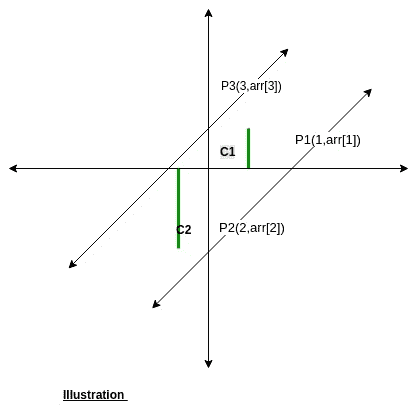

# 查找是否只有两条平行线包含所有坐标点

> 原文:[https://www . geeksforgeeks . org/find-是否-仅-两条-平行线-包含-所有-坐标-点-或-否/](https://www.geeksforgeeks.org/find-whether-only-two-parallel-lines-contain-all-coordinates-points-or-not/)

给定一个表示坐标平面上一组点的 y 坐标的数组，其中(I，arr[i])表示一个点。找出是否有可能画一对平行线，其中包括所有给定的坐标点，并且两条线必须包含一个点。打印 **1** 表示可能，打印 **0** 表示不可能。

**示例:**

> **输入:** arr[] = {1，4，3，6，5 }；
> **输出:** 1
> (1，1)、(3，3)和(5，5)位于一条线上
> as(2，4)和(4，6)位于另一条线上。
> **输入:** arr[] = {2，4，3，6，5 }；
> **输出:** 0
> 覆盖所有点至少需要 3 行。

**逼近:**由点(x1，y1)和(x2，y2)构成的直线的斜率为 y2-y2/x2-x1。因为给定的数组由点的坐标组成，如(I，arr[i])。所以，(arr[2]-arr[1]) / (2-1)是由(1，arr[i])和(2，arr[2])构成的直线的斜率。仅考虑三个点，例如 P0(0，arr[0])、P1(1，arr[1])和 P2(2，arr[2])，因为要求只有两条平行线，所以这三个点中的两点必须位于同一条线上。因此，三种可能的情况是:

*   P0 和 P1 在同一条线上，因此它们的斜率是 arr[1]-arr[0]
*   P1 和 P2 在同一条线上，因此它们的斜率是 arr[2]-arr[1]
*   P0 和 P2 在同一条线上，因此它们的斜率是 arr[2]-arr[0]/2

从三种情况中选择一种，假设 P0 和 P1 位于同一条直线上，在这种情况下，假设 m=arr[1]-arr[0]是我们的斜率。对于数组中的一般点(I，arr[i])，线的方程为:

```
=> (y-y1) = m (x-x1)
=> y-arr[i] = m (x-i)
=> y-mx = arr[i] - mi
```

因为 y-mx=c 是直线的一般方程，这里 c = arr[i] -mi。现在，如果给定数组的解是可能的，那么我们必须正好有两个截距(c)。
因此，如果上述三种可能中的任何一种存在两个不同的截距，则所需的解决方案是可能的，并打印 1 否则 0。



下面是上述方法的实现:

## C++

```
// C++ implementation of the above approach
#include <bits/stdc++.h>
using namespace std;

// Find if slope is good with only two intercept
bool isSlopeGood(double slope, int arr[], int n)
{
    set<double> setOfLines;
    for (int i = 0; i < n; i++)
        setOfLines.insert(arr[i] - slope * (i));

    // if set of lines have only two distinct intercept
    return setOfLines.size() == 2;
}

// Function to check if required solution exist
bool checkForParallel(int arr[], int n)
{
    // check the result by processing
    // the slope by starting three points
    bool slope1 = isSlopeGood(arr[1] - arr[0], arr, n);
    bool slope2 = isSlopeGood(arr[2] - arr[1], arr, n);
    bool slope3 = isSlopeGood((arr[2] - arr[0]) / 2, arr, n);

    return (slope1 || slope2 || slope3);
}

// Driver code
int main()
{
    int arr[] = { 1, 6, 3, 8, 5 };
    int n = sizeof(arr) / sizeof(arr[0]);
    cout << (int)checkForParallel(arr, n);

    return 0;
}
```

## Java 语言(一种计算机语言，尤用于创建网站)

```
// Java implementation of the above approach
import java.util.*;

class GfG
{

// Find if slope is good
// with only two intercept
static boolean isSlopeGood(double slope,
                        int arr[], int n)
{
    Set<Double> setOfLines = new HashSet<Double> ();
    for (int i = 0; i < n; i++)
        setOfLines.add(arr[i] - slope * (i));

    // if set of lines have only two distinct intercept
    return setOfLines.size() == 2;
}

// Function to check if required solution exist
static boolean checkForParallel(int arr[], int n)
{
    // check the result by processing
    // the slope by starting three points
    boolean slope1 = isSlopeGood(arr[1] - arr[0], arr, n);
    boolean slope2 = isSlopeGood(arr[2] - arr[1], arr, n);
    boolean slope3 = isSlopeGood((arr[2] - arr[0]) / 2, arr, n);

    return (slope1 == true || slope2 == true || slope3 == true);
}

// Driver code
public static void main(String[] args)
{
    int arr[] = { 1, 6, 3, 8, 5 };
    int n = arr.length;
    if(checkForParallel(arr, n) == true)
    System.out.println("1");
    else
    System.out.println("0");
}
}

// This code is contributed by Prerna Saini.
```

## 蟒蛇 3

```
# Python3 implementation of the
# above approach

# Find if slope is good with only
# two intercept
def isSlopeGood(slope, arr, n):

    setOfLines = dict()
    for i in range(n):
        setOfLines[arr[i] - slope * (i)] = 1

    # if set of lines have only
    # two distinct intercept
    return len(setOfLines) == 2

# Function to check if required solution exist
def checkForParallel(arr, n):

    # check the result by processing
    # the slope by starting three points
    slope1 = isSlopeGood(arr[1] - arr[0], arr, n)
    slope2 = isSlopeGood(arr[2] - arr[1], arr, n)
    slope3 = isSlopeGood((arr[2] - arr[0]) // 2, arr, n)

    return (slope1 or slope2 or slope3)

# Driver code
arr = [1, 6, 3, 8, 5 ]
n = len(arr)
if checkForParallel(arr, n):
    print(1)
else:
    print(0)

# This code is contributed by Mohit Kumar   
```

## C#

```
// C# implementation of the above approach
using System;
using System.Collections.Generic;

class GfG
{

// Find if slope is good
// with only two intercept
static bool isSlopeGood(double slope,
                        int []arr, int n)
{

    HashSet<Double> setOfLines = new HashSet<Double> ();
    for (int i = 0; i < n; i++)
        setOfLines.Add(arr[i] - slope * (i));

    // if set of lines have only two distinct intercept
    return setOfLines.Count == 2;
}

// Function to check if required solution exist
static bool checkForParallel(int []arr, int n)
{
    // check the result by processing
    // the slope by starting three points
    bool slope1 = isSlopeGood(arr[1] - arr[0], arr, n);
    bool slope2 = isSlopeGood(arr[2] - arr[1], arr, n);
    bool slope3 = isSlopeGood((arr[2] - arr[0]) / 2, arr, n);

    return (slope1 == true || slope2 == true || slope3 == true);
}

// Driver code
public static void Main()
{
    int []arr = { 1, 6, 3, 8, 5 };
    int n = arr.Length;
    if(checkForParallel(arr, n) == true)
        Console.WriteLine("1");
    else
        Console.WriteLine("0");
}
}

// This code is contributed by Ryuga.
```

## 服务器端编程语言（Professional Hypertext Preprocessor 的缩写）

```
<?php
// PHP implementation of the above approach

// Find if slope is good with only
// two intercept
function isSlopeGood($slope, $arr, $n)
{
    $setOfLines = array_fill(0, max($arr) * $n, 0);
    for ($i = 0; $i < $n; $i++)
        $setOfLines[$arr[$i] - $slope * $i] = 1;
    $setOfLines = array_unique($setOfLines);

    // if set of lines have only two
    // distinct intercept
    return (count($setOfLines) == 2);
}

// Function to check if required
// solution exist
function checkForParallel($arr, $n)
{
    // check the result by processing
    // the slope by starting three points
    $slope1 = isSlopeGood($arr[1] - $arr[0],
                                    $arr, $n);
    $slope2 = isSlopeGood($arr[2] - $arr[1],
                                    $arr, $n);
    $slope3 = isSlopeGood((int)(($arr[2] -
                                 $arr[0]) / 2),
                                 $arr, $n);

    return ($slope1 || $slope2 || $slope3);
}

// Driver code
$arr = array( 1, 6, 3, 8, 5 );
$n = count($arr);
echo (int)checkForParallel($arr, $n) . "\n";

// This code is contributed by mits
?>
```

## java 描述语言

```
<script>

// Javascript implementation of the above approach

// Find if slope is good with only two intercept
function isSlopeGood(slope, arr, n)
{
    var setOfLines = new Set();
    for (var i = 0; i < n; i++)
        setOfLines.add(arr[i] - slope * (i));

    // if set of lines have only two distinct intercept
    return setOfLines.size == 2;
}

// Function to check if required solution exist
function checkForParallel(arr, n)
{
    // check the result by processing
    // the slope by starting three points
    var slope1 = isSlopeGood(arr[1] - arr[0], arr, n);
    var slope2 = isSlopeGood(arr[2] - arr[1], arr, n);
    var slope3 = isSlopeGood(parseInt((arr[2] - arr[0]) / 2), arr, n);

    if(slope1 || slope2 || slope3)
    {
        return 1;
    }
    return 0;
}

// Driver code
var arr = [ 1, 6, 3, 8, 5 ];
var n = arr.length;
document.write( checkForParallel(arr, n));

</script>
```

**Output:** 

```
1
```