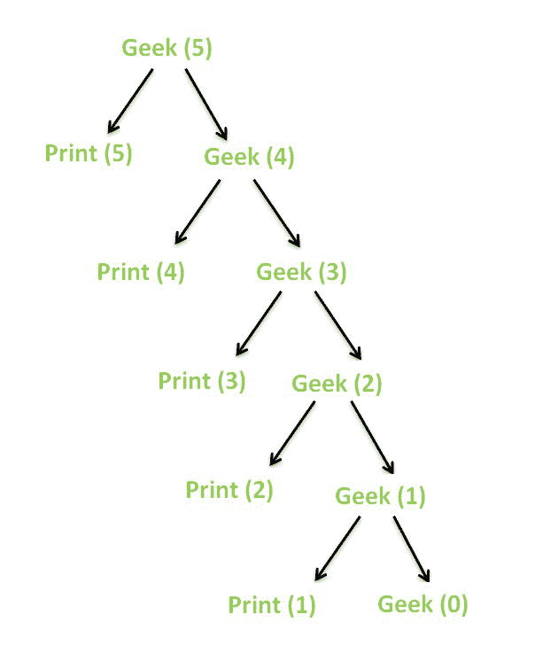
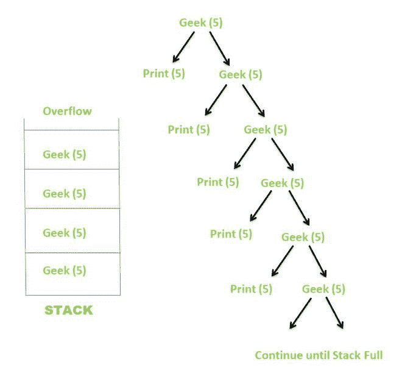

# 有限和无限递归及示例

> 原文:[https://www . geeksforgeeks . org/有限和无限递归示例/](https://www.geeksforgeeks.org/finite-and-infinite-recursion-with-examples/)

函数直接或间接调用自身的过程称为 [**【递归】**](https://www.geeksforgeeks.org/recursion/) ，对应的函数称为 [**递归函数**](https://www.geeksforgeeks.org/recursive-functions/) 。
使用递归，某些问题可以很容易地解决。此类问题的例子有:河内(TOH)塔、 [有序/前序/后序树遍历](https://www.geeksforgeeks.org/tree-traversals-inorder-preorder-and-postorder/)、 [DFS](https://www.geeksforgeeks.org/depth-first-traversal-for-a-graph/) 等。

**<u>递归类型:</u>**

**递归**可以进一步分为两种，取决于它们何时终止:

1.  有限递归
2.  无限递归

**<u>有限递归:</u>**

当递归在有限次数的递归调用后终止时，就会发生有限递归。递归只有在满足基本条件时才会终止。

**示例:**

下面是一个演示有限递归的实现。

## C++

```
// C++ program to demsonstrate Finite Recursion
#include <bits/stdc++.h>
using namespace std;

// Recursive function
void Geek(int N)
{
    // Base condition
    // When this condition is met,
    // the recursion terminates
    if (N == 0)
        return;

    // Print the current value of N
    cout << N << " ";

    // Call itself recursively
    Geek(N - 1);
}

// Driver code
int main()
{

    // Initial value of N
    int N = 5;

    // Call the recursive function
    Geek(N);
    return 0;
}
```

## Java 语言(一种计算机语言，尤用于创建网站)

```
// Java program for the above approach
class GFG{

// Recursive function
static void Geek(int N)
{

    // Base condition
    // When this condition is met,
    // the recursion terminates
    if (N == 0)
        return;

    // Print the current value of N
    System.out.println(N + " ");

    // Call itself recursively
    Geek(N - 1);
}

// Driver code
public static void main(String[] args)
{

    // Initial value of N
    int N = 5;

    // Call the recursive function
    Geek(N);
}
}

// This code is contributed by abhinavjain194
```

## 蟒蛇 3

```
# Python program to demsonstrate Finite Recursion
# Recursive function
def Geek( N):

    # Base condition
    # When this condition is met,
    # the recursion terminates
    if (N == 0):
        return

    # Pr the current value of N
    print( N, end =" " )

    # Call itself recursively
    Geek(N - 1)

# Driver code
# Initial value of N
N = 5

# Call the recursive function
Geek(N)

# this code is contributed by shivanisinghss2110
```

## C#

```
// C# program for the above approach
using System;
using System.Collections.Generic;

class GFG{

// Recursive function
static void Geek(int N)
{

    // Base condition
    // When this condition is met,
    // the recursion terminates
    if (N == 0)
        return;

    // Print the current value of N
    Console.Write(N + " ");

    // Call itself recursively
    Geek(N - 1);
}

// Driver Code
public static void Main(String[] args)
{

    // Initial value of N
    int N = 5;

    // Call the recursive function
    Geek(N);
}
}

// This code is contributed by target_2.
```

## java 描述语言

```
<script>

// JavaScript program to demsonstrate Finite Recursion
// Recursive function
function Geek(N)
{
    // Base condition
    // When this condition is met,
    // the recursion terminates
    if (N == 0)
        return;

    // Print the current value of N
    document.write(N +" ");

    // Call itself recursively
    Geek(N - 1);
}

// Driver code
// Initial value of N
    var N = 5;

    // Call the recursive function
    Geek(N);

 // this code is contributed by shivanisinghss2110

</script>
```

**Output**

```
5 4 3 2 1 
```

上述递归函数的递归树如下所示。



**递归树**

当 **N** 的值变为 **0** 时，由于基础条件，递归终止。

**<u>无限递归:</u>**

当递归在有限次数的递归调用后没有终止时，就会发生无限递归。由于基本条件不满足，递归无限进行。

**示例:**

下面是一个演示无限递归的实现。

## C++

```
// C++ program to demsonstrate Infinite Recursion
#include <bits/stdc++.h>
using namespace std;

// Recursive function
void Geek(int N)
{
    // Base condition
    // This condition is never met here
    if (N == 0)
        return;

    // Print the current value of N
    cout << N << " ";

    // Call itself recursively
    Geek(N);
}

// Driver code
int main()
{

    // Initial value of N
    int N = 5;

    // Call the recursive function
    Geek(N);
    return 0;
}
```

## Java 语言(一种计算机语言，尤用于创建网站)

```
// Java program to demsonstrate Infinite Recursion
import java.io.*;

class GFG
{
// Recursive function
static void Geek(int N)
{
    // Base condition
    // This condition is never met here
    if (N == 0)
        return;

    // Print the current value of N
    System.out.print( N +" ");

    // Call itself recursively
    Geek(N);
}

// Driver code
public static void main(String[] args)
    {

    // Initial value of N
    int N = 5;

    // Call the recursive function
    Geek(N);
    }
}

// This code is contributed by shivanisinghss2110
```

## 蟒蛇 3

```
# Python3 to demsonstrate Infinite Recursion

# Recursive function
def Geek(N):

    # Base condition
    # This condition is never met here
    if (N == 0):
        return

    # Print the current value of N
    print(N, end = " " )

    # Call itself recursively
    Geek(N)

# Driver code

# Initial value of N
N = 5

# Call the recursive function
Geek(N)

# This code is contributed by shivanisinghss2110
```

## C#

```
// C# program to demsonstrate Infinite Recursion
using System;

class GFG
{
// Recursive function
static void Geek(int N)
{
    // Base condition
    // This condition is never met here
    if (N == 0)
        return;

    // Print the current value of N
    Console.Write( N +" ");

    // Call itself recursively
    Geek(N);
}

// Driver code
public static void Main(String[] args)
    {

    // Initial value of N
    int N = 5;

    // Call the recursive function
    Geek(N);
    }
}

// This code is contributed by shivanisinghss2110
```

## java 描述语言

```
<script>
// JavaScript program to demsonstrate Infinite Recursion
// Recursive function
function Geek(N)
{
    // Base condition
    // This condition is never met here
    if (N == 0)
        return;

    // Print the current value of N
    document.write( N +" ");

    // Call itself recursively
    Geek(N);
}

// Driver code
    // Initial value of N
    var N = 5;

    // Call the recursive function
    Geek(N);

// This code is contributed by shivanisinghss2110
</script>
```

上述递归函数的递归树如下所示。



**递归树**

由于 **N** 的值永远不会变成 **0** ，所以递归永远不会终止。相反，递归继续，直到隐式堆栈变满，这导致了[堆栈溢出](https://www.geeksforgeeks.org/heap-overflow-stack-overflow/)。有些编译器直接给出输出为[分段故障(堆芯转储)](https://www.geeksforgeeks.org/core-dump-segmentation-fault-c-cpp/)，而有些编译器可能会因为某个值而异常终止，然后显示[分段故障](https://www.geeksforgeeks.org/exit-codes-in-c-c-with-examples/)。