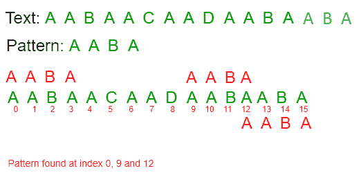
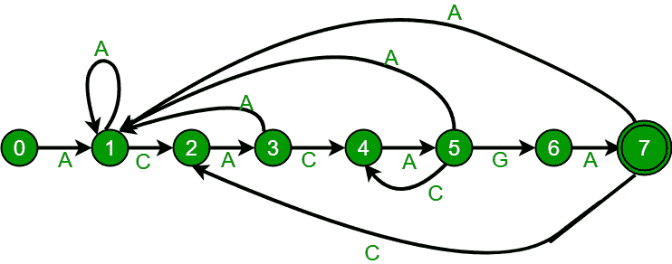
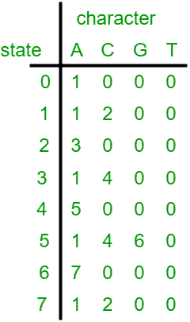

# 模式搜索的有限自动机算法

> 原文:[https://www . geesforgeks . org/有限自动机-模式搜索算法/](https://www.geeksforgeeks.org/finite-automata-algorithm-for-pattern-searching/)

给定一个文本*txt【0..n-1]* 和模式*帕特【0..m-1]* ，编写一个函数*搜索(char pat[]，char txt[])* ，打印 *txt[]* 中所有出现的 *pat[]* 。你可以假设 n>m
**例:**

```
Input:  txt[] = "THIS IS A TEST TEXT"
        pat[] = "TEST"
Output: Pattern found at index 10

Input:  txt[] =  "AABAACAADAABAABA"
        pat[] =  "AABA"
Output: Pattern found at index 0
        Pattern found at index 9
        Pattern found at index 12
```



模式搜索是计算机科学中的一个重要问题。当我们在记事本/word 文件或浏览器或数据库中搜索字符串时，会使用模式搜索算法来显示搜索结果。
我们在之前的帖子中讨论过以下算法:
[朴素算法](https://www.geeksforgeeks.org/naive-algorithm-for-pattern-searching/)
T5】KMP 算法
T8】拉宾卡普算法
在这篇帖子中，我们将讨论基于有限自动机(FA)的模式搜索算法。在基于 FA 的算法中，我们对模式进行预处理，并构建一个表示有限自动机的 2D 阵列。构造 FA 是这个算法的主要棘手部分。一旦构建了 FA，搜索就很简单了。在搜索中，我们只需要从自动机的第一个状态和文本的第一个字符开始。在每一步，我们考虑文本的下一个字符，在构建的 FA 中寻找下一个状态，并移动到一个新的状态。如果我们达到了最终状态，那么模式就在文本中找到了。搜索过程的时间复杂度为 O(n)。
在讨论 FA 构建之前，我们先来看看下面的 FA 对于模式 ACACAGA 的作用。





上面的图表代表了 ACACAGA 模式的图形和表格表示。
FA 中的状态数将为 M+1，其中 M 是模式的长度。构造 FA 最主要的是为每个可能的角色从当前状态获取下一个状态。给定字符 x 和状态 k，我们可以通过考虑字符串“pat[0..k-1]x”，它基本上是模式字符 pat[0]、pat[1] … pat[k-1]和字符 x 的串联。其思想是获得给定模式的最长前缀的长度，使得前缀也是“pat[0..k-1]x”。长度的值给出了下一个状态。例如，让我们看看如何从当前状态 5 和上图中的字符“C”获得下一个状态。我们需要考虑字符串，”pat[0..4]C”，即“ACACAC”。模式的最长前缀的长度是 4(“ACAC”)，使得前缀是“ACACAC”的后缀。因此，字符“C”的下一个状态(来自状态 5)是 4。
在下面的代码中，computeTF()构造了 FA。computeTF()的时间复杂度是 O(m^3*NO_OF_CHARS)，其中 m 是模式的长度，NO_OF_CHARS 是字母表的大小(模式和文本中可能的字符总数)。该实现尝试所有可能的前缀，从可能是后缀“pat[0..k-1]x”。在 O(m*NO_OF_CHARS)中构造 FA 有更好的实现(提示:我们可以在 KMP 算法中使用类似 [lps 数组构造的东西)。我们已经在下一篇关于模式搜索的文章](https://www.geeksforgeeks.org/kmp-algorithm-for-pattern-searching/)[中介绍了更好的实现方式。](https://www.geeksforgeeks.org/pattern-searching-set-5-efficient-constructtion-of-finite-automata/) 

## C

```
// C program for Finite Automata Pattern searching
// Algorithm
#include<stdio.h>
#include<string.h>
#define NO_OF_CHARS 256

int getNextState(char *pat, int M, int state, int x)
{
    // If the character c is same as next character
    // in pattern,then simply increment state
    if (state < M && x == pat[state])
        return state+1;

    // ns stores the result which is next state
    int ns, i;

    // ns finally contains the longest prefix
    // which is also suffix in "pat[0..state-1]c"

    // Start from the largest possible value
    // and stop when you find a prefix which
    // is also suffix
    for (ns = state; ns > 0; ns--)
    {
        if (pat[ns-1] == x)
        {
            for (i = 0; i < ns-1; i++)
                if (pat[i] != pat[state-ns+1+i])
                    break;
            if (i == ns-1)
                return ns;
        }
    }

    return 0;
}

/* This function builds the TF table which represents4
    Finite Automata for a given pattern */
void computeTF(char *pat, int M, int TF[][NO_OF_CHARS])
{
    int state, x;
    for (state = 0; state <= M; ++state)
        for (x = 0; x < NO_OF_CHARS; ++x)
            TF[state][x] = getNextState(pat, M, state, x);
}

/* Prints all occurrences of pat in txt */
void search(char *pat, char *txt)
{
    int M = strlen(pat);
    int N = strlen(txt);

    int TF[M+1][NO_OF_CHARS];

    computeTF(pat, M, TF);

    // Process txt over FA.
    int i, state=0;
    for (i = 0; i < N; i++)
    {
        state = TF[state][txt[i]];
        if (state == M)
            printf ("\n Pattern found at index %d",
                                           i-M+1);
    }
}

// Driver program to test above function
int main()
{
    char *txt = "AABAACAADAABAAABAA";
    char *pat = "AABA";
    search(pat, txt);
    return 0;
}
```

## 卡片打印处理机（Card Print Processor 的缩写）

```
// CPP program for Finite Automata Pattern searching 
// Algorithm 
#include <bits/stdc++.h>
using namespace std;
#define NO_OF_CHARS 256 

int getNextState(string pat, int M, int state, int x) 
{ 
    // If the character c is same as next character 
    // in pattern,then simply increment state 
    if (state < M && x == pat[state]) 
        return state+1; 

    // ns stores the result which is next state 
    int ns, i; 

    // ns finally contains the longest prefix 
    // which is also suffix in "pat[0..state-1]c" 

    // Start from the largest possible value 
    // and stop when you find a prefix which 
    // is also suffix 
    for (ns = state; ns > 0; ns--) 
    { 
        if (pat[ns-1] == x) 
        { 
            for (i = 0; i < ns-1; i++) 
                if (pat[i] != pat[state-ns+1+i]) 
                    break; 
            if (i == ns-1) 
                return ns; 
        } 
    } 

    return 0; 
} 

/* This function builds the TF table which represents4 
    Finite Automata for a given pattern */
void computeTF(string pat, int M, int TF[][NO_OF_CHARS]) 
{ 
    int state, x; 
    for (state = 0; state <= M; ++state) 
        for (x = 0; x < NO_OF_CHARS; ++x) 
            TF[state][x] = getNextState(pat, M, state, x); 
} 

/* Prints all occurrences of pat in txt */
void search(string pat, string txt) 
{ 
    int M = pat.size(); 
    int N = txt.size(); 

    int TF[M+1][NO_OF_CHARS]; 

    computeTF(pat, M, TF); 

    // Process txt over FA. 
    int i, state=0; 
    for (i = 0; i < N; i++) 
    { 
        state = TF[state][txt[i]]; 
        if (state == M) 
            cout<<" Pattern found at index "<< i-M+1<<endl; 
    } 
} 

// Driver program to test above function 
int main() 
{ 
    string txt = "AABAACAADAABAAABAA"; 
    string pat = "AABA"; 
    search(pat, txt); 
    return 0; 
} 

//This code is contributed by rathbhupendra
```

## Java 语言(一种计算机语言，尤用于创建网站)

```
// Java program for Finite Automata Pattern
// searching Algorithm
class GFG {

    static int NO_OF_CHARS = 256;
    static int getNextState(char[] pat, int M,  
                             int state, int x)
    {

        // If the character c is same as next
        // character in pattern,then simply 
        // increment state
        if(state < M && x == pat[state])
            return state + 1;

        // ns stores the result which is next state
        int ns, i;

        // ns finally contains the longest prefix
        // which is also suffix in "pat[0..state-1]c"

        // Start from the largest possible value
        // and stop when you find a prefix which
        // is also suffix
        for (ns = state; ns > 0; ns--)
        {
            if (pat[ns-1] == x)
            {
                for (i = 0; i < ns-1; i++)
                    if (pat[i] != pat[state-ns+1+i])
                        break;
                    if (i == ns-1)
                        return ns;
            }
        }

            return 0;
    }

    /* This function builds the TF table which
    represents Finite Automata for a given pattern */
    static void computeTF(char[] pat, int M, int TF[][])
    {
        int state, x;
        for (state = 0; state <= M; ++state)
            for (x = 0; x < NO_OF_CHARS; ++x)
                TF[state][x] = getNextState(pat, M, state, x);
    }

    /* Prints all occurrences of pat in txt */
    static void search(char[] pat, char[] txt)
    {
        int M = pat.length;
        int N = txt.length;

        int[][] TF = new int[M+1][NO_OF_CHARS];

        computeTF(pat, M, TF);

        // Process txt over FA.
        int i, state = 0;
        for (i = 0; i < N; i++)
        {
            state = TF[state][txt[i]];
            if (state == M)
                System.out.println("Pattern found "
                          + "at index " + (i-M+1));
        }
    }

    // Driver code
    public static void main(String[] args) 
    {
        char[] pat = "AABAACAADAABAAABAA".toCharArray();
        char[] txt = "AABA".toCharArray();
        search(txt,pat);
    }
}

// This code is contributed by debjitdbb.
```

## 计算机编程语言

```
# Python program for Finite Automata 
# Pattern searching Algorithm

NO_OF_CHARS = 256

def getNextState(pat, M, state, x):
    '''
    calculate the next state 
    '''

    # If the character c is same as next character 
      # in pattern, then simply increment state

    if state < M and x == ord(pat[state]):
        return state+1

    i=0
    # ns stores the result which is next state

    # ns finally contains the longest prefix 
     # which is also suffix in "pat[0..state-1]c"

     # Start from the largest possible value and 
      # stop when you find a prefix which is also suffix
    for ns in range(state,0,-1):
        if ord(pat[ns-1]) == x:
            while(i<ns-1):
                if pat[i] != pat[state-ns+1+i]:
                    break
                i+=1
            if i == ns-1:
                return ns 
    return 0

def computeTF(pat, M):
    '''
    This function builds the TF table which 
    represents Finite Automata for a given pattern
    '''
    global NO_OF_CHARS

    TF = [[0 for i in range(NO_OF_CHARS)]\
          for _ in range(M+1)]

    for state in range(M+1):
        for x in range(NO_OF_CHARS):
            z = getNextState(pat, M, state, x)
            TF[state][x] = z

    return TF

def search(pat, txt):
    '''
    Prints all occurrences of pat in txt
    '''
    global NO_OF_CHARS
    M = len(pat)
    N = len(txt)
    TF = computeTF(pat, M)    

    # Process txt over FA.
    state=0
    for i in range(N):
        state = TF[state][ord(txt[i])]
        if state == M:
            print("Pattern found at index: {}".\
                   format(i-M+1))

# Driver program to test above function            
def main():
    txt = "AABAACAADAABAAABAA"
    pat = "AABA"
    search(pat, txt)

if __name__ == '__main__':
    main()

# This code is contributed by Atul Kumar
```

## C#

```
// C# program for Finite Automata Pattern 
// searching Algorithm 
using System;

class GFG
{

public static int NO_OF_CHARS = 256;
public static int getNextState(char[] pat, int M, 
                               int state, int x)
{

    // If the character c is same as next 
    // character in pattern,then simply 
    // increment state 
    if (state < M && (char)x == pat[state])
    {
        return state + 1;
    }

    // ns stores the result 
    // which is next state 
    int ns, i;

    // ns finally contains the longest 
    // prefix which is also suffix in 
    // "pat[0..state-1]c" 

    // Start from the largest possible  
    // value and stop when you find a 
    // prefix which is also suffix 
    for (ns = state; ns > 0; ns--)
    {
        if (pat[ns - 1] == (char)x)
        {
            for (i = 0; i < ns - 1; i++)
            {
                if (pat[i] != pat[state - ns + 1 + i])
                {
                    break;
                }
            }
                if (i == ns - 1)
                {
                    return ns;
                }
        }
    }

        return 0;
}

/* This function builds the TF table which 
represents Finite Automata for a given pattern */
public static void computeTF(char[] pat, 
                             int M, int[][] TF)
{
    int state, x;
    for (state = 0; state <= M; ++state)
    {
        for (x = 0; x < NO_OF_CHARS; ++x)
        {
            TF[state][x] = getNextState(pat, M, 
                                        state, x);
        }
    }
}

/* Prints all occurrences of 
   pat in txt */
public static void search(char[] pat, 
                          char[] txt)
{
    int M = pat.Length;
    int N = txt.Length;

    int[][] TF = RectangularArrays.ReturnRectangularIntArray(M + 1, 
                                                      NO_OF_CHARS);

    computeTF(pat, M, TF);

    // Process txt over FA. 
    int i, state = 0;
    for (i = 0; i < N; i++)
    {
        state = TF[state][txt[i]];
        if (state == M)
        {
            Console.WriteLine("Pattern found " + 
                              "at index " + (i - M + 1));
        }
    }
}

public static class RectangularArrays
{
public static int[][] ReturnRectangularIntArray(int size1, 
                                                int size2)
{
    int[][] newArray = new int[size1][];
    for (int array1 = 0; array1 < size1; array1++)
    {
        newArray[array1] = new int[size2];
    }

    return newArray;
}
}

// Driver code 
public static void Main(string[] args)
{
    char[] pat = "AABAACAADAABAAABAA".ToCharArray();
    char[] txt = "AABA".ToCharArray();
    search(txt,pat);
}
}

// This code is contributed by Shrikant13
```

## java 描述语言

```
<script>
// Javascript program for Finite Automata Pattern
// searching Algorithm

let NO_OF_CHARS = 256;

function getNextState(pat,M,state,x)
{    
    // If the character c is same as next
        // character in pattern,then simply 
        // increment state
        if(state < M && x == pat[state].charCodeAt(0))
            return state + 1;

        // ns stores the result which is next state
        let ns, i;

        // ns finally contains the longest prefix
        // which is also suffix in "pat[0..state-1]c"

        // Start from the largest possible value
        // and stop when you find a prefix which
        // is also suffix
        for (ns = state; ns > 0; ns--)
        {
            if (pat[ns-1].charCodeAt(0) == x)
            {
                for (i = 0; i < ns-1; i++)
                    if (pat[i] != pat[state-ns+1+i])
                        break;
                    if (i == ns-1)
                        return ns;
            }
        }

            return 0;
}

/* This function builds the TF table which
    represents Finite Automata for a given pattern */
function computeTF(pat,M,TF)
{
    let state, x;
        for (state = 0; state <= M; ++state)
            for (x = 0; x < NO_OF_CHARS; ++x)
                TF[state][x] = getNextState(pat, M, state, x);    
}

/* Prints all occurrences of pat in txt */
function search(pat,txt)
{
    let M = pat.length;
        let N = txt.length;

        let TF = new Array(M+1);
        for(let i=0;i<M+1;i++)
        {
            TF[i]=new Array(NO_OF_CHARS);
            for(let j=0;j<NO_OF_CHARS;j++)
                TF[i][j]=0;
        }

        computeTF(pat, M, TF);

        // Process txt over FA.
        let i, state = 0;
        for (i = 0; i < N; i++)
        {
            state = TF[state][txt[i].charCodeAt(0)];
            if (state == M)
                document.write("Pattern found " + "at index " + (i-M+1)+"<br>");
        }
}

// Driver code
let pat = "AABAACAADAABAAABAA".split("");
let txt = "AABA".split("");

search(txt,pat);

// This code is contributed by avanitrachhadiya2155
</script>
```

**输出:**

```
  Pattern found at index 0
  Pattern found at index 9
  Pattern found at index 13
```

**参考文献:**
[托马斯·h·科曼、查尔斯·e·雷瑟森、罗纳德·L·李维斯特、克利福德·斯坦的《算法导论》](http://mitpress.mit.edu/algorithms/)
如果您发现任何不正确的地方，或者您想分享更多关于上述主题的信息，请写评论。