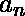
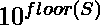

# 一组数字乘积的第一个数字

> 原文:[https://www . geesforgeks . org/数字阵列产品中的第一位数字/](https://www.geeksforgeeks.org/first-digit-in-product-of-an-array-of-numbers/)

给定一组 n 个数字。我们需要找到这些‘n’个数字的乘积的第一位数字
**例:**

```
Input  : arr[] = {5, 8, 3, 7}
Output : 8
        Product of 5, 8, 3, 7 is 840
        and its first  digit is 8

Input  : arr[] = {6, 7, 9}
Output : 3
```

**背景:**
首先我们从一个非常基础的问题开始，如何找到任意数字 x 的第一位数字，要做到这一点，就要不断地对这个数字进行除法运算，直到它大于等于 10。这样做之后，我们得到的数字将是 x 的第一位数字

## C++

```
// C++ implementation to find first digit of a
// single number
#include <bits/stdc++.h>
using namespace std;

int firstDigit(int x)
{
    // Keep dividing by 10 until it is
    // greater than equal to 10
    while (x >= 10)
        x = x / 10;
    return x;
}

// driver function
int main()
{
    cout << firstDigit(12345) << endl;
    cout << firstDigit(5432) << endl;
}
```

## Java 语言(一种计算机语言，尤用于创建网站)

```
// Java implementation to find first digit of a
// single number

class Test {
    static int firstDigit(int x)
    {
        // Keep dividing by 10 until it is
        // greater than equal to 10
        while (x >= 10)
            x = x / 10;
        return x;
    }

    // Driver method
    public static void main(String args[])
    {
        System.out.println(firstDigit(12345));
        System.out.println(firstDigit(5432));
    }
}
```

## 蟒蛇 3

```
# Python implementation to
# find first digit of a
# single number

def firstDigit(x):

    # Keep dividing by 10 until it is
    # greater than equal to 10
    while(x >= 10):
        x = x//10
    return x

# driver function

print(firstDigit(12345))
print(firstDigit(5432))

# This code is contributed
# by Anant Agarwal.
```

## C#

```
// C# implementation to find first
// digit of a single number
using System;

public class GFG {

    static int firstDigit(int x)
    {

        // Keep dividing by 10 until
        // it is greater than equal
        // to 10
        while (x >= 10)
            x = x / 10;

        return x;
    }

    // Driver method
    public static void Main()
    {
        Console.WriteLine(
                  firstDigit(12345));

        Console.WriteLine(
                   firstDigit(5432));
    }
}

// This code is contributed by Sam007.
```

## 服务器端编程语言（Professional Hypertext Preprocessor 的缩写）

```
<?php
// PHP implementation to
// find first digit of a
// single number

function firstDigit($x)
{

    // Keep dividing by 10
    // until it is greater
    // than equal to 10
    while ($x >= 10)
        $x = $x / 10;
    return floor($x);
}

    // Driver Code
    echo firstDigit(12345),"\n" ;
    echo firstDigit(5432) ;

// This code is contributed by vishal tripathi.
?>
```

## java 描述语言

```
<script>

// Javascript implementation to
// find first digit of a
// single number

function firstDigit(x)
{

    // Keep dividing by 10
    // until it is greater
    // than equal to 10
    while (x >= 10)
        x = x / 10;
    return Math.floor(x);
}

    // Driver Code
    document.write( firstDigit(12345)+"<br>" );
    document.write( firstDigit(5432)) ;

// This code is contributed by Bobby

</script>
```

**输出:**

```
1
5
```

**解决方案:**
对于数字数组，乘积可能非常大，它们的乘法可能不适合任何典型的数据类型。即使你使用大整数，这个数字也会很大，用直接除以 10 的方法找到第一个会很慢。所以我们需要用一些不一样的
让数字是、、 …… 他们的乘积是 P .P =  *  …..* 。
let S =(P)=()+()…..+  ( )。
所以我们可以说 P = 。
我们知道任何数都可以写成它的底值和分值之和。
因此 P = 这意味着 P =  * 。
现在我们可以应用上面讨论的方法来寻找一个数字的第一个数字，因为在将 P 除以 10 直到它大于或等于 10 之后，我们将只剩下作为我们的答案。分数(S)可以很容易地计算出来分数(S)= S–下限(S)。

## C++

```
// C++ implementation of finding first digit
// of product of n numbers
#include <bits/stdc++.h>
using namespace std;

// returns the first digit of product of elements of arr[]
int FirstDigit(int arr[], int n)
{
    // stores the logarithm of product of elements of arr[]
    double S = 0;
    for (int i = 0; i < n; i++)
        S = S + log10(arr[i] * 1.0);

    // fractional(s) = s - floor(s)
    double fract_S = S - floor(S);

    // ans = 10^fract_s
    int ans = pow(10, fract_S);
    return ans;
}

// Driver function
int main()
{
    int arr[] = { 5, 8, 3, 7 };
    int n = sizeof(arr) / sizeof(arr[0]);
    cout << FirstDigit(arr, n) << endl;
    return 0;
}
```

## Java 语言(一种计算机语言，尤用于创建网站)

```
// Java implementation of finding first digit
// of product of n numbers

class Test {
    // returns the first digit of product of elements of arr[]
    static int FirstDigit(int arr[], int n)
    {
        // stores the logarithm of product of elements of arr[]
        double S = 0;
        for (int i = 0; i < n; i++)
            S = S + Math.log10(arr[i] * 1.0);

        // fractional(s) = s - floor(s)
        double fract_S = S - Math.floor(S);

        // ans = 10^fract_s
        int ans = (int)Math.pow(10, fract_S);
        return ans;
    }

    // Driver method
    public static void main(String args[])
    {
        int arr[] = { 5, 8, 3, 7 };

        System.out.println(FirstDigit(arr, arr.length));
    }
}
```

## 蟒蛇 3

```
# Python implementation of
# finding first digit
# of product of n numbers

import math

# Returns the first digit of
# product of elements of arr[]
def FirstDigit (arr, n):

    # stores the logarithm of
    # product of elements of arr[]
    S = 0
    for i in range(n):
        S = S + math.log10(arr[i]*1.0)

    # fractional(s) = s - floor(s)
    fract_S = S - math.floor(S)

    # ans = 10 ^ fract_s
    ans = math.pow(10, fract_S)
    return ans

# Driver function

arr = [5, 8, 3, 7]
n = len(arr)
print((int)(FirstDigit(arr, n)))

# This code is contributed
# by Anant Agarwal.
```

## C#

```
// C# implementation of finding first
// digit of product of n numbers
using System;

public class GFG {

    // returns the first digit of product
    // of elements of arr[]
    static int FirstDigit(int[] arr, int n)
    {

        // stores the logarithm of product
        // of elements of arr[]
        double S = 0;

        for (int i = 0; i < n; i++)
            S = S + Math.Log10(arr[i] * 1.0);

        // fractional(s) = s - floor(s)
        double fract_S = S - Math.Floor(S);

        // ans = 10^fract_s
        int ans = (int)Math.Pow(10, fract_S);

        return ans;
    }

    // Driver method
    public static void Main()
    {
        int[] arr = { 5, 8, 3, 7 };
        int n = arr.Length;

        Console.WriteLine(FirstDigit(arr, n));
    }
}

// This code is contributed by Sam007.
```

## 服务器端编程语言（Professional Hypertext Preprocessor 的缩写）

```
<?php
// PHP implementation of
// finding first digit of
// product of n numbers

// Returns the first digit of
// product of elements of arr[]
function FirstDigit($arr, $n)
{
    // stores the logarithm of
    // product of elements of arr[]
    $S = 0;
    for ($i = 0; $i < $n; $i++)
        $S = $S + log10($arr[$i] * 1.0);

    // fractional(s) = s - floor(s)
    $fract_S = $S - floor($S);

    // ans = 10^fract_s
    $ans = pow(10, $fract_S);
    return floor($ans);
}

// Driver Code
$arr = array ( 5, 8, 3, 7 );
$n = sizeof($arr);
echo FirstDigit($arr, $n);

// This code is contributed by aj_36
?>
```

## java 描述语言

```
<script>
    // Javascript implementation of finding first
    // digit of product of n numbers

    // returns the first digit of product
    // of elements of arr[]
    function FirstDigit(arr, n)
    {

        // stores the logarithm of product
        // of elements of arr[]
        let S = 0;

        for (let i = 0; i < n; i++)
            S = S + Math.log10(arr[i] * 1.0);

        // fractional(s) = s - floor(s)
        let fract_S = S - Math.floor(S);

        // ans = 10^fract_s
        let ans = parseInt(Math.pow(10, fract_S), 10);

        return ans;
    }

    let arr = [ 5, 8, 3, 7 ];
    let n = arr.length;

    document.write(FirstDigit(arr, n));

</script>
```

**输出:**

```
8
```

本文由 **Ayush Jha** 供稿。如果你喜欢 GeeksforGeeks 并想投稿，你也可以使用[write.geeksforgeeks.org](https://write.geeksforgeeks.org)写一篇文章或者把你的文章邮寄到 review-team@geeksforgeeks.org。看到你的文章出现在极客博客主页上，帮助其他极客。
如果你发现任何不正确的地方，或者你想分享更多关于上面讨论的话题的信息，请写评论。