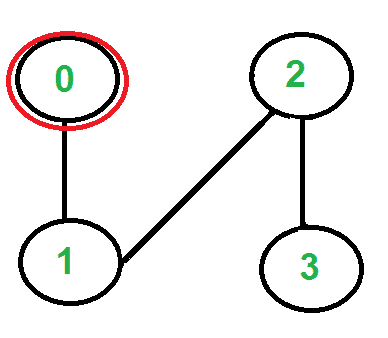
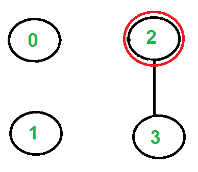

# 弗勒里算法打印欧拉路径或电路

> 原文:[https://www . geeksforgeeks . org/fleurys-用于打印的算法-欧拉路径/](https://www.geeksforgeeks.org/fleurys-algorithm-for-printing-eulerian-path/)

[欧拉路径](http://en.wikipedia.org/wiki/Eulerian_path)是图中访问每条边精确一次的路径。欧拉回路是在同一顶点开始和结束的欧拉路径。
我们强烈建议首先阅读以下关于欧拉路径和赛道的帖子。
[【https://www.geeksforgeeks.org/eulerian-path-and-circuit/】](https://www.geeksforgeeks.org/eulerian-path-and-circuit/)
在上面提到的帖子中，我们讨论了找出给定图是否是欧拉图的问题。在这篇文章中，讨论了一种打印欧拉轨迹或电路的算法。
以下是弗勒里的欧拉轨迹或循环打印算法(来源[参考文献 1](http://www.math.ku.edu/~jmartin/courses/math105-F11/Lectures/chapter5-part2.pdf) )。
**1。**确保图形有 0 个或 2 个奇数顶点。
**2。**如果有 0 个奇数顶点，从任意位置开始。如果有 2 个奇数顶点，从其中一个开始。
**3。**一次跟随一条边。如果你有桥和非桥的选择，*总是选择非桥*。
T22】4。用完边就停。
的想法是， ***“不要烧*** [***桥梁***](https://www.geeksforgeeks.org/bridge-in-a-graph/)**这样我们就可以回到一个顶点并遍历剩余的边。例如，让我们考虑下面的图表。** 

****

**有两个奇数度的顶点，‘2’和‘3’，我们可以从其中任何一个开始路径。让我们从顶点“2”开始游览。** 

****

**有三条边从顶点“2”出来，选哪一条？我们不选择边缘“2-3”，因为那是一座桥(我们将无法回到“3”)。我们可以选择剩下的两条边中的任何一条。假设我们选择“2-0”。我们移除这条边并移动到顶点“0”。** 

****

**从顶点“0”开始只有一条边，所以我们拾取它，移除它并移动到顶点“1”。欧拉巡回赛变成‘2-0 0-1’。** 

****

**从顶点“1”只有一条边，所以我们拾取它，移除它，并移动到顶点“2”。欧拉巡回赛变成‘2-0 0-1 1-2’** 

****

**同样，从顶点 2 只有一条边，所以我们拾取它，移除它并移动到顶点 3。欧拉巡回赛变成‘2-0 0-1 1-2 2-3’** 

****

**没有更多的边缘了，所以我们到此为止。最终的巡回赛是 20011223。
详见[本](http://www.math.ku.edu/~jmartin/courses/math105-F11/Lectures/chapter5-part2.pdf)为和[本](http://www.austincc.edu/powens/+Topics/HTML/05-6/05-6.html)为例。
以下是上述算法的 C++实现。在下面的代码中，假设给定的图具有欧拉轨迹或回路。主要重点是打印欧拉轨迹或电路。我们可以使用 [isEulerian()](https://www.geeksforgeeks.org/eulerian-path-and-circuit/) 首先检查给定图形中是否有欧拉轨迹或回路。
我们首先找到必须是奇数顶点的起点(如果有奇数顶点)并存储在变量‘u’中。如果有零个奇数顶点，我们从顶点“0”开始。我们调用 printEulerUtil()来打印以 u 开头的 Euler tour，我们遍历 u 的所有相邻顶点，如果只有一个相邻顶点，我们会立即考虑它。如果有一个以上的相邻顶点，只有当边 u-v 不是桥时，我们才考虑相邻的 v。如何发现给定的是边是桥？我们计算从 u 可达的顶点数，我们去掉边 u-v，再计算从 u 可达的顶点数，如果可达的顶点数减少，那么边 u-v 就是桥。为了计算可达顶点，我们可以使用 BFS 或 DFS，我们已经在上面的代码中使用了 DFS。函数 DFSCount(u)返回可从 u 到达的顶点数。
一旦处理了一条边(包含在欧拉巡回中)，我们就将其从图中移除。为了移除边，我们用邻接表中的-1 替换顶点条目。请注意，简单地删除节点可能不起作用，因为代码是递归的，父调用可能位于邻接表的中间。** 

## **C++**

```
// A C++ program print Eulerian Trail in a given Eulerian or
// Semi-Eulerian Graph
#include <algorithm>
#include <iostream>
#include <list>
#include <string.h>
using namespace std;

// A class that represents an undirected graph
class Graph {
    int V; // No. of vertices
    list<int>* adj; // A dynamic array of adjacency lists
public:
    // Constructor and destructor
    Graph(int V)
    {
        this->V = V;
        adj = new list<int>[V];
    }
    ~Graph() { delete[] adj; }

    // functions to add and remove edge
    void addEdge(int u, int v)
    {
        adj[u].push_back(v);
        adj[v].push_back(u);
    }
    void rmvEdge(int u, int v);

    // Methods to print Eulerian tour
    void printEulerTour();
    void printEulerUtil(int s);

    // This function returns count of vertices reachable
    // from v. It does DFS
    int DFSCount(int v, bool visited[]);

    // Utility function to check if edge u-v is a valid next
    // edge in Eulerian trail or circuit
    bool isValidNextEdge(int u, int v);
};

/* The main function that print Eulerian Trail. It first
   finds an odd degree vertex (if there is any) and then
   calls printEulerUtil() to print the path */
void Graph::printEulerTour()
{
    // Find a vertex with odd degree
    int u = 0;
    for (int i = 0; i < V; i++)
        if (adj[i].size() & 1) {
            u = i;
            break;
        }

    // Print tour starting from oddv
    printEulerUtil(u);
    cout << endl;
}

// Print Euler tour starting from vertex u
void Graph::printEulerUtil(int u)
{
    // Recur for all the vertices adjacent to this vertex
    list<int>::iterator i;
    for (i = adj[u].begin(); i != adj[u].end(); ++i) {
        int v = *i;

        // If edge u-v is not removed and it's a a valid
        // next edge
        if (v != -1 && isValidNextEdge(u, v)) {
            cout << u << "-" << v << "  ";
            rmvEdge(u, v);
            printEulerUtil(v);
        }
    }
}

// The function to check if edge u-v can be considered as
// next edge in Euler Tout
bool Graph::isValidNextEdge(int u, int v)
{
    // The edge u-v is valid in one of the following two
    // cases:

    // 1) If v is the only adjacent vertex of u
    int count = 0; // To store count of adjacent vertices
    list<int>::iterator i;
    for (i = adj[u].begin(); i != adj[u].end(); ++i)
        if (*i != -1)
            count++;
    if (count == 1)
        return true;

    // 2) If there are multiple adjacents, then u-v is not a
    // bridge Do following steps to check if u-v is a bridge

    // 2.a) count of vertices reachable from u
    bool visited[V];
    memset(visited, false, V);
    int count1 = DFSCount(u, visited);

    // 2.b) Remove edge (u, v) and after removing the edge,
    // count vertices reachable from u
    rmvEdge(u, v);
    memset(visited, false, V);
    int count2 = DFSCount(u, visited);

    // 2.c) Add the edge back to the graph
    addEdge(u, v);

    // 2.d) If count1 is greater, then edge (u, v) is a
    // bridge
    return (count1 > count2) ? false : true;
}

// This function removes edge u-v from graph.  It removes
// the edge by replacing adjacent vertex value with -1.
void Graph::rmvEdge(int u, int v)
{
    // Find v in adjacency list of u and replace it with -1
    list<int>::iterator iv
        = find(adj[u].begin(), adj[u].end(), v);
    *iv = -1;

    // Find u in adjacency list of v and replace it with -1
    list<int>::iterator iu
        = find(adj[v].begin(), adj[v].end(), u);
    *iu = -1;
}

// A DFS based function to count reachable vertices from v
int Graph::DFSCount(int v, bool visited[])
{
    // Mark the current node as visited
    visited[v] = true;
    int count = 1;

    // Recur for all vertices adjacent to this vertex
    list<int>::iterator i;
    for (i = adj[v].begin(); i != adj[v].end(); ++i)
        if (*i != -1 && !visited[*i])
            count += DFSCount(*i, visited);

    return count;
}

// Driver program to test above function
int main()
{
    // Let us first create and test graphs shown in above
    // figure
    Graph g1(4);
    g1.addEdge(0, 1);
    g1.addEdge(0, 2);
    g1.addEdge(1, 2);
    g1.addEdge(2, 3);
    g1.printEulerTour();

    Graph g2(3);
    g2.addEdge(0, 1);
    g2.addEdge(1, 2);
    g2.addEdge(2, 0);
    g2.printEulerTour();

    Graph g3(5);
    g3.addEdge(1, 0);
    g3.addEdge(0, 2);
    g3.addEdge(2, 1);
    g3.addEdge(0, 3);
    g3.addEdge(3, 4);
    g3.addEdge(3, 2);
    g3.addEdge(3, 1);
    g3.addEdge(2, 4);
    g3.printEulerTour();

    return 0;
}
```

## **Java 语言(一种计算机语言，尤用于创建网站)**

```
// A Java program print Eulerian Trail
// in a given Eulerian or Semi-Eulerian Graph
import java.util.ArrayList;

// An Undirected graph using
// adjacency list representation
public class Graph {

    private int vertices; // No. of vertices
    private ArrayList<Integer>[] adj; // adjacency list

    // Constructor
    Graph(int numOfVertices)
    {
        // initialise vertex count
        this.vertices = numOfVertices;

        // initialise adjacency list
        initGraph();
    }

    // utility method to initialise adjacency list
    @SuppressWarnings("unchecked") private void initGraph()
    {
        adj = new ArrayList[vertices];
        for (int i = 0; i < vertices; i++) {
            adj[i] = new ArrayList<>();
        }
    }

    // add edge u-v
    private void addEdge(Integer u, Integer v)
    {
        adj[u].add(v);
        adj[v].add(u);
    }

    // This function removes edge u-v from graph.
    private void removeEdge(Integer u, Integer v)
    {
        adj[u].remove(v);
        adj[v].remove(u);
    }

    /* The main function that print Eulerian Trail.
       It first finds an odd degree vertex (if there
       is any) and then calls printEulerUtil() to
       print the path */
    private void printEulerTour()
    {
        // Find a vertex with odd degree
        Integer u = 0;
        for (int i = 0; i < vertices; i++) {
            if (adj[i].size() % 2 == 1) {
                u = i;
                break;
            }
        }

        // Print tour starting from oddv
        printEulerUtil(u);
        System.out.println();
    }

    // Print Euler tour starting from vertex u
    private void printEulerUtil(Integer u)
    {
        // Recur for all the vertices adjacent to this
        // vertex
        for (int i = 0; i < adj[u].size(); i++) {
            Integer v = adj[u].get(i);
            // If edge u-v is a valid next edge
            if (isValidNextEdge(u, v)) {
                System.out.print(u + "-" + v + " ");

                // This edge is used so remove it now
                removeEdge(u, v);
                printEulerUtil(v);
            }
        }
    }

    // The function to check if edge u-v can be
    // considered as next edge in Euler Tout
    private boolean isValidNextEdge(Integer u, Integer v)
    {
        // The edge u-v is valid in one of the
        // following two cases:

        // 1) If v is the only adjacent vertex of u
        // ie size of adjacent vertex list is 1
        if (adj[u].size() == 1) {
            return true;
        }

        // 2) If there are multiple adjacents, then
        // u-v is not a bridge Do following steps
        // to check if u-v is a bridge
        // 2.a) count of vertices reachable from u
        boolean[] isVisited = new boolean[this.vertices];
        int count1 = dfsCount(u, isVisited);

        // 2.b) Remove edge (u, v) and after removing
        //  the edge, count vertices reachable from u
        removeEdge(u, v);
        isVisited = new boolean[this.vertices];
        int count2 = dfsCount(u, isVisited);

        // 2.c) Add the edge back to the graph
        addEdge(u, v);
        return (count1 > count2) ? false : true;
    }

    // A DFS based function to count reachable
    // vertices from v
    private int dfsCount(Integer v, boolean[] isVisited)
    {
        // Mark the current node as visited
        isVisited[v] = true;
        int count = 1;
        // Recur for all vertices adjacent to this vertex
        for (int adj : adj[v]) {
            if (!isVisited[adj]) {
                count = count + dfsCount(adj, isVisited);
            }
        }
        return count;
    }

    // Driver program to test above function
    public static void main(String a[])
    {
        // Let us first create and test
        // graphs shown in above figure
        Graph g1 = new Graph(4);
        g1.addEdge(0, 1);
        g1.addEdge(0, 2);
        g1.addEdge(1, 2);
        g1.addEdge(2, 3);
        g1.printEulerTour();

        Graph g2 = new Graph(3);
        g2.addEdge(0, 1);
        g2.addEdge(1, 2);
        g2.addEdge(2, 0);
        g2.printEulerTour();

        Graph g3 = new Graph(5);
        g3.addEdge(1, 0);
        g3.addEdge(0, 2);
        g3.addEdge(2, 1);
        g3.addEdge(0, 3);
        g3.addEdge(3, 4);
        g3.addEdge(3, 2);
        g3.addEdge(3, 1);
        g3.addEdge(2, 4);
        g3.printEulerTour();
    }
}

// This code is contributed by Himanshu Shekhar
```

## **计算机编程语言**

```
# Python program print Eulerian Trail in a given Eulerian or Semi-Eulerian Graph

from collections import defaultdict

#This class represents an undirected graph using adjacency list representation
class Graph:

    def __init__(self,vertices):
        self.V= vertices #No. of vertices
        self.graph = defaultdict(list) # default dictionary to store graph
        self.Time = 0

    # function to add an edge to graph
    def addEdge(self,u,v):
        self.graph[u].append(v)
        self.graph[v].append(u)

    # This function removes edge u-v from graph   
    def rmvEdge(self, u, v):
        for index, key in enumerate(self.graph[u]):
            if key == v:
                self.graph[u].pop(index)
        for index, key in enumerate(self.graph[v]):
            if key == u:
                self.graph[v].pop(index)

    # A DFS based function to count reachable vertices from v
    def DFSCount(self, v, visited):
        count = 1
        visited[v] = True
        for i in self.graph[v]:
            if visited[i] == False:
                count = count + self.DFSCount(i, visited)        
        return count

    # The function to check if edge u-v can be considered as next edge in
    # Euler Tour
    def isValidNextEdge(self, u, v):
        # The edge u-v is valid in one of the following two cases:

          #  1) If v is the only adjacent vertex of u
        if len(self.graph[u]) == 1:
            return True
        else:
            '''
             2) If there are multiple adjacents, then u-v is not a bridge
                 Do following steps to check if u-v is a bridge

            2.a) count of vertices reachable from u'''   
            visited =[False]*(self.V)
            count1 = self.DFSCount(u, visited)

            '''2.b) Remove edge (u, v) and after removing the edge, count
                vertices reachable from u'''
            self.rmvEdge(u, v)
            visited =[False]*(self.V)
            count2 = self.DFSCount(u, visited)

            #2.c) Add the edge back to the graph
            self.addEdge(u,v)

            # 2.d) If count1 is greater, then edge (u, v) is a bridge
            return False if count1 > count2 else True

    # Print Euler tour starting from vertex u
    def printEulerUtil(self, u):
        #Recur for all the vertices adjacent to this vertex
        for v in self.graph[u]:
            #If edge u-v is not removed and it's a a valid next edge
            if self.isValidNextEdge(u, v):
                print("%d-%d " %(u,v)),
                self.rmvEdge(u, v)
                self.printEulerUtil(v)

    '''The main function that print Eulerian Trail. It first finds an odd
   degree vertex (if there is any) and then calls printEulerUtil()
   to print the path '''
    def printEulerTour(self):
        #Find a vertex with odd degree
        u = 0
        for i in range(self.V):
            if len(self.graph[i]) %2 != 0 :
                u = i
                break
        # Print tour starting from odd vertex
        print ("\n")
        self.printEulerUtil(u)

# Create a graph given in the above diagram

g1 = Graph(4)
g1.addEdge(0, 1)
g1.addEdge(0, 2)
g1.addEdge(1, 2)
g1.addEdge(2, 3)
g1.printEulerTour()

g2 = Graph(3)
g2.addEdge(0, 1)
g2.addEdge(1, 2)
g2.addEdge(2, 0)
g2.printEulerTour()

g3 = Graph (5)
g3.addEdge(1, 0)
g3.addEdge(0, 2)
g3.addEdge(2, 1)
g3.addEdge(0, 3)
g3.addEdge(3, 4)
g3.addEdge(3, 2)
g3.addEdge(3, 1)
g3.addEdge(2, 4)
g3.printEulerTour()

#This code is contributed by Neelam Yadav
```

## **C#**

```
// A C# program print Eulerian Trail
// in a given Eulerian or Semi-Eulerian Graph
using System;
using System.Collections.Generic;

// An Undirected graph using
// adjacency list representation
class Graph
{
    private int vertices; // No. of vertices
    private List<int>[] adj; // adjacency list

    // Constructor
    Graph(int numOfVertices)
    {
        // initialise vertex count
        this.vertices = numOfVertices;

        // initialise adjacency list
        initGraph();
    }

    // utility method to initialise adjacency list
    private void initGraph()
    {
        adj = new List<int>[vertices];
        for (int i = 0; i < vertices; i++)
        {
            adj[i] = new List<int>();
        }
    }

    // add edge u-v
    private void addEdge(int u, int v)
    {
        adj[u].Add(v);
        adj[v].Add(u);
    }

    // This function removes edge u-v from graph.
    private void removeEdge(int u, int v)
    {
        adj[u].Remove(v);
        adj[v].Remove(u);
    }

    /* The main function that print Eulerian Trail.
    It first finds an odd degree vertex (if there
    is any) and then calls printEulerUtil() to
    print the path */
    private void printEulerTour()
    {
        // Find a vertex with odd degree
        int u = 0;
        for (int i = 0; i < vertices; i++)
        {
            if (adj[i].Count % 2 == 1)
            {
                u = i;
                break;
            }
        }

        // Print tour starting from oddv
        printEulerUtil(u);
        Console.WriteLine();
    }

    // Print Euler tour starting from vertex u
    private void printEulerUtil(int u)
    {
        // Recur for all the vertices
        // adjacent to this vertex
        for (int i = 0; i < adj[u].Count; i++)
        {
            int v = adj[u][i];

            // If edge u-v is a valid next edge
            if (isValidNextEdge(u, v))
            {
                Console.Write(u + "-" + v + " ");

                // This edge is used so remove it now
                removeEdge(u, v);
                printEulerUtil(v);
            }
        }
    }

    // The function to check if edge u-v can be
    // considered as next edge in Euler Tout
    private bool isValidNextEdge(int u, int v)
    {
        // The edge u-v is valid in one of the
        // following two cases:

        // 1) If v is the only adjacent vertex of u
        // ie size of adjacent vertex list is 1
        if (adj[u].Count == 1)
        {
            return true;
        }

        // 2) If there are multiple adjacents, then
        // u-v is not a bridge Do following steps
        // to check if u-v is a bridge
        // 2.a) count of vertices reachable from u
        bool[] isVisited = new bool[this.vertices];
        int count1 = dfsCount(u, isVisited);

        // 2.b) Remove edge (u, v) and after removing
        // the edge, count vertices reachable from u
        removeEdge(u, v);
        isVisited = new bool[this.vertices];
        int count2 = dfsCount(u, isVisited);

        // 2.c) Add the edge back to the graph
        addEdge(u, v);
        return (count1 > count2) ? false : true;
    }

    // A DFS based function to count reachable
    // vertices from v
    private int dfsCount(int v, bool[] isVisited)
    {
        // Mark the current node as visited
        isVisited[v] = true;
        int count = 1;

        // Recur for all vertices adjacent
        // to this vertex
        foreach(int i in adj[v])
        {
            if (!isVisited[i])
            {
                count = count + dfsCount(i, isVisited);
            }
        }
        return count;
    }

    // Driver Code
    public static void Main(String []a)
    {
        // Let us first create and test
        // graphs shown in above figure
        Graph g1 = new Graph(4);
        g1.addEdge(0, 1);
        g1.addEdge(0, 2);
        g1.addEdge(1, 2);
        g1.addEdge(2, 3);
        g1.printEulerTour();

        Graph g2 = new Graph(3);
        g2.addEdge(0, 1);
        g2.addEdge(1, 2);
        g2.addEdge(2, 0);
        g2.printEulerTour();

        Graph g3 = new Graph(5);
        g3.addEdge(1, 0);
        g3.addEdge(0, 2);
        g3.addEdge(2, 1);
        g3.addEdge(0, 3);
        g3.addEdge(3, 4);
        g3.addEdge(3, 2);
        g3.addEdge(3, 1);
        g3.addEdge(2, 4);
        g3.printEulerTour();
    }
}

// This code is contributed by PrinciRaj1992
```

****输出:****

```
2-0  0-1  1-2  2-3
0-1  1-2  2-0
0-1  1-2  2-0  0-3  3-4  4-2  2-3  3-1
```

**注意，上面的代码修改了给定的图，如果我们不想修改给定的图，我们可以创建一个图的副本。
**时间复杂度:**以上实现的时间复杂度为 O ((V+E) <sup>2</sup> 。函数 printEulerUtil()类似于 DFS，它调用 isValidNextEdge()，后者也执行两次 DFS。邻接表表示的 DFS 时间复杂度为 O(V+E)。因此整体时间复杂度为 O((V+E)*(V+E))，对于连通图可以写成 O(E <sup>2</sup> )。
有更好的算法打印欧拉游， [Hierholzer 的算法](https://www.geeksforgeeks.org/hierholzers-algorithm-directed-graph/)在 O(V+E)时间找到。
**参考文献:**
[http://www . math . ku . edu/~ jmartin/courses/math 105-F11/讲座/第 5 章-part 2 . pdf](http://www.math.ku.edu/~jmartin/courses/math105-F11/Lectures/chapter5-part2.pdf)
[http://en . Wikipedia . org/wiki/Euler Ian _ path # fleury . 27s _ algorithm](http://en.wikipedia.org/wiki/Eulerian_path#Fleury.27s_algorithm)
如发现有不正确之处，或想分享以上讨论话题的更多信息**