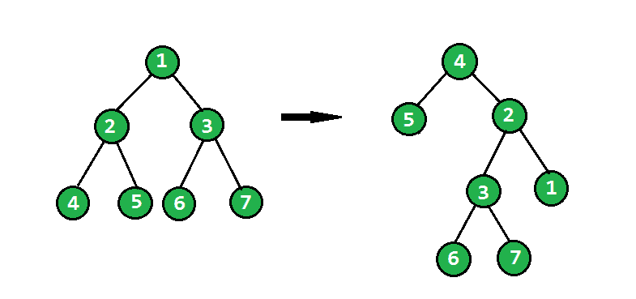

# 翻转二叉树

> 原文:[https://www.geeksforgeeks.org/flip-binary-tree/](https://www.geeksforgeeks.org/flip-binary-tree/)

给定一棵二叉树，任务是将二叉树朝顺时针方向翻转。请参见下面的示例来查看转换。
在翻转操作中，最左边的节点成为翻转树的根，它的父节点成为它的右子节点，右兄弟节点成为它的左子节点，对所有最左边的节点递归地做同样的操作。

 

下面是一个子树的主要旋转代码

```
    root->left->left = root->right;
    root->left->right = root;
    root->left = NULL;
    root->right = NULL; 
```

通过下图可以理解上述代码–


当我们将 root->left 存储在翻转的根中时，翻转的子树会存储在每个递归调用中。

## C++

```
/*  C/C++ program to flip a binary tree */
#include <bits/stdc++.h>
using namespace std;

/* A binary tree node structure */
struct Node
{
    int data;
    Node *left, *right;
};

/* Utility function to create a new Binary
   Tree Node */
struct Node* newNode(int data)
{
    struct Node *temp = new struct Node;
    temp->data = data;
    temp->left = temp->right = NULL;
    return temp;
}

// method to flip the binary tree
Node* flipBinaryTree(Node* root)
{
    // Base cases
    if (root == NULL)
        return root;
    if (root->left == NULL && root->right == NULL)
        return root;

    //  recursively call the same method
    Node* flippedRoot = flipBinaryTree(root->left);

    //  rearranging main root Node after returning
    // from recursive call
    root->left->left = root->right;
    root->left->right = root;
    root->left = root->right = NULL;

    return flippedRoot;
}

// Iterative method to do level order traversal
// line by line
void printLevelOrder(Node *root)
{
    // Base Case
    if (root == NULL)  return;

    // Create an empty queue for level order traversal
    queue<Node *> q;

    // Enqueue Root and initialize height
    q.push(root);

    while (1)
    {
        // nodeCount (queue size) indicates number
        // of nodes at current level.
        int nodeCount = q.size();
        if (nodeCount == 0)
            break;

        // Dequeue all nodes of current level and
        // Enqueue all nodes of next level
        while (nodeCount > 0)
        {
            Node *node = q.front();
            cout << node->data << " ";
            q.pop();
            if (node->left != NULL)
                q.push(node->left);
            if (node->right != NULL)
                q.push(node->right);
            nodeCount--;
        }
        cout << endl;
    }
}

//  Driver code
int main()
{
    Node* root = newNode(1);
    root->left = newNode(2);
    root->right = newNode(3);
    root->right->left = newNode(4);
    root->right->right = newNode(5);

    cout << "Level order traversal of given tree\n";
    printLevelOrder(root);

    root = flipBinaryTree(root);

    cout << "\nLevel order traversal of the flipped"
            " tree\n";
    printLevelOrder(root);
    return 0;
}
```

## Java 语言(一种计算机语言，尤用于创建网站)

```
/*  Java program to flip a binary tree */
import java.util.Queue;
import java.util.LinkedList;
public class FlipTree {

    // method to flip the binary tree
    public static Node flipBinaryTree(Node root)
    {
        if (root == null)
            return root;
        if (root.left == null && root.right ==null)
            return root;

        //  recursively call the same method
        Node flippedRoot=flipBinaryTree(root.left);

        //  rearranging main root Node after returning
        // from recursive call
        root.left.left=root.right;
        root.left.right=root;
        root.left=root.right=null;
        return flippedRoot;
    }

    // Iterative method to do level order traversal
    // line by line
    public static void printLevelOrder(Node root)
    {
        // Base Case
        if(root==null)
            return ;

        // Create an empty queue for level order traversal
        Queue<Node> q=new LinkedList<>();
        // Enqueue Root and initialize height
        q.add(root);
        while(true)
        {
            // nodeCount (queue size) indicates number
            // of nodes at current level.
            int nodeCount = q.size();
            if (nodeCount == 0)
                break;

            // Dequeue all nodes of current level and
            // Enqueue all nodes of next level
            while (nodeCount > 0)
            {
                Node node = q.remove();
                System.out.print(node.data+" ");
                if (node.left != null)
                    q.add(node.left);
                if (node.right != null)
                    q.add(node.right);
                nodeCount--;
            }
            System.out.println();
        }
    }

    public static void main(String args[]) {
        Node root=new Node(1);
        root.left=new Node(2);
        root.right=new Node(1);
        root.right.left = new Node(4);
        root.right.right = new Node(5);
        System.out.println("Level order traversal of given tree");
        printLevelOrder(root);

        root = flipBinaryTree(root);
        System.out.println("Level order traversal of flipped tree");
        printLevelOrder(root);
    }
}

/* A binary tree node structure */
class Node
{
    int data;
    Node left, right;
    Node(int data)
    {
        this.data=data;
    }
};

//This code is contributed by Gaurav Tiwari
```

## 蟒蛇 3

```
# Python3 program to flip
# a binary tree

# A binary tree node
class Node:

    # Constructor to create
    # a new node
    def __init__(self, data):

        self.data = data
        self.right = None
        self.left = None

def flipBinaryTree(root):

    # Base Cases
    if root is None:
        return root

    if (root.left is None and
        root.right is None):
        return root

    # Recursively call the
    # same method
    flippedRoot = flipBinaryTree(root.left)

    # Rearranging main root Node
    # after returning from
    # recursive call
    root.left.left = root.right
    root.left.right = root
    root.left = root.right = None

    return flippedRoot

# Iterative method to do the level
# order traversal line by line
def printLevelOrder(root):

    # Base Case
    if root is None:
        return

    # Create an empty queue for
    # level order traversal
    from Queue import Queue
    q = Queue()

    # Enqueue root and initialize
    # height
    q.put(root)

    while(True):

        # nodeCount (queue size) indicates
        # number of nodes at current level
        nodeCount = q.qsize()
        if nodeCount == 0:
            break

        # Dequeue all nodes of current
        # level and Enqueue all nodes
        # of next level  
        while nodeCount > 0:
            node = q.get()
            print node.data,
            if node.left is not None:
                q.put(node.left)
            if node.right is not None:
                q.put(node.right)
            nodeCount -= 1

        print

# Driver code
root = Node(1)
root.left = Node(2)
root.right = Node(3)
root.right.left = Node(4)
root.right.right = Node(5)

print "Level order traversal of given tree"
printLevelOrder(root)

root = flipBinaryTree(root)

print "\nLevel order traversal of the flipped tree"
printLevelOrder(root)

# This code is contributed by Nikhil Kumar Singh(nickzuck_007)
```

## C#

```
// C# program to flip a binary tree
using System;
using System.Collections.Generic;

public class FlipTree
{

    // method to flip the binary tree
    public static Node flipBinaryTree(Node root)
    {
        if (root == null)
            return root;
        if (root.left == null && root.right ==null)
            return root;

        // recursively call the same method
        Node flippedRoot = flipBinaryTree(root.left);

        // rearranging main root Node after returning
        // from recursive call
        root.left.left = root.right;
        root.left.right = root;
        root.left = root.right = null;
        return flippedRoot;
    }

    // Iterative method to do level order traversal
    // line by line
    public static void printLevelOrder(Node root)
    {
        // Base Case
        if(root == null)
            return ;

        // Create an empty queue for level order traversal
        Queue<Node> q = new Queue<Node>();

        // Enqueue Root and initialize height
        q.Enqueue(root);
        while(true)
        {
            // nodeCount (queue size) indicates number
            // of nodes at current level.
            int nodeCount = q.Count;
            if (nodeCount == 0)
                break;

            // Dequeue all nodes of current level and
            // Enqueue all nodes of next level
            while (nodeCount > 0)
            {
                Node node = q.Dequeue();
                Console.Write(node.data+" ");
                if (node.left != null)
                    q.Enqueue(node.left);
                if (node.right != null)
                    q.Enqueue(node.right);
                nodeCount--;
            }
            Console.WriteLine();
        }
    }

    // Driver code
    public static void Main(String []args)
    {
        Node root = new Node(1);
        root.left = new Node(2);
        root.right = new Node(1);
        root.right.left = new Node(4);
        root.right.right = new Node(5);
        Console.WriteLine("Level order traversal of given tree");
        printLevelOrder(root);

        root = flipBinaryTree(root);
        Console.WriteLine("Level order traversal of flipped tree");
        printLevelOrder(root);
    }
}

/* A binary tree node structure */
public class Node
{
    public int data;
    public Node left, right;
    public Node(int data)
    {
        this.data = data;
    }
};

// This code is contributed by Princi Singh
```

## java 描述语言

```
<script>
/*  Javascript program to flip a binary tree */

    /* A binary tree node structure */
    class Node
    {

        constructor( data)
        {
            this.data = data;
            this.left=this.right=null;
        }
    };

    // method to flip the binary tree
    function flipBinaryTree(root)
    {
         if (root == null)
            return root;
        if (root.left == null && root.right ==null)
            return root;

        //  recursively call the same method
        let flippedRoot=flipBinaryTree(root.left);

        //  rearranging main root Node after returning
        // from recursive call
        root.left.left=root.right;
        root.left.right=root;
        root.left=root.right=null;
        return flippedRoot;
    }

    // Iterative method to do level order traversal
    // line by line
    function printLevelOrder(root)
    {
        // Base Case
        if(root==null)
            return ;

        // Create an empty queue for level order traversal
        let q=[];
        // Enqueue Root and initialize height
        q.push(root);
        while(true)
        {
            // nodeCount (queue size) indicates number
            // of nodes at current level.
            let nodeCount = q.length;
            if (nodeCount == 0)
                break;

            // Dequeue all nodes of current level and
            // Enqueue all nodes of next level
            while (nodeCount > 0)
            {
                let node = q.shift();
                document.write(node.data+" ");
                if (node.left != null)
                    q.push(node.left);
                if (node.right != null)
                    q.push(node.right);
                nodeCount--;
            }
            document.write("<br>");
        }
    }

    let root=new Node(1);
        root.left=new Node(2);
        root.right=new Node(3);
        root.right.left = new Node(4);
        root.right.right = new Node(5);
        document.write("Level order traversal of given tree<br>");
        printLevelOrder(root);

        root = flipBinaryTree(root);
        document.write("Level order traversal of flipped tree<br>");
        printLevelOrder(root);

    // This code is contributed by unknown2108
</script>
```

**输出:**

```
Level order traversal of given tree
1 
2 3 
4 5 

Level order traversal of the flipped tree
2 
3 1 
4 5 
```

**迭代方法**
这个方法是由**帕尔 13** 贡献的。
迭代求解遵循与递归相同的方法，我们唯一需要注意的是保存将要被覆盖的节点信息。

## C++

```
//  C/C++ program to flip a binary tree
#include <bits/stdc++.h>
using namespace std;

// A binary tree node structure
struct Node
{
    int data;
    Node *left, *right;
};

// Utility function to create a new Binary
// Tree Node
struct Node* newNode(int data)
{
    struct Node *temp = new struct Node;
    temp->data = data;
    temp->left = temp->right = NULL;
    return temp;
}

// method to flip the binary tree
Node* flipBinaryTree(Node* root)
{
    // Initialization of pointers
    Node *curr = root;
    Node *next = NULL;
    Node *temp = NULL;
    Node *prev = NULL;

    // Iterate through all left nodes
    while(curr)
    {
        next = curr->left;

        // Swapping nodes now, need temp to keep the previous right child

        // Making prev's right as curr's left child
        curr->left = temp;        

        // Storing curr's right child
        temp = curr->right;        

        // Making prev as curr's right child
        curr->right = prev;        

        prev = curr;
        curr = next;
    }
    return prev;
}

// Iterative method to do level order traversal
// line by line
void printLevelOrder(Node *root)
{
    // Base Case
    if (root == NULL) return;

    // Create an empty queue for level order traversal
    queue<Node *> q;

    // Enqueue Root and initialize height
    q.push(root);

    while (1)
    {
        // nodeCount (queue size) indicates number
        // of nodes at current level.
        int nodeCount = q.size();
        if (nodeCount == 0)
            break;

        // Dequeue all nodes of current level and
        // Enqueue all nodes of next level
        while (nodeCount > 0)
        {
            Node *node = q.front();
            cout << node->data << " ";
            q.pop();

            if (node->left != NULL)
                q.push(node->left);

            if (node->right != NULL)
                q.push(node->right);
            nodeCount--;
        }
        cout << endl;
    }
}

// Driver code
int main()
{

    Node* root = newNode(1);
    root->left = newNode(2);
    root->right = newNode(3);
    root->right->left = newNode(4);
    root->right->right = newNode(5);

    cout << "Level order traversal of given tree\n";
    printLevelOrder(root);

    root = flipBinaryTree(root);

    cout << "\nLevel order traversal of the flipped"
            " tree\n";
    printLevelOrder(root);
    return 0;
}

// This article is contributed by Pal13
```

## Java 语言(一种计算机语言，尤用于创建网站)

```
// Java program to flip a binary tree
import java.util.*;
class GFG
{

// A binary tree node
static class Node
{
    int data;
    Node left, right;
};

// Utility function to create
// a new Binary Tree Node

static Node newNode(int data)
{
    Node temp = new Node();
    temp.data = data;
    temp.left = temp.right = null;
    return temp;
}

// method to flip the binary tree
static Node flipBinaryTree(Node root)
{
    // Initialization of pointers
    Node curr = root;
    Node next = null;
    Node temp = null;
    Node prev = null;

    // Iterate through all left nodes
    while(curr != null)
    {
        next = curr.left;

        // Swapping nodes now, need
        // temp to keep the previous
        // right child

        // Making prev's right
        // as curr's left child
        curr.left = temp;        

        // Storing curr's right child
        temp = curr.right;        

        // Making prev as curr's
        // right child
        curr.right = prev;        

        prev = curr;
        curr = next;
    }
    return prev;
}

// Iterative method to do
// level order traversal
// line by line
static void printLevelOrder(Node root)
{
    // Base Case
    if (root == null) return;

    // Create an empty queue for
    // level order traversal
    Queue<Node> q = new LinkedList<Node>();

    // Enqueue Root and
    // initialize height
    q.add(root);

    while (true)
    {
        // nodeCount (queue size)
        // indicates number of nodes
        // at current level.
        int nodeCount = q.size();
        if (nodeCount == 0)
            break;

        // Dequeue all nodes of current
        // level and Enqueue all nodes
        // of next level
        while (nodeCount > 0)
        {
            Node node = q.peek();
            System.out.print(node.data + " ");
            q.remove();

            if (node.left != null)
                q.add(node.left);

            if (node.right != null)
                q.add(node.right);
            nodeCount--;
        }
        System.out.println();
    }
}

// Driver code
public static void main(String args[])
{
    Node root = newNode(1);
    root.left = newNode(2);
    root.right = newNode(3);
    root.right.left = newNode(4);
    root.right.right = newNode(5);

    System.out.print("Level order traversal " +
                            "of given tree\n");
    printLevelOrder(root);

    root = flipBinaryTree(root);

    System.out.print("\nLevel order traversal " +
                        "of the flipped tree\n");
    printLevelOrder(root);
}
}

// This code is contributed
// by Arnab Kundu
```

## 蟒蛇 3

```
# Python3 program to flip
# a binary tree
from collections import deque

# A binary tree node structure
class Node:

    def __init__(self, key):

        self.data = key
        self.left = None
        self.right = None

# method to flip the
# binary tree
def flipBinaryTree(root):

    # Initialization of
    # pointers
    curr = root
    next = None
    temp = None
    prev = None

    # Iterate through all
    # left nodes
    while(curr):
        next = curr.left

        # Swapping nodes now, need temp
        # to keep the previous right child

        # Making prev's right as curr's
        # left child
        curr.left = temp

        # Storing curr's right child
        temp = curr.right

        # Making prev as curr's right
        # child
        curr.right = prev

        prev = curr
        curr = next
    return prev

# Iterative method to do level
# order traversal line by line
def printLevelOrder(root):

    # Base Case
    if (root == None):
        return

    # Create an empty queue for
    # level order traversal
    q = deque()

    # Enqueue Root and initialize
    # height
    q.append(root)

    while (1):
        # nodeCount (queue size) indicates
        # number of nodes at current level.
        nodeCount = len(q)
        if (nodeCount == 0):
            break

        # Dequeue all nodes of current
        # level and Enqueue all nodes
        # of next level
        while (nodeCount > 0):
            node = q.popleft()
            print(node.data, end = " ")

            if (node.left != None):
                q.append(node.left)

            if (node.right != None):
                q.append(node.right)
            nodeCount -= 1

        print()

# Driver code
if __name__ == '__main__':

    root = Node(1)
    root.left = Node(2)
    root.right = Node(3)
    root.right.left = Node(4)
    root.right.right = Node(5)

    print("Level order traversal of given tree")
    printLevelOrder(root)

    root = flipBinaryTree(root)

    print("\nLevel order traversal of the flipped"
          " tree")
    printLevelOrder(root)

# This code is contributed by Mohit Kumar 29
```

## C#

```
// C# program to flip a binary tree
using System;
using System.Collections.Generic;

class GFG
{

// A binary tree node
public class Node
{
    public int data;
    public Node left, right;
}

// Utility function to create
// a new Binary Tree Node
public static Node newNode(int data)
{
    Node temp = new Node();
    temp.data = data;
    temp.left = temp.right = null;
    return temp;
}

// method to flip the binary tree
public static Node flipBinaryTree(Node root)
{
    // Initialization of pointers
    Node curr = root;
    Node next = null;
    Node temp = null;
    Node prev = null;

    // Iterate through all left nodes
    while (curr != null)
    {
        next = curr.left;

        // Swapping nodes now, need
        // temp to keep the previous
        // right child

        // Making prev's right
        // as curr's left child
        curr.left = temp;

        // Storing curr's right child
        temp = curr.right;

        // Making prev as curr's
        // right child
        curr.right = prev;

        prev = curr;
        curr = next;
    }
    return prev;
}

// Iterative method to do level
// order traversal line by line
public static void printLevelOrder(Node root)
{
    // Base Case
    if (root == null)
    {
        return;
    }

    // Create an empty queue for
    // level order traversal
    LinkedList<Node> q = new LinkedList<Node>();

    // Enqueue Root and
    // initialize height
    q.AddLast(root);

    while (true)
    {
        // nodeCount (queue size)
        // indicates number of nodes
        // at current level.
        int nodeCount = q.Count;
        if (nodeCount == 0)
        {
            break;
        }

        // Dequeue all nodes of current
        // level and Enqueue all nodes
        // of next level
        while (nodeCount > 0)
        {
            Node node = q.First.Value;
            Console.Write(node.data + " ");
            q.RemoveFirst();

            if (node.left != null)
            {
                q.AddLast(node.left);
            }

            if (node.right != null)
            {
                q.AddLast(node.right);
            }
            nodeCount--;
        }
        Console.WriteLine();
    }
}

// Driver code
public static void Main(string[] args)
{
    Node root = newNode(1);
    root.left = newNode(2);
    root.right = newNode(3);
    root.right.left = newNode(4);
    root.right.right = newNode(5);

    Console.Write("Level order traversal " +
                         "of given tree\n");
    printLevelOrder(root);

    root = flipBinaryTree(root);

    Console.Write("\nLevel order traversal " +
                     "of the flipped tree\n");
    printLevelOrder(root);
}
}

// This code is contributed by Shrikant13
```

## java 描述语言

```
<script>

    // JavaScript program to flip a binary tree

    class Node
    {
        constructor(data) {
           this.left = null;
           this.right = null;
           this.data = data;
        }
    }

    // Utility function to create
    // a new Binary Tree Node

    function newNode(data)
    {
        let temp = new Node(data);
        return temp;
    }

    // method to flip the binary tree
    function flipBinaryTree(root)
    {
        // Initialization of pointers
        let curr = root;
        let next = null;
        let temp = null;
        let prev = null;

        // Iterate through all left nodes
        while(curr != null)
        {
            next = curr.left;

            // Swapping nodes now, need
            // temp to keep the previous
            // right child

            // Making prev's right
            // as curr's left child
            curr.left = temp;       

            // Storing curr's right child
            temp = curr.right;       

            // Making prev as curr's
            // right child
            curr.right = prev;       

            prev = curr;
            curr = next;
        }
        return prev;
    }

    // Iterative method to do
    // level order traversal
    // line by line
    function printLevelOrder(root)
    {
        // Base Case
        if (root == null) return;

        // Create an empty queue for
        // level order traversal
        let q = [];

        // Enqueue Root and
        // initialize height
        q.push(root);

        while (true)
        {
            // nodeCount (queue size)
            // indicates number of nodes
            // at current level.
            let nodeCount = q.length;
            if (nodeCount == 0)
                break;

            // Dequeue all nodes of current
            // level and Enqueue all nodes
            // of next level
            while (nodeCount > 0)
            {
                let node = q[0];
                document.write(node.data + " ");
                q.shift();

                if (node.left != null)
                    q.push(node.left);

                if (node.right != null)
                    q.push(node.right);
                nodeCount--;
            }
            document.write("</br>");
        }
    }

    let root = newNode(1);
    root.left = newNode(2);
    root.right = newNode(3);
    root.right.left = newNode(4);
    root.right.right = newNode(5);

    document.write("Level order traversal " +
                            "of given tree" + "</br>");
    printLevelOrder(root);

    root = flipBinaryTree(root);

    document.write("</br>" + "Level order traversal " +
                        "of the flipped tree" + "</br>");
    printLevelOrder(root);

</script>
```

**输出:**

```
Level order traversal of given tree
1 
2 3 
4 5 

Level order traversal of the flipped tree
2 
3 1 
4 5 
```

**复杂度分析:**
**时间复杂度:** O(n)最差情况下，二叉树深度会为 n.
**辅助空间:** O(1)。

本文由 [**乌卡什·特里维迪**](https://in.linkedin.com/in/utkarsh-trivedi-253069a7) 供稿。如果你喜欢 GeeksforGeeks 并想投稿，你也可以使用[write.geeksforgeeks.org](https://write.geeksforgeeks.org)写一篇文章或者把你的文章邮寄到 review-team@geeksforgeeks.org。看到你的文章出现在极客博客主页上，帮助其他极客。
如果发现有不正确的地方，或者想分享更多关于上述话题的信息，请写评论。