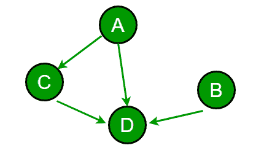
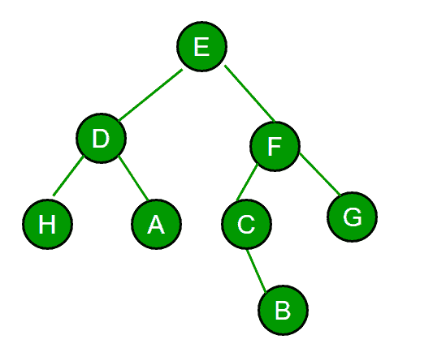

# Flipkart 访谈|第 11 集

> 原文:[https://www.geeksforgeeks.org/flipkart-interview-set-11/](https://www.geeksforgeeks.org/flipkart-interview-set-11/)

检查你的编码能力和思维水平是他们的主要动机。因此，我参与的整个过程只处理编码问题。😀

总共有 4 轮。

1.  在线编码
2.  机器编码
3.  面对面技术面试
4.  技术+人力资源

*   **Round 1 : Online Coding :**

    时间:1 小时 30 分钟

    1.  **5 的幂**
        [切割二元弦](https://practice.geeksforgeeks.org/problems/cutting-binary-string/0)

*   **Apllication of DFS/BFS**
    You were given a directed graph with n nodes. Given graph was connected. If there is an edge from u to v then u depends on v. Our task was to [find out the sum of dependencies for every node](https://practice.geeksforgeeks.org/problems/sum-of-dependencies-in-a-graph/0).

    [](https://media.geeksforgeeks.org/wp-content/uploads/tree-flipkart.png) 
    例:

    对于图中的图形，A 依赖:C，D 即 2
    B 依赖:D 即 1
    C 依赖:D 即 1
    而 D 不依赖。
    因此答案=0+1+1+2=4。

*   **Round 2: Machine Coding Round**

    时间:1 小时 30 分钟

    1.  Given two very large numbers a & b in string format. You need to produce the result for the following operation:
        0: Add a & b
        1: Subtract a & b
        2: Multiply a & b

        示例:
        123456789
        987654321

        输出:
        0→1111111110
        1 →- 864197532
        2→1219326313718945259

        很少案例被特别检查:

        *   132-132 的输出必须是 0 而不是 000。
        *   2–122222000002 应产生-122222000000，即 a 或 b 可以是更大的字符串。
        *   应该处理负输入。-2+202 = 200 的结果。
        *   1000000000–1 = 999999999，即结果答案的长度可能不同。

*   **Round 3: Face to face technical Interview**

    时间:45-50 分钟。

    *   [Given the mobile numeric keypad. You can only press buttons that are up,left,right or down to the current button.You are not allowed to press bottom row corner buttons](https://practice.geeksforgeeks.org/problems/mobile-numeric-keypad/0) (i.e. * and # ).

        

        给定一个 N，找出给定长度的可能数。它被要求写代码。

        例如:
        对于 N=2
        可能的数字:00，08 11，12，14 22，21，23，25 等等。我们必须打印这些数字的计数。
        第一次尝试我用 DP 解决了。他对此印象深刻，因为我花很少的时间去思考确切的解决方案。

    *   Given an undirected graph with the following special points:
        1.  每个节点最多有 3 个链接。
        2.  具有单个链接的节点是叶节点。
        3.  节点编号从 1 到 n

        (想一想它与三叉树有什么不同，参见粗体文本😛)
        我们对给定的图做如下操作:在所有当前叶节点中，我们搜索节点值最小的节点，删除它并打印它的父节点。我们执行这个操作，直到图中只剩下两个节点。
        如果给你一个 N 和一个数组，数组中有操作的打印值，你必须把图形生成回来。要求写出确切的实现。

        示例:
        N = 8

        ar[]= {4，3，6，6，5，4}

        输出应为下图的邻接矩阵。
        [](https://media.geeksforgeeks.org/wp-content/uploads/undirected-graph-flipkart.png) 
        第 3 轮第 2 题示例图。

*   **Round 4 : Technical + HR**

    时间:1 小时

    1.  引言。
    2.  当我被问到关于我的项目的每一个细节时，甚至我被要求为我的代码的几个部分写代码，也就是我如何实现那些特性。
    3.  问了几个关于团队合作的问题，比如我如何处理特殊情况。
    4.  优点和缺点。
    5.  告诉我你在大学里做过的一件事，并以在学术或任何领域都是如此而自豪。
    6.  Best and worst classmate till now and Why !! 😀

        以此作为最后的采访，我漫长的采访之旅结束了:)。祝你们所有人一切顺利，希望这会有所帮助🙂

*   **以下为第 1 轮在线编码题。**

    1.  **求和节点(编程)**
        在 Flipkart，一个员工有很多下属。但是一个员工也可以有很多经理。经理还可以有更多的经理监督他的工作。

一个简单的“老板-员工-关系”可以用箭头“—>”
A→B→C
这个表示 A 是 B 的直接老板，B 是 C 的直接老板，这里 A 也是 C 的(间接)老板，保证这个关系没有循环。
就是没有一对员工，X 和 Y，这样 X 是 Y 的老板，Y 也是 X 的老板

员工的工资可以根据以下规则计算:

1.  像 C 这样没有下属的员工赚 1。
2.  有直接下属的员工的工资等于其直接下属的工资总和。

“关系”表示一个字符串数组，其中如果 i <sup>第</sup>个字符串的第 I 个字符是 Y，如果员工 I 是员工 j 的直接上司，则为‘N’。你必须显示所有员工的工资总额。

在代码编辑器中完成此功能:
int Summing(String[]关系)

**约束**

*   关系数组的大小不会有大于 50 的元素。
*   数组将只包含由“是”和“否”组成的字符串。
*   数组的每个元素都有相同数量的字符。
*   对于第 k 行，第 k 个元素将始终为“N”。
*   如果 X 是 Y 的老板，Y 就不能是 X 的老板。
*   测试用例的设计使得答案总是在有符号的 32 位 int 的范围内。

**示例案例#1**
**输入**
N
**返回:** 1
**说明:**只有一个员工，所以他的工资会是 1。

**样本案例#2**
**输入**
NNYN
NNYN
NNNN
NYYN
**返回:** 5
**说明:**有以下关系。

```
   4
   | \
1  |  2
 \ | / 
   3
```

所以 3 <sup>第</sup>号员工的工资为 1，1 <sup>第</sup>号和 2 <sup>第</sup>号员工等于其(唯一)员工(3 <sup>第</sup>号)的总和为 1。第 4 名<sup>员工的工资是第 2 名和第 3 名员工的工资之和，1 + 1 = 2。所以工资总额是 2 + 1 + 1 + 1 = 5。</sup>

*   The future is not always what we expect it to be. 60 years ago, we never thought that the world of humans, as we know it, will undergo such a drastic change. In the final war between the humans and the apes, the apes won, and Ceaser leads his civilization to its zenith,” a fellow human prisoner tells another.

    “现在他们中的一些人甚至已经学会了数学，并正在尽最大努力从废墟中重建人类机器。他们要求我帮助他们启动发电机，否则他们没有理由让我活着。”

    要开始它，必须解决一个难题:
    你必须完成一个函数 int optimalCuts(字符串 s)，其中 s 是包含 0 和 l 的字符串。它必须返回最小的正整数 C，这样，位串可以被切割成 C 个片段，每个片段是 5 的幂。注意，每个棋子也可以代表 5 的不同次方。如果不可能这样切割，则返回-1。

    **约束**

    1.  参数字符串将仅由“0”和“1”组成。
    2.  1 <= length(s) <="50.</ol">

        **示例案例#1**
        s = 101101101
        返回:3
        解释:我们可以将给定的字符串拆分为三个“101”s，其中 101 是 5 的二进制表示。

        **样本案例#2**
        s = 1111101
        返回:1
        解释:“1111101”是 125，也就是 5^3

        **示例案例# 3**T2 s = 00000
        返回:-1
        解释:0 不是 5 的幂。

        =>

如果你喜欢 GeeksforGeeks 并想投稿，也可以写一篇文章，把文章邮寄到 contribute@geeksforgeeks.org。看到你的文章出现在极客博客主页上，帮助其他极客。

[All Practice Problems for Flipkart](https://practice.geeksforgeeks.org/company/Flipkart/) !