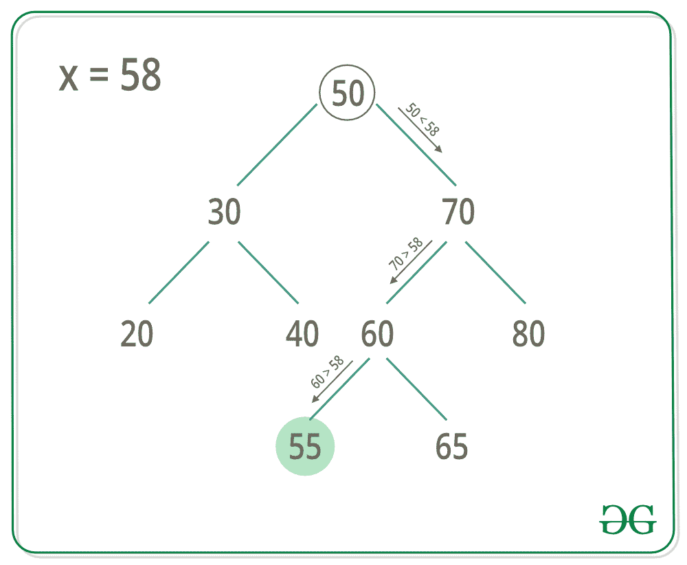

# 二叉查找树楼层(英国夏令时)

> 原文:[https://www . geesforgeks . org/floor-in-binary-search-tree-BST/](https://www.geeksforgeeks.org/floor-in-binary-search-tree-bst/)

给定一个二叉查找树和一个数 x，在给定的 BST 中求 x 的楼层。

```
Input : x = 14 and root of below tree
            10
           /  \
          5    15
              /  \
            12    30
Output : 12

Input : x = 15 and root of below tree
            10
           /  \
          5    15
              /  \
            12    30
Output : 15    
```



一个**简单的解决方案**是使用(有序或前序或后序)遍历树，并跟踪最近的较小或相同的元素。这个解决方案的时间复杂度是 **O(n)** ，其中 n 是 BST 中的节点总数。
我们可以**高效**在 **O(h)** 时间内找到最近的更小或相同的元素，其中 h 是 BST 的高度。在二叉查找树找到钥匙所在楼层的算法

```
1 Start at the root Node.
2 If root->data == key, 
     floor of the key is equal 
     to the root.
3 Else if root->data > key, then 
     floor of the key must lie in the
     left subtree.
4 Else floor may lie in the right subtree 
  but only if there is a value lesser than 
  or equal to the key.If not, then root is
  the key.
```

要找到 BST 的上限，可以参考[这篇](https://www.geeksforgeeks.org/floor-and-ceil-from-a-bst/)文章。

## C++

```
// C++ code to find floor of a key in BST
#include <bits/stdc++.h>
using namespace std;

/*Structure of each Node in the tree*/
struct Node {
    int data;
    Node *left, *right;
};

/*This function is used to create and
initializes new Nodes*/
Node* newNode(int key)
{
    Node* temp = new Node;
    temp->left = temp->right = NULL;
    temp->data = key;
    return temp;
}

/* This function is used to insert
 new values in BST*/
Node* insert(Node* root, int key)
{
    if (!root)
        return newNode(key);
    if (key < root->data)
        root->left = insert(root->left, key);
    else
        root->right = insert(root->right, key);
    return root;
}

/*This function is used to find floor of a key*/
int floor(Node* root, int key)
{
    if (!root)
        return INT_MAX;

    /* If root->data is equal to key */
    if (root->data == key)
        return root->data;

    /* If root->data is greater than the key */
    if (root->data > key)
        return floor(root->left, key);

    /* Else, the floor may lie in right subtree
      or may be equal to the root*/
    int floorValue = floor(root->right, key);
    return (floorValue <= key) ? floorValue : root->data;
}

int main()
{
    /* Let us create following BST
              7
            /    \
           5      10
         /  \    /  \
        3    6   8   12 */
    Node* root = NULL;
    root = insert(root, 7);
    insert(root, 10);
    insert(root, 5);
    insert(root, 3);
    insert(root, 6);
    insert(root, 8);
    insert(root, 12);
    cout << floor(root, 9) << endl;
    return 0;
}
```

## Java 语言(一种计算机语言，尤用于创建网站)

```
// Java code to find floor of a key in BST
class GfG {

    /*Structure of each Node in the tree*/
    static class Node {
        int data;
        Node left, right;
    }

    /*This function is used to create and
initializes new Nodes*/
    static Node newNode(int key)
    {
        Node temp = new Node();
        temp.left = null;
        temp.right = null;
        temp.data = key;
        return temp;
    }

    /* This function is used to insert
new values in BST*/
    static Node insert(Node root, int key)
    {
        if (root == null)
            return newNode(key);
        if (key < root.data)
            root.left = insert(root.left, key);
        else
            root.right = insert(root.right, key);
        return root;
    }

    /*This function is used to find floor of a key*/
    static int floor(Node root, int key)
    {
        if (root == null)
            return Integer.MAX_VALUE;

        /* If root->data is equal to key */
        if (root.data == key)
            return root.data;

        /* If root->data is greater than the key */
        if (root.data > key)
            return floor(root.left, key);

        /* Else, the floor may lie in right subtree
    or may be equal to the root*/
        int floorValue = floor(root.right, key);
        return (floorValue <= key) ? floorValue : root.data;
    }

    public static void main(String[] args)
    {
        /* Let us create following BST
            7
            / \
        5     10
        / \ / \
        3 6 8 12 */
        Node root = null;
        root = insert(root, 7);
        insert(root, 10);
        insert(root, 5);
        insert(root, 3);
        insert(root, 6);
        insert(root, 8);
        insert(root, 12);
        System.out.println(floor(root, 9));
    }
}
```

## 蟒蛇 3

```
# Python3 code to find floor of a key in BST
INT_MAX = 2147483647

# Binary Tree Node
""" A utility function to create a
new BST node """
class newNode:

    # Construct to create a newNode
    def __init__(self, data):
        self.data = data
        self.left = None
        self.right = None

""" This function is used to insert
new values in BST"""
def insert(root, key):

    if (not root):
        return newNode(key)
    if (key < root.data):
        root.left = insert(root.left, key)
    else:
        root.right = insert(root.right, key)
    return root

"""This function is used to find floor of a key"""
def floor(root, key) :

    if (not root):
        return INT_MAX

    """ If root.data is equal to key """
    if (root.data == key) :
        return root.data

    """ If root.data is greater than the key """
    if (root.data > key) :
        return floor(root.left, key)

    """ Else, the floor may lie in right subtree
    or may be equal to the root"""
    floorValue = floor(root.right, key)
    return floorValue if (floorValue <= key) else root.data

# Driver Code
if __name__ == '__main__':

    """ Let us create following BST
            7
            / \
        5     10
        / \ / \
        3 6 8 12 """
    root = None
    root = insert(root, 7)
    insert(root, 10)
    insert(root, 5)
    insert(root, 3)
    insert(root, 6)
    insert(root, 8)
    insert(root, 12)
    print(floor(root, 9))

# This code is contributed by
# Shubham Singh(SHUBHAMSINGH10)
```

## C#

```
// C# code to find floor of a key in BST
using System;

class GfG {

    /*Structure of each Node in the tree*/
    public class Node {
        public int data;
        public Node left, right;
    }

    /*This function is used to create and
initializes new Nodes*/
    static Node newNode(int key)
    {
        Node temp = new Node();
        temp.left = null;
        temp.right = null;
        temp.data = key;
        return temp;
    }

    /* This function is used to insert
new values in BST*/
    static Node insert(Node root, int key)
    {
        if (root == null)
            return newNode(key);
        if (key < root.data)
            root.left = insert(root.left, key);
        else
            root.right = insert(root.right, key);
        return root;
    }

    /*This function is used to find floor of a key*/
    static int floor(Node root, int key)
    {
        if (root == null)
            return int.MaxValue;

        /* If root->data is equal to key */
        if (root.data == key)
            return root.data;

        /* If root->data is greater than the key */
        if (root.data > key)
            return floor(root.left, key);

        /* Else, the floor may lie in right subtree
    or may be equal to the root*/
        int floorValue = floor(root.right, key);
        return (floorValue <= key) ? floorValue : root.data;
    }

    // Driver code
    public static void Main(String[] args)
    {
        /* Let us create following BST
            7
            / \
        5     10
        / \ / \
        3 6 8 12 */
        Node root = null;
        root = insert(root, 7);
        insert(root, 10);
        insert(root, 5);
        insert(root, 3);
        insert(root, 6);
        insert(root, 8);
        insert(root, 12);
        Console.WriteLine(floor(root, 9));
    }
}

// This code has been contributed by 29AjayKumar
```

## java 描述语言

```
<script>
// Javascript code to find floor of a key in BST

class Node
{
    constructor()
    {
        this.data=0;
        this.left=this.right=null;
    }
}

/*This function is used to create and
initializes new Nodes*/
function newNode(key)
{
    let temp = new Node();
        temp.left = null;
        temp.right = null;
        temp.data = key;
        return temp;
}

/* This function is used to insert
new values in BST*/
function insert(root,key)
{
    if (root == null)
            return newNode(key);
        if (key < root.data)
            root.left = insert(root.left, key);
        else
            root.right = insert(root.right, key);
        return root;
}

/*This function is used to find floor of a key*/
function floor(root,key)
{
    if (root == null)
            return Number.MAX_VALUE;

        /* If root->data is equal to key */
        if (root.data == key)
            return root.data;

        /* If root->data is greater than the key */
        if (root.data > key)
            return floor(root.left, key);

        /* Else, the floor may lie in right subtree
    or may be equal to the root*/
        let floorValue = floor(root.right, key);
        return (floorValue <= key) ? floorValue : root.data;
}

/* Let us create following BST
            7
            / \
        5     10
        / \ / \
        3 6 8 12 */
let root = null;
root = insert(root, 7);
insert(root, 10);
insert(root, 5);
insert(root, 3);
insert(root, 6);
insert(root, 8);
insert(root, 12);
document.write(floor(root, 9));

// This code is contributed by rag2127
</script>
```

**Output:** 

```
8
```