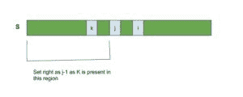

# 弗洛伊德-瑞文斯特算法

> 原文:[https://www.geeksforgeeks.org/floyd-rivest-algorithm/](https://www.geeksforgeeks.org/floyd-rivest-algorithm/)

Floyd-Rivest 算法是一种选择算法，用于在不同元素的数组中找到第**k**个最小元素。它类似于[快速选择算法](https://www.geeksforgeeks.org/quickselect-algorithm/)，但在实际运行中有更好的运行时间。
和 QuickSelect 一样，该算法基于分区的思想工作。对数组进行分区后，分区元素会在正确的排序位置结束。如果数组有所有不同的元素，检索第(k+1) <sup>个</sup>个最小元素与排序后检索第(k+1) <sup>个</sup>个元素相同。因为完全排序是昂贵的(需要 **O(N log N)** 来计算)，所以 Floyd-Rivest 算法利用分区在 **O(N)** 时间内完成相同的工作。

**算法:**

1.  如果所考虑的数组 S 的大小足够小，则直接应用[快速选择](https://www.geeksforgeeks.org/quickselect-algorithm/)算法来获得第 K 个最小元素。这个大小是算法的任意常数，作者选择它作为 **600** 。
2.  否则，使用随机抽样选择 2 个枢轴- newLeftIndex 和 newRightIndex，使得它们具有包含第 K 个最大元素的最高概率。然后，递归调用该函数，数组的左右边界现在设置为 newLeftIndex 和 newRightIndex。
3.  像快速选择一样，在划分子阵列后，需要设置左右边界，使它们包含 K 最大的元素。
    围绕 K 分割数组后，第 K 个元素处于其正确的排序位置。因此，左右边界以这样一种方式设置，即所考虑的子阵列包含数组[k]

 

下面是上述方法的实现。

## C++

```
// C++ implementation of the above approach.
#include <iostream>
#include <math.h>
using namespace std;

// Function to return the
// sign of a number
int sign(double x)
{
    if (x < 0)
        return -1;
    if (x > 0)
        return 1;
    return 0;
}

// Function to swap
// two numbers in an array.
void swap(int arr[], int i, int j)
{
    int temp = arr[i];
    arr[i] = arr[j];
    arr[j] = temp;
}

int select(int arr[], int left,
           int right, int k)
{
    while (right > left) {
        if (right - left > 600) {
            // Choosing a small subarray
            // S based on sampling.
            // 600, 0.5 and 0.5
            // are arbitrary constants
            int n = right - left + 1;
            int i = k - left + 1;
            double z = log(n);
            double s = 0.5 * exp(2 * z / 3);
            double sd = 0.5 * sqrt(z * s
                                   * (n - s) / n)
                        * sign(i - n / 2);

            int newLeft = max(left,
                              (int)(k - i * s / n + sd));

            int newRight = min(right,
                               (int)(k + (n - i) * s / n
                                     + sd));

            select(arr, newLeft, newRight, k);
        }

        // Partition the subarray S[left..right]
        // with arr[k] as pivot
        int t = arr[k];
        int i = left;
        int j = right;
        swap(arr, left, k);
        if (arr[right] > t) {
            swap(arr, left, right);
        }

        while (i < j) {
            swap(arr, i, j);
            i++;
            j--;

            while (arr[i] < t)
                i++;
            while (arr[j] > t)
                j--;
        }

        if (arr[left] == t)
            swap(arr, left, j);
        else {
            j++;
            swap(arr, right, j);
        }

        // Adjust the left and right pointers
        // to select the subarray having k
        if (j <= k)
            left = j + 1;
        if (k <= j)
            right = j - 1;
    }
    return arr[k];
}

// Driver code
int main()
{
    int arr[] = { 7, 3, 4, 0, 1, 6 };
    int n = sizeof(arr) / sizeof(int);

    // k-th smallest element.
    // In this we get the 2nd smallest element
    int k = 2;
    int res = select(arr, 0, n - 1, k - 1);
    cout << "The " << k << "-th smallest element is "
         << res << endl;
    return 0;
}
```

## Java 语言(一种计算机语言，尤用于创建网站)

```
// Java implementation of the above approach.
class GFG {

    // Function to return
    // the sign of the number
    int sign(double x)
    {
        if (x < 0)
            return -1;
        if (x > 0)
            return 1;
        return 0;
    }

    // Function to swap two numbers in an array
    void swap(int arr[], int i, int j)
    {
        int temp = arr[i];
        arr[i] = arr[j];
        arr[j] = temp;
    }

    // Function to return kth smallest number
    int select(int arr[], int left,
               int right, int k)
    {
        while (right > left) {
            if (right - left > 600) {
                // Choosing a small subarray
                // S based on sampling.
                // 600, 0.5 and 0.5 are
                // arbitrary constants
                int n = right - left + 1;
                int i = k - left + 1;
                double z = Math.log(n);
                double s = 0.5 * Math.exp(2 * z / 3);

                double sd = 0.5 * Math.sqrt(z * s * (n - s) / n)
                            * sign(i - n / 2);

                int newLeft = Math.max(left,
                                       (int)(k - i * s / n
                                             + sd));

                int newRight = Math.min(right,
                                        (int)(k + (n - i) * s / n
                                              + sd));

                select(arr, newLeft, newRight, k);
            }

            // Partition the subarray S[left..right]
            // with arr[k] as pivot
            int t = arr[k];
            int i = left;
            int j = right;
            swap(arr, left, k);
            if (arr[right] > t) {
                swap(arr, left, right);
            }

            while (i < j) {
                swap(arr, i, j);
                i++;
                j--;

                while (arr[i] < t)
                    i++;
                while (arr[j] > t)
                    j--;
            }

            if (arr[left] == t)
                swap(arr, left, j);
            else {
                j++;
                swap(arr, right, j);
            }

            // Adjust the left and right
            // pointers to select the subarray having k
            if (j <= k)
                left = j + 1;
            if (k <= j)
                right = j - 1;
        }
        return arr[k];
    }

    // Driver code
    public static void main(String[] args)
    {
        int[] arr = new int[] { 7, 3, 4, 0, 1, 6 };

        // k-th smallest element.
        // In this we get the 2nd smallest element
        int k = 2;
        FloydRivest f = new FloydRivest();
        int res = f.select(arr, 0, arr.length - 1, k - 1);
        System.out.println("The " + k
                           + "-th smallest element is " + res);
    }
}
```

## 蟒蛇 3

```
# Python implementation of the above approach.
import math
import random

# Function to return the
# sign of the number
def sign(x):
    if x>0:
        return 1
    elif x<0:
        return -1
    return 0

# Function to swap two
# numbers in an array
def swap(arr, i, j):
    temp = arr[i]
    arr[i] = arr[j]
    arr[j] = temp

# Function to return kth smallest number
def select(arr: list, left: int,
right: int, k: int):
    while right>left:

        # Choosing a small subarray
        # S based on sampling.
        # 600, 0.5 and 0.5 are
        # arbitrary constants
        if right-left > 600:
            n = right - left + 1
            i = k - left + 1
            z = math.log(n)
            s = 0.5 * math.exp(2 * z / 3)
            sd = 0.5 * math.sqrt(z * s * (n-s)/n) * sign(i-n / 2)
            newLeft = int(max(left, k-i * s / n + sd))
            newRight = int(min(right, k + (n - i) * s / n + sd))
            select(arr, newLeft, newRight, k)
        t = arr[k]
        i = left
        j = right
        swap(arr, left, k)
        if arr[right] > t:
            swap(arr, left, right)
        while i<j:
            swap(arr, i, j)
            i = i + 1
            j = j-1
            while arr[i]<t:
                i = i + 1
            while arr[j] >t:
                j = j-1

        if arr[left] == t:
            swap(arr, left, j)
        else:
            j = j + 1
            swap(arr, right, j)

        # Updating the left and right indices
        # depending on position of k-th element
        if j<= k:
            left = j + 1
        if k<= j:
            right = j-1
    return arr[k]

arr = [7, 3, 4, 0, 1, 6]
# k-th smallest element.
# In this the 2nd smallest element is returned.
k = 2
res = select(arr, 0, len(arr)-1, k-1)
print('The {}-th smallest element is {}'.format(k, res))
```

## C#

```
// C# implementation of the above approach.
using System;

class GFG
{

    // Function to return
    // the sign of the number
    static int sign(double x)
    {
        if (x < 0)
            return -1;
        if (x > 0)
            return 1;
        return 0;
    }

    // Function to swap two numbers in an array
    static void swap(int []arr, int i, int j)
    {
        int temp = arr[i];
        arr[i] = arr[j];
        arr[j] = temp;
    }

    // Function to return kth smallest number
    static int select(int []arr, int left,
            int right, int k)
    {
        int i;
        while (right > left)
        {
            if (right - left > 600)
            {
                // Choosing a small subarray
                // S based on sampling.
                // 600, 0.5 and 0.5 are
                // arbitrary constants
                int n = right - left + 1;
                i = k - left + 1;
                double z = Math.Log(n);
                double s = 0.5 * Math.Exp(2 * z / 3);

                double sd = 0.5 * Math.Sqrt(z * s * (n - s) / n)
                            * sign(i - n / 2);

                int newLeft = Math.Max(left,
                                    (int)(k - i * s / n
                                            + sd));

                int newRight = Math.Min(right,
                                        (int)(k + (n - i) * s / n
                                            + sd));

                select(arr, newLeft, newRight, k);
            }

            // Partition the subarray S[left..right]
            // with arr[k] as pivot
            int t = arr[k];
            i = left;
            int j = right;
            swap(arr, left, k);
            if (arr[right] > t)
            {
                swap(arr, left, right);
            }

            while (i < j)
            {
                swap(arr, i, j);
                i++;
                j--;

                while (arr[i] < t)
                    i++;
                while (arr[j] > t)
                    j--;
            }

            if (arr[left] == t)
                swap(arr, left, j);
            else
            {
                j++;
                swap(arr, right, j);
            }

            // Adjust the left and right
            // pointers to select the subarray having k
            if (j <= k)
                left = j + 1;
            if (k <= j)
                right = j - 1;
        }
        return arr[k];
    }

    // Driver code
    public static void Main()
    {
        int[] arr = { 7, 3, 4, 0, 1, 6 };

        // k-th smallest element.
        // In this we get the 2nd smallest element
        int k = 2;

        int res = select(arr, 0, arr.Length - 1, k - 1);
        Console.WriteLine("The " + k + "-th smallest element is " + res);
    }
}

// This code is contributed by AnkitRai01
```

## java 描述语言

```
<script>
    // Javascript implementation of the above approach.

    // Function to return
    // the sign of the number
    function sign(x)
    {
        if (x < 0)
            return -1;
        if (x > 0)
            return 1;
        return 0;
    }

    // Function to swap two numbers in an array
    function swap(arr, i, j)
    {
        let temp = arr[i];
        arr[i] = arr[j];
        arr[j] = temp;
    }

    // Function to return kth smallest number
    function select(arr, left, right, k)
    {
        let i;
        while (right > left)
        {
            if (right - left > 600)
            {
                // Choosing a small subarray
                // S based on sampling.
                // 600, 0.5 and 0.5 are
                // arbitrary constants
                let n = right - left + 1;
                i = k - left + 1;
                let z = Math.log(n);
                let s = 0.5 * Math.exp(2 * z / 3);

                let sd = 0.5 * Math.sqrt(z * s * (n - s) / n)
                            * sign(i - n / 2);

                let newLeft = Math.max(left, (k - i * s / n + sd));

                let newRight = Math.min(right, (k + (n - i) * s / n
                                            + sd));

                select(arr, newLeft, newRight, k);
            }

            // Partition the subarray S[left..right]
            // with arr[k] as pivot
            let t = arr[k];
            i = left;
            let j = right;
            swap(arr, left, k);
            if (arr[right] > t)
            {
                swap(arr, left, right);
            }

            while (i < j)
            {
                swap(arr, i, j);
                i++;
                j--;

                while (arr[i] < t)
                    i++;
                while (arr[j] > t)
                    j--;
            }

            if (arr[left] == t)
                swap(arr, left, j);
            else
            {
                j++;
                swap(arr, right, j);
            }

            // Adjust the left and right
            // pointers to select the subarray having k
            if (j <= k)
                left = j + 1;
            if (k <= j)
                right = j - 1;
        }
        return arr[k];
    }

    let arr = [ 7, 3, 4, 0, 1, 6 ];

    // k-th smallest element.
    // In this we get the 2nd smallest element
    let k = 2;

    let res = select(arr, 0, arr.length - 1, k - 1);
    document.write("The " + k + "-th smallest element is " + res);

</script>
```

**Output:** 

```
The 2-th smallest element is 1
```

**时间复杂度** : O(N)