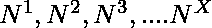

# 用幂的角位数组成一个数

> 原文:[https://www . geesforgeks . org/form-a-number-use-corner-digits-of-power/](https://www.geeksforgeeks.org/form-a-number-using-corner-digits-of-powers/)

给定两个整数 N 和 x，组成一个数，使该数包含出现在中的第一个和最后一个数字。
**例:**

```
Input : N = 10, X = 5 
Output : 1010101010
Explanation :
10^1 = 10
10^2 = 100
10^3 = 1000
10^4 = 10000
10^5 = 100000
Take First and Last Digit of each Power to
get required number.

Input : N = 19, X = 4 
Output : 19316911
Explanation :
19^1 = 19
19^2 = 361
19^3 = 6859
19^4 = 130321
Take First and Last Digit of each Power to get required number.
```

[推荐:请先在“<u>”上解，再进行解。</u>](https://practice.geeksforgeeks.org/problems/make-the-hit-in-power-game/0)

<u>**进场:**
**1。**逐个计算 N 从 1 到 X 的所有幂。
**2。**将输出存储在电源[]阵列中。
**3。**存储幂[0]即最后一位数字和幂[power _ size–1]即从幂[]数组到结果[]数组的单位位数。
**4。**打印结果[]数组。
以下是上述方法的实施:</u> 

## <u>C++</u>

```
// C++ program to find number formed by
// corner digits of powers.
#include <bits/stdc++.h>
using namespace std;

// Find next power by multiplying N with
// current power
void nextPower(int N, vector<int> &power)
{
    int carry = 0;

    for (int i=0 ; i < power.size(); i++)
    {
        int prod = (power[i] * N) + carry ;

        // Store digits of Power one by one.
        power[i] = prod % 10 ;

        // Calculate carry.
        carry = prod / 10 ;
    }

    while (carry)
    {
        // Store carry in Power array.
        power.push_back(carry % 10);
        carry = carry / 10 ;
    }
}

// Prints number formed by corner digits of
// powers of N.
void printPowerNumber(int X, int N)
{
    // Storing N raised to power 0
    vector<int> power;
    power.push_back(1);

    // Initializing empty result
    vector<int> res;

    // One by one compute next powers and
    // add their corner digits.
    for (int i=1; i<=X; i++)
    {
        // Call Function that store power
        // in Power array.
        nextPower(N, power) ;

        // Store unit and last digits of
        // power in res.
        res.push_back(power.back());
        res.push_back(power.front());
    }

    for (int i=0 ; i < res.size(); i++)
        cout << res[i] ;
}

// Driver Code
int main()
{
    int N = 19 , X = 4;
    printPowerNumber(X, N);
    return 0 ;
}
```

## <u>Java 语言(一种计算机语言，尤用于创建网站)</u>

```
// Java program to find number formed by
// corner digits of powers.
import java.io.*;
import java.util.*;

public class GFG {

    static List<Integer> power = new ArrayList<Integer>();
    // Find next power by multiplying N
    // with current power
    static void nextPower(Integer N)
    {
        Integer carry = 0;

        for (int i = 0; i < power.size(); i++)
        {
            Integer prod = (power.get(i) * N) + carry ;

            // Store digits of Power one by one.
            power.set(i,prod % 10);

            // Calculate carry.
            carry = prod / 10 ;
        }

        while (carry >= 1)
        {
            // Store carry in Power array.
            power.add(carry % 10);
            carry = carry / 10 ;
        }
    }

    // Prints number formed by corner digits of
    // powers of N.
    static void printPowerNumber(int X, int N)
    {

        // Storing N raised to power 0
        power.add(1);

        // Initializing empty result
        List<Integer> res = new ArrayList<Integer>();

        // One by one compute next powers and
        // add their corner digits.
        for (int i = 1; i <= X; i++)
        {
            // Call Function that store power
            // in Power array.
            nextPower(N) ;

            // Store unit and last digits of
            // power in res.
            res.add(power.get(power.size() - 1));
            res.add(power.get(0));
        }

        for (int i = 0 ; i < res.size(); i++)
            System.out.print(res.get(i)) ;
    }

    // Driver Code
    public static void main(String args[])
    {
        Integer N = 19 , X = 4;
        printPowerNumber(X, N);
    }
}

// This code is contributed by Manish Shaw
// (manishshaw1)
```

## <u>蟒蛇 3</u>

```
# Python3 program to find
# number formed by
# corner digits of powers.

# Storing N raised to power 0
power = []

# Find next power by multiplying
# N with current power
def nextPower(N) :
    global power
    carry = 0

    for i in range(0, len(power)) :
        prod = (power[i] * N) + carry

        # Store digits of
        # Power one by one.
        power[i] = prod % 10

        # Calculate carry.
        carry = (int)(prod / 10)

    while (carry) :

        # Store carry in Power array.
        power.append(carry % 10)
        carry = (int)(carry / 10)

# Prints number formed by corner
# digits of powers of N.
def printPowerNumber(X, N) :
    global power
    power.append(1)

    # Initializing empty result
    res = []

    # One by one compute next powers
    # and add their corner digits.
    for i in range(1, X+1) :

        # Call Function that store
        # power in Power array.
        nextPower(N)

        # Store unit and last
        # digits of power in res.
        res.append(power[-1])
        res.append(power[0])

    for i in range(0, len(res)) :
        print (res[i], end="")

# Driver Code
N = 19
X = 4
printPowerNumber(X, N)

# This code is contributed by
# Manish Shaw(manishshaw1)
```

## <u>C#</u>

```
// C# program to find number formed by
// corner digits of powers.
using System;
using System.Collections.Generic;
using System.Linq;
using System.Collections;

class GFG {

    // Find next power by multiplying N
    // with current power
    static void nextPower(int N, ref List<int> power)
    {
        int carry = 0;

        for (int i = 0; i < power.Count; i++)
        {
            int prod = (power[i] * N) + carry ;

            // Store digits of Power one by one.
            power[i] = prod % 10 ;

            // Calculate carry.
            carry = prod / 10 ;
        }

        while (carry >= 1)
        {
            // Store carry in Power array.
            power.Add(carry % 10);
            carry = carry / 10 ;
        }
    }

    // Prints number formed by corner digits of
    // powers of N.
    static void printPowerNumber(int X, int N)
    {

        // Storing N raised to power 0
        List<int> power = new List<int>();
        power.Add(1);

        // Initializing empty result
        List<int> res = new List<int>();

        // One by one compute next powers and
        // add their corner digits.
        for (int i = 1; i <= X; i++)
        {
            // Call Function that store power
            // in Power array.
            nextPower(N, ref power) ;

            // Store unit and last digits of
            // power in res.
            res.Add(power.Last());
            res.Add(power.First());
        }

        for (int i = 0 ; i < res.Count; i++)
            Console.Write(res[i]) ;
    }

    // Driver Code
    public static void Main()
    {
        int N = 19 , X = 4;
        printPowerNumber(X, N);
    }
}

// This code is contributed by Manish Shaw
// (manishshaw1)
```

## <u>服务器端编程语言（Professional Hypertext Preprocessor 的缩写）</u>

```
<?php
// PHP program to find
// number formed by
// corner digits of powers.

// Find next power by multiplying
// N with current power
function nextPower($N, &$power)
{
    $carry = 0;

    for ($i = 0 ; $i < count($power); $i++)
    {
        $prod = ($power[$i] *
                 $N) + $carry ;

        // Store digits of
        // Power one by one.
        $power[$i] = $prod % 10 ;

        // Calculate carry.
        $carry = (int)($prod / 10) ;
    }

    while ($carry)
    {
        // Store carry in Power array.
        array_push($power, $carry % 10);
        $carry = (int)($carry / 10) ;
    }
}

// Prints number formed by corner
// digits of powers of N.
function printPowerNumber($X, $N)
{
    // Storing N raised to power 0
    $power = array();
    array_push($power, 1);

    // Initializing empty result
    $res = array();

    // One by one compute next powers
    // and add their corner digits.
    for ($i = 1; $i <= $X; $i++)
    {
        // Call Function that store
        // power in Power array.
        nextPower($N, $power) ;

        // Store unit and last
        // digits of power in res.
        array_push($res,
                   $power[count($power) - 1]);
        array_push($res, $power[0]);
    }

    for ($i = 0 ; $i < count($res); $i++)
        echo ($res[$i]) ;
}

// Driver Code
$N = 19; $X = 4;
printPowerNumber($X, $N);

// This code is contributed by
// Manish Shaw(manishshaw1)
?>
```

## <u>java 描述语言</u>

```
<script>

// JavaScript program to find number formed by
// corner digits of powers.

// Find next power by multiplying N with
// current power
function nextPower(N, power)
{
    var carry = 0;

    for (var i=0 ; i < power.length; i++)
    {
        var prod = (power[i] * N) + carry ;

        // Store digits of Power one by one.
        power[i] = prod % 10 ;

        // Calculate carry.
        carry = parseInt(prod / 10);
    }

    while (carry>=1)
    {
        // Store carry in Power array.
        power.push(carry % 10);
        carry = parseInt(carry / 10);
    }
    return power;
}

// Prints number formed by corner digits of
// powers of N.
function printPowerNumber( X, N)
{
    // Storing N raised to power 0
    var power = [];
    power.push(1);

    // Initializing empty result
    var res = [];

    // One by one compute next powers and
    // add their corner digits.
    for (var i=1; i<=X; i++)
    {
        // Call Function that store power
        // in Power array.
        power = nextPower(N, power) ;

        // Store unit and last digits of
        // power in res.
        res.push(power[power.length-1]);
        res.push(power[0]);
    }

    for (var i=0 ; i < res.length; i++)
        document.write( res[i] );
}

// Driver Code
var N = 19 , X = 4;
printPowerNumber(X, N);

</script>
```

<u>**Output :** 

```
19316911
```</u>