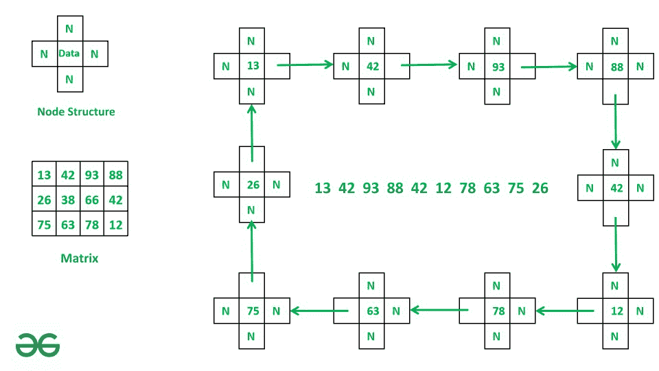

# 使用链表从矩阵的边界元素形成一个矩形

> 原文:[https://www . geeksforgeeks . org/form-a-从矩阵元素的边界使用链表/](https://www.geeksforgeeks.org/form-a-rectangle-from-boundary-elements-of-matrix-using-linked-list/)

给定一个大小为 **NxM** 的[矩阵](https://www.geeksforgeeks.org/matrix/) **网格[][]** ，其中 **N** 是行数， **M** 是列数。任务是使用[链表](https://www.geeksforgeeks.org/data-structures/linked-list/)从**网格[][]** 的边界元素形成一个矩形，链表有四个指针，即**上一个**、**下一个**、**上一个**和**下一个**。打印最终的链接列表。

**示例:**

> **输入:** A = [[13，42，93，88]，
> [26，38，66，42]，
> [75，63，78，12]]
> **输出:** 13 42 93 88 42 12 78 63 75 26
> 
> **说明:**
> 
> 
> 
> 1.制作 A[0][0]和头节点
> 2。遍历第 0 行，为每个元素创建节点，并通过下一个指针连接它们。
> 3。遍历第(m-1)列，为每个元素创建节点，并通过底部指针连接它们。
> 4。遍历第(n-1)行，为每个元素创建节点，并通过 prev 指针连接它们。
> 5。遍历第 0 列，为每个元素创建节点，并通过顶部指针连接它们。
> 6。重复步骤 2、3、4、5，直到温度。顶变得等于头。
> 
> **输入:**A =【【1，2，3】
> 【8，9，4】
> 【7，6，5】】
> **输出:** 1 2 3 4 5 6 7 8

**方法:**这个问题可以通过执行矩阵的[边界遍历来解决，为每个元素创建节点，并使用 next、prev、bottom 或 top 链接它们，并创建一个链表。](https://www.geeksforgeeks.org/boundary-elements-matrix/)

请遵循以下步骤:

**第一步:**将**网格【0】【0】**设为链表的**头**，将**温度**初始化为**头**。
**第二步:**遍历第一行从 **j=1** 到 **j=m-1** ，其中 **i=0** ，为每个元素创建一个节点，并通过**下一个**指针链接它们。
**步骤 3:** 遍历从 **i=0** 到 **i=n-1** 的最后一列，其中 **j=m-1** ，为每个元素创建一个节点，并通过**底部的**指针将它们链接起来。
**步骤 4:** 遍历从 **j=m-1** 到 **j=0** 的最后一行，其中 **i=n-1** 并为每个元素创建一个节点，并通过 **prev** 指针将它们链接起来。
**第五步:**遍历从 **i=n-1** 到 **i=0** 的第一列，其中 **j=0** 并为每个元素创建一个节点，并通过**顶部**指针将它们链接起来。
**步骤 6:** 重复步骤 2、3、4、5，直到**温度上限**等于**头部**。
**第七步:**打印需要的链表。

下面是上述算法的实现。

## 蟒蛇 3

```
# Python program for above approach
# Node Class
class Node:

    # Constructor to initialize the node object
    def __init__(self, val):
        self.data = val
        self.next = None
        self.prev = None
        self.top = None
        self.bottom = None

# Linked List class
class LinkedList:

    # Constructor to initialize head
    def __init__(self):
        self.head = None

    # function to form square
    # linked list of matrix.
    def Quad(self, grid, n, m):

        # initialising A[0][0] as head.
        self.head = Node(grid[0][0])

        # head is assigned to head.
        temp = self.head

        # i is row index, j is column index
        i = 0
        j = 1

        # loop till temp.top become equal to head.
        while temp.top != self.head:
            # as we iterating over boundary
            # of matrix so we will iterate
            # over first(0) and last(n-1) row
            # and first(0) and last(m-1) column.

            # iterating over first i.e 0th row
            # and connecting node.
            if j < m and i == 0:
                temp.next = Node(grid[i][j])
                temp = temp.next
                j += 1

            # iterating over last i.e (m-1)th
            # column and connecting Node.
            elif j == m and i < n - 1:
                i = i + 1
                temp.bottom = Node(grid[i][j - 1])
                temp = temp.bottom

            # iterating over last i.e (n-1)th row
            # and connecting Node.
            elif i == n - 1 and j <= m and j >= 1:
                if j == m: j = j - 1
                j = j - 1
                temp.prev = Node(grid[i][j])
                temp = temp.prev

            # iterating over first i.e 0th column
            # and connecting Node.
            elif i <= n - 1 and j == 0:
                i = i - 1
                temp.top = Node(grid[i][j])
                temp = temp.top
                if i == 1:
                    temp.top = self.head

    # function to print Linked list.
    def printList(self, root):

        temp = root

        # printing head of linked list
        print(temp.data, end =" ")

        # loop till temp.top
        # become equal to head
        while temp.top != root:

          # printing the node
            if temp.next:
                print(temp.next.data, end =" ")
                temp = temp.next
            if temp.prev:
                print(temp.prev.data, end =" ")
                temp = temp.prev
            if temp.bottom:
                print(temp.bottom.data, end =" ")
                temp = temp.bottom
            if temp.top:
                print(temp.top.data, end =" ")
                temp = temp.top

# Driver Code
grid = [[13, 42, 93, 88],   
        [26, 38, 66, 42],
        [75, 63, 78, 12]]

# n is number of rows
n = len(grid)

# m is number of column
m = len(grid[0])

# creation of object
l = LinkedList()

# Call Quad method to create Linked List.
l.Quad(grid, n, m)

# Call printList method to print list.
l.printList(l.head)
```

## java 描述语言

```
<script>
// Javascript program for above approach
// Node Class
class Node{

    // Constructor to initialize the node object
    constructor(val){
        this.data = val
        this.next = null
        this.prev = null
        this.top = null
        this.bottom = null
    }
}

// Linked List class
class LinkedList{

    // Constructor to initialize head
    constructor(){
        this.head = null
    }

    // function to form square
    // linked list of matrix.
    Quad(grid, n, m){

        // initialising A[0][0] as head.
        this.head = new Node(grid[0][0])

        // head is assigned to head.
        let temp = this.head

        // i is row index, j is column index
        let i = 0
        let j = 1

        // loop till temp.top become equal to head.
        while(temp.top != this.head){
            // as we iterating over boundary
            // of matrix so we will iterate
            // over first(0) and last(n-1) row
            // and first(0) and last(m-1) column.

            // iterating over first i.e 0th row
            // and connecting node.
            if(j < m && i == 0){
                temp.next = new Node(grid[i][j])
                temp = temp.next
                j += 1
            }

            // iterating over last i.e (m-1)th
            // column and connecting Node.
            else if (j == m && i < n - 1){
                i = i + 1
                temp.bottom = new Node(grid[i][j - 1])
                temp = temp.bottom
            }

            // iterating over last i.e (n-1)th row
            // and connecting Node.
            else if (i == n - 1 && j <= m && j >= 1){
                if (j == m) j = j - 1
                j = j - 1
                temp.prev = new Node(grid[i][j])
                temp = temp.prev
            }

            // iterating over first i.e 0th column
            // and connecting Node.
            else if (i <= n - 1 && j == 0){
                i = i - 1
                temp.top = new Node(grid[i][j])
                temp = temp.top
                if(i == 1)
                    temp.top = this.head
            }
        }
    }

    // function to print Linked list.
    printList(root){

        let temp = root

        // printing head of linked list
        document.write(temp.data + " ")

        // loop till temp.top
        // become equal to head
        while(temp.top != root){

          // printing the node
            if(temp.next){
               document.write(temp.next.data + " ")
                temp = temp.next
            }
            if(temp.prev){
               document.write(temp.prev.data + " ")
                temp = temp.prev
            }
            if(temp.bottom){
               document.write(temp.bottom.data + " ")
                temp = temp.bottom
            }
            if(temp.top){
               document.write(temp.top.data + " ")
                temp = temp.top
            }
        }
    }
}

// Driver Code
let grid = [[13, 42, 93, 88],   
        [26, 38, 66, 42],
        [75, 63, 78, 12]]

// n is number of rows
let n = grid.length

// m is number of column
let m = grid[0].length

// creation of object
let l = new LinkedList()

// Call Quad method to create Linked List.
l.Quad(grid, n, m)

// Call printList method to print list.
l.printList(l.head)

// This code is contributed by gfgking.
</script>
```

**Output**

```
13 42 93 88 42 12 78 63 75 26 
```

**时间复杂度:**O(N * M)
T3】辅助空间: O(N*M)