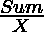

# 使用从和小于 S 的数组中选择的数字的索引形成最小的数字

> 原文:[https://www . geesforgeks . org/form-最小数字-使用数字索引-从总和小于 s 的数组中选择/](https://www.geeksforgeeks.org/form-smallest-number-using-indices-of-numbers-chosen-from-array-with-sum-less-than-s/)

给定一个数组 **arr[]** 和一个整数 **S** ，任务是从数组中选择最大数量的数字，使得数字的总和小于 **S** ，并使用它们的索引
**形成最小可能的数字。注:**任何元素都可以被选择任意次。

**示例:**

> **输入:** arr[] = {3，4，2，4，6，5，4，2，3}，S = 13
> **输出:** 133333
> **解释:**
> 所选元素–3+2+2+2+2 = 13
> 因此，指数的串联–133333
> 
> **输入:** arr[] = {18，21，22，51，13，14，17，15，17}，S = 50
> **输出:** 115

**方法:**想法是找到可以选择的元素的最大数量，可以使用



最后，可以选择多次的最小索引是通过取数字中每个数字位置的最小数字来计算的。

下面是上述方法的实现:

## C++

```
// C++ implementation to find
// minimum number which
// have a maximum length

#include <bits/stdc++.h>
using namespace std;

// Function to find the
// minimum number which
// have maximum length
string max_number(int arr[], int sum)
{
    int frac[9];
    int maxi = INT_MIN;
    string ans;
    int pos;

    // Find Maximum length
    // of number
    for (int i = 0; i < 9; i++) {
        frac[i] = sum / arr[i];
        if (frac[i] > maxi) {
            pos = i;
            maxi = frac[i];
        }
    }

    ans.insert(0,
               string(maxi,
                      (pos + 1) + '0'));
    sum -= maxi * arr[pos];

    // Find minimum number WHich
    // have maximum length
    for (int i = 0; i < maxi; i++) {
        for (int j = 1; j <= 9; j++) {

            if (sum
                    + arr[pos]
                    - arr[j - 1]
                >= 0) {

                ans[i] = (j + '0');
                sum += arr[pos]
                       - arr[j - 1];
                break;
            }
        }
    }

    if (maxi == 0) {
        return 0;
    }
    else {
        return ans;
    }
}

// Driver Code
int main()
{
    int arr[9] = { 3, 4, 2, 4, 6,
                   5, 4, 2, 3 };
    int s = 13;
    cout << max_number(arr, s);
    return 0;
}
```

## Java 语言(一种计算机语言，尤用于创建网站)

```
// Java implementation to find
// minimum number which
// have a maximum length
class GFG{

// Function to find the
// minimum number which
// have maximum length
static String max_number(int arr[], int sum)
{
    int frac[] = new int[9];
    int maxi = Integer.MIN_VALUE;

    StringBuilder ans = new StringBuilder();
    int pos = 0;

    // Find Maximum length
    // of number
    for(int i = 0; i < 9; i++)
    {
        frac[i] = sum / arr[i];
        if (frac[i] > maxi)
        {
            pos = i;
            maxi = frac[i];
        }
    }

    for(int i = 0; i < maxi; i++)
    {
        ans.append((char)((pos + 1) + '0'));
    }

    sum -= maxi * arr[pos];

    // Find minimum number WHich
    // have maximum length
    for(int i = 0; i < maxi; i++)
    {
        for(int j = 1; j <= 9; j++)
        {
            if (sum + arr[pos] - arr[j - 1] >= 0)
            {
                ans.setCharAt(i, (char)(j + '0'));

                sum += arr[pos] - arr[j - 1];
                break;
            }
        }
    }

    if (maxi == 0)
    {
        return "0";
    }
    else
    {
        return ans.toString();
    }
}

// Driver Code
public static void main(String str[])
{
    int arr[] = { 3, 4, 2, 4, 6,
                  5, 4, 2, 3 };
    int s = 13;

    System.out.println(max_number(arr, s));
}
}

// This code is contributed by rutvik_56
```

## 蟒蛇 3

```
# Python3 implementation to find
# minimum number which
# have a maximum length

# Function to find the
# minimum number which
# have maximum length
def max_number(arr, sum):

    frac = [0]*9
    maxi = -10**9

    pos = 0

    # Find Maximum length
    # of number
    for i in range(9):
        frac[i] = sum // arr[i]

        if (frac[i] > maxi):
            pos = i
            maxi = frac[i]

    an = str((pos + 1)) * maxi

    #print(an)
    sum -= maxi * arr[pos]

    ans = [i for i in an]

    # Find minimum number WHich
    # have maximum length
    for i in range(maxi):
        for j in range(1, 10):
            if (sum + arr[pos] - arr[j - 1] >= 0):
                ans[i] = str(j)
                sum += arr[pos] - arr[j - 1]
                break

    if (maxi == 0):
        return 0
    else:
        return "".join(ans)

# Driver Code
if __name__ == '__main__':

    arr = [ 3, 4, 2, 4, 6,
            5, 4, 2, 3 ]
    s = 13

    print(max_number(arr, s))

# This code is contributed by mohit kumar 29
```

## C#

```
// C# implementation to find
// minimum number which
// have a maximum length
using System;
using System.Text;
class GFG{

// Function to find the
// minimum number which
// have maximum length
static String max_number(int []arr,
                         int sum)
{
  int []frac = new int[9];
  int maxi = int.MinValue;
  StringBuilder ans =
                new StringBuilder();
  int pos = 0;

  // Find Maximum length
  // of number
  for(int i = 0; i < 9; i++)
  {
    frac[i] = sum / arr[i];
    if (frac[i] > maxi)
    {
      pos = i;
      maxi = frac[i];
    }
  }

  for(int i = 0; i < maxi; i++)
  {
    ans.Append((char)((pos + 1) + '0'));
  }
  sum -= maxi * arr[pos];

  // Find minimum number WHich
  // have maximum length
  for(int i = 0; i < maxi; i++)
  {
    for(int j = 1; j <= 9; j++)
    {
      if (sum + arr[pos] -
          arr[j - 1] >= 0)
      {
        ans[i] = (char)(j + '0');

        sum += arr[pos] - arr[j - 1];
        break;
      }
    }
  }

  if (maxi == 0)
  {
    return "0";
  }
  else
  {
    return ans.ToString();
  }
}

// Driver Code
public static void Main(String []str)
{
  int []arr = {3, 4, 2, 4, 6,
               5, 4, 2, 3};
  int s = 13;
  Console.WriteLine(max_number(arr, s));
}
}

// This code is contributed by 29AjayKumar
```

## java 描述语言

```
<script>
// Javascript implementation to find
// minimum number which
// have a maximum length

// Function to find the
// minimum number which
// have maximum length
function max_number(arr,sum)
{
    let frac = new Array(9);
    let maxi = Number.MIN_VALUE;

    let ans = [];
    let pos = 0;

    // Find Maximum length
    // of number
    for(let i = 0; i < 9; i++)
    {
        frac[i] = Math.floor(sum / arr[i]);
        if (frac[i] > maxi)
        {
            pos = i;
            maxi = frac[i];
        }
    }

    for(let i = 0; i < maxi; i++)
    {
        ans.push(String.fromCharCode((pos + 1) + '0'.charCodeAt(0)));
    }

    sum -= maxi * arr[pos];

    // Find minimum number WHich
    // have maximum length
    for(let i = 0; i < maxi; i++)
    {
        for(let j = 1; j <= 9; j++)
        {
            if (sum + arr[pos] - arr[j - 1] >= 0)
            {
                ans[i] = String.fromCharCode((j + '0'.charCodeAt(0)));

                sum += arr[pos] - arr[j - 1];
                break;
            }
        }
    }

    if (maxi == 0)
    {
        return "0";
    }
    else
    {
        return ans.join("");
    }
}

// Driver Code
let arr = [3, 4, 2, 4, 6,
                  5, 4, 2, 3];
let s = 13;
document.write(max_number(arr, s));

// This code is contributed by unknown2108
</script>
```

**Output:** 

```
133333
```