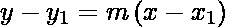
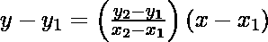
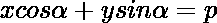
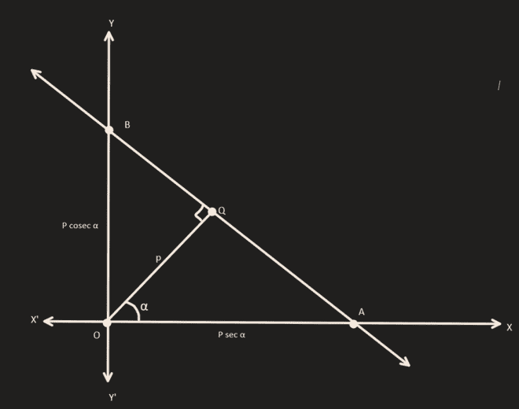

# 二元线性方程的形式–直线|第 11 课数学

> 原文:[https://www . geesforgeks . org/forms-of-two-variable-linear-equations-直线-class-11-mathematics/](https://www.geeksforgeeks.org/forms-of-two-variable-linear-equations-straight-lines-class-11-maths/)

直线是最简单的几何形状。它没有端点，向两个方向延伸，直到无穷远。**直**这个词简单的意思是没有**弯**。线上任意两点之间的坡度是相同的。因此，我们可以说，如果直线上任意两点之间的梯度相同，那么轨迹就是一条**直线**。让我们来看看这条线有哪些不同的表现方式。

## 一条线的不同形式

> *   Point slope form
> *   Two-point form
> *   Slope-intercept form
> *   Intercept form
> *   standard form

## **点-斜坡形式**

通过点(x 1 ，y 1 )和斜率‘m’的直线方程可以写成:

**证明:**

> 让位于曲线上的点为 **(x 1 ，y 1 )** ，任何一个一般点都可以用 **(h，k)** 表示。
> 
> 所以，直线的斜率可以写成
> 
> 斜率=(k-y 1 ) / (h-x 1
> 
> 还有，我们知道直线的斜率是 **m** 。
> 
> 因此，
> 
> (k-y 1 ) / (h-x 1 )= m
> 
> 用 y 替换 k，用 x 替换 h
> 
> 并且，我们得到 y–y1= m(x–x1

**实施例 1。写出通过(5，6)的直线方程，斜率等于 3**

**解决方案:**

> 将(x1，y1)的值设为(5，6)并且 m = 3，我们得到
> 
> y–6 = 3 *(x-5)
> 
> y–6 = 3x–15
> 
> **y = 3x–9**

**例 2。写出通过(0，0)且斜率等于 1 的直线方程**

**解决方案:**

> 将(x1，y1)的值设为(0，0)并且 m=1，我们得到
> 
> y–0 = 1 *(x-0)
> 
> **y = x**

## **两点表单**

通过点(x 1 、y 1 )和(x 2 、y 2 )的直线方程可以写成:

**证明:**

> 因为我们知道直线上的任意两点，所以我们可以把直线的斜率写成
> 
> m =(y2-y1)/(x2-x1
> 
> 我们也从点斜率形式知道
> 
> y-y 1 = m(x-x 1
> 
> 将上式中 m 的值代入，我们得到
> 
> y-y1=((y2-y1)/(x2-x1)*(x-x1

**实施例 1。写出通过(5，6)和(6，7)的直线的方程**

**解决方案:**

> 将(x1，y1)的值设为(5，6)并将(x2，y2)设为(6，7)，我们得到
> 
> y–6 =(7-6)/(6-5)*(x-5)
> 
> y–6 = 1 *(x–5)
> 
> **y = x + 1**

**例 2。写出通过(0，5)和(5，5)** 的直线的方程

**解决方案:**

> 将(x1，y1)的值设为(0，5)并将(x2，y2)设为(5，5)，我们得到
> 
> y–5 =(5-5)/(5-0)*(x-0)
> 
> **y = 0**

## 斜率-截距形式

y 轴上斜率为‘m’和截距为‘c’的直线方程可以写成:

**证明:**

> 因为 y 截距=c
> 
> 穿过(0，c)的直线方程由下式给出
> 
> y–c = m(x-0)
> 
> y = mx + c

**实施例 1。将斜率=5 且 y 截距为 3 的直线方程写成**

**解决方案:**

> 将 m=5 和 c=3 的值放入等式 y = mx + c
> 
> **y = 5x+3**

**例 2。将斜率=1 且 y 截距为 1 的直线方程写成**

**解决方案:**

> 将 m=1 和 c=1 的值放入等式 y = mx + c
> 
> **y = x+1**

## **截取表格**

剖线截距 x 轴上的‘a’和 y 轴上的‘b’的方程可以写成:

**证明:**

> 所以我们知道直线通过点(a，0)和(0，b)，我们可以用两点形式写出方程
> 
> y–y1=(y2–y1)/(x2–x1)*(x–x1
> 
> 放入 x 1 = a，y 1 = 0，x 2 = 0，y 2 = b
> 
> 我们得到，
> 
> y = (b/(-a) * (x-a)
> 
> 将两边除以 b，简化我们得到的 RHS
> 
> y/b = -(x/a)+1
> 
> ⇒ x/a + y/b =1

**实施例 1。写出 x 截距为 5，y 截距为 3 的直线方程**

**解决方案:**

> 将 a=5 和 b=3 的值放入公式 x / a + y / b = 1
> 
> **x/5 + y/3 =1**

**例 2。写出 x 截距为 1，y 截距为 1 的直线方程**

**解决方案:**

> 将 a=1 和 b=1 的值放入公式 x / a + y / b = 1
> 
> **x/1 + y/1 =1**

## **范式**

垂线距离原点的长度为“p”且该垂线与 x 轴的正方向成角度“∧”的直线方程为:

**证明:**

> 假设直线 AB 是这样的，从原点 O 到直线的垂直 OQ 的长度是 p，并且< XOQ =∧。
> 
> 从图表中，使用截取形式，我们得到
> 
> AB 线的方程是
> 
> x/p 干燥ⅲ+y/p cosecⅲ= 1
> 
> 或者
> 
> xcosⅲ+ysonⅲ= p

**实施例 1。写出垂线距离原点的长度为 5 个单位的直线方程，该垂线与 x 轴的正方向成 45°0°。**

**解决方案:**

> 所以，基本上我们得到了 p=5 和∧= 450的值
> 
> 把这些值放在上面的等式中，
> 
> x /√2 + y√2 = 5
> 
> **x+y = 5ⅰ2**

**例 2。写出直线方程，该直线的垂线距离原点的长度为 1 个单位，该垂线与 x 轴的正方向成 60°角0°。**

**解决方案:**

> 所以，基本上我们得到了 p=1 和∧= 600的值
> 
> 把这些值放在上面的等式中，
> 
> x * (1/2) + y * (√3/2) = 1
> 
> x+y * 3 = 2

