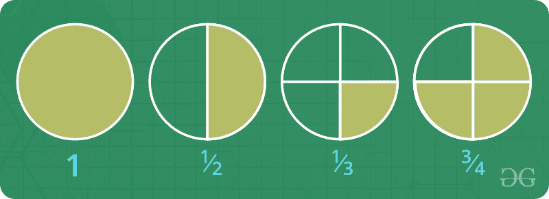

# 分数

> 原文:[https://www.geeksforgeeks.org/fraction/](https://www.geeksforgeeks.org/fraction/)

分数是两个值的[比](https://www.geeksforgeeks.org/ratio-proportion-and-partnership/)。分数的形式为 a/b，其中 a 称为*分子*，b 称为*分母*，b 不能等于 0(因为除以 0 没有定义)。分母给出了有多少相等的部分。分子代表其中的多少。例如，二分之一、五分之八、四分之三(1/2、8/5、3/4)。



**关于分数的事实:**

1.  如果分子和分母的[最大公约数(gcd)](https://www.geeksforgeeks.org/lcm-and-hcf/) 大于 1，分数可以减少。
2.  **分数的加减:**加减分数时，必须有相同的分母。如果它们没有相同的分母，我们必须为两者找到一个共同的分母。为此，我们首先需要找到两个分母的[最低公倍数(lcm)](https://www.geeksforgeeks.org/lcm-and-hcf/) ，或者将每个分数乘以适当的整数，以便有相同的分母。

3.  **分数的乘除:**两个分数相乘时，只需将两个记数器相乘，再将两个分母相乘即可。当划分两个分数时，第一个分数必须乘以第二个分数的倒数。
4.  有三种类型的分数:
    *   **适当分数:**分子小于分母。例如，1/3，3/4，2/7
    *   **不当分数:**分子大于(或等于)分母。比如 4/3，11/4，7/7。
    *   **混合分数:**一个整数和适当的分数加在一起。例如，1 1/3，2 1/4，16 2/5。

**如何将两个分数相加？**
将 a/b 和 c/d 两个分数相加，用最简单的形式打印出答案。

**示例:**

```
Input:  1/2 + 3/2
Output: 2/1

Input:  1/3 + 3/9
Output: 2/3

Input:  1/5 + 3/15
Output: 2/5
```

**两个分数相加的算法**

*   通过找到两个分母的最小公倍数来找到一个公分母。
*   改变分数，使其具有相同的分母，并将两项相加。
*   通过将分子和分母除以其最大公因数，将最终分数简化为更简单的形式。

## C++

```
// C++ program to add 2 fractions
#include <bits/stdc++.h>
using namespace std;

// Function to return gcd of a and b
int gcd(int a, int b)
{
    if (a == 0)
        return b;
    return gcd(b % a, a);
}

// Function to convert the obtained fraction
// into it's simplest form
void lowest(int& den3, int& num3)
{
    // Finding gcd of both terms
    int common_factor = gcd(num3, den3);

    // Converting both terms into simpler
    // terms by dividing them by common factor
    den3 = den3 / common_factor;
    num3 = num3 / common_factor;
}

// Function to add two fractions
void addFraction(int num1, int den1, int num2,
                 int den2, int& num3, int& den3)
{
    // Finding gcd of den1 and den2
    den3 = gcd(den1, den2);

    // Denominator of final fraction obtained
    // finding LCM of den1 and den2
    // LCM * GCD = a * b
    den3 = (den1 * den2) / den3;

    // Changing the fractions to have same denominator
    // Numerator of the final fraction obtained
    num3 = (num1) * (den3 / den1) + (num2) * (den3 / den2);

    // Calling function to convert final fraction
    // into it's simplest form
    lowest(den3, num3);
}

// Driver program
int main()
{
    int num1 = 1, den1 = 500, num2 = 2, den2 = 1500, den3, num3;

    addFraction(num1, den1, num2, den2, num3, den3);

    printf("%d/%d + %d/%d is equal to %d/%d\n", num1, den1,
           num2, den2, num3, den3);
    return 0;
}
```

## Java 语言(一种计算机语言，尤用于创建网站)

```
// Java program to add 2 fractions
import java.util.*;

class GFG
{
static int den3, num3;

// Function to return gcd of a and b
static int gcd(int a, int b)
{
    if (a == 0)
        return b;
    return gcd(b % a, a);
}

// Function to convert the obtained fraction
// into it's simplest form
static void lowest()
{
    // Finding gcd of both terms
    int common_factor = gcd(num3, den3);

    // Converting both terms into simpler
    // terms by dividing them by common factor
    den3 = den3 / common_factor;
    num3 = num3 / common_factor;
}

// Function to add two fractions
static void addFraction(int num1, int den1,
                        int num2, int den2)
{
    // Finding gcd of den1 and den2
    den3 = gcd(den1, den2);

    // Denominator of final fraction obtained
    // finding LCM of den1 and den2
    // LCM * GCD = a * b
    den3 = (den1 * den2) / den3;

    // Changing the fractions to have
    // same denominator.
    // Numerator of the final fraction obtained
    num3 = (num1) * (den3 / den1) +
           (num2) * (den3 / den2);

    // Calling function to convert final fraction
    // into it's simplest form
    lowest();
}

// Driver Code
public static void main(String[] args)
{
    int num1 = 1, den1 = 500,
        num2 = 2, den2 = 1500;

    addFraction(num1, den1, num2, den2);

    System.out.printf("%d/%d + %d/%d is equal to %d/%d\n",
                      num1, den1, num2, den2, num3, den3);
}
}

// This code is contributed by Rajput-Ji
```

## 蟒蛇 3

```
# Python3 program to add 2 fractions

# Function to return gcd of a and b
def gcd(a, b):
    if (a == 0):
        return b
    return gcd(b % a, a)

# Function to convert the obtained
# fraction into it's simplest form
def lowest(den3, num3):

    # Finding gcd of both terms
    common_factor = gcd(num3, den3)

    # Converting both terms
    # into simpler terms by
    # dividing them by common factor
    den3 = int(den3 / common_factor)
    num3 = int(num3 / common_factor)
    print(num3, "/", den3)

# Function to add two fractions
def addFraction(num1, den1, num2, den2):

    # Finding gcd of den1 and den2
    den3 = gcd(den1, den2)

    # Denominator of final
    # fraction obtained finding
    # LCM of den1 and den2
    # LCM * GCD = a * b
    den3 = (den1 * den2) / den3

    # Changing the fractions to
    # have same denominator Numerator
    # of the final fraction obtained
    num3 = ((num1) * (den3 / den1) +
            (num2) * (den3 / den2))

    # Calling function to convert
    # final fraction into it's
    # simplest form
    lowest(den3, num3)

# Driver Code
num1 = 1; den1 = 500
num2 = 2; den2 = 1500

print(num1, "/", den1, " + ", num2, "/",
    den2, " is equal to ", end = "")

addFraction(num1, den1, num2, den2)
```

## C#

```
// C# program to add 2 fractions
using System;

class GFG
{
static int den3, num3;

// Function to return gcd of a and b
static int gcd(int a, int b)
{
    if (a == 0)
        return b;
    return gcd(b % a, a);
}

// Function to convert the obtained fraction
// into it's simplest form
static void lowest()
{
    // Finding gcd of both terms
    int common_factor = gcd(num3, den3);

    // Converting both terms into simpler
    // terms by dividing them by common factor
    den3 = den3 / common_factor;
    num3 = num3 / common_factor;
}

// Function to add two fractions
static void addFraction(int num1, int den1,
                        int num2, int den2)
{
    // Finding gcd of den1 and den2
    den3 = gcd(den1, den2);

    // Denominator of final fraction obtained
    // finding LCM of den1 and den2
    // LCM * GCD = a * b
    den3 = (den1 * den2) / den3;

    // Changing the fractions to have
    // same denominator.
    // Numerator of the final fraction obtained
    num3 = (num1) * (den3 / den1) +
           (num2) * (den3 / den2);

    // Calling function to convert final fraction
    // into it's simplest form
    lowest();
}

// Driver Code
public static void Main(String[] args)
{
    int num1 = 1, den1 = 500,
        num2 = 2, den2 = 1500;

    addFraction(num1, den1, num2, den2);

    Console.Write("{0}/{1} + {2}/{3} is equal to {4}/{5}\n",
                        num1, den1, num2, den2, num3, den3);
}
}

// This code is contributed by PrinciRaj1992
```

## 服务器端编程语言（Professional Hypertext Preprocessor 的缩写）

```
<?php
// PHP program to add
// 2 fractions

// Function to return
// gcd of a and b
function gcd($a, $b)
{
    if ($a == 0)
        return $b;
    return gcd($b % $a, $a);
}

// Function to convert the
// obtained fraction into
// it's simplest form
function lowest(&$den3, &$num3)
{
    // Finding gcd of both terms
    $common_factor = gcd($num3, $den3);

    // Converting both terms 
    // into simpler terms by
    // dividing them by common factor

    $den3 = (int)$den3 / $common_factor;
    $num3 = (int) $num3 / $common_factor;
}

// Function to add
// two fractions
function addFraction($num1, $den1, $num2,
                     $den2, &$num3, &$den3)
{
    // Finding gcd of den1 and den2
    $den3 = gcd($den1, $den2);

    // Denominator of final
    // fraction obtained finding
    // LCM of den1 and den2
    // LCM * GCD = a * b
    $den3 = ($den1 * $den2) / $den3;

    // Changing the fractions to
    // have same denominator Numerator
    // of the final fraction obtained
    $num3 = ($num1) * ($den3 / $den1) +
            ($num2) * ($den3 / $den2);

    // Calling function to convert
    // final fraction into it's
    // simplest form
    lowest($den3, $num3);
}

// Driver Code
$num1 = 1; $den1 = 500;
$num2 = 2; $den2 = 1500;
$den3; $num3;
addFraction($num1, $den1, $num2,
            $den2, $num3, $den3);
echo $num1, "/", $den1, " + ",
     $num2, "/", $den2, " is equal to ",
               $num3, "/", $den3, "\n";

?>
```

## java 描述语言

```
<script>
      // JavaScript program to add
      // 2 fractions
      // Function to return
      // gcd of a and b
      function gcd(a, b) {
        if (a === 0) return b;
        return gcd(b % a, a);
      }

      // Function to convert the
      // obtained fraction into
      // it's simplest form
      function lowest(den3, num3) {
        // Finding gcd of both terms
        var common_factor = gcd(num3, den3);

        // Converting both terms
        // into simpler terms by
        // dividing them by common factor
        den3 = parseInt(den3 / common_factor);
        num3 = parseInt(num3 / common_factor);
        return [den3, num3];
      }

      // Function to add
      // two fractions
      function addFraction(num1, den1, num2, den2, num3, den3) {
        // Finding gcd of den1 and den2
        den3 = gcd(den1, den2);

        // Denominator of final
        // fraction obtained finding
        // LCM of den1 and den2
        // LCM * GCD = a * b
        den3 = (den1 * den2) / den3;

        // Changing the fractions to
        // have same denominator Numerator
        // of the final fraction obtained
        num3 = num1 * (den3 / den1) + num2 * (den3 / den2);

        // Calling function to convert
        // final fraction into it's
        // simplest form
        return lowest(den3, num3);
      }

      // Driver Code
      var num1 = 1,
        den1 = 500,
        num2 = 2,
        den2 = 1500,
        den3,
        num3;
      var [den3, num3] = addFraction(num1, den1, num2, den2, num3, den3);
      document.write(
        num1 +
          "/" +
          den1 +
          " + " +
          num2 +
          "/" +
          den2 +
          " is equal to " +
          num3 +
          "/" +
          den3 +
          "<br>"
      );
    </script>
```

**输出:**

```
1/500 + 2/1500 is equal to 1/300
```

**更多分数相关问题:**

*   [馏分的 LCM 和 HCF](https://www.geeksforgeeks.org/lcm-and-hcf-of-fractions/)
*   [以字符串形式表示两个数的分数](https://www.geeksforgeeks.org/represent-the-fraction-of-two-numbers-in-the-string-format/)
*   [比较两个分数的程序](https://www.geeksforgeeks.org/program-compare-two-fractions/)
*   [将二进制分数转换为十进制](https://www.geeksforgeeks.org/convert-binary-fraction-decimal/)
*   [将十进制分数转换为二进制数](https://www.geeksforgeeks.org/convert-decimal-fraction-binary-number/)
*   [分数背包问题](https://www.geeksforgeeks.org/fractional-knapsack-problem/)
*   [在分数中寻找循环序列](https://www.geeksforgeeks.org/find-recurring-sequence-fraction/)

[**分数近期文章！**T3】](https://www.geeksforgeeks.org/tag/fraction/)