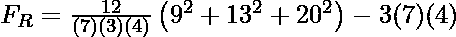
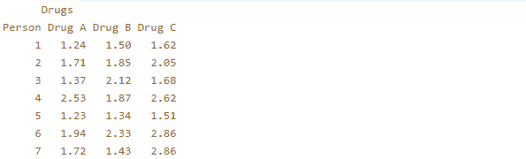
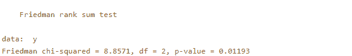

# 弗里德曼测试

> 原文:[https://www.geeksforgeeks.org/friedman-test/](https://www.geeksforgeeks.org/friedman-test/)

**弗里德曼检验:**这是一种非参数检验，替代了具有重复测量的单向方差分析。它试图确定受试者是否在不同的场合/条件下发生了显著变化。例如:-早上、下午、晚上一组人解决问题的能力相同或不同。当**因变量为序数时，用于测试组间**差异**。**当样本量很小时，该测试特别有用。

**弗里德曼试验的要素**

*   在**的**三个或更多** **区块**上测量的一组**测量超时**/实验条件**。
*   **一个因变量**，可以是序数、区间或比率。

**弗里德曼检验的假设**

*   这个群体是从人群中随机抽取的。
*   样本不是正态分布的。

**弗里德曼检验的零假设和交替假设**

**零假设:**给定的测量条件之间没有显著差异，或者所有条件的概率分布相同。(中位数相同)

**交替假设:**其中至少有 2 个相互不同。

```
H0 : M1 = M2 = M3 = ..... Mk  ; M= Median
H1 : At least two of them show significant difference.

```

**弗里德曼检验的检验统计**

<center>
</center>

```
n = total number of subjects/participants.
k = total number of blocks to be measured.
Ri = sum of ranks of all subjects for a block i

```

**弗里德曼测试的决策规则**

您可以根据以下规则做出决定-

1.  **计算值对表值:**如果 F <sub>R</sub> 大于临界值，则拒绝零假设。否则，接受零假设。
2.  **P 值法:**将 P 值与α(显著性水平)进行比较。如果 p 值小于或等于α，则拒绝零假设。

**后即席分析:**如果使用后即席分析(可以使用 Wilcoxon 符号秩检验、Conover 检验等)拒绝零假设，则可以找出任何给定的实验条件对中是否存在差异..在 Wilcoxon 测试中，您也可以获得所有配对的结果，但是您必须进行 Bonferroni 校正，将显著性级别更改为**给定的显著性级别/配对总数。**

**执行弗里德曼测试的步骤:**

让我们举一个例子来理解如何执行这个测试。

**实施例:**随机给 7 人服用 3 种不同的药物，并记录每个人与药物对应的反应时间。在 5%显著性水平上检验所有 3 种药物具有相同概率分布的说法。

<figure class="table">

|   | 药物甲 | 药物乙 | 药物 C |
| --- | --- | --- | --- |
| one | One point two four | One point five | One point six two |
| Two | One point seven one | One point eight five | Two point zero five |
| three | one point three seven | Two point one two | One point six eight |
| four | Two point five three | One point eight seven | Two point six two |
| five | One point two three | One point three four | One point five one |
| six | One point nine four | Two point three three | Two point eight six |
| seven | One point seven two | One point four three | Two point eight six |

**步骤 1:** 定义零假设和替代假设

```
H0 : All three drugs have the same probability distribution. MA = MB = MC
H1 : At least two of them differ from each other.

```

**步骤 2:** 状态α(显著性水平)

```
Alpha = 0.05

```

**步骤 3:** 计算自由度

```
DF = K-1       ; K = number of blocks to be measured.
Here , DF = 3-1 =2.

```

**第四步:**找出临界卡方值。

使用此表找出α= 0.05 和 DF = 2 的[临界卡方值](https://people.richland.edu/james/lecture/m170/tbl-chi.html)。

```
X2 = 5.991

```

**步骤 5:** 状态决策规则

您可以检查两个规则中的任何一个–

```
1) If FR is greater than 5.991 , reject the Null Hypothesis.

```

**第六步:**给每个人对应的药物赋等级，求和。

等级将按升序排列。

<figure class="table">

|   | 级别 |
| --- | --- |
|   | 药物甲 | 药物乙 | 药物 C |
| --- | --- | --- | --- |
| one | one | Two | three |
| Two | one | Two | three |
| three | one | three | Two |
| four | Two | one | three |
| five | one | Two | three |
| six | one | Two | three |
| seven | Two | one | three |
|   | **∑ = 9** | **∑ = 13** | **∑ = 20** |

**注意:**如果同一行中有 2 列或更多列具有相同的值，则分配给它们的等级是它们获得的等级的平均值。例如:如果一行有 2 列值为 x 的列，它们得到的等级是 4 和 5。那么这两列将被分配一个等级(4+5)/2，即 4.5。

**第 7 步:**计算测试统计

<center></center>

```
FR = 8.857

```

**步骤 8:** 状态结果

```
Since FR is greater than 5.991 , We reject the Null Hypothesis.

```

**步骤 9:** 状态结论

```
All the three drugs do not have the same probability distribution.

```

您可以将事后分析应用于威尔科克森测试，以了解哪些对之间有显著差异。

在这里，

```
Total number of pairs can be 3 (Drug A - Drug B , Drug B - Drug C , Drug A - Drug C).
The new level of significance to be considered for each pair will be 0.05/3 = 0.0166.

```

**使用 R** 实施弗里德曼试验

## 稀有

```
# R program to illustrate 
# Friedman Test 

#input the data
y <- matrix(c(1.24,1.50,1.62,
              1.71,1.85,2.05,
              1.37,2.12,1.68,
              2.53,1.87,2.62,
              1.23,1.34,1.51,
              1.94,2.33,2.86,
              1.72,1.43,2.86),
nrow = 7, byrow = TRUE,
dimnames = list(Person= as.character(1:7),Drugs = c("Drug A","Drug B","Drug C")))

#display the sample data
print(y)
```

**输出:**



## 稀有

```
#perform friedman test on the sample
result = friedman.test(y)
print(result)
```

**输出:**



由于 p 值小于显著性水平(5%)，因此可以得出结论，概率分布存在显著差异。

</figure>

</figure>