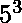
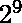
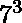

# 节俭号

> 原文:[https://www.geeksforgeeks.org/frugal-number/](https://www.geeksforgeeks.org/frugal-number/)

一个**节俭数**是一个其位数严格大于其素分解(包括指数)中位数的数。如果某个素数的指数为 1，并且包含在素数因子分解中，那么该指数对素数因子分解中的位数没有影响。
节俭数字的一些例子有:

> 1) 125 = ，这里数字中的位数是 3(1，2 和 5)，严格大于其素分解中的位数 2(5 和 3)。
> 2) 512 = ，这里数字中的位数是 3(5，1 和 2)，严格来说大于其素分解中的位数 2(2 和 9)。
> 3) 1029 = 3 × ，这里数字中的位数是 4(1，0，2 和 9)，严格大于其素分解为 3(3，7 和 3)的位数。

前几个节俭的数字是:125，128，243，256，343，512，625，729，…
这里要注意的是，素数不是节俭数，因为素数的素数因子分解中的位数等于素数中的位数(因为不考虑值 1 的指数)。
例 19 = ，但指数中的 1 对数的素分解中的位数没有贡献。因此，数字中的位数是 2(1 和 9)，这等于它的质因数分解中的位数(1 和 9)。
一个判断一个数字‘n’是否节俭的程序，包括简单的步骤。首先，我们找到所有到‘n’的素数，然后找到 n 的素因子分解，最后，我们检查 n 中的位数是否大于 n 的素因子分解中的位数

## C++

```
// Program to check for Frugal number
#include <bits/stdc++.h>
using namespace std;

// Finding primes upto entered number
vector<long long int> primes(long long int n)
{
    bool prime[n + 1];

    // Finding primes by Sieve of Eratosthenes method
    memset(prime, true, sizeof(prime));
    for (int i = 2; i * i <= n; i++) {

        // If prime[i] is not changed, then it is prime
        if (prime[i] == true) {

            // Update all multiples of p
            for (int j = i * 2; j <= n; j += i)
                prime[j] = false;
        }
    }

    // Forming array of the prime numbers found
    vector<long long int> arr;   
    for (int i = 2; i < n; i++)
        if (prime[i])
            arr.push_back(i);   

    return arr;
}

// Returns number of digits in n
int countDigits(long long int n)
{
    long long int temp = n;
    int c = 0;
    while (temp != 0) {
        temp = temp / 10;
        c++;
    }
    return c;
}

// Checking whether a number is Frugal or not
bool frugal(long long int n)
{
    vector<long long int> r = primes(n);  
    long long int t = n;
    // Finding number of digits in prime 
    // factorization of the number
    long long int s = 0;
    for (int i = 0; i < r.size(); i++) {
        if (t % r[i] == 0) {

            // Exponent for current factor
            long long int k = 0; 

            // Counting number of times this prime
            // factor divides (Finding exponent)
            while (t % r[i] == 0) {
                t = t / r[i];
                k++;
            }

            // Finding number of digits in the exponent   
            // Avoiding exponents of value 1
            if (k == 1)
                s = s + countDigits(r[i]);
            else if (k != 1)
                s = s + countDigits(r[i]) + countDigits(k);           
        }
    }

    // Checking condition for frugal number
    return (countDigits(n) > s && s != 0);
}

// Driver Method to check for frugal number
int main()
{
    long long int n = 343;
    if (frugal(n))
        cout << "A Frugal number\n";
    else
        cout << "Not a frugal number\n";
    return 0;
}
```

## Java 语言(一种计算机语言，尤用于创建网站)

```
// Program to check
// for Frugal number
import java.io.*;
import java.util.*;

class GFG
{
    // Finding primes upto
    // entered number
    static ArrayList<Long>
           primes(long n)
    {
        boolean []prime =
                new boolean[(int)n + 1];
        for(int i = 0;
                i < n + 1; i++)
            prime[i] = true;

        // Finding primes by Sieve
        // of Eratosthenes method
        for (int i = 2;
                 i * i <= n; i++)
        {

            // If prime[i] is not
            // changed, then it
            // is prime
            if (prime[i] == true)
            {
                // Update all
                // multiples of p
                for (int j = i * 2;
                         j <= n; j += i)
                    prime[j] = false;
            }
        }

        // Forming array of the
        // prime numbers found
        ArrayList<Long> arr =
                 new ArrayList<Long>();
        for (int i = 2; i < n; i++)
            if (prime[i])
                arr.add((long)i);

        return arr;
    }

    // Returns number
    // of digits in n
    static int countDigits(long n)
    {
        long temp = n;
        int c = 0;
        while (temp != 0)
        {
            temp = temp / 10;
            c++;
        }
        return c;
    }

    // Checking whether a
    // number is Frugal or not
    static boolean frugal(long n)
    {
        ArrayList<Long> r = primes(n);
        long t = n;

        // Finding number of digits
        // in prime factorization
        // of the number
        long s = 0;
        for (int i = 0;
                 i < r.size(); i++)
        {
            if (t % r.get(i) == 0)
            {

                // Exponent for
                // current factor
                long k = 0;

                // Counting number of times
                // this prime factor divides
                // (Finding exponent)
                while (t % r.get(i) == 0)
                {
                    t = t / r.get(i);
                    k++;
                }

                // Finding number of digits
                // in the exponent Avoiding
                // exponents of value 1
                if (k == 1)
                    s = s + countDigits(r.get(i));
                else if (k != 1)
                    s = s + countDigits(r.get(i)) +
                            countDigits(k);        
            }
        }

        // Checking condition
        // for frugal number
        return (countDigits(n) > s && s != 0);
    }

    // Driver Code
    public static void main(String[] args)
    {
        long n = 343;
        if (frugal(n))
            System.out.print("A Frugal number\n");
        else
            System.out.print("Not a frugal number\n");
    }
}

// This code is contributed by
// Manish Shaw(manishshaw1)
```

## 蟒蛇 3

```
# Program to check for Frugal number

# Finding primes upto entered number
def primes(n):

    # Finding primes by Sieve
    # of Eratosthenes method
    prime = [True] * (n + 1);

    i = 2;
    while (i * i <= n):

        # If prime[i] is not changed,
        # then it is prime
        if (prime[i] == True):

            # Update all multiples of p
            j = i * 2;
            while (j <= n):
                prime[j] = False;
                j += i;
        i += 1;

    # Forming array of the prime
    # numbers found
    arr = [];
    for i in range(2, n):
        if (prime[i]):
            arr.append(i);

    return arr;

# Returns number of digits in n
def countDigits(n):

    temp = n;
    c = 0;
    while (temp != 0):
        temp = int(temp / 10);
        c += 1;
    return c;

# Checking whether a number is
# Frugal or not
def frugal(n):

    r = primes(n);
    t = n;

    # Finding number of digits
    # in prime factorization
    # of the number
    s = 0;
    for i in range(len(r)):
        if (t % r[i] == 0):

            # Exponent for current factor
            k = 0;

            # Counting number of times
            # this prime factor divides
            # (Finding exponent)
            while (t % r[i] == 0):
                t = int(t / r[i]);
                k += 1;

            # Finding number of digits
            # in the exponent Avoiding
            # exponents of value 1
            if (k == 1):
                s = s + countDigits(r[i]);
            elif (k != 1):
                s = (s + countDigits(r[i]) +
                         countDigits(k));    

    # Checking condition
    # for frugal number
    return (countDigits(n) > s and s != 0);

# Driver Code
n = 343;
if (frugal(n)):
    print("A Frugal number");
else:
    print("Not a frugal number");

# This code is contributed by
# mits
```

## C#

```
// Program to check for Frugal number
using System;
using System.Collections.Generic;

class GFG
{
    // Finding primes upto
    // entered number
    static List<long> primes(long n)
    {
        bool []prime = new bool[n + 1];
        for(int i = 0; i < n + 1; i++)
            prime[i] = true;

        // Finding primes by Sieve
        // of Eratosthenes method
        for (int i = 2; i * i <= n; i++)
        {

            // If prime[i] is not
            // changed, then it is prime
            if (prime[i] == true)
            {

                // Update all multiples of p
                for (int j = i * 2;
                         j <= n; j += i)
                    prime[j] = false;
            }
        }

        // Forming array of the
        // prime numbers found
        List<long> arr = new List<long>();
        for (int i = 2; i < n; i++)
            if (prime[i])
                arr.Add(i);

        return arr;
    }

    // Returns number of digits in n
    static int countDigits(long n)
    {
        long temp = n;
        int c = 0;
        while (temp != 0)
        {
            temp = temp / 10;
            c++;
        }
        return c;
    }

    // Checking whether a number
    // is Frugal or not
    static bool frugal(long n)
    {
        List<long> r = primes(n);
        long t = n;

        // Finding number of digits in prime
        // factorization of the number
        long s = 0;
        for (int i = 0; i < r.Count; i++)
        {
            if (t % r[i] == 0)
            {

                // Exponent for current factor
                long k = 0;

                // Counting number of times
                // this prime factor divides
                // (Finding exponent)
                while (t % r[i] == 0)
                {
                    t = t / r[i];
                    k++;
                }

                // Finding number of digits
                // in the exponent Avoiding
                // exponents of value 1
                if (k == 1)
                    s = s + countDigits(r[i]);
                else if (k != 1)
                    s = s + countDigits(r[i]) +
                            countDigits(k);        
            }
        }

        // Checking condition
        // for frugal number
        return (countDigits(n) > s && s != 0);
    }

    // Driver Code
    static void Main()
    {
        long n = 343;
        if (frugal(n))
            Console.Write("A Frugal number\n");
        else
            Console.Write("Not a frugal number\n");
    }
}

// This code is contributed by
// Manish Shaw(manishshaw1)
```

## 服务器端编程语言（Professional Hypertext Preprocessor 的缩写）

```
<?php
// Program to check for Frugal number

// Finding primes upto
// entered number
function primes($n)
{
    $prime = array();

    // Finding primes by Sieve
    // of Eratosthenes method
    for($i = 0; $i < $n + 1; $i++)
        $prime[$i] = true;

    for ($i = 2; $i * $i <= $n; $i++)
    {

        // If prime[i] is not changed,
        // then it is prime
        if ($prime[$i] == true)
        {

            // Update all multiples of p
            for ($j = $i * 2;
                 $j <= $n; $j += $i)
                $prime[$j] = false;
        }
    }

    // Forming array of the
    // prime numbers found
    $arr = array();
    for ($i = 2; $i < $n; $i++)
        if ($prime[$i])
            array_push($arr, $i);

    return $arr;
}

// Returns number
// of digits in n
function countDigits($n)
{
    $temp = $n;
    $c = 0;
    while ($temp != 0)
    {
        $temp = intval($temp / 10);
        $c++;
    }
    return $c;
}

// Checking whether a
// number is Frugal or not
function frugal($n)
{
    $r = primes($n);
    $t = $n;

    // Finding number of digits
    // in prime factorization
    // of the number
    $s = 0;
    for ($i = 0; $i < count($r); $i++)
    {
        if ($t % $r[$i] == 0)
        {

            // Exponent for
            // current factor
            $k = 0;

            // Counting number of times
            // this prime factor divides
            // (Finding exponent)
            while ($t % $r[$i] == 0)
            {
                $t = intval($t / $r[$i]);
                $k++;
            }

            // Finding number of digits
            // in the exponent Avoiding
            // exponents of value 1
            if ($k == 1)
                $s = $s + countDigits($r[$i]);
            else if ($k != 1)
                $s = $s + countDigits($r[$i]) +
                          countDigits($k);        
        }
    }

    // Checking condition
    // for frugal number
    return (countDigits($n) > $s &&
                        $s != 0);
}

// Driver Code
$n = 343;
if (frugal($n))
    echo ("A Frugal number\n");
else
    echo ("Not a frugal number\n");

// This code is contributed by
// Manish Shaw(manishshaw1)
?>
```

## java 描述语言

```
<script>

// Program to check for Frugal number

// Finding primes upto entered number
function primes(n)
{
    var prime = Array(n+1).fill(true);

    // Finding primes by Sieve of Eratosthenes method
    for (var i = 2; i * i <= n; i++) {

        // If prime[i] is not changed, then it is prime
        if (prime[i] == true) {

            // Update all multiples of p
            for (var j = i * 2; j <= n; j += i)
                prime[j] = false;
        }
    }

    // Forming array of the prime numbers found
    var arr = [];   
    for (var i = 2; i < n; i++)
        if (prime[i])
            arr.push(i);   

    return arr;
}

// Returns number of digits in n
function countDigits(n)
{
    var temp = n;
    var c = 0;
    while (temp != 0) {
        temp = parseInt(temp / 10);
        c++;
    }
    return c;
}

// Checking whether a number is Frugal or not
function frugal(n)
{
    var r = primes(n);  
    var t = n;
    // Finding number of digits in prime 
    // factorization of the number
    var s = 0;
    for (var i = 0; i < r.length; i++) {
        if (t % r[i] == 0) {

            // Exponent for current factor
            var k = 0; 

            // Counting number of times this prime
            // factor divides (Finding exponent)
            while (t % r[i] == 0) {
                t = parseInt(t / r[i]);
                k++;
            }

            // Finding number of digits in the exponent   
            // Avoiding exponents of value 1
            if (k == 1)
                s = s + countDigits(r[i]);
            else if (k != 1)
                s = s + countDigits(r[i]) + countDigits(k);           
        }
    }

    // Checking condition for frugal number
    return (countDigits(n) > s && s != 0);
}

// Driver Method to check for frugal number
var n = 343;
if (frugal(n))
    document.write( "A Frugal number");
else
    document.write( "Not a frugal number");

// This code is contributed by rrrtnx.
</script>
```

**Output:** 

```
A Frugal number
```

**优化:**
上述代码可以使用[中讨论的方法进行优化打印所有质因数及其功率](https://www.geeksforgeeks.org/print-all-prime-factors-and-their-powers/)