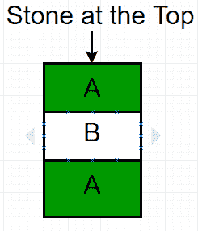

# 尼姆游戏允许移除一块石头

> 原文:[https://www . geesforgeks . org/game-nim-remove-one-stone-allied/](https://www.geeksforgeeks.org/game-nim-removal-one-stone-allowed/)

在尼姆的[游戏中，两个玩家轮流从一堆或一堆石头中移除物体。
假设两个玩家 A 和 B 在玩游戏。每人只能从堆里拿一块石头。挑选最后一块石头的玩家将赢得比赛。鉴于 **N** 堆中石头的数量，任务是找到赢家，如果玩家 A 开始游戏。
**例:**](https://www.geeksforgeeks.org/combinatorial-game-theory-set-2-game-nim/) 

```
Input : N = 3.
Output : Player A
```



```
Player A remove stone 1 which is at the top, then Player B remove stone 2 
and finally player A removes the last stone.

Input : N = 15.
Output : Player A
```

对于 N = 1，玩家 A 将从堆中移除唯一的石头并赢得游戏。
对于 N = 2，A 玩家将移除第一块石头，然后 B 玩家移除第二块或最后一块石头。所以 B 玩家会赢得比赛。
所以，我们可以观察到 N 为奇数时 A 玩家获胜，N 为偶数时 B 玩家获胜。
以下是本办法的实施情况:

## C++

```
// C++ program for Game of Nim with removal
// of one stone allowed.
#include<bits/stdc++.h>
using namespace std;

// Return true if player A wins,
// return false if player B wins.
bool findWinner(int N)
{
  // Checking the last bit of N.
  return N&1;
}

// Driven Program
int main()
{
  int N = 15;
  findWinner(N)? (cout << "Player A";):
                 (cout << "Player B";);
  return 0;
}
```

## Java 语言(一种计算机语言，尤用于创建网站)

```
// JAVA Code For Game of Nim with
// removal of one stone allowed
import java.util.*;

class GFG {

    // Return true if player A wins,
    // return false if player B wins.
    static int findWinner(int N)
    {
      // Checking the last bit of N.
      return N & 1;
    }

    /* Driver program to test above function */
    public static void main(String[] args)
    {
        int N = 15;
        if(findWinner(N)==1)
            System.out.println("Player A");
        else
             System.out.println("Player B");

    }
}

// This code is contributed by Arnav Kr. Mandal.
```

## 蟒蛇 3

```
# Python3 code for Game of Nim with
# removal of one stone allowed.

# Return true if player A wins,
# return false if player B wins.
def findWinner( N ):

    # Checking the last bit of N.
    return N & 1

# Driven Program
N = 15
print("Player A" if findWinner(N) else "Player B")

# This code is contributed by "Sharad_Bhardwaj".
```

## C#

```
// C# Code For Game of Nim with
// removal of one stone allowed
using System;

class GFG {

    // Return true if player A wins,
    // return false if player B wins.
    static int findWinner(int N)
    {
        // Checking the last bit of N.
        return N & 1;
    }

    /* Driver program to test above function */
    public static void Main()
    {
        int N = 15;

        if(findWinner(N) == 1)
            Console.Write("Player A");
        else
            Console.Write("Player B");

    }
}

// This code is contributed by vt_m.
```

## 服务器端编程语言（Professional Hypertext Preprocessor 的缩写）

```
<?php
// PHP program for Game of
// Nim with removal of one
// stone allowed.

// Return true if player A wins,
// return false if player B wins.
function findWinner($N)
{

// Checking the last bit of N.
return $N&1;
}

// Driver Code
$N = 15;

if(findWinner($N))
echo "Player A";
else
echo "Player B";

// This code is contributed by vt_m.
?>
```

## java 描述语言

```
<script>

// JavaScript program For Game of Nim with
// removal of one stone allowed

   // Return true if player A wins,
    // return false if player B wins.
    function findWinner(N)
    {

      // Checking the last bit of N.
      return N & 1;
    }

// Driver code
        let N = 15;
        if(findWinner(N)==1)
            document.write("Player A");
        else
             document.write("Player B");

         // This code is contributed by sanjoy_2.
</script>
```

**输出:**

```
Player A
```

**时间复杂度:** O(1)。
本文由 **Anuj Chauhan** 供稿。如果你喜欢 GeeksforGeeks 并想投稿，你也可以使用[contribute.geeksforgeeks.org](http://www.contribute.geeksforgeeks.org)写一篇文章或者把你的文章邮寄到 contribute@geeksforgeeks.org。看到你的文章出现在极客博客主页上，帮助其他极客。
如果发现有不正确的地方，或者想分享更多关于上述话题的信息，请写评论。