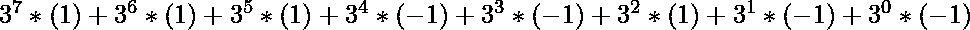
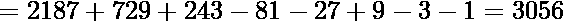
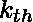
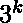

# 平衡三元数系中的博弈论|(一次移动 3k 步)

> 原文:[https://www . geesforgeks . org/game-theory-in-balanced-三元-数系-moved-3k-steps-at-time/](https://www.geeksforgeeks.org/game-theory-in-balanced-ternary-numeral-system-moving-3k-steps-at-a-time/)

就像以 0 和 1 为数字的基数为 2 的二进制数制一样，三进制数制是以 0、1 和-1 为数字的基数为 3 的数制。
最好用字母“Z”代替-1，因为表示全三进制数时-1 在 1 和 0 之间看起来是奇数。

**十进制到平衡三进制的转换:**
与二进制转换一样，首先将十进制数表示成具有 0、1、2 作为提醒的正常三进制。
现在从最低的数字开始迭代，安全地跳过任何 0 和 1，但是将 2 变成 Z，并将 1 添加到下一个数字。在相同的条件下将 3 变成 0(这种数字最初不出现在数字中，但在增加 2 后会出现。)

**示例:**

> **十进制:**128
> T3】三元:11202
> T6】平衡三元:1ZZZ1Z
> T9】十进制:1000
> T12】三元:1102101
> T15】平衡三元: 111Z101

## C++

```
// C++ implementation of the approach
#include <bits/stdc++.h>
using namespace std;

// Numbers are in range of pow(3, 32)
int arr[32];

// Conversion of ternary into balanced ternary as
// start iterating from Least Significant Bit (i.e 0th),
// if encountered 0 or 1, safely skip and pass carry 0
// further 2, replace it to -1 and pass carry 1 further
// 3, replace it to 0 and pass carry 1 further
void balTernary(int ter)
{
    int carry = 0, base = 10;
    int i = 32;
    while (ter > 0) {
        int rem = ter % base;
        rem = rem + carry;
        if (rem == 0) {
            arr[i--] = 0;
            carry = 0;
        }
        else if (rem == 1) {
            arr[i--] = 1;
            carry = 0;
        }
        else if (rem == 2) {
            arr[i--] = -1;
            carry = 1;
        }
        else if (rem == 3) {
            arr[i--] = 0;
            carry = 1;
        }
        ter = ter / base;
    }
    if (carry == 1)
        arr[i] = 1;
}

// Similar to binary conversion
int ternary(int number)
{
    int ans = 0, rem = 1, base = 1;
    while (number > 0) {
        rem = number % 3;
        ans = ans + rem * base;
        number /= 3;
        base = base * 10;
    }
    return ans;
}

// Driver code
int main()
{
    int number = 3056;

    int ter = ternary(number);
    memset(arr, 0, sizeof(arr));
    balTernary(ter);

    int i = 0;

    // Moving on to first occupied bit
    while (arr[i] == 0) {
        i++;
    }

    // Printing
    for (int j = i; j <= 32; j++) {

        // Print 'Z' in place of -1
        if (arr[j] == -1)
            cout << 'Z';
        else
            cout << arr[j];
    }

    return 0;
}
```

## Java 语言(一种计算机语言，尤用于创建网站)

```
// Java implementation of the approach
import java.util.*;

class GFG
{

// Numbers are in range of pow(3, 32)
static int []arr = new int[33];

// Conversion of ternary into balanced ternary as
// start iterating from Least Significant Bit (i.e 0th),
// if encountered 0 or 1, safely skip and pass carry 0
// further 2, replace it to -1 and pass carry 1 further
// 3, replace it to 0 and pass carry 1 further
static void balTernary(int ter)
{
    int carry = 0, base = 10;
    int i = 32;
    while (ter > 0)
    {
        int rem = ter % base;
        rem = rem + carry;
        if (rem == 0)
        {
            arr[i--] = 0;
            carry = 0;
        }
        else if (rem == 1)
        {
            arr[i--] = 1;
            carry = 0;
        }
        else if (rem == 2)
        {
            arr[i--] = -1;
            carry = 1;
        }
        else if (rem == 3)
        {
            arr[i--] = 0;
            carry = 1;
        }
        ter = (int)(ter / base);
    }
    if (carry == 1)
        arr[i] = 1;
}

// Similar to binary conversion
static int ternary(int number)
{
    int ans = 0, rem = 1, base = 1;
    while (number > 0)
    {
        rem = number % 3;
        ans = ans + rem * base;
        number = (int)(number/3);
        base = base * 10;
    }
    return ans;
}

// Driver code
public static void main(String args[])
{
    int number = 3056;

    int ter = ternary(number);
    Arrays.fill(arr,0);
    balTernary(ter);

    int i = 0;

    // Moving on to first occupied bit
    while (arr[i] == 0)
    {
        i++;
    }

    // Printing
    for (int j = i; j <= 32; j++)
    {

        // Print 'Z' in place of -1
        if (arr[j] == -1)
            System.out.print('Z');
        else
        System.out.print(arr[j]);
    }
}
}

// This code is contributed by SURENDRA_GANGWAR
```

## 蟒蛇 3

```
# Python3 implementation of the approach

# Numbers are in range of pow(3, 32)
arr = [0] * 32

# Conversion of ternary into balanced ternary as
# start iterating from Least Significant Bit (i.e 0th),
# if encountered 0 or 1, safely skip and pass carry 0
# further 2, replace it to -1 and pass carry 1 further
# 3, replace it to 0 and pass carry 1 further
def balTernary(ter):

    carry, base, i = 0, 10, 31
    while ter > 0:
        rem = (ter % base) + carry

        if rem == 0: 
            arr[i] = 0
            carry, i = 0, i-1

        elif rem == 1: 
            arr[i] = 1
            carry, i = 0, i-1

        elif rem == 2: 
            arr[i] = -1
            carry, i = 1, i-1

        elif rem == 3: 
            arr[i] = 0
            carry, i = 1, i-1

        ter = ter // base

    if carry == 1:
        arr[i] = 1

# Similar to binary conversion
def ternary(number):

    ans, rem, base = 0, 1, 1
    while number > 0:
        rem = number % 3
        ans = ans + rem * base
        number //= 3
        base = base * 10

    return ans

# Driver code
if __name__ == "__main__":

    number = 3056
    ter = ternary(number)
    balTernary(ter)

    i = 0

    # Moving on to first occupied bit
    while arr[i] == 0: 
        i += 1

    # Printing
    for j in range(i, 32): 

        # Print 'Z' in place of -1
        if arr[j] == -1:
            print('Z', end = "")
        else:
            print(arr[j], end = "")

# This code is contributed by Rituraj Jain
```

## C#

```
// C# implementation of the approach
using System;

class GFG
{

// Numbers are in range of pow(3, 32)
static int []arr = new int[33];

// Conversion of ternary into balanced ternary as
// start iterating from Least Significant Bit (i.e 0th),
// if encountered 0 or 1, safely skip and pass carry 0
// further 2, replace it to -1 and pass carry 1 further
// 3, replace it to 0 and pass carry 1 further
static void balTernary(int ter)
{
    int carry = 0, b = 10;
    int i = 32;
    while (ter > 0)
    {
        int rem = ter % b;
        rem = rem + carry;
        if (rem == 0)
        {
            arr[i--] = 0;
            carry = 0;
        }
        else if (rem == 1)
        {
            arr[i--] = 1;
            carry = 0;
        }
        else if (rem == 2)
        {
            arr[i--] = -1;
            carry = 1;
        }
        else if (rem == 3)
        {
            arr[i--] = 0;
            carry = 1;
        }
        ter = (int)(ter / b);
    }
    if (carry == 1)
        arr[i] = 1;
}

// Similar to binary conversion
static int ternary(int number)
{
    int ans = 0, rem = 1, b = 1;
    while (number > 0)
    {
        rem = number % 3;
        ans = ans + rem * b;
        number = (int)(number / 3);
        b = b * 10;
    }
    return ans;
}

// Driver code
public static void Main(String []args)
{
    int number = 3056;

    int ter = ternary(number);
    balTernary(ter);

    int i = 0;

    // Moving on to first occupied bit
    while (arr[i] == 0)
    {
        i++;
    }

    // Printing
    for (int j = i; j <= 32; j++)
    {

        // Print 'Z' in place of -1
        if (arr[j] == -1)
            Console.Write('Z');
        else
            Console.Write(arr[j]);
    }
}
}

// This code is contributed by Rajput-Ji
```

## java 描述语言

```
<script>

// Javascript implementation of the approach

// Numbers are in range of pow(3, 32)
let arr = new Array(33);

// Conversion of ternary into balanced ternary as
// start iterating from Least Significant Bit (i.e 0th),
// if encountered 0 or 1, safely skip and pass carry 0
// further 2, replace it to -1 and pass carry 1 further
// 3, replace it to 0 and pass carry 1 further
function balTernary(ter)
{
    let carry = 0, base = 10;
    let i = 32;
    while (ter > 0)
    {
        let rem = ter % base;
        rem = rem + carry;
        if (rem == 0)
        {
            arr[i--] = 0;
            carry = 0;
        }
        else if (rem == 1)
        {
            arr[i--] = 1;
            carry = 0;
        }
        else if (rem == 2)
        {
            arr[i--] = -1;
            carry = 1;
        }
        else if (rem == 3)
        {
            arr[i--] = 0;
            carry = 1;
        }
        ter = Math.floor(ter / base);
    }
    if (carry == 1)
        arr[i] = 1;
}

// Similar to binary conversion   
function ternary(number)
{
    let ans = 0, rem = 1, base = 1;
    while (number > 0)
    {
        rem = number % 3;
        ans = ans + rem * base;
        number = Math.floor(number/3);
        base = base * 10;
    }
    return ans;
}

// Driver code
let number = 3056;

    let ter = ternary(number);
    for(let i=0;i<arr.length;i++)
    {
        arr[i]=0;
    }
    balTernary(ter);

    let i = 0;

    // Moving on to first occupied bit
    while (arr[i] == 0)
    {
        i++;
    }

    // Printing
    for (let j = i; j <= 32; j++)
    {

        // Print 'Z' in place of -1
        if (arr[j] == -1)
            document.write('Z');
        else
            document.write(arr[j]);
    }

// This code is contributed by patel2127
</script>
```

**Output:** 

```
111ZZ1ZZ
```

**从平衡的三进制数中恢复原始的十进制数:-**
程序:-类似于二进制到十进制的转换
示例:- 111ZZ1ZZ



**游戏规则:**
允许两个机器人从 0 开始在 x 轴上步进移动。
它们可以从 0 开始走几步，但它们的移动有一些限制。
在步机器人将移动精确的距离单位。
在每一步中，机器人必须选择向左(x 坐标减小)或向右(x 坐标增大)两个方向中的一个，在特定的一步中，只有一个机器人会移动，另一个会等待。
不允许跳过任何一步。

**陈述:**
给定两个整数 x1 和 x2。机器人 1 和 2 分别需要覆盖它们各自的距离 x1 和 x2。有可能吗？？
如果有可能你赢了，否则你就输了。

**方法:**
每个十进制数(这里的距离)只有一个平衡的三进制表示，这意味着只有一种方法来覆盖满足上述规则的特定距离。
因此，如果有可能覆盖距离 x1 和 x2，使得当一个机器人移动时，另一个机器人保持静止，并且两个机器人不能同时保持静止，那么这就是一场胜利。

**逻辑:**
首先使用上述程序将 x1 和 x2 表示为平衡的三进制数。
从 LSB 开始迭代检查:-
一次(步骤)只能有一个值为 1 或 z。
两者不能同时为 0(步骤)。
如果规则在任何一步被打破，那就是你输了，否则你就赢了。

**示例:**

> **输入:** x1 = 6890，x2 = 18252
> **输出:**
> 平衡三元表示 x1 = 01001101ZZ
> 平衡三元表示 x2 = 10Z1001000
> 胜利
> 
> **输入:** x1 = 18，x2 = 45
> **输出:**
> 平衡三元表示 x1 = 01Z00
> 平衡三元表示 x2 = 1ZZ00
> 击败

对两个数组进行逐位迭代，并在规则中断的地方中断。
首先通过在最短数组的开头加上 0，使两个数组的长度相等，这样长度就相同了。

下面是上述方法的实现:

## C++

```
// C++ implementation of the approach
#include <bits/stdc++.h>
using namespace std;

// Function that returns true
// if the game cannot be won
bool isDefeat(string s1, string s2, int n)
{
    for (int i = 0; i < n; i++) {
        if ((s1[i] == '0' && s2[i] == '1')
            || (s1[i] == '1' && s2[i] == '0'))
            continue;
        else if ((s1[i] == '0' && s2[i] == 'Z')
                 || (s1[i] == 'Z' && s2[i] == '0'))
            continue;
        else {
            return true;
        }
    }
    return false;
}

// Driver code
int main()
{
    string s1 = { "01001101ZZ" };
    string s2 = { "10Z1001000" };

    // Common length
    int n = 10;

    if (isDefeat(s1, s2, n))
        cout << "Defeat";
    else
        cout << "Victory";

    return 0;
}
```

## Java 语言(一种计算机语言，尤用于创建网站)

```
// Java implementation of the approach
class GfG
{

// Function that returns true
// if the game cannot be won
static boolean isDefeat(String s1, String s2, int n)
{
    for (int i = 0; i < n; i++)
    {
        if ((s1.charAt(i) == '0' && s2.charAt(i) == '1')
            || (s1.charAt(i) == '1' && s2.charAt(i) == '0'))
            continue;
        else if ((s1.charAt(i) == '0' && s2.charAt(i) == 'Z')
                || (s1.charAt(i) == 'Z' && s2.charAt(i) == '0'))
            continue;
        else
        {
            return true;
        }
    }
    return false;
}

// Driver code
public static void main(String[] args)
{
    String s1 = ("01001101ZZ" );
    String s2 = ("10Z1001000" );

    // Common length
    int n = 10;

    if (isDefeat(s1, s2, n))
        System.out.println("Defeat");
    else
        System.out.println("Victory");

}
}

// This code is contributed by Code_Mech
```

## 蟒蛇 3

```
# Python3 implementation of the approach

# Function that returns true
# if the game cannot be won
def isDefeat(s1, s2, n):

    for i in range(n):
        if ((s1[i] == '0' and s2[i] == '1') or
            (s1[i] == '1' and s2[i] == '0')):
            continue
        elif ((s1[i] == '0' and s2[i] == 'Z') or
              (s1[i] == 'Z' and s2[i] == '0')):
            continue
        else:
            return True

    return False

# Driver code
s1 = "01001101ZZ"
s2 = "10Z1001000"

# Common length
n = 10

if (isDefeat(s1, s2, n)):
    print("Defeat")
else:
    print("Victory")

# This code is contributed by mohit kumar
```

## C#

```
// C# implementation of the approach
using System;

class GfG
{

// Function that returns true
// if the game cannot be won
static bool isDefeat(string s1, string s2, int n)
{
    for (int i = 0; i < n; i++)
    {
        if ((s1[i] == '0' && s2[i] == '1')
            || (s1[i] == '1' && s2[i] == '0'))
            continue;
        else if ((s1[i] == '0' && s2[i] == 'Z')
                || (s1[i] == 'Z' && s2[i]== '0'))
            continue;
        else
        {
            return true;
        }
    }
    return false;
}

// Driver code
public static void Main()
{
    string s1 = ("01001101ZZ" );
    string s2 = ("10Z1001000" );

    // Common length
    int n = 10;

    if (isDefeat(s1, s2, n))
        Console.WriteLine("Defeat");
    else
        Console.WriteLine("Victory");

}
}

// This code is contributed by Code_Mech
```

## 服务器端编程语言（Professional Hypertext Preprocessor 的缩写）

```
<?php
// PHP implementation of the approach
// Function that returns true
// if the game cannot be won
function isDefeat($s1, $s2, $n)
{
    for ($i = 0; $i < $n; $i++)
    {
        if( ($s1[$i] == '0' && $s2[$i] == '1')
            || ($s1[$i] == '1' && $s2[$i] == '0'))
            continue;
        else if (($s1[$i] == '0' && $s2[$i] == 'Z')
                || ($s1[$i] == 'Z' && $s2[$i] == '0'))
            continue;
        else
        {
            return true;
        }
    }
    return false;
}

// Driver code
    $s1 = ("01001101ZZ" );
    $s2 = ("10Z1001000" );

    // Common length
    $n = 10;

    if (isDefeat($s1, $s2, $n))
        echo("Defeat");
    else
        echo("Victory");

// This code is contributed by Code_Mech
```

## java 描述语言

```
<script>

// Javascript implementation of the approach

// Function that returns true
// if the game cannot be won
function isDefeat(s1, s2, n)
{
    for(let i = 0; i < n; i++)
    {
        if ((s1[i] == '0' && s2[i] == '1') ||
            (s1[i] == '1' && s2[i] == '0'))
            continue;
        else if ((s1[i] == '0' && s2[i] == 'Z') ||
                 (s1[i] == 'Z' && s2[i]== '0'))
            continue;
        else
        {
            return true;
        }
    }
    return false;
}

// Driver Code
let s1 = ("01001101ZZ");
let s2 = ("10Z1001000");

// Common length
let n = 10;

if (isDefeat(s1, s2, n))
    document.write("Defeat");
else
    document.write("Victory");

// This code is contributed by code_hunt

</script>
```

**Output:** 

```
Victory
```