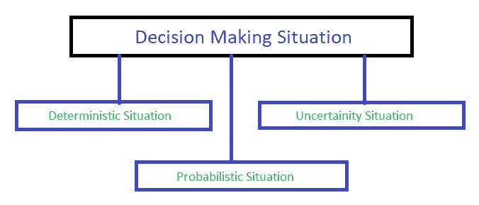
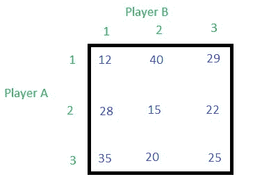
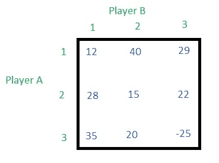

# 博弈论(范式游戏)|第一集(简介)

> 原文:[https://www . geesforgeks . org/game-theory-normal-form-game-set-1-introduction/](https://www.geeksforgeeks.org/game-theory-normal-form-game-set-1-introduction/)

[博弈论](https://en.wikipedia.org/wiki/Game_theory)是用于决策的数学模型。它应用于社会科学的所有领域，以及逻辑和计算机科学。博弈论在逻辑和计算机科学中发挥着越来越重要的作用。要完全定义，游戏必须指定以下元素:游戏的玩家，每个玩家在每个决策点可用的信息和动作，以及每个结果的回报。大多数合作博弈都是以特征函数的形式出现的，而非合作博弈则是用泛形式和正规形式来定义的。

在博弈论中，[范式](https://en.wikipedia.org/wiki/Normal-form_game)或者也叫战略形态，是对一个游戏的描述。正常(或战略形式)的游戏通常由显示玩家、战略和收益的矩阵来表示。当一个游戏以正常形式呈现时，假设每个玩家同时行动，或者至少不知道另一个玩家的行动。

**决策情况**
一般来说，决策情况可以分为三个不同的类别，如下图所示:

**博弈论基本术语**

1.  **玩家**:一般一局有两个玩家。比如玩家 A 和玩家 B，或者公司 A 和公司 B。
2.  **Strategies** : Strategy means it is a course of action taken by a player, for example, a company will have different strategies to increase the volumes of sales. Generally, in-game theory there are two strategies, the first one **pure strategy**, and the second one **mixed strategy**. If a company selects only one particular strategy leaving the remaining strategy then it is said as **pure strategy**, but the sum of these probabilities is always equal to 1 (see example below). If the player follows more than one strategies, then the player is said to follow mixed strategy, and where the probability of selection of a particular or individual strategy is always less than one so that the sum of all the probabilities will be equal to 1 (see example below).

    **例:**假设有三个策略 **S1、S2、S3** 。

    > **纯策略**:当玩家选择一个策略时，比如说 S2，那么 S2 的概率就变成 1，剩下两个策略的概率就变成 0。因此总概率的和是 0 + 1 + 0 = 1。
    > 
    > **混合策略**:玩家选择两个策略的时候，假设 S1 和 S3，他们的概率分别给定为 0.62 和 0.38，策略 S2 的概率为 0。因此总概率的和是 0.62 + 0 + 0.38 = 1。

3.  **支付矩阵**:支付矩阵示例如下。有两个玩家，玩家 A 和玩家 B，各有三个策略，分别是 1、2 和 3。矩阵中的内部值是不同组合的结果。如果玩家 A 选择第三策略，玩家 B 选择第一策略，那么结果将是 35，如果玩家 A 选择第二策略，玩家 B 也选择第二策略，那么结果将是 15。
    
    如果结果是正的，那么对 A 玩家来说是一个增益，对 B 玩家来说是一个损失，如果结果是负的，那么对 A 玩家来说是一个损失，对 B 玩家来说是一个增益，考虑下面的支付矩阵，如果结果是-25，那么 A 玩家输 25 分，而 B 玩家赢 25 分。
    
4.  **马希民原理**:最大化最小保证增益。
5.  **极小极大原则**:最大限度减少损失。
6.  **鞍点**:如果**马希民**值与**极小极大**值**相等**即交点相等，则游戏会有鞍点。当游戏中没有鞍点时，游戏就被称为混合策略。
7.  **游戏的价值**:如果游戏有鞍点，那么鞍点单元格中的胜负就叫做游戏的价值。
8.  **二人零和游戏**:在有两个玩家的游戏中，如果一个玩家的收益等于另一个玩家的损失，那么这个游戏就叫做二人零和游戏。为了更好的理解，请看上面的支付矩阵，如果游戏的结果是 40，那么对玩家 A 是收益，但对玩家 B 是损失，如果结果是-25，那么对玩家 A 是损失，但对玩家 B 是收益