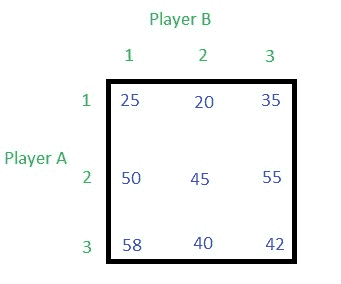
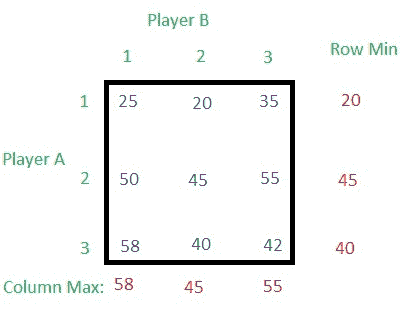
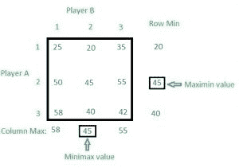
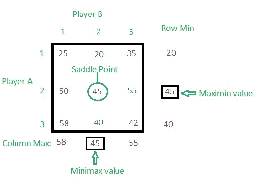

# 博弈论(范式游戏)|第二集(纯策略游戏)

> 原文:[https://www . geesforgeks . org/game-theory-normal-form-game-set-2-纯策略游戏/](https://www.geeksforgeeks.org/game-theory-normal-form-game-set-2-game-with-pure-strategy/)

[博弈论(范式游戏)|第一集(简介)](https://www.geeksforgeeks.org/game-theory-normal-form-game-set-1-introduction/)

请在继续之前通读以上文章。

给定一个收益矩阵。任务是找到玩家的最佳策略。

**解决方案:**
玩家 A 有 3 个策略——1、2、3，玩家 B 也有 3 个策略——1、2、3。

*   **第 1 步:**求每行的行最小值和每列的列最大值。
    
    20、45、40 分别是第一、二、三排的最小值。58、45 和 55 分别是第一、第二和第三列中的最大值。
*   **Step 2:** Find maximum of the row minimum (Row Min) values and minimum of the column maximum (Column Max) values.
    
    The maximum of Row Min value is called **maximin** value and the minimum of Column Max value is called **minimax**.

    这里的马希民值等于极小极大值，所以这个游戏在对应于第 2 行和第 2 列的单元格中有一个鞍点(见下图)。
    

    因此，游戏(V)的数值为 **45** 。每个策略中两个参与者的最优概率，

    > A [P1、P2、P3] = A [0、1、0]
    > B [Q1、Q2、Q3] = B [0、1、0]

    其中，
    **P1****P2**和 **P3** 分别是玩家 **A** 的策略**1****2**和 **3** 的概率。
    **Q1****Q2**和 **Q3** 分别为玩家**B**T30】的策略**1****2**和 **3** 的概率，两个玩家的总概率为 **1** 。