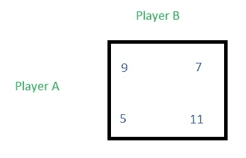
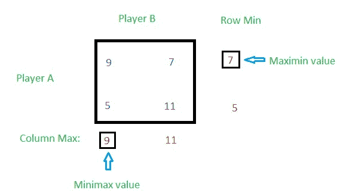
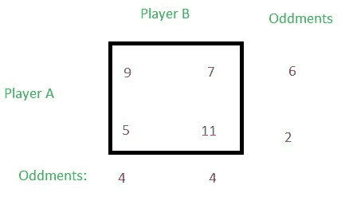
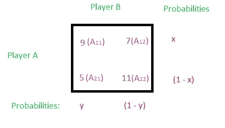
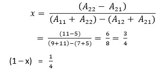
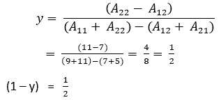
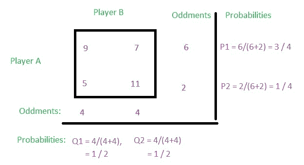
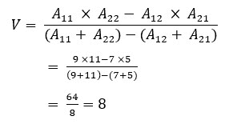

# 博弈论(范式游戏)|第三集(混合策略游戏)

> 原文:[https://www . geesforgeks . org/game-theory-normal-form-game-set-3-混合策略游戏/](https://www.geeksforgeeks.org/game-theory-normal-form-game-set-3-game-with-mixed-strategy/)

考虑以下关于玩家 A 的收益矩阵，并对其进行优化求解。

**解决方案:**
如果一个游戏没有鞍点，那么这个游戏就说是混合策略。

*   **第一步:**找出行最小值和列最大值。
    T3】
*   **第二步:**找出极小极大和马希民值。
    
    由于这款游戏的 minimax 和马希民值不相等，所以这款游戏没有鞍点。
*   **第三步:**现在取 2×2 矩阵，找出行和列的奇数。
    
    **odds:**取第一排最高结局和最小结局的差值放在第二排右侧(见上图)，即 9 和 7 的差值为 2，放在第二排右侧。同样，取第二行最高和最低结果的差，放在第一行的右边，即 11 和 5 的差是 6，放在第一行的右边。类似地，也可以为列查找杂物。取一个列的较大结果和较小结果之间的差值，并将其放在另一列的底部。11–7 = 4 位于第一列的底部，而 9–5 = 4 位于第二列的底部。
*   **Step 4:** Now find the probabilities for each row.
    *Using Formula*
    
    Let x and (1 – x) be the probabilities of selection of strategies of player A, and y and (1 – y) be the probabilities of selection of strategies of player B, then
    
    And,
    

    *不使用公式*
    
    **计算概率:**对应的零头/行或列零头之和，即
    对于 P1，行 1 的零头值为 6，两行零头值之和为 8，所以 P1 = 6/(6+2) = 3/4
    对于 P2，行 2 的零头值为 2，两行零头值之和为 8，所以 P2 = 2/(6+2) = 1/4
    对于 第 1 列的 odd 值为 4，两列的 odd 值之和为 8，因此 Q1 = 4/(4+4) = 1/2
    对于 Q2，第 2 列的 odd 值为 4，两列的 odd 值之和为 8，因此 Q2 = 4/(4+4) = 1/2

*   **第五步:**找到游戏的价值。
    *使用公式*
    
    *不使用公式*
    有 4 种方法可以找到游戏的价值。
    取第一列。现在将第一列的元素与相应的行零头相乘，然后将两次相乘相加，再除以行的总零头。
    V =(9 * 6+5 * 2)/(6+2)=(54+10)/8 = 64/8 = 8。
    **OR、**
    取第二列。现在将第二列的元素与相应的行奇数相乘，然后将两次相乘相加，然后除以行的总奇数。
    V =(7 * 6+11 * 2)/(6+2)=(42+22)/8 = 64/8 = 8。
    **OR、**
    拿第一排。现在将第一行的元素与相应的列奇数相乘，然后将两次相乘相加，再除以列的总奇数。
    V =(9 * 4+7 * 4)/(4+4)=(36+28)/8 = 64/8 = 8。
    **OR，**
    取第二排。现在将第二行的元素与相应的列奇数相乘，然后将两次相乘相加，再除以列的总奇数。
    V =(5 * 4+11 * 4)/(4+4)=(20+44)/8 = 64/8 = 8。
*   **第六步:**因此，玩家 A 的策略为(3/4，1/4)，玩家 B 的策略为(1/2，1/2)，游戏的价值为 V = 8。你可以看到每个玩家选择每个策略的概率小于 1，但是每个玩家的总概率是 1。玩家 A 的总概率为 3/4 + 1/4 = 1，玩家 B 的总概率为 1/2 + 1/2 = 1。