# 博弈论(范式博弈)|集合 4(优势属性-纯策略)

> 原文:[https://www . geesforgeks . org/game-theory-normal-form-game-set-4-支配-property-pure-strategy/](https://www.geeksforgeeks.org/game-theory-normal-form-game-set-4-dominance-property-pure-strategy/)

在一些游戏中，可以通过消除分别由其他行(或列)支配的行(或列)来减小支付矩阵的大小。

**行的优势属性:** X ≤ Y，即如果特定行 **X** 的所有元素小于或等于另一行 **Y** 的相应元素，则删除行 **X** (行 **X** 由行 **Y** 主导)。特定行 **X** 的元素也可以与其他两行或更多行的平均值进行比较，如果行 **X** 的元素在取平均值后小于或等于相应的元素，则删除行 **X** 。

**列的支配属性:** X ≥ Y，即如果某一列 **X** 的所有元素都大于或等于另一列 **Y** 的相应元素，则删除列 **X** (列 **X** 由列 **Y** 支配)。第 **X** 列的元素也可以与两列或更多列的平均值进行比较，如果取平均值后第 **X** 列的元素大于相应的元素，则删除第 **X** 列。

考虑以下游戏:

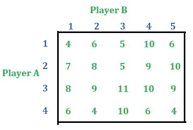

**解:**
**纯策略:**以上游戏由[纯策略](https://www.geeksforgeeks.org/game-theory-normal-form-game-set-2-game-with-pure-strategy/)解将，
–游戏的值(V)= 8
–A【P1、P2、P3、P4】= A【0、0、1、0】
–B【Q1、Q2、Q3、Q4、Q5】= B【1、0、0、0、0】
其中，
P1、P2、P3、P4 为概率 Q4 和 Q5 分别是 B 玩家的策略 1、2、3、4 和 5 的概率
对于两个玩家，总概率为 1。

**优势属性:**同样使用优势属性也会得到同样的结果。
–取每行的总数，从中选择最少的一行。

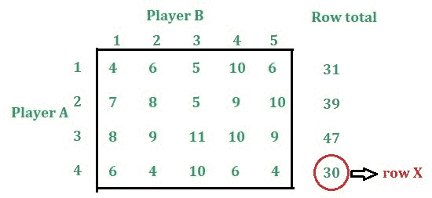

–使用行的优势属性，行 4 的元素小于行 3 的元素，即行 4 由行 3 主导。删除第 4 行。

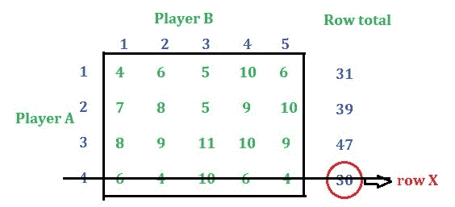

–在剩余的“行总数”中选择最小的值，并应用优势属性。

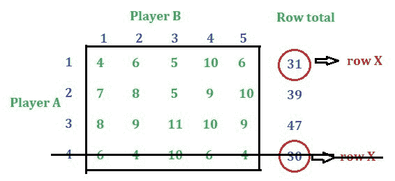

–使用优势属性，第 1 行由第 3 行主导。删除第 1 行。

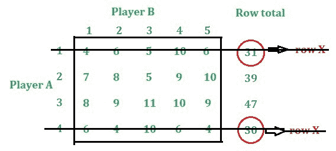

–在剩余值中选择最小的值，即 39 是最小的，同时应用优势属性，可以看出行优势的条件不满足。现在，对列应用优势属性。

–取每一列的总和(仅从剩余的行中)并从中选择最大的一列。

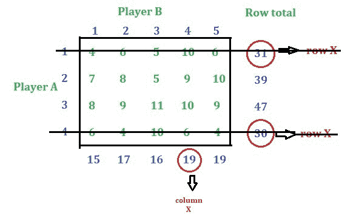

–使用列的优势属性，列 4 由列 1 主导。删除第 4 栏。

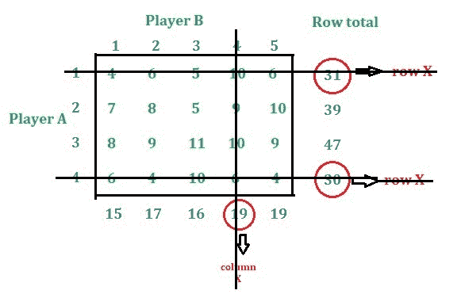

–从剩余的列值中选择最大的值。

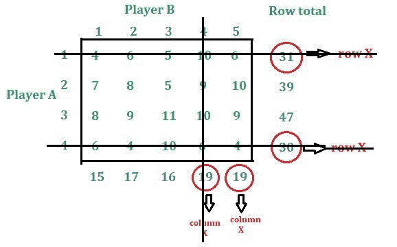

–使用列的优势属性，列 5 由列 1 主导。删除第 5 栏。

–从剩余的列值中选择最大的值。

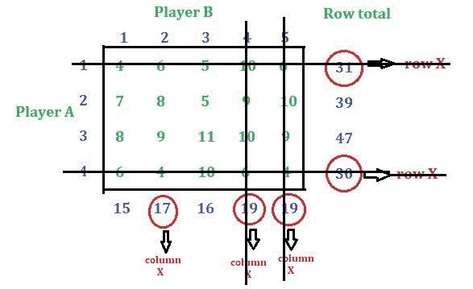

–使用列的优势属性，列 2 由列 1 主导。删除该列。

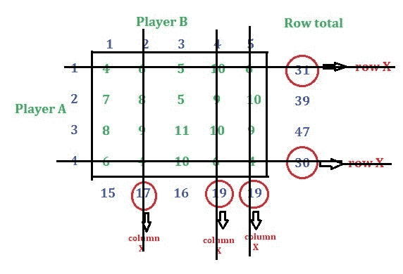

–再次选择最大值(即 16)。现在，在应用支配属性时，将找不到支配。现在，再次减少行数。

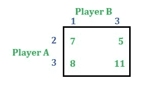

–找出行总数，并从中选择最少的行。

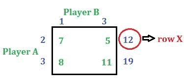

–使用行的优势属性，行 2 由行 3 主导。删除第 2 行。

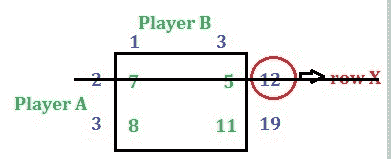

–现在只有一行(不需要找到列总数)，剩下两列。对列应用优势属性。

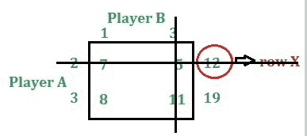

–只剩下一个价值，那就是游戏的价值。

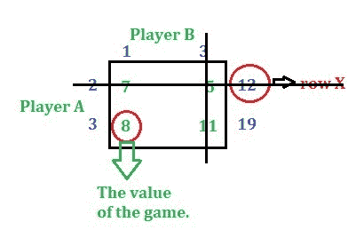

所以我们有，
–游戏的价值(V)= 8
–A【P1、P2、P3、P4】= A【0、0、1、0】
–B【Q1、Q2、Q3、Q4、Q5】= B【1、0、0、0、0】
其中，
P1、P2、P3、P4 分别是玩家 A 的策略 1、2、3、4 的概率。
Q1、Q2、Q3、Q4、Q5 是策略 1、2、3 的概率