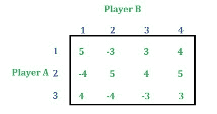
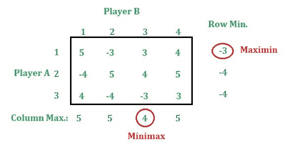
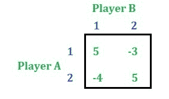

# 博弈论(范式博弈)|第五集(优势属性-混合策略)

> 原文:[https://www . geesforgeks . org/game-theory-normal-form-game-set-5-支配-property-mixed-strategy/](https://www.geeksforgeeks.org/game-theory-normal-form-game-set-5-dominance-property-mixed-strategy/)

本文讨论了如何利用混合策略的优势性质来求解一个博弈。考虑下面的游戏:

**求解:**找出行最小值和列最大值。

这里 Minimax 值不等于马希民所以这个游戏没有鞍点。现在继续使用优势属性来减少行和列。
减少游戏的行列在[这篇](https://www.geeksforgeeks.org/game-theory-normal-form-game-set-4-dominance-property-pure-strategy/)文章中有说明。因此，在减少行和列之后，将剩下下面的游戏。

**注:**我们还可以将特定行 **X** 的元素与其他两行或更多行的平均值进行比较，如果取平均值后行 **X** 的元素小于或等于相应的元素，则删除行 **X** **或**我们还可以将特定列 **X** 的元素与两列或更多列的平均值进行比较 如果取平均值后 **X** 列的元素大于相应的元素，则删除 **X** 列。
现在使用[混合策略](https://www.geeksforgeeks.org/game-theory-normal-form-game-set-3-game-with-mixed-strategy/)求解此游戏，我们得到，
–游戏价值= 0.76
–玩家 A 的概率= [9/17，8/17，0]
–玩家 B 的概率= [8/17，9/17，0]