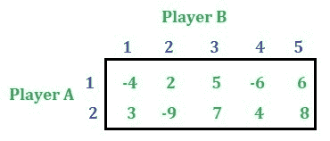
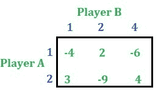
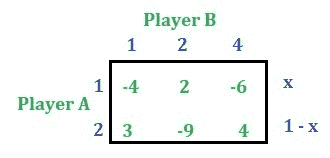
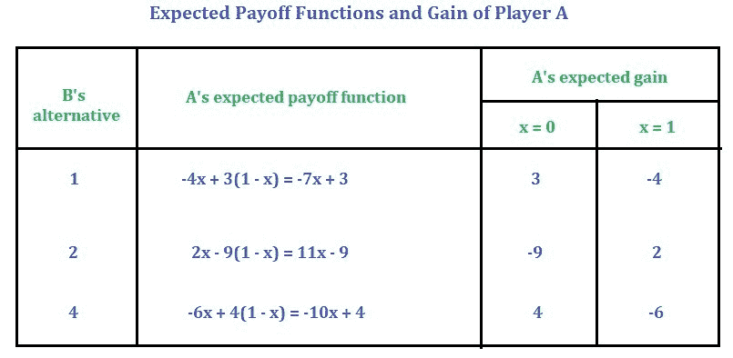
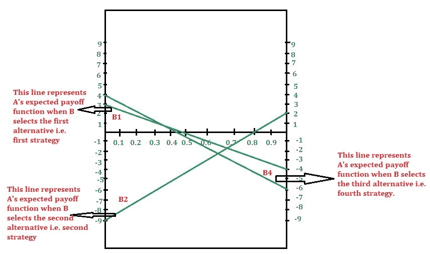
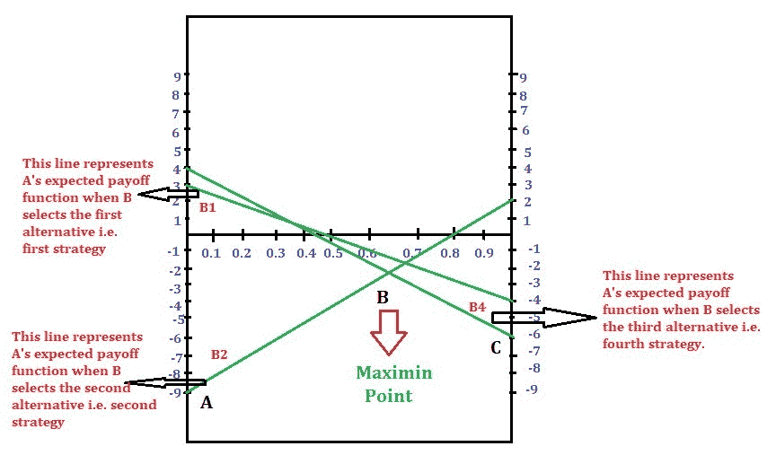
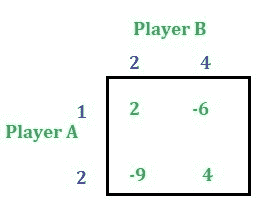

# 博弈论(范式游戏)|第六集(图解法[2 X N]游戏)

> 原文:[https://www . geesforgeks . org/game-theory-normal-form-game-set-6-graphic-method-2-x-n-game/](https://www.geeksforgeeks.org/game-theory-normal-form-game-set-6-graphical-method-2-x-n-game/)

一个 **2 * N** 游戏的支付矩阵由 **2 行**和 **N 列**组成。本文将讨论如何用图解法求解一个 **2 * N** 游戏。
考虑以下 2 * 5 游戏:

**解决方法:**首先检查游戏的鞍点。这个游戏没有鞍点。

**步骤 1:** 通过应用[优势属性](https://www.geeksforgeeks.org/game-theory-normal-form-game-set-4-dominance-property-pure-strategy/)来缩小支付矩阵的大小(如果存在的话)。这一步不是强制性的。尺寸被缩小只是为了简化问题。游戏可以在不缩小尺寸的情况下解决。
在借助优势属性减少了上面的游戏之后，我们得到了下面的游戏。

**第二步:**设 **x** 为玩家 A 选择备选方案 1 的概率，**(1–x)**为玩家 A 选择备选方案 2 的概率。

推导出玩家 A 相对于玩家 B 的每个备选方案的预期增益函数，为此只需将 B 的备选方案的列值与其对应的玩家 A 选择备选方案的概率相乘即可，例如， 玩家 B 的第一个选择是列号 1，所以将 **-4** 乘以 **x** ， **3** 乘以**(1–x)**再相加，那么得到的表达式就是 A 的期望收益函数。 同样，玩家 B 的第二个选择是 2 号栏，所以将 **2** 乘以 **x** ， **-9** 乘以**(1–x)**相加。同样，玩家 B 的第三个选择是列号 4，所以将 **-6** 乘以 **x** ， **4** 乘以**(1–x)**相加。请参考下表。

**第三步:**求 **x = 0** 和 **x = 1** 时的增益值。见下表:

**第 4 步:**现在假设合适的比例，在图上绘制增益函数。【x 轴保持 x，y 轴保持增益】
如果 **B** 选择第一种选择，即第一种策略，当 **x = 0** A 的预期增益为 **3** 时，当 **x = 1** A 的预期增益为 **-4** 时。
如果 **B** 选择第二种选择，即第二种策略，当 **x = 0 时** A 的预期增益为 **-9** ，当 **x = 1 时** A 的预期增益为 **2** 。
如果 **B** 选择第三种方案即第四种策略，当 **x = 0 时** A 的预期增益为 **4** ，当 **x = 1 时** A 的预期增益为 **-6** 。
利用以上信息绘制图表。

**第五步:**在图的下边界找到最高交点–>**最大点**作为 A 是**马希民选手**。
下边界为 ABC。A、B、C 中最高点为 B，这个交点 B 称为**马希民点**。

**第六步:**如果通过马希民点的线路只有两条，形成 2 * 2 的支付矩阵，然后按照本文求解博弈。
如果不是，请找出通过该点的两条斜率相反的直线。形成一个 2 * 2 的支付矩阵，然后求解。这一点将在下一篇文章中讨论。
由于我们有两条线通过这一点，使用 B1 和 B2 替代方案的支付矩阵是:

现在使用本文中讨论的方法求解游戏。

玩家 A 的概率= [13/21，8/21]
玩家 B 的概率= [0，10/21，0，11/21，0]
游戏的数值为-46/21