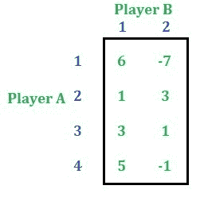
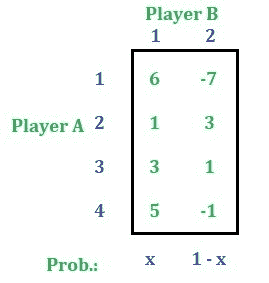
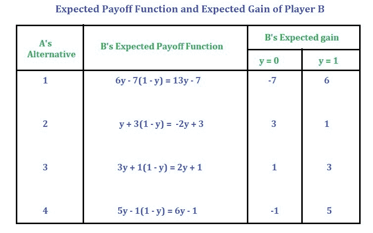
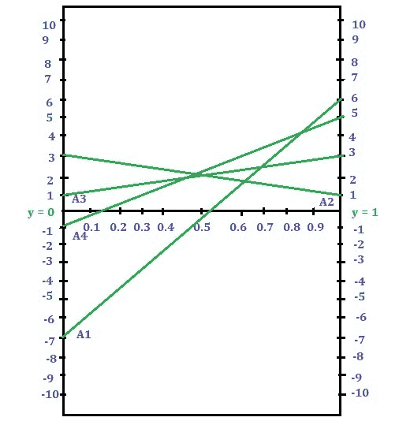
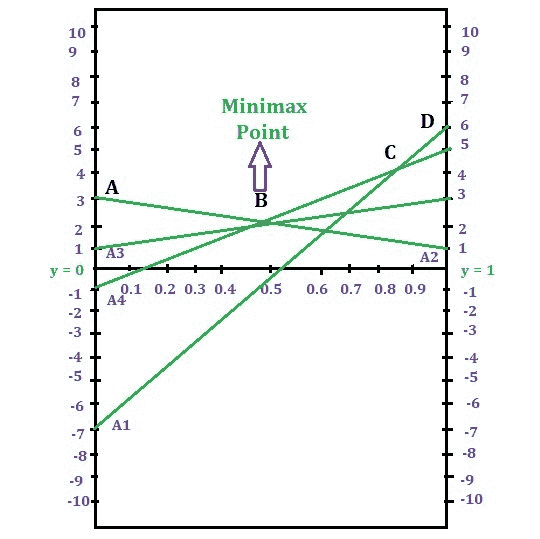
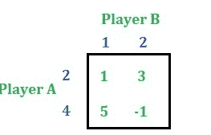

# 博弈论(范式游戏)|第七集(图解法[M×2]游戏)

> 原文:[https://www . geesforgeks . org/game-theory-normal-form-game-set-7-graphic-method-m-x-2-game/](https://www.geeksforgeeks.org/game-theory-normal-form-game-set-7-graphical-method-m-x-2-game/)

一个 **M * 2** 游戏的支付矩阵由 **M** 行和两列组成。本文将讨论如何用图解法解决一个 **M * 2** 游戏。此外，本文还将讨论如果图中有两条以上的线与同一点相交，那么如何形成 **2 * 2** 支付矩阵。
考虑以下问题:

**解决方法:**首先检查问题是否有鞍点。这个游戏没有鞍点。

**第一步:**通过应用[优势属性](https://www.geeksforgeeks.org/game-theory-normal-form-game-set-4-dominance-property-pure-strategy/)缩小玩家 A 的支付矩阵的大小，如果存在的话。尺寸被缩小只是为了简化问题。游戏可以在不缩小尺寸的情况下解决。
在这个问题中，支配地位属性不适用。我们不能比这更简化这个矩阵了。所以，我们继续下面的游戏。

**第二步:**设 **y** 为玩家 B 选择备选方案 1 的概率，**(1–y)**为玩家 B 选择备选方案 2 的概率。

推导出玩家 B 相对于玩家 a 每个备选方案的预期增益函数，见下表。
同时找到 **y = 0** 和 **y = 1** 时的增益值。见下表

**步骤 3:** 通过假设合适的比例，在图表上绘制增益函数。保持 **y** 在 X 轴，增益在 Y 轴。

**第三步:**求图的上边界的最低交点–>极小极大点。
ABCD 是给定图形中的上边界。有四个交叉点，其中 B 是最低的交叉点。所以这个点叫做极大极小点。

由于有两条以上的线通过最低交点，我们将识别任何两条斜率相反的线通过该点。然后形成 **2 * 2** 的支付矩阵。
A4、A3、A2 是通过 b 点的三条线，所以这三条线中，A2、A3 的斜率相反，A2、A4 的斜率相反。我们可以选择两对线中的任何一对。这里我们选择 A2 和 A4。那么收益矩阵将是

现在按照本文求解上述游戏。
解完游戏我们得到，
玩家 A 的策略概率= [0，3/4，0，1/4]
玩家 B 的策略概率= [1/2，1/2]
游戏的数值为 2