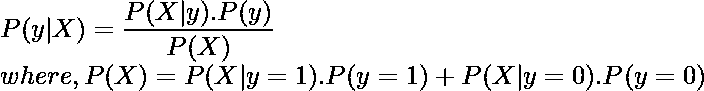
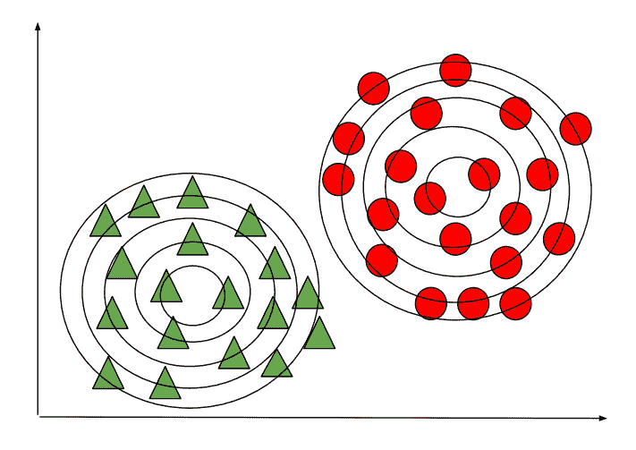
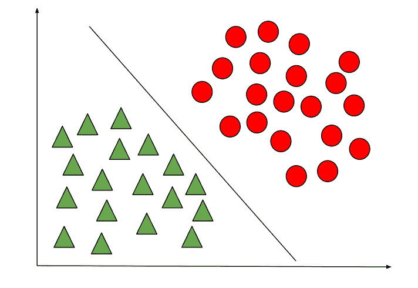
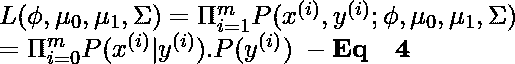
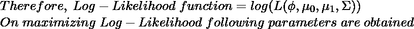

# 高斯判别分析

> 原文:[https://www . geesforgeks . org/Gaussian-判别分析/](https://www.geeksforgeeks.org/gaussian-discriminant-analysis/)

机器学习中有两种用于分类的监督学习算法。

1.  判别学习算法
2.  生成学习算法

判别学习算法包括逻辑回归、感知器算法等。其试图在学习过程中找到不同类之间的**决策边界**。例如，给定一个分类问题来预测患者是否患有疟疾，判别学习算法将尝试创建一个分类边界来区分两种类型的患者，当引入一个新的示例时，将检查该示例位于边界的哪一侧来对其进行分类。这种算法试图对 **P(y|X)** 建模，即给定一个数据样本的特征集 X，它属于“y”类的概率是多少。

另一方面，生成学习算法遵循不同的方法，它们试图分别捕获每个类的分布，而不是在类之间找到决策边界。考虑到前面的例子，生成学习算法将分别查看感染患者和健康患者的分布，并尝试分别学习每个分布的特征，当引入新的例子时，它将与两个分布进行比较，数据例子最相似的类将被分配给它。这样的算法试图为给定的 **P(y)** 建模 **P(X|y)** 这里，P(y)被称为之前的**类。**

生成学习算法的预测使用[贝叶斯定理](https://www.geeksforgeeks.org/bayess-theorem-for-conditional-probability/)进行，如下所示:

仅使用特定类别的 P(X|y)和 P(y)的值，我们可以计算 P(y|X)，即给定数据样本的特征，它属于类别“y”的概率是多少。

**高斯判别分析**是一种生成学习算法，为了捕捉每个类的分布，它试图将**高斯分布**分别拟合到数据的每个类。下图描述了区分学习算法和生成学习算法之间的区别。在生成学习算法的情况下，如果预测位于对应于其类别的轮廓的中心附近，则预测的概率将很高，并且随着我们远离轮廓的中心而降低。

生成学习算法

判别学习算法

让我们考虑一个**二进制分类**问题，使得所有的数据样本都是 IID(独立同分布)，因此为了计算 **P(X|y)** ，我们可以使用**多元高斯分布**来形成每个单独类别的概率密度函数。为了计算每个类的 **P(y)** 或类先验，我们可以使用**伯努利分布**，因为二进制分类中的所有数据样本可以取值 1 或 0。

因此，可以分别使用高斯分布和伯努利分布的一般形式来定义数据样本之前的概率分布和类别:

 [Tex]\\在空间{ 1 毫米}上面的空间{ 1 毫米}公式中:\ \ \ mu _ 0 \空间{ 1 毫米}是空间{ 1 毫米}的平均空间{ 1 毫米}数据\ hs 空间{ 1 毫米}样本\ hs 空间{ 1 毫米}对应于空间{ 1 毫米}数据\ hs 空间{ 1 毫米}的 class\hspace{1mm}0\hspace{1mm}of\hspace{1mm}dimensions\hspace{1mm}\r^{n*1}\\\mu_1\hspace{1mm}is\hspace{1mm}the\hspace{1mm}mean\hspace{1mm}\ new line \ hs space { 1mm } \ phi \ hs space { 1mm }是\ hs space { 1mm }的概率\ hspace { 1mm } a \ hspace { 1mm }数据\ hs space { 1mm }样本\ hs space { 1mm }属于\ hs space { 1mm }类\ hs space { 1mm } y \ new line[/Tex]

为了将概率分布视为上述参数的函数，我们可以定义一个**似然函数**，它等于每个数据样本之前的概率分布和类别的乘积(取概率的乘积是合理的，因为所有数据样本都被认为是 IID)。

根据最大似然估计原理，我们必须以最大化**方程 4** 中给出的概率函数的方式选择参数值。这样做，而不是最大化似然函数，我们可以最大化**对数似然函数**，这是一个严格的递增函数。

在上面的等式中，函数**“1 {条件}”**是**指示器函数**，如果条件为真，则返回 1，否则返回 0。例如，1{y=1}仅在该数据样本的类为 1 时返回 1，否则返回 0 类似地，在 1{y=0}的情况下，仅在该数据样本的类为 0 时返回 1，否则返回 0。

获得的参数值可以插入方程 **1、2** 和 **3** 中，以找到所有数据样本之前的概率分布和类别。获得的这些值可以进一步相乘，得到等式 **4** 中给出的似然函数。如前所述，似然函数，即 P(X|y)。可以将 P(y)插入贝叶斯公式中来预测 P(y|X)(即预测给定特征的数据样本的类别'**y**'**X**')。

> **注:**该模型中的数据样本被认为是 IID，这是对模型的一个假设，如果数据不是高斯分布，高斯判别分析将表现不佳，因此，总是建议可视化数据，以检查它是否具有正态分布，如果没有，可以尝试使用对数变换等方法来这样做。(不要将高斯判别分析与高斯混合模型混淆，后者是一种无监督的学习算法)。

因此，高斯判别分析对少量数据(比如几千个例子)非常有效，如果我们对数据分布的基本假设是正确的，那么与逻辑回归相比，高斯判别分析可以更加稳健

参考:[T1】http://cs229.stanford.edu/notes2020spring/cs229-notes2.pdfT3】](http://cs229.stanford.edu/notes2020spring/cs229-notes2.pdf)