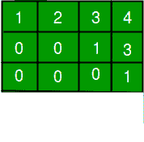
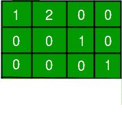
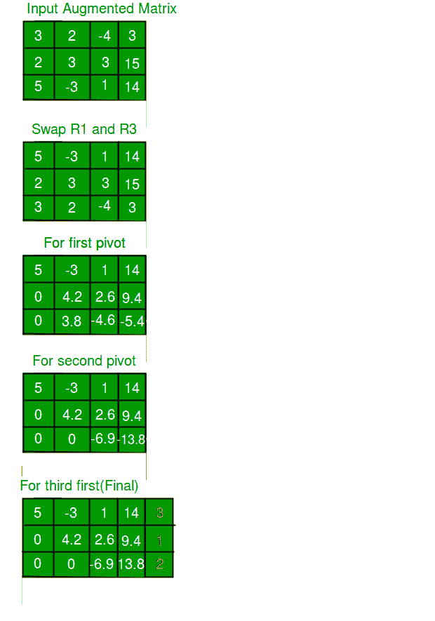

# 高斯消元求解线性方程组

> 原文:[https://www.geeksforgeeks.org/gaussian-elimination/](https://www.geeksforgeeks.org/gaussian-elimination/)

这篇文章着重于使用一种算法来求解一个线性方程组。我们将处理系数矩阵。高斯消去法不适用于奇异矩阵(它们导致被零除)。

```
Input: For N unknowns, input is an augmented 
       matrix of size N x (N+1). One extra 
       column is for Right Hand Side (RHS)
  mat[N][N+1] = {{3.0, 2.0,-4.0, 3.0},
                {2.0, 3.0, 3.0, 15.0},
                {5.0, -3, 1.0, 14.0}
               };
Output: Solution to equations is:
        3.000000
        1.000000
        2.000000

Explanation:
Given matrix represents following equations
3.0X1 + 2.0X2 - 4.0X3 =  3.0
2.0X1 + 3.0X2 + 3.0X3 = 15.0
5.0X1 - 3.0X2 +    X3 = 14.0

There is a unique solution for given equations, 
solutions is, X1 = 3.0, X2 = 1.0, X3 = 2.0, 
```



**排梯队形式:**如果满足以下条件，则称矩阵处于紧急状态:

1.  每行的第一个非零元素，称为前导系数，是 1。
2.  每个前导系数位于前一行前导系数右侧的一列中。
3.  全零行位于至少有一个非零元素的行下方。



**减少行梯队形式:**如果下列条件成立，矩阵被认为是在皇家空军

1.  射频的所有条件。
2.  每行中的前导系数是其列中唯一的非零条目。

该算法主要是对矩阵的行执行一系列操作。在执行这些操作时，我们希望记住的是，我们希望将矩阵转换为行梯次形式的上三角矩阵。操作可以是:

1.  交换两行
2.  将一行乘以非零标量
3.  向一行添加另一行的倍数

流程:

1.  **向前淘汰:**缩减为排梯队形式。<u>用它可以知道是没有解，还是唯一解，还是无穷多个解。</u>
2.  **回换人:**进一步缩减为缩减排梯队形式。

**算法:**

1.  部分旋转:通过交换行找到第 k 个旋转，将绝对值最大的条目移动到旋转位置。这赋予了算法计算稳定性。
2.  对于枢轴下面的每一行，计算使第 k 个条目为零的因子 f，对于该行中的每个元素，减去第 k 行中相应元素的 fth 倍数。
3.  对每个未知重复上述步骤。我们会剩下一个部分的 r.e.f .矩阵。

下面是上述算法的实现。

## C++

```
// C++ program to demonstrate working of Guassian Elimination
// method
#include<bits/stdc++.h>
using namespace std;

#define N 3        // Number of unknowns

// function to reduce matrix to r.e.f.  Returns a value to
// indicate whether matrix is singular or not
int forwardElim(double mat[N][N+1]);

// function to calculate the values of the unknowns
void backSub(double mat[N][N+1]);

// function to get matrix content
void gaussianElimination(double mat[N][N+1])
{
    /* reduction into r.e.f. */
    int singular_flag = forwardElim(mat);

    /* if matrix is singular */
    if (singular_flag != -1)
    {
        printf("Singular Matrix.\n");

        /* if the RHS of equation corresponding to
           zero row  is 0, * system has infinitely
           many solutions, else inconsistent*/
        if (mat[singular_flag][N])
            printf("Inconsistent System.");
        else
            printf("May have infinitely many "
                   "solutions.");

        return;
    }

    /* get solution to system and print it using
       backward substitution */
    backSub(mat);
}

// function for elementary operation of swapping two rows
void swap_row(double mat[N][N+1], int i, int j)
{
    //printf("Swapped rows %d and %d\n", i, j);

    for (int k=0; k<=N; k++)
    {
        double temp = mat[i][k];
        mat[i][k] = mat[j][k];
        mat[j][k] = temp;
    }
}

// function to print matrix content at any stage
void print(double mat[N][N+1])
{
    for (int i=0; i<N; i++, printf("\n"))
        for (int j=0; j<=N; j++)
            printf("%lf ", mat[i][j]);

    printf("\n");
}

// function to reduce matrix to r.e.f.
int forwardElim(double mat[N][N+1])
{
    for (int k=0; k<N; k++)
    {
        // Initialize maximum value and index for pivot
        int i_max = k;
        int v_max = mat[i_max][k];

        /* find greater amplitude for pivot if any */
        for (int i = k+1; i < N; i++)
            if (abs(mat[i][k]) > v_max)
                v_max = mat[i][k], i_max = i;

        /* if a prinicipal diagonal element  is zero,
         * it denotes that matrix is singular, and
         * will lead to a division-by-zero later. */
        if (!mat[k][i_max])
            return k; // Matrix is singular

        /* Swap the greatest value row with current row */
        if (i_max != k)
            swap_row(mat, k, i_max);

        for (int i=k+1; i<N; i++)
        {
            /* factor f to set current row kth element to 0,
             * and subsequently remaining kth column to 0 */
            double f = mat[i][k]/mat[k][k];

            /* subtract fth multiple of corresponding kth
               row element*/
            for (int j=k+1; j<=N; j++)
                mat[i][j] -= mat[k][j]*f;

            /* filling lower triangular matrix with zeros*/
            mat[i][k] = 0;
        }

        //print(mat);        //for matrix state
    }
    //print(mat);            //for matrix state
    return -1;
}

// function to calculate the values of the unknowns
void backSub(double mat[N][N+1])
{
    double x[N];  // An array to store solution

    /* Start calculating from last equation up to the
       first */
    for (int i = N-1; i >= 0; i--)
    {
        /* start with the RHS of the equation */
        x[i] = mat[i][N];

        /* Initialize j to i+1 since matrix is upper
           triangular*/
        for (int j=i+1; j<N; j++)
        {
            /* subtract all the lhs values
             * except the coefficient of the variable
             * whose value is being calculated */
            x[i] -= mat[i][j]*x[j];
        }

        /* divide the RHS by the coefficient of the
           unknown being calculated */
        x[i] = x[i]/mat[i][i];
    }

    printf("\nSolution for the system:\n");
    for (int i=0; i<N; i++)
        printf("%lf\n", x[i]);
}

// Driver program
int main()
{
    /* input matrix */
    double mat[N][N+1] = {{3.0, 2.0,-4.0, 3.0},
                          {2.0, 3.0, 3.0, 15.0},
                          {5.0, -3, 1.0, 14.0}
                         };

    gaussianElimination(mat);

    return 0;
}
```

## Java 语言(一种计算机语言，尤用于创建网站)

```
// Java program to demonstrate working of Guassian Elimination
// method
import java.io.*;
class GFG
{

  public static int N = 3; // Number of unknowns

  // function to get matrix content
  static void gaussianElimination(double mat[][])
  {

    /* reduction into r.e.f. */
    int singular_flag = forwardElim(mat);

    /* if matrix is singular */
    if (singular_flag != -1)
    {
      System.out.println("Singular Matrix.");

      /* if the RHS of equation corresponding to
               zero row  is 0, * system has infinitely
               many solutions, else inconsistent*/
      if (mat[singular_flag][N] != 0)
        System.out.print("Inconsistent System.");
      else
        System.out.print(
        "May have infinitely many solutions.");

      return;
    }

    /* get solution to system and print it using
           backward substitution */
    backSub(mat);
  }

  // function for elementary operation of swapping two
  // rows
  static void swap_row(double mat[][], int i, int j)
  {
    // printf("Swapped rows %d and %d\n", i, j);

    for (int k = 0; k <= N; k++)
    {
      double temp = mat[i][k];
      mat[i][k] = mat[j][k];
      mat[j][k] = temp;
    }
  }

  // function to print matrix content at any stage
  static void print(double mat[][])
  {
    for (int i = 0; i < N; i++, System.out.println())
      for (int j = 0; j <= N; j++)
        System.out.print(mat[i][j]);
    System.out.println();
  }

  // function to reduce matrix to r.e.f.
  static int forwardElim(double mat[][])
  {
    for (int k = 0; k < N; k++)
    {

      // Initialize maximum value and index for pivot
      int i_max = k;
      int v_max = (int)mat[i_max][k];

      /* find greater amplitude for pivot if any */
      for (int i = k + 1; i < N; i++)
        if (Math.abs(mat[i][k]) > v_max)
        {
          v_max = (int)mat[i][k];
          i_max = i;
        }

      /* if a prinicipal diagonal element  is zero,
             * it denotes that matrix is singular, and
             * will lead to a division-by-zero later. */
      if (mat[k][i_max] == 0)
        return k; // Matrix is singular

      /* Swap the greatest value row with current row
             */
      if (i_max != k)
        swap_row(mat, k, i_max);

      for (int i = k + 1; i < N; i++)
      {

        /* factor f to set current row kth element
                 * to 0, and subsequently remaining kth
                 * column to 0 */
        double f = mat[i][k] / mat[k][k];

        /* subtract fth multiple of corresponding
                   kth row element*/
        for (int j = k + 1; j <= N; j++)
          mat[i][j] -= mat[k][j] * f;

        /* filling lower triangular matrix with
                 * zeros*/
        mat[i][k] = 0;
      }

      // print(mat);        //for matrix state
    }

    // print(mat);            //for matrix state
    return -1;
  }

  // function to calculate the values of the unknowns
  static void backSub(double mat[][])
  {
    double x[]
      = new double[N]; // An array to store solution

    /* Start calculating from last equation up to the
           first */
    for (int i = N - 1; i >= 0; i--)
    {

      /* start with the RHS of the equation */
      x[i] = mat[i][N];

      /* Initialize j to i+1 since matrix is upper
               triangular*/
      for (int j = i + 1; j < N; j++)
      {

        /* subtract all the lhs values
                 * except the coefficient of the variable
                 * whose value is being calculated */
        x[i] -= mat[i][j] * x[j];
      }

      /* divide the RHS by the coefficient of the
               unknown being calculated */
      x[i] = x[i] / mat[i][i];
    }

    System.out.println();
    System.out.println("Solution for the system:");
    for (int i = 0; i < N; i++)
    {
      System.out.format("%.6f", x[i]);
      System.out.println();
    }
  }

  // Driver program
  public static void main(String[] args)
  {

    /* input matrix */
    double mat[][] = { { 3.0, 2.0, -4.0, 3.0 },
                      { 2.0, 3.0, 3.0, 15.0 },
                      { 5.0, -3, 1.0, 14.0 } };

    gaussianElimination(mat);
  }
}

// This code is contributed by Dharanendra L V.
```

## 服务器端编程语言（Professional Hypertext Preprocessor 的缩写）

```
<?php
// PHP program to demonstrate working
// of Guassian Elimination method

$N = 3; // Number of unknowns

// function to get matrix content
function gaussianElimination($mat)
{
    global $N;

    /* reduction into r.e.f. */
    $singular_flag = forwardElim($mat);

    /* if matrix is singular */
    if ($singular_flag != -1)
    {
        print("Singular Matrix.\n");

        /* if the RHS of equation corresponding to
        zero row is 0, * system has infinitely
        many solutions, else inconsistent*/
        if ($mat[$singular_flag][$N])
            print("Inconsistent System.");
        else
            print("May have infinitely many solutions.");

        return;
    }

    /* get solution to system and print it using
    backward substitution */
    backSub($mat);
}

// function for elementary operation
// of swapping two rows
function swap_row(&$mat, $i, $j)
{
    global $N;
    //printf("Swapped rows %d and %d\n", i, j);

    for ($k = 0; $k <= $N; $k++)
    {
        $temp = $mat[$i][$k];
        $mat[$i][$k] = $mat[$j][$k];
        $mat[$j][$k] = $temp;
    }
}

// function to print matrix content at any stage
function print1($mat)
{
    global $N;
    for ($i=0; $i<$N; $i++, print("\n"))
        for ($j=0; $j<=$N; $j++)
            print($mat[$i][$j]);

    print("\n");
}

// function to reduce matrix to r.e.f.
function forwardElim(&$mat)
{
    global $N;
    for ($k=0; $k<$N; $k++)
    {
        // Initialize maximum value and index for pivot
        $i_max = $k;
        $v_max = $mat[$i_max][$k];

        /* find greater amplitude for pivot if any */
        for ($i = $k+1; $i < $N; $i++)
            if (abs($mat[$i][$k]) > $v_max)
                {
                    $v_max = $mat[$i][$k];
                    $i_max = $i;
                }

        /* if a prinicipal diagonal element is zero,
        * it denotes that matrix is singular, and
        * will lead to a division-by-zero later. */
        if (!$mat[$k][$i_max])
            return $k; // Matrix is singular

        /* Swap the greatest value row with current row */
        if ($i_max != $k)
            swap_row($mat, $k, $i_max);

        for ($i = $k + 1; $i < $N; $i++)
        {
            /* factor f to set current row kth element to 0,
            * and subsequently remaining kth column to 0 */
            $f = $mat[$i][$k]/$mat[$k][$k];

            /* subtract fth multiple of corresponding kth
            row element*/
            for ($j = $k + 1; $j <= $N; $j++)
                $mat[$i][$j] -= $mat[$k][$j] * $f;

            /* filling lower triangular matrix with zeros*/
            $mat[$i][$k] = 0;
        }

        //print(mat); //for matrix state
    }
    //print(mat);     //for matrix state
    return -1;
}

// function to calculate the values of the unknowns
function backSub(&$mat)
{
    global $N;
    $x = array_fill(0, $N, 0); // An array to store solution

    /* Start calculating from last equation up to the
    first */
    for ($i = $N - 1; $i >= 0; $i--)
    {
        /* start with the RHS of the equation */
        $x[$i] = $mat[$i][$N];

        /* Initialize j to i+1 since matrix is upper
        triangular*/
        for ($j = $i + 1; $j < $N; $j++)
        {
            /* subtract all the lhs values
            * except the coefficient of the variable
            * whose value is being calculated */
            $x[$i] -= $mat[$i][$j] * $x[$j];
        }

        /* divide the RHS by the coefficient of the
        unknown being calculated */
        $x[$i] = $x[$i] / $mat[$i][$i];
    }

    print("\nSolution for the system:\n");
    for ($i = 0; $i < $N; $i++)
        print(number_format(strval($x[$i]), 6)."\n");
}

// Driver program

    /* input matrix */
    $mat = array(array(3.0, 2.0,-4.0, 3.0),
                        array(2.0, 3.0, 3.0, 15.0),
                        array(5.0, -3, 1.0, 14.0));

    gaussianElimination($mat);

// This code is contributed by mits
?>
```

## C#

```
// C# program to demonstrate working
// of Guassian Elimination method
using System;

class GFG{

// Number of unknowns
public static int N = 3;

// Function to get matrix content
static void gaussianElimination(double [,]mat)
{

    /* reduction into r.e.f. */
    int singular_flag = forwardElim(mat);

    /* if matrix is singular */
    if (singular_flag != -1)
    {
        Console.WriteLine("Singular Matrix.");

        /* if the RHS of equation corresponding to
           zero row  is 0, * system has infinitely
           many solutions, else inconsistent*/
        if (mat[singular_flag,N] != 0)
            Console.Write("Inconsistent System.");
        else
            Console.Write("May have infinitely " +
                          "many solutions.");

        return;
    }

    /* get solution to system and print it using
    backward substitution */
    backSub(mat);
}

// Function for elementary operation of swapping two
// rows
static void swap_row(double [,]mat, int i, int j)
{

    // printf("Swapped rows %d and %d\n", i, j);

    for(int k = 0; k <= N; k++)
    {
        double temp = mat[i, k];
        mat[i, k] = mat[j, k];
        mat[j, k] = temp;
    }
}

// Function to print matrix content at any stage
static void print(double [,]mat)
{
    for(int i = 0; i < N; i++, Console.WriteLine())
        for(int j = 0; j <= N; j++)
            Console.Write(mat[i, j]);

    Console.WriteLine();
}

// Function to reduce matrix to r.e.f.
static int forwardElim(double [,]mat)
{
    for(int k = 0; k < N; k++)
    {

        // Initialize maximum value and index for pivot
        int i_max = k;
        int v_max = (int)mat[i_max, k];

        /* find greater amplitude for pivot if any */
        for(int i = k + 1; i < N; i++)
        {
            if (Math.Abs(mat[i, k]) > v_max)
            {
                v_max = (int)mat[i, k];
                i_max = i;
            }

            /* If a prinicipal diagonal element  is zero,
            *  it denotes that matrix is singular, and
            *  will lead to a division-by-zero later. */
            if (mat[k, i_max] == 0)
                return k; // Matrix is singular

            /* Swap the greatest value row with
               current row
            */
            if (i_max != k)
                swap_row(mat, k, i_max);

            for(int i = k + 1; i < N; i++)
            {

                /* factor f to set current row kth element
                *  to 0, and subsequently remaining kth
                *  column to 0 */
                double f = mat[i, k] / mat[k, k];

                /* subtract fth multiple of corresponding
                   kth row element*/
                for(int j = k + 1; j <= N; j++)
                    mat[i, j] -= mat[k, j] * f;

                /* filling lower triangular matrix with
                *  zeros*/
                mat[i, k] = 0;
            }
        }
        // print(mat);        //for matrix state
    }

    // print(mat);            //for matrix state
    return -1;
}

// Function to calculate the values of the unknowns
static void backSub(double [,]mat)
{

    // An array to store solution
    double []x = new double[N];

    /* Start calculating from last equation up to the
       first */
    for(int i = N - 1; i >= 0; i--)
    {

        /* start with the RHS of the equation */
        x[i] = mat[i,N];

        /* Initialize j to i+1 since matrix is upper
        triangular*/
        for(int j = i + 1; j < N; j++)
        {

            /* subtract all the lhs values
             * except the coefficient of the variable
             * whose value is being calculated */
            x[i] -= mat[i,j] * x[j];
        }

        /* divide the RHS by the coefficient of the
        unknown being calculated */
        x[i] = x[i] / mat[i,i];
    }

    Console.WriteLine();
    Console.WriteLine("Solution for the system:");
    for(int i = 0; i < N; i++)
    {
        Console.Write("{0:F6}", x[i]);
        Console.WriteLine();
    }
}

// Driver code
public static void Main(String[] args)
{

    /* input matrix */
    double [,]mat = { { 3.0, 2.0, -4.0, 3.0 },
                      { 2.0, 3.0, 3.0, 15.0 },
                      { 5.0, -3, 1.0, 14.0 } };

    gaussianElimination(mat);
}
}

// This code is contributed by shikhasingrajput
```

**输出:**

```
Solution for the system:
3.000000
1.000000
2.000000
```

**插图:**



**时间复杂度:**因为对于每个枢轴，我们在它下面的每一行遍历它右边的部分，O(n)*(O(n)* O(n))= O(n)<sup>3</sup>。
我们也可以应用高斯消去法来计算:

1.  矩阵的秩
2.  矩阵的行列式
3.  可逆方阵的逆

本文由 **Yash Varyani** 供稿。如果你发现任何不正确的地方，或者你想分享更多关于上面讨论的话题的信息，请写评论。