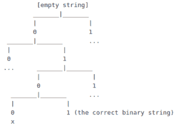

# 生成所有长度为 n 的二进制字符串，子字符串“01”恰好出现两次

> 原文:[https://www . geesforgeks . org/generate-all-binary-length-n-with-sub-string-01-出现-恰好两次/](https://www.geeksforgeeks.org/generate-all-binary-strings-of-length-n-with-sub-string-01-appearing-exactly-twice/)

给定一个整数 **N** ，任务是生成长度为 **N** 的所有可能的二进制字符串，其中包含**“01”**作为子字符串正好两次。

**示例:**

> **输入:** N = 4
> **输出:**
> 0101
> “0101”是长度为 4
> 的唯一二进制字符串，其中包含的“01”正好是子字符串的两倍。
> 
> **输入:**N = 5
> T3】输出:T5】00101
> 01001
> 01010
> 01011
> 01101
> 10101

**方法:**这个问题可以使用[回溯](https://www.geeksforgeeks.org/backtracking-algorithms/)解决。为了生成二进制字符串，我们实现一个函数，一次生成每个位，更新二进制字符串的状态(当前长度，模式出现的次数)。然后递归调用函数，根据二进制字符串的当前状态，函数将决定如何生成下一位或打印出二进制字符串(如果满足问题的要求)。

对于这个问题，回溯策略看起来像是我们生成了一个二叉树，每个节点可以有值 **0** 或者 **1** 。
比如 **N = 4** ，树看起来会像:



下面是上述方法的实现:

## C++

```
// C++ implementation of the approach
#include <iostream>
#include <stdlib.h>
using namespace std;

// Utility function to print the given binary string
void printBinStr(int* str, int len)
{
    for (int i = 0; i < len; i++) {
        cout << str[i];
    }
    cout << endl;
}

// This function will be called recursively
// to generate the next bit for given
// binary string according to its current state
void generateBinStr(int* str, int len, int currlen,
                    int occur, int nextbit)
{

    // Base-case: if the generated binary string
    // meets the required length and the pattern "01"
    // appears twice
    if (currlen == len) {

        // nextbit needs to be  0 because each time
        // we call the function recursively,
        // we call 2 times for 2 cases:
        // next bit is 0 or 1
        // The is to assure that the binary
        // string is printed one time only
        if (occur == 2 && nextbit == 0)
            printBinStr(str, len);
        return;
    }

    // Generate the next bit for str
    // and call recursive
    if (currlen == 0) {

        // Assign first bit
        str[0] = nextbit;

        // The next generated bit will wither be 0 or 1
        generateBinStr(str, len, currlen + 1, occur, 0);
        generateBinStr(str, len, currlen + 1, occur, 1);
    }
    else {

        // If pattern "01" occurrence is < 2
        if (occur < 2) {

            // Set next bit
            str[currlen] = nextbit;

            // If pattern "01" appears then
            // increase the occurrence of pattern
            if (str[currlen - 1] == 0 && nextbit == 1) {
                occur += 1;
            }
            generateBinStr(str, len, currlen + 1, occur, 0);
            generateBinStr(str, len, currlen + 1, occur, 1);

            // Else pattern "01" occurrence equals 2
        }
        else {

            // If previous bit is 0 then next bit cannot be 1
            if (str[currlen - 1] == 0 && nextbit == 1) {
                return;

                // Otherwise
            }
            else {
                str[currlen] = nextbit;
                generateBinStr(str, len, currlen + 1, occur, 0);
                generateBinStr(str, len, currlen + 1, occur, 1);
            }
        }
    }
}

// Driver code
int main()
{

    int n = 5;

    // Length of the resulting strings
    // must be at least 4
    if (n < 4)
        cout << -1;
    else {
        int* str = new int[n];

        // Generate all binary strings of length n
        // with sub-string "01" appearing twice
        generateBinStr(str, n, 0, 0, 0);
        generateBinStr(str, n, 0, 0, 1);
    }

    return 0;
}
```

## Java 语言(一种计算机语言，尤用于创建网站)

```
// Java implementation of the above approach
class GFG
{

    // Utility function to print the given binary string
    static void printBinStr(int[] str, int len)
    {
        for (int i = 0; i < len; i++)
        {
            System.out.print(str[i]);
        }
        System.out.println();
    }

    // This function will be called recursively
    // to generate the next bit for given
    // binary string according to its current state
    static void generateBinStr(int[] str, int len, int currlen,
                                    int occur, int nextbit)
    {

        // Base-case: if the generated binary string
        // meets the required length and the pattern "01"
        // appears twice
        if (currlen == len)
        {

            // nextbit needs to be 0 because each time
            // we call the function recursively,
            // we call 2 times for 2 cases:
            // next bit is 0 or 1
            // The is to assure that the binary
            // string is printed one time only
            if (occur == 2 && nextbit == 0)
            {
                printBinStr(str, len);
            }
            return;
        }

        // Generate the next bit for str
        // and call recursive
        if (currlen == 0)
        {

            // Assign first bit
            str[0] = nextbit;

            // The next generated bit will wither be 0 or 1
            generateBinStr(str, len, currlen + 1, occur, 0);
            generateBinStr(str, len, currlen + 1, occur, 1);
        } else // If pattern "01" occurrence is < 2
        if (occur < 2)
        {

            // Set next bit
            str[currlen] = nextbit;

            // If pattern "01" appears then
            // increase the occurrence of pattern
            if (str[currlen - 1] == 0 && nextbit == 1)
            {
                occur += 1;
            }
            generateBinStr(str, len, currlen + 1, occur, 0);
            generateBinStr(str, len, currlen + 1, occur, 1);

            // Else pattern "01" occurrence equals 2
        } else // If previous bit is 0 then next bit cannot be 1
        if (str[currlen - 1] == 0 && nextbit == 1)
        {
            return;

            // Otherwise
        }
        else
        {
            str[currlen] = nextbit;
            generateBinStr(str, len, currlen + 1, occur, 0);
            generateBinStr(str, len, currlen + 1, occur, 1);
        }
    }

    // Driver code
    public static void main(String[] args)
    {
        int n = 5;

        // Length of the resulting strings
        // must be at least 4
        if (n < 4)
        {
            System.out.print(-1);
        }
        else
        {
            int[] str = new int[n];

            // Generate all binary strings of length n
            // with sub-string "01" appearing twice
            generateBinStr(str, n, 0, 0, 0);
            generateBinStr(str, n, 0, 0, 1);
        }
    }
}

// This code has been contributed by 29AjayKumar
```

## 蟒蛇 3

```
# Python3 implementation of the approach

# Utility function to print the
# given binary string
def printBinStr(string, length):

    for i in range(0, length):
        print(string[i], end = "")

    print()

# This function will be called recursively
# to generate the next bit for given
# binary string according to its current state
def generateBinStr(string, length, currlen,
                            occur, nextbit):

    # Base-case: if the generated binary
    # string meets the required length and
    # the pattern "01" appears twice
    if currlen == length:

        # nextbit needs to be 0 because each
        # time we call the function recursively,
        # we call 2 times for 2 cases:
        # next bit is 0 or 1
        # The is to assure that the binary
        # string is printed one time only
        if occur == 2 and nextbit == 0:
            printBinStr(string, length)
        return

    # Generate the next bit for
    # str and call recursive
    if currlen == 0:

        # Assign first bit
        string[0] = nextbit

        # The next generated bit will
        # either be 0 or 1
        generateBinStr(string, length,
                       currlen + 1, occur, 0)
        generateBinStr(string, length,
                       currlen + 1, occur, 1)

    else:

        # If pattern "01" occurrence is < 2
        if occur < 2:

            # Set next bit
            string[currlen] = nextbit

            # If pattern "01" appears then
            # increase the occurrence of pattern
            if string[currlen - 1] == 0 and nextbit == 1:
                occur += 1

            generateBinStr(string, length,
                           currlen + 1, occur, 0)
            generateBinStr(string, length,
                           currlen + 1, occur, 1)

            # Else pattern "01" occurrence equals 2

        else:

            # If previous bit is 0 then next bit cannot be 1
            if string[currlen - 1] == 0 and nextbit == 1:
                return

                # Otherwise

            else:
                string[currlen] = nextbit
                generateBinStr(string, length,
                               currlen + 1, occur, 0)
                generateBinStr(string, length,
                               currlen + 1, occur, 1)

# Driver code
if __name__ == "__main__":

    n = 5

    # Length of the resulting strings
    # must be at least 4
    if n < 4:
        print(-1)
    else:
        string = [None] * n

        # Generate all binary strings of length n
        # with sub-string "01" appearing twice
        generateBinStr(string, n, 0, 0, 0)
        generateBinStr(string, n, 0, 0, 1)

# This code is contributed by Rituraj Jain
```

## C#

```
// C# implementation of the above approach
using System;

class GFG
{

// Utility function to print the given binary string
static void printBinStr(int[] str, int len)
{
    for (int i = 0; i < len; i++)
    {
        Console.Write(str[i]);
    }
    Console.Write("\n");
}

// This function will be called recursively
// to generate the next bit for given
// binary string according to its current state
static void generateBinStr(int[] str, int len, int currlen,
                                    int occur, int nextbit)
{

    // Base-case: if the generated binary string
    // meets the required length and the pattern "01"
    // appears twice
    if (currlen == len)
    {

        // nextbit needs to be 0 because each time
        // we call the function recursively,
        // we call 2 times for 2 cases:
        // next bit is 0 or 1
        // The is to assure that the binary
        // string is printed one time only
        if (occur == 2 && nextbit == 0)
        {
            printBinStr(str, len);
        }
        return;
    }

    // Generate the next bit for str
    // and call recursive
    if (currlen == 0)
    {

        // Assign first bit
        str[0] = nextbit;

        // The next generated bit will wither be 0 or 1
        generateBinStr(str, len, currlen + 1, occur, 0);
        generateBinStr(str, len, currlen + 1, occur, 1);
    } else // If pattern "01" occurrence is < 2
    if (occur < 2)
    {

        // Set next bit
        str[currlen] = nextbit;

        // If pattern "01" appears then
        // increase the occurrence of pattern
        if (str[currlen - 1] == 0 && nextbit == 1)
        {
            occur += 1;
        }
        generateBinStr(str, len, currlen + 1, occur, 0);
        generateBinStr(str, len, currlen + 1, occur, 1);

        // Else pattern "01" occurrence equals 2
    } else // If previous bit is 0 then next bit cannot be 1
    if (str[currlen - 1] == 0 && nextbit == 1)
    {
        return;

        // Otherwise
    }
    else
    {
        str[currlen] = nextbit;
        generateBinStr(str, len, currlen + 1, occur, 0);
        generateBinStr(str, len, currlen + 1, occur, 1);
    }
}

// Driver code
public static void Main(String[] args)
{
    int n = 5;

    // Length of the resulting strings
    // must be at least 4
    if (n < 4)
    {
        Console.Write(-1);
    }
    else
    {
        int[] str = new int[n];

        // Generate all binary strings of length n
        // with sub-string "01" appearing twice
        generateBinStr(str, n, 0, 0, 0);
        generateBinStr(str, n, 0, 0, 1);
    }
}
}

// This code is contributed by Princi Singh
```

## java 描述语言

```
<script>

// Javascript implementation of the approach

// Utility function to print the given binary string
function printBinStr(str, len)
{
    for(var i = 0; i < len; i++)
    {
        document.write(str[i]);
    }
    document.write("<br>");
}

// This function will be called recursively
// to generate the next bit for given
// binary string according to its current state
function generateBinStr(str, len, currlen, occur, nextbit)
{

    // Base-case: if the generated binary string
    // meets the required length and the pattern "01"
    // appears twice
    if (currlen == len)
    {

        // nextbit needs to be  0 because each time
        // we call the function recursively,
        // we call 2 times for 2 cases:
        // next bit is 0 or 1
        // The is to assure that the binary
        // string is printed one time only
        if (occur == 2 && nextbit == 0)
            printBinStr(str, len);

        return;
    }

    // Generate the next bit for str
    // and call recursive
    if (currlen == 0)
    {

        // Assign first bit
        str[0] = nextbit;

        // The next generated bit will wither be 0 or 1
        generateBinStr(str, len, currlen + 1, occur, 0);
        generateBinStr(str, len, currlen + 1, occur, 1);
    }
    else
    {

        // If pattern "01" occurrence is < 2
        if (occur < 2)
        {

            // Set next bit
            str[currlen] = nextbit;

            // If pattern "01" appears then
            // increase the occurrence of pattern
            if (str[currlen - 1] == 0 && nextbit == 1)
            {
                occur += 1;
            }
            generateBinStr(str, len,
                   currlen + 1, occur, 0);
            generateBinStr(str, len,
                   currlen + 1, occur, 1);
        }

        // Else pattern "01" occurrence equals 2
        else
        {

            // If previous bit is 0 then next
            // bit cannot be 1
            if (str[currlen - 1] == 0 && nextbit == 1)
            {
                return;
            }

            // Otherwise
            else
            {
                str[currlen] = nextbit;
                generateBinStr(str, len,
                       currlen + 1, occur, 0);
                generateBinStr(str, len,
                       currlen + 1, occur, 1);
            }
        }
    }
}

// Driver code
var n = 5;

// Length of the resulting strings
// must be at least 4
if (n < 4)
    document.write(-1);
else
{
    var str = Array(n);

    // Generate all binary strings of length n
    // with sub-string "01" appearing twice
    generateBinStr(str, n, 0, 0, 0);
    generateBinStr(str, n, 0, 0, 1);
}

// This code is contributed by importantly

</script>
```

**Output:** 

```
00101
01001
01010
01011
01101
10101
```