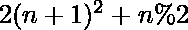

# 生成一个交替的奇偶序列，所有连续对的和作为一个完美的正方形

> 原文:[https://www . geesforgeks . org/generate-a-alternate-奇数-偶数序列-将所有连续对的和作为完美平方/](https://www.geeksforgeeks.org/generate-an-alternate-odd-even-sequence-having-sum-of-all-consecutive-pairs-as-a-perfect-square/)

给定一个整数 **N** ，任务是按递增顺序打印一个由交替的[奇数和偶数](https://www.geeksforgeeks.org/c-program-to-print-all-even-and-odd-numbers-from-1-to-n/)组成的长度序列 **N** ，使得任意两个连续项的和为一个[完美平方](https://www.geeksforgeeks.org/check-if-given-number-is-perfect-square-in-cpp/)。

**示例:**

> **输入:** N = 4
> **输出:** 1 8 17 32
> **解释:**
> 1+8 = 9 = 3<sup>2</sup>
> 8+17 = 25 = 5<sup>2</sup>
> 17+32 = 49 = 7<sup>2</sup>
> 
> **输入:**N = 2
> T3】输出: 1 8

**方法:**根据上述例子的观察，可以解决给定的问题，对于整数 **N** ，序列将是 **1，8，17，32，49** 等形式。因此，第 **N <sup>次</sup>** 项可由下式计算:

> 

因此，为了解决这个问题，使用上述公式遍历范围**【1，N】**来计算和打印序列的每个项。

下面是上述方法的实现:

## C++

```
// C++ Program to implement
// the above approach

#include <iostream>
using namespace std;

// Function to print the
// required sequence
void findNumbers(int n)
{
    int i = 0;
    while (i <= n) {

        // Print ith odd number
        cout << 2 * i * i + 4 * i
                    + 1 + i % 2
             << " ";
        i++;
    }
}

// Driver Code
int main()
{
    int n = 6;
    findNumbers(n);
}
```

## Java 语言(一种计算机语言，尤用于创建网站)

```
// Java program to implement
// the above approach
import java.util.*;

class GFG{

// Function to print the
// required sequence
static void findNumbers(int n)
{
    int i = 0;
    while (i <= n)
    {

        // Print ith odd number
        System.out.print(2 * i * i + 4 * i +
                         1 + i % 2 + " ");
        i++;
    }
}

// Driver code
public static void main (String[] args)
{
    int n = 6;

    // Function call
    findNumbers(n);
}
}

// This code is contributed by offbeat
```

## 蟒蛇 3

```
# Python3 program to implement
# the above approach

# Function to print the
# required sequence
def findNumbers(n):

    i = 0
    while (i <= n):

        # Print ith odd number
        print(2 * i * i + 4 * i +
              1 + i % 2, end = " ")

        i += 1

# Driver Code
n = 6

findNumbers(n)

# This code is contributed by sanjoy_62
```

## C#

```
// C# program to implement
// the above approach
using System;

class GFG{

// Function to print the
// required sequence
static void findNumbers(int n)
{
    int i = 0;
    while (i <= n)
    {

        // Print ith odd number
        Console.Write(2 * i * i + 4 * i +
                      1 + i % 2 + " ");

        i++;
    }
}

// Driver code
public static void Main ()
{
    int n = 6;

    // Function call
    findNumbers(n);
}
}

// This code is contributed by sanjoy_62
```

## java 描述语言

```
<script>

// Javascript Program to implement
// the above approach

// Function to print the
// required sequence
function findNumbers(n)
{
    var i = 0;
    while (i <= n) {

        // Print ith odd number
        document.write(2 * i * i + 4 * i + 1 + i % 2+" ");
        i++;
    }
}

// Driver Code
var n = 6;
findNumbers(n);

</script>
```

**Output:** 

```
1 8 17 32 49 72 97
```

***时间复杂度:**O(N)*
T5**辅助空间:** O(1)