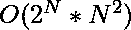

# 生成一个数组，其中偶、奇和子数组的个数分别为 E 和 O

> 原文:[https://www . geeksforgeeks . org/生成一个数组，其中偶数和奇数和子数组的计数分别是 e 和 o/](https://www.geeksforgeeks.org/generate-an-array-in-which-count-of-even-and-odd-sum-sub-arrays-are-e-and-o-respectively/)

给定三个整数 **N** 、 **E** 和 **O** 。任务是找到一个大小为 **N** 的数组，使得和偶和奇的子数组个数分别为 **E** 和 **O** 。
**示例:**

> **输入:** N = 3，E = 2，O = 4
> **输出:** 0 1 0
> 总共有 6 个子数组:{0}、{1}、{0}、{0，1}、{1，0}、{0，1，0}、{0，1，0}。
> 它们的和分别为{0，1，0，1，1，1}。
> 其中 2 个为偶数，4 个为奇数。
> **输入:** N = 3，E = 0，O = 6
> **输出:** -1

**天真方法:**使用位屏蔽生成数组中 0 和 1 的所有组合。对于每一种组合，我们都计算偶和与奇和子阵列的数量。如果它们等于给定值，那么它就是正确的组合，我们打印
数组。
对于这种生成所有集合的方法，对于每一个组合，我们找到花费的子阵列的数量。
**高效方法:**众所周知，数组的前缀是什么。所以我们将计算偶数前缀和奇数前缀的数量。如果我们知道分别具有奇数和偶数奇偶校验的前缀的数量，我们可以相应地创建任何有效的数组，前提是奇数前缀和偶数前缀的总数是 N + 1。
**示例:**如果我们有 3 个 evenPrefixSums 和 2 个 oddPrefixSums，我们可以创建一个数组[0，0，1，0]。诀窍是在放置(evenpifysums–1)个零后只放置 1。所有剩余的前缀显然都是奇数奇偶校验。
以下等式成立。

> 等于前缀和后缀= n+1

因为，prefix sum _ I–prefix sum _ j 贡献了连续子数组的和，所以两者应该具有不同的奇偶性。因此，具有奇数奇偶校验的连续子阵列的数量将是 C(偶数前缀，1) * C(奇数前缀，1)。这就产生了另一个等式。

> 等于前缀 sum * odd 前缀 sum = o

我们可以形成一个二次方程，求解得到各自的值。如果没有找到任何有效值，输出-1。
以下是上述方法的实现:

## C++

```
// C++ implementation of the approach
#include <algorithm>
#include <iostream>
using namespace std;

// Function to generate and print the required array
void CreateArray(int N, int even, int odd)
{
    int temp = -1;
    int OddPreSums;

    // Find the number of odd prefix sums
    for (int i = 0; i <= N + 1; i++) {
        if (i * ((N + 1) - i) == odd) {
            temp = 0;
            OddPreSums = i;
            break;
        }
    }

    // If no odd prefix sum found
    if (temp == -1) {
        cout << temp << endl;
    }
    else {

        // Calculating the number of even prefix sums
        int EvenPreSums = (N + 1) - OddPreSums;
        int e = 1;
        int o = 0;

        // Stores the current prefix sum
        int CurrSum = 0;
        for (int i = 0; i < N; i++) {

            // If current prefix sum is even
            if (CurrSum % 2 == 0) {

                // Print 0 until e = EvenPreSums - 1
                if (e < EvenPreSums) {
                    e++;
                    cout << "0 ";
                }
                else {
                    o++;

                    // Print 1 when e = EvenPreSums
                    cout << "1 ";
                    CurrSum++;
                }
            }
            else {
                if (e < EvenPreSums) {
                    e++;
                    cout << "1 ";
                    CurrSum++;
                }
                else {
                    o++;

                    // Print 0 for rest of the values
                    cout << "0 ";
                }
            }
        }
        cout << endl;
    }
}

// Driver code
int main()
{
    int N = 15;
    int even = 60, odd = 60;
    CreateArray(N, even, odd);

    return 0;
}
```

## Java 语言(一种计算机语言，尤用于创建网站)

```
// Java implementation of the approach
import java.io.*;

class GFG {

    // Function to generate and print the required array
    static void CreateArray(int N, int even, int odd)
    {
        int EvenPreSums = 1;
        int temp = -1;
        int OddPreSums = 0;

        // Find the number of odd prefix sums
        for (int i = 0; i <= N + 1; i++) {
            if (i * ((N + 1) - i) == odd) {
                temp = 0;
                OddPreSums = i;
                break;
            }
        }

        // If no odd prefix sum found
        if (temp == -1) {
            System.out.println(temp);
        }
        else {

            // Calculating the number of even prefix sums

            EvenPreSums = ((N + 1) - OddPreSums);
            int e = 1;
            int o = 0;

            // Stores the current prefix sum
            int CurrSum = 0;
            for (int i = 0; i < N; i++) {

                // If current prefix sum is even
                if (CurrSum % 2 == 0) {

                    // Print 0 until e = EvenPreSums - 1
                    if (e < EvenPreSums) {
                        e++;
                        System.out.print("0 ");
                    }
                    else {
                        o++;

                        // Print 1 when e = EvenPreSums
                        System.out.print("1 ");
                        CurrSum++;
                    }
                }
                else {
                    if (e < EvenPreSums) {
                        e++;
                        System.out.print("1 ");
                        CurrSum++;
                    }
                    else {
                        o++;

                        // Print 0 for rest of the values
                        System.out.print("0 ");
                    }
                }
            }
            System.out.println();
        }
    }

    // Driver code
    public static void main(String[] args)
    {

        int N = 15;
        int even = 60, odd = 60;
        CreateArray(N, even, odd);
    }
}

// This code is contributed by akt_mit
```

## 蟒蛇 3

```
# Python 3 implementation of the approach

# Function to generate and print
# the required array
def CreateArray(N, even, odd):
    temp = -1

    # Find the number of odd prefix sums
    for i in range(N + 2):
        if (i * ((N + 1) - i) == odd):
            temp = 0
            OddPreSums = i
            break

    # If no odd prefix sum found
    if (temp == -1):
        print(temp)
    else:

        # Calculating the number
        # of even prefix sums
        EvenPreSums = (N + 1) - OddPreSums
        e = 1
        o = 0

        # Stores the current prefix sum
        CurrSum = 0
        for i in range(N):

            # If current prefix sum is even
            if (CurrSum % 2 == 0):

                # Print 0 until e = EvenPreSums - 1
                if (e < EvenPreSums):
                    e += 1
                    print("0 ", end = "")
                else:
                    o += 1

                    # Print 1 when e = EvenPreSums
                    print("1 ", end = "")
                    CurrSum += 1

            else:
                if (e < EvenPreSums):
                    e += 1
                    print("1 ")
                    CurrSum += 1
                else:
                    o += 1

                    # Print 0 for rest of the values
                    print("0 ", end = "")
        print("\n", end = "")

# Driver code
if __name__ == '__main__':
    N = 15
    even = 60
    odd = 60
    CreateArray(N, even, odd)

# This code is contributed by
# Surendra_Gangwar
```

## C#

```
// C# implementation of the approach
using System;

class GFG {

    // Function to generate and print the required array
    static void CreateArray(int N, int even, int odd)
    {
        int EvenPreSums = 1;
        int temp = -1;
        int OddPreSums = 0;

        // Find the number of odd prefix sums
        for (int i = 0; i <= N + 1; i++) {
            if (i * ((N + 1) - i) == odd) {
                temp = 0;
                OddPreSums = i;
                break;
            }
        }

        // If no odd prefix sum found
        if (temp == -1) {
            Console.WriteLine(temp);
        }
        else {

            // Calculating the number of even prefix sums

            EvenPreSums = ((N + 1) - OddPreSums);
            int e = 1;
            int o = 0;

            // Stores the current prefix sum
            int CurrSum = 0;
            for (int i = 0; i < N; i++) {

                // If current prefix sum is even
                if (CurrSum % 2 == 0) {

                    // Print 0 until e = EvenPreSums - 1
                    if (e < EvenPreSums) {
                        e++;
                        Console.Write("0 ");
                    }
                    else {
                        o++;

                        // Print 1 when e = EvenPreSums
                        Console.Write("1 ");
                        CurrSum++;
                    }
                }
                else {
                    if (e < EvenPreSums) {
                        e++;
                        Console.Write("1 ");
                        CurrSum++;
                    }
                    else {
                        o++;

                        // Print 0 for rest of the values
                        Console.Write("0 ");
                    }
                }
            }
            Console.WriteLine();
        }
    }

    // Driver code
    static public void Main()
    {
        int N = 15;
        int even = 60, odd = 60;
        CreateArray(N, even, odd);
    }
}

// This code is contributed by Tushil
```

## 服务器端编程语言（Professional Hypertext Preprocessor 的缩写）

```
<?php
// PHP implementation of the approach

// Function to generate and print the required array
function CreateArray($N, $even, $odd)
{
    $temp = -1;
    $OddPreSums = 0;

    // Find the number of odd prefix sums
    for ($i = 0; $i <= $N + 1; $i++)
    {
        if ($i * (($N + 1) - $i) == $odd)
        {
            $temp = 0;
            $OddPreSums = $i;
            break;
        }
    }

    // If no odd prefix sum found
    if ($temp == -1)
    {
        echo temp ;
    }
    else
    {

        // Calculating the number of even prefix sums
        $EvenPreSums = ($N + 1) - $OddPreSums;
        $e = 1;
        $o = 0;

        // Stores the current prefix sum
        $CurrSum = 0;
        for ($i = 0; $i < $N; $i++)
        {

            // If current prefix sum is even
            if ($CurrSum % 2 == 0)
            {

                // Print 0 until e = EvenPreSums - 1
                if ($e < $EvenPreSums)
                {
                    $e++;
                    echo "0 ";
                }
                else
                {
                    $o++;

                    // Print 1 when e = EvenPreSums
                    echo "1 ";
                    $CurrSum++;
                }
            }
            else
            {
                if ($e < $EvenPreSums)
                {
                    $e++;
                    echo "1 ";
                    $CurrSum++;
                }
                else
                {
                    $o++;

                    // Print 0 for rest of the values
                    echo "0 ";
                }
            }
        }
        echo "\n";
    }
}

// Driver code
$N = 15;
$even = 60;
$odd = 60;
CreateArray($N, $even, $odd);

// This code is contributed by AnkitRai01
?>
```

## java 描述语言

```
<script>
    // Javascript implementation of the approach

    // Function to generate and print the required array
    function CreateArray(N, even, odd)
    {
        let EvenPreSums = 1;
        let temp = -1;
        let OddPreSums = 0;

        // Find the number of odd prefix sums
        for (let i = 0; i <= N + 1; i++) {
            if (i * ((N + 1) - i) == odd) {
                temp = 0;
                OddPreSums = i;
                break;
            }
        }

        // If no odd prefix sum found
        if (temp == -1) {
            document.write(temp);
        }
        else {

            // Calculating the number of even prefix sums

            EvenPreSums = ((N + 1) - OddPreSums);
            let e = 1;
            let o = 0;

            // Stores the current prefix sum
            let CurrSum = 0;
            for (let i = 0; i < N; i++) {

                // If current prefix sum is even
                if (CurrSum % 2 == 0) {

                    // Print 0 until e = EvenPreSums - 1
                    if (e < EvenPreSums) {
                        e++;
                        document.write("0 ");
                    }
                    else {
                        o++;

                        // Print 1 when e = EvenPreSums
                        document.write("1 ");
                        CurrSum++;
                    }
                }
                else {
                    if (e < EvenPreSums) {
                        e++;
                        document.write("1 ");
                        CurrSum++;
                    }
                    else {
                        o++;

                        // Print 0 for rest of the values
                        document.write("0 ");
                    }
                }
            }
            document.write();
        }
    }

    let N = 15;
    let even = 60, odd = 60;
    CreateArray(N, even, odd);

</script>
```

**Output:** 

```
0 0 0 0 0 0 0 0 0 1 0 0 0 0 0
```