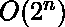

# 使用分支定界

生成长度为 N 的二进制字符串

> 原文:[https://www . geeksforgeeks . org/generate-binary-length-n-use-branch-and-bound/](https://www.geeksforgeeks.org/generate-binary-strings-of-length-n-using-branch-and-bound/)

任务是使用[分支和绑定](https://www.geeksforgeeks.org/branch-and-bound-algorithm/)技术生成长度为 N 的二进制字符串

**示例:**

> **输入:** N = 3
> **输出:**
> 000
> 001
> 010
> 011
> 100
> 101
> 110
> 111
> **说明:**
> 3 位二进制数字为
> 0、1、2、3、4、5、6、7
> 
> **输入:** N = 2
> **输出:**
> 00
> 01
> 10
> 11

**进场:**

使用分支和绑定生成组合:

*   它从一个空解[向量](https://www.geeksforgeeks.org/vector-in-cpp-stl/)开始。
*   当[队列](https://www.geeksforgeeks.org/queue-data-structure/)不为空时，从队列中移除部分向量。
*   如果是最终矢量打印，则组合为其他，
*   对于部分向量的下一个分量，通过固定下一个分量的所有可能状态来创建 k 个子向量，将向量插入队列。

以下是上述方法的实施

## C++

```
// CPP Program to generate
// Binary Strings using Branch and Bound
#include <bits/stdc++.h>
using namespace std;

// Creating a Node class
class Node
{
public:
    int *soln;
    int level;
    vector<Node *> child;
    Node *parent;

    Node(Node *parent, int level, int N)
    {
        this->parent = parent;
        this->level = level;
        this->soln = new int[N];
    }
};

// Utility function to generate binary strings of length n
void generate(Node *n, int &N, queue<Node *> &Q)
{
    // If list is full print combination
    if (n->level == N)
    {
        for (int i = 0; i < N; i++)
            cout << n->soln[i];
        cout << endl;
    }
    else
    {
        int l = n->level;

        // iterate while length is not equal to n
        for (int i = 0; i <= 1; i++)
        {
            Node *x = new Node(n, l + 1, N);
            for (int k = 0; k < l; k++)
                x->soln[k] = n->soln[k];
            x->soln[l] = i;
            n->child.push_back(x);
            Q.push(x);
        }
    }
}

// Driver Code
int main()
{
    // Initiate Generation
    // Create a root Node
    int N = 3;
    Node *root;
    root = new Node(NULL, 0, N);

    // Queue that maintains the list of live Nodes
    queue<Node *> Q;

    // Instantiate the Queue
    Q.push(root);

    while (!Q.empty())
    {
        Node *E = Q.front();
        Q.pop();
        generate(E, N, Q);
    }

    return 0;
}

// This code is contributed by
// sanjeev2552
```

## Java 语言(一种计算机语言，尤用于创建网站)

```
// Java Program to generate
// Binary Strings using Branch and Bound

import java.io.*;
import java.util.*;

// Creating a Node class
class Node {

    int soln[];
    int level;
    ArrayList<Node> child;
    Node parent;

    Node(Node parent, int level, int N)
    {
        this.parent = parent;
        this.level = level;
        this.soln = new int[N];
    }
}

class GFG {

    static int N;

    // Queue that maintains the list of live Nodes
    public static Queue<Node> Q;

    // Utility function to generate binary strings of length n
    public static void generate(Node n)
    {
        // If list is full print combination
        if (n.level == N) {
            for (int i = 0; i <= N - 1; i++) {
                System.out.print(n.soln[i]);
            }
            System.out.println();
        }
        else {

            // Create a new vector for new combination
            n.child = new ArrayList<Node>();

            int l = n.level;

            // iterate while length is not equal to n
            for (int i = 0; i <= 1; i++) {
                Node x = new Node(n, l + 1, N);
                for (int k = 0; k < l; k++) {
                    x.soln[k] = n.soln[k];
                }
                x.soln[l] = i;
                n.child.add(x);
                Q.add(x);
            }
        }
    }

    // Driver code
    public static void main(String args[])
    {
        // Initiate Generation
        // Create a root Node
        N = 3;
        Node root = new Node(null, 0, N);

        // Instantiate the Queue
        Q = new LinkedList<Node>();
        Q.add(root);

        while (Q.size() != 0) {
            Node E = Q.poll();
            generate(E);
        }
    }
}
```

## C#

```
// C# Program to generate
// Binary Strings using Branch and Bound
using System;
using System.Collections.Generic;

// Creating a Node class
public class Node 
{
    public int []soln;
    public int level;
    public List<Node> child;
    public Node parent;

    public Node(Node parent, 
                int level, int N)
    {
        this.parent = parent;
        this.level = level;
        this.soln = new int[N];
    }
}

class GFG
{
    static int N;

    // Queue that maintains the list of live Nodes
    public static Queue<Node> Q;

    // Utility function to generate 
    // binary strings of length n
    public static void generate(Node n)
    {
        // If list is full print combination
        if (n.level == N)
        {
            for (int i = 0; i <= N - 1; i++)
            {
                Console.Write(n.soln[i]);
            }
            Console.WriteLine();
        }
        else
        {

            // Create a new vector for new combination
            n.child = new List<Node>();

            int l = n.level;

            // iterate while length is not equal to n
            for (int i = 0; i <= 1; i++) 
            {
                Node x = new Node(n, l + 1, N);
                for (int k = 0; k < l; k++) 
                {
                    x.soln[k] = n.soln[k];
                }
                x.soln[l] = i;
                n.child.Add(x);
                Q.Enqueue(x);
            }
        }
    }

    // Driver code
    public static void Main(String []args)
    {
        // Initiate Generation
        // Create a root Node
        N = 3;
        Node root = new Node(null, 0, N);

        // Instantiate the Queue
        Q = new Queue<Node>();
        Q.Enqueue(root);

        while (Q.Count != 0)
        {
            Node E = Q.Dequeue();
            generate(E);
        }
    }
}

// This code is contributed by Rajput-Ji
```

**Output:**

```
000
001
010
011
100
101
110
111

```

**时间复杂度:** 