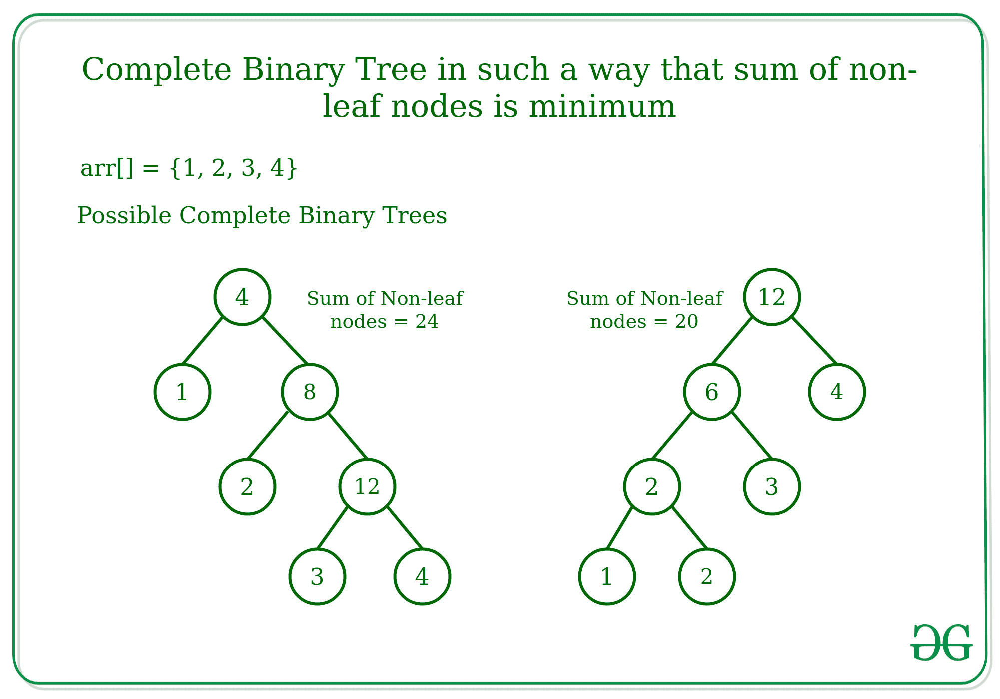

# 以非叶节点之和最小的方式生成完全二叉树

> 原文:[https://www . geeksforgeeks . org/generate-complete-二叉树-in-way-非叶节点之和-is-minimum/](https://www.geeksforgeeks.org/generate-complete-binary-tree-in-such-a-way-that-sum-of-non-leaf-nodes-is-minimum/)

给定大小为 **N** 的数组**arr【】**，任务是生成[完全二叉树](https://www.geeksforgeeks.org/binary-tree-set-3-types-of-binary-tree/)，使得非叶节点的总和最小，而叶节点的值对应于树的有序遍历中的数组元素，并且每个非叶节点的值对应于左子树和右子树中最大叶值的乘积
**示例:**

> **输入:** arr[] = {1，2，3，4}
> **输出:** 20
> **解释:**
> 解释请参考下文
> **输入:** arr[] = {5，2，3}
> **输出:** 21



**方法:**
要移除一个数字**arr【I】**，需要一个代价 **a * b** ，其中 **b > = a** 也是数组的一个元素。为了最大限度地降低拆卸成本，想法是尽量减少 **b** 。要计算非叶节点，有两个候选节点，即左边的第一个最大数字和右边的第一个最大数字。移除**arr【I】**的成本为 **a * min(左，右)**。它可以进一步分解，以找到数组中的下一个更大的元素，在左边和右边各一个。
**参考:** [下一个更大的元素](https://www.geeksforgeeks.org/next-greater-element-in-same-order-as-input/)
下面是上述方法的实现:

## C++

```
// C++ implementation to find the
// minimum cost tree

#include <bits/stdc++.h>
using namespace std;

// Function to find minimum cost tree
int MinCostTree(int arr[], int n)
{
    int ans = 0;

    // Stack
    vector<int> st = { INT_MAX };

    // Loop to traverse the array elements
    for (int i = 0; i < n; i++) {

        // Keep array elements
        // in decreasing order by poping out
        // the elements from stack till the top
        // element is less than current element
        while (st.back() <= arr[i]) {

            // Get top element
            int x = st.back();

            // Remove it
            st.pop_back();

            // Get the minimum cost to remove x
            ans += x * min(st.back(), arr[i]);
        }

        // Push current element
        st.push_back(arr[i]);
    }

    // Find cost for all remaining elements
    for (int i = 2; i < st.size(); i++)
        ans += st[i] * st[i - 1];

    return ans;
}

// Driver Code
int main()
{
    int arr[] = { 5, 2, 3 };

    int n = sizeof(arr) / sizeof(arr[0]);

    // Function call
    cout << MinCostTree(arr, n);

    return 0;
}
```

## Java 语言(一种计算机语言，尤用于创建网站)

```
// Java implementation to find the
// minimum cost tree
import java.util.*;

class GFG{

// Function to find minimum cost tree
static int MinCostTree(int arr[], int n)
{
    int ans = 0;

    // Stack
    Vector<Integer> st = new Vector<Integer>();
    st.add(Integer.MAX_VALUE);

    // Loop to traverse the array elements
    for (int i = 0; i < n; i++) {

        // Keep array elements
        // in decreasing order by poping out
        // the elements from stack till the top
        // element is less than current element
        while (st.get(st.size()-1) <= arr[i]) {

            // Get top element
            int x = st.get(st.size()-1);

            // Remove it
            st.remove(st.size()-1);

            // Get the minimum cost to remove x
            ans += x * Math.min(st.get(st.size()-1), arr[i]);
        }

        // Push current element
        st.add(arr[i]);
    }

    // Find cost for all remaining elements
    for (int i = 2; i < st.size(); i++)
        ans += st.get(i) * st.get(i-1);

    return ans;
}

// Driver Code
public static void main(String[] args)
{
    int arr[] = { 5, 2, 3 };

    int n = arr.length;

    // Function call
    System.out.print(MinCostTree(arr, n));
}
}

// This code is contributed by sapnasingh4991
```

## 蟒蛇 3

```
# Python3 implementation to find the
# minimum cost tree

# Function to find minimum cost tree
def MinCostTree(arr, n):

    ans = 0
    st = [2**32]

    # Loop to traverse the array elements
    for i in range(n):

        # Keep array elements
        # in decreasing order by poping out
        # the elements from stack till the top
        # element is less than current element
        while (st[-1] <= arr[i]):

            # Get top element
            x = st[-1]

            # Remove it
            st.pop()

            # Get the minimum cost to remove x
            ans += x * min(st[-1], arr[i])

        # Push current element
        st.append(arr[i])

    # Find cost for all remaining elements
    for i in range(2,len(st)):
        ans += st[i] * st[i - 1]

    return ans

# Driver Code
arr = [5, 2, 3]

n = len(arr)

# Function call
print(MinCostTree(arr, n))

# This code is contributed by shubhamsingh10
```

## C#

```
// C# implementation to find the
// minimum cost tree
using System;
using System.Collections.Generic;

class GFG
{

// Function to find minimum cost tree
static int MinCostTree(int []arr, int n)
{
    int ans = 0;

    // Stack
    List<int> st = new List<int>();
    st.Add(int.MaxValue);

    // Loop to traverse the array elements
    for (int i = 0; i < n; i++) {

        // Keep array elements
        // in decreasing order by poping out
        // the elements from stack till the top
        // element is less than current element
        while (st[st.Count-1] <= arr[i]) {

            // Get top element
            int x = st[st.Count-1];

            // Remove it
            st.RemoveAt(st.Count-1);

            // Get the minimum cost to remove x
            ans += x * Math.Min(st[st.Count-1], arr[i]);
        }

        // Push current element
        st.Add(arr[i]);
    }

    // Find cost for all remaining elements
    for (int i = 2; i < st.Count; i++)
        ans += st[i] * st[i-1];

    return ans;
}

// Driver Code
public static void Main(String[] args)
{
    int []arr = { 5, 2, 3 };

    int n = arr.Length;

    // Function call
    Console.Write(MinCostTree(arr, n));
}
}

// This code is contributed by 29AjayKumar
```

## java 描述语言

```
<script>
// Javascript implementation to find the
// minimum cost tree

// Function to find minimum cost tree
function MinCostTree(arr, n)
{
    let ans = 0;

    // Stack
    let st = new Array()
    st.push(Number.MAX_SAFE_INTEGER);

    // Loop to traverse the array elements
    for (let i = 0; i < n; i++) {

        // Keep array elements
        // in decreasing order by poping out
        // the elements from stack till the top
        // element is less than current element
        while (st[st.length -1] <= arr[i]) {

            // Get top element
            let x = st[st.length-1];

            // Remove it
            st.pop();

            // Get the minimum cost to remove x
            ans += x * Math.min(st[st.length - 1], arr[i]);
        }

        // Push current element
        st.push(arr[i]);
    }

    // Find cost for all remaining elements
    for (let i = 2; i < st.length; i++)
        ans += st[i] * st[i - 1];

    return ans;
}

// Driver Code

    let arr = [ 5, 2, 3 ];

    let n = arr.length;

    // Function call
    document.write(MinCostTree(arr, n));

    // This code is contributed by gfgking
</script>
```

**Output:** 

```
21
```