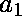

# 生成一个数的所有循环排列

> 原文:[https://www . geesforgeks . org/generate-cyclic-排列-number/](https://www.geeksforgeeks.org/generate-cyclic-permutations-number/)

给定一个数 N，我们的任务是生成该数所有可能的循环排列。
循环置换将集合的所有元素移动固定的偏移量。对于具有元素、、…、的集合，向左一个位置的循环排列将产生、…、、，向右一个位置的循环排列将产生、、、…。
**举例:**

```
Input :  123
Output : 123
         312
         231

Input :  5674
Output : 5674
         4567
         7456
         6745
```

想法是使用下面的公式生成一个数字的下一个排列。

```
    rem = num % 10;
    div = num / 10;
    num = (pow(10, n - 1)) * rem + div;
```

在重复上述步骤的同时，如果我们回到原来的数字，我们会停下来返回。

## C++

```
// Program to generate all cyclic permutations
// of number
#include <bits/stdc++.h>
using namespace std;

// Function to count the total number of digits
// in a number.
int countdigits(int N)
{
    int count = 0;
    while (N) {
        count++;
        N = N / 10;
    }
    return count;
}

// Function to generate all cyclic permutations
// of a number
void cyclic(int N)
{
    int num = N;
    int n = countdigits(N);

    while (1) {
        cout << num << endl;

        // Following three lines generates a
        // circular pirmutation of a number.
        int rem = num % 10;
        int div = num / 10;
        num = (pow(10, n - 1)) * rem + div;

        // If all the permutations are checked
        // and we obtain original number exit
        // from loop.
        if (num == N)
            break;       
    }
}

// Driver Program
int main()
{
    int N = 5674;
    cyclic(N);
    return 0;
}
```

## Java 语言(一种计算机语言，尤用于创建网站)

```
// Java Program to generate all
// cyclic permutations of number
class GFG
{

    // Function to count the total number
    // of digits in a number.
    static int countdigits(int N)
    {
        int count = 0;
        while (N>0) {
            count++;
            N = N / 10;
        }
        return count;
    }

    // Function to generate all cyclic
    // permutations of a number
    static void cyclic(int N)
    {
        int num = N;
        int n = countdigits(N);

        while (true) {
            System.out.println(num);

            // Following three lines generates a
            // circular pirmutation of a number.
            int rem = num % 10;
            int dev = num / 10;
            num = (int)((Math.pow(10, n - 1)) *
                                rem + dev);

            // If all the permutations are
            // checked and we obtain original
            // number exit from loop.
            if (num == N)
                break;
        }
    }

    // Driver Program
    public static void main (String[] args) {
    int N = 5674;
    cyclic(N);
    }
}

/* This code is contributed by Mr. Somesh Awasthi */
```

## 蟒蛇 3

```
# Python3 Program to
# generate all cyclic
# permutations of number
import math

# Function to count the
# total number of digits
# in a number.
def countdigits(N):
    count = 0;
    while (N):
        count = count + 1;
        N = int(math.floor(N / 10));
    return count;

# Function to generate
# all cyclic permutations
# of a number
def cyclic(N):
    num = N;
    n = countdigits(N);
    while (1):
        print(int(num));

        # Following three lines
        # generates a circular
        # permutation of a number.
        rem = num % 10;
        div = math.floor(num / 10);
        num = ((math.pow(10, n - 1)) *
                           rem + div);

        # If all the permutations
        # are checked and we obtain
        # original number exit from loop.
        if (num == N):
            break;

# Driver Code
N = 5674;
cyclic(N);

# This code is contributed by mits
```

## C#

```
// C# Program to generate all
// cyclic permutations of number
using System;

class GFG
{
    // Function to count the total number
    // of digits in a number.
    static int countdigits(int N)
    {
        int count = 0;
        while (N > 0) {
            count++;
            N = N / 10;
        }
        return count;
    }

    // Function to generate all cyclic
    // permutations of a number
    static void cyclic(int N)
    {
        int num = N;
        int n = countdigits(N);

        while (true) {
            Console.WriteLine(num);

            // Following three lines generates a
            // circular permutation of a number.
            int rem = num % 10;
            int dev = num / 10;
            num = (int)((Math.Pow(10, n - 1)) *
                                    rem + dev);

            // If all the permutations are
            // checked and we obtain original
            // number exit from loop.
            if (num == N)
                break;
        }
    }

    // Driver Program
    public static void Main ()
    {
      int N = 5674;
      cyclic(N);
    }
}

// This code is contributed by nitin mittal
```

## 服务器端编程语言（Professional Hypertext Preprocessor 的缩写）

```
<?php
// PHP Program to generate all
// cyclic permutations of number

// Function to count the total
// number of digits in a number.
function countdigits($N)
{
    $count = 0;
    while ($N)
    {
        $count++;
        $N = floor($N / 10);
    }
    return $count;
}

// Function to generate all
// cyclic permutations of a number
function cyclic($N)
{
    $num = $N;
    $n = countdigits($N);

    while (1)
    {
        echo ($num);
        echo "\n" ;

        // Following three lines generates a
        // circular pirmutation of a number.
        $rem = $num % 10;
        $div = floor($num / 10);
        $num = (pow(10, $n - 1)) * $rem + $div;

        // If all the permutations are checked
        // and we obtain original number exit
        // from loop.
        if ($num == $N)
            break;    
    }
}

    // Driver Code
    $N = 5674;
    cyclic($N);

// This code is contributed by nitin mittal
?>
```

## java 描述语言

```
<script>

// javascript Program to generate all
// cyclic permutations of number  
// Function to count the total number
// of digits in a number.

function countdigits(N)
{
    var count = 0;
    while (N>0) {
        count++;
        N = parseInt(N / 10);
    }
    return count;
}

// Function to generate all cyclic
// permutations of a number
function cyclic(N)
{
    var num = N;
    var n = countdigits(N);

    while (true) {
        document.write(num+"<br>");

        // Following three lines generates a
        // circular pirmutation of a number.
        var rem = num % 10;
        var dev = parseInt(num / 10);
        num = parseInt(((Math.pow(10, n - 1)) *
                            rem + dev));

        // If all the permutations are
        // checked and we obtain original
        // number exit from loop.
        if (num == N)
            break;
    }
}

// Driver Program
var N = 5674;
cyclic(N);

// This code is contributed by Amit Katiyar
</script>
```

**输出:**

```
 5674
 4567
 7456
 6745
```

本文由**vinet Joshi**供稿。如果你喜欢 GeeksforGeeks 并想投稿，你也可以使用[write.geeksforgeeks.org](https://write.geeksforgeeks.org)写一篇文章或者把你的文章邮寄到 contribute@geeksforgeeks.org。看到你的文章出现在极客博客主页上，帮助其他极客。
如果你发现任何不正确的地方，或者你想分享更多关于上面讨论的话题的信息，请写评论。