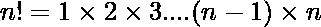
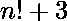
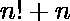

# 生成 n 个连续合成数字的列表(一个有趣的方法)

> 原文:[https://www . geesforgeks . org/generate-list-n-continuous-composite-numbers-interest-method/](https://www.geeksforgeeks.org/generate-list-n-consecutive-composite-numbers-interesting-method/)

给定一个数字 n，生成 n 个[复合数字](https://www.geeksforgeeks.org/composite-number/)的列表。
**例:**

```
Input : 5
Output : 122, 123, 124, 125

Input : 10
Output : 3628802, 3628803, 3628804, 3628805, 3628806, 
         3628807, 3628808, 3628809, 3628810
```

这里的想法是利用的属性。既然，那么数字，都分。因此可以被 2 整除，可以被 3 整除…..可被 n 整除。通过上述模式，它们是连续的复合物。
我们发现(n+1)！，那么我们打印数字(n+1)！+ 2，(n+1)！+ 3, ….(n+1)！+ (n + 1)。
以下是上述方法的实施:

## C++

```
// CPP program to print n consecutive composite
// numbers.
#include <iostream>
using namespace std;

// function to find factorial of given
// number
unsigned long long int factorial(unsigned int n)
{   
    unsigned long long int res = 1;
    for (int i=2; i<=n; i++)
        res *= i;
    return res;
}

// Prints n consecutive numbers.
void printNComposite(int n)
{
    unsigned long long int fact = factorial(n+1);
    for (int i = 2; i <= n+1; ++i)
        cout << fact + i << " ";
}

// Driver program to test above function
int main()
{
    int n = 4;
    printNComposite(n);
    return 0;
}
```

## Java 语言(一种计算机语言，尤用于创建网站)

```
// Java program to print n consecutive composite
// numbers

class GFG {

// function to find factorial of given
// number
    static long factorial(int n) {
        long res = 1;
        for (int i = 2; i <= n; i++) {
            res *= i;
        }
        return res;
    }

// Prints n consecutive numbers.
    static void printNComposite(int n) {
        long fact = factorial(n + 1);
        for (int i = 2; i <= n + 1; ++i) {
            System.out.print(fact + i + " ");
        }
    }

// Driver program to test above function
    public static void main(String[] args) {
        int n = 4;
        printNComposite(n);

    }
}
```

## 蟒蛇 3

```
# Python3 program to print n consecutive
# composite numbers.

# function to find factorial
# of given number
def factorial( n):

    res = 1;
    for i in range(2, n + 1):
        res *= i;
    return res;

# Prints n consecutive numbers.
def printNComposite(n):
    fact = factorial(n + 1);
    for i in range(2, n + 2):
        print(fact + i, end = " ");

# Driver Code
n = 4;
printNComposite(n);

# This code is contributed by mits
```

## C#

```
// C# program to print n consecutive composite
// numbers
using System;

public class Program{

// function to find factorial of given
// number
    static long factorial(int n) {
        long res = 1;
        for (int i = 2; i <= n; i++) {
            res *= i;
        }
        return res;
    }

// Prints n consecutive numbers.
    static void printNComposite(int n) {
        long fact = factorial(n + 1);
        for (int i = 2; i <= n + 1; ++i) {
            Console.Write(fact + i + " ");
        }
    }

// Driver program to test above function
    public static void Main() {
        int n = 4;
        printNComposite(n);

    }
}

// This code is contributed by Rajput-Ji
```

## 服务器端编程语言（Professional Hypertext Preprocessor 的缩写）

```
<?php
// PHP program to print n consecutive
// composite numbers.

// function to find factorial of given
// number
function factorial( $n)
{
    $res = 1;
    for ($i = 2; $i <= $n; $i++)
        $res *= $i;
    return $res;
}

// Prints n consecutive numbers.
function printNComposite(int $n)
{
    $fact = factorial($n + 1);
    for($i = 2; $i <= $n + 1; ++$i)
        echo $fact + $i ," ";
}

    // Driver Code
    $n = 4;
    printNComposite($n);

// This code is contributed by anuj_67.
?>
```

## java 描述语言

```
<script>

// JavaScript program to print n consecutive composite
// numbers

// function to find factorial of given
// number
    function factorial(n) {
        let res = 1;
        for (let i = 2; i <= n; i++) {
            res *= i;
        }
        return res;
    }

// Prints n consecutive numbers.
    function printNComposite(n) {
        let fact = factorial(n + 1);
        for (let i = 2; i <= n + 1; ++i) {
            document.write(fact + i + " ");
        }
    }

// Driver code

        let n = 4;
        printNComposite(n);

    // This code is contributed by code_hunt.
</script>
```

**Output:** 

```
122 123 124 125
```

上述解决方案很快就会导致溢出(对于小的 n 值)。我们可以用技巧[求大数](https://www.geeksforgeeks.org/factorial-large-number/)的阶乘，避免溢出。