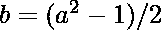
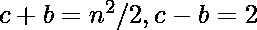

# 从单个整数生成一个毕达哥拉斯三元组

> 原文:[https://www . geesforgeks . org/generate-毕达哥拉斯-三元组-单整数/](https://www.geeksforgeeks.org/generate-pythagoras-triplet-single-integer/)

给定一个整数 n  [1，1000000000]，生成一个毕达哥拉斯三元组，如果可能的话，该三元组的一边包括 n。
**例:**

```
Input : 22
Output : Pythagoras Triplets exist i.e. 22 120 122

Input : 4
Output : Pythagoras Triplets exist i.e.  4 3 5

Input : 2
Output : No Pythagoras Triplet exists 
```

**解释:**
定义:“毕达哥拉斯三元组”是毕达哥拉斯定理的整数解，即它们满足方程
我们的任务是从整数值生成三元组。这可能是一个令人困惑的任务，因为给我们的边可以是斜边或非斜边。
通过把三胞胎放在一个公式中开始计算三胞胎，可以推导出只有对于 1 和 2，才可能没有三胞胎。
再进一步，
如果 n 为偶数，我们的三胞胎用公式
计算如果 n 为奇数，我们的三胞胎用公式
*计算证明:*
勾股定理也可以写成
即 a*a = (c-b)(c+b)
a*a x 1 = a*a，由此可见和一样，如果 n 为奇数，这种解法也有效。
对于偶数解，，由此，我们得到 n 为偶数时的上式。
**代码**

## C++

```
// CPP program to find Pythagoras triplet
// with one side as given number.
#include <bits/stdc++.h>
using namespace std;

// Function, to evaluate the Pythagoras triplet
// with includes 'n' if possible
void evaluate(long long int n)
{

    if (n == 1 || n == 2)
        printf("No Pythagoras Triplet exists");

    else if (n % 2 == 0) {

        // Calculating for even case
        long long int var = 1LL * n * n / 4;
        printf("Pythagoras Triplets exist i.e. ");
        printf("%lld %lld %lld", n, var - 1, var + 1);
    }

    else if (n % 2 != 0) {

        // Calculating for odd case
        long long int var = 1LL * n * n + 1;
        printf("Pythagoras Triplets exist i.e. ");
        printf("%lld %lld %lld", n, var / 2 - 1, var / 2);
    }
}

// Driver function
int main()
{
    long long int n = 22;
    evaluate(n);
    return 0;
}
```

## Java 语言(一种计算机语言，尤用于创建网站)

```
// Java program to find
// Pythagoras triplet
// with one side as
// given number.
import java.io.*;

class GFG
{

// Function, to evaluate
// the Pythagoras triplet
// with includes 'n' if
// possible
static void evaluate( int n)
{
    if (n == 1 || n == 2)
        System.out.println("No Pythagoras " +
                           "Triplet exists");

    else if (n % 2 == 0)
    {

        // Calculating for even case
        int var = 1 * n * n / 4;
        System.out.print("Pythagoras Triplets " +
                                  "exist i.e. ");
        System.out.print(n + " ");
        System.out.print(var - 1+ " ");
        System.out.println(var + 1 +" ");
    }

    else if (n % 2 != 0)
    {

        int var = 1 * n * n + 1;
        System.out.print("Pythagoras Triplets " +
                                  "exist i.e. ");
        System.out.print(n + " ");
        System.out.print(var / 2 - 1 + " ");
        System.out.println(var / 2 + " ");
    }
}

// Driver Code
public static void main(String[] args)
{
    int n = 22;
    evaluate(n);
}
}

// This code is contributed
// by ajit
```

## 蟒蛇 3

```
# Python3 program to find
# Pythagoras triplet with
# one side as given number.

# Function, to evaluate the
# Pythagoras triplet with
# includes 'n' if possible
def evaluate(n):
    if (n == 1 or n == 2):
        print("No Pythagoras" +
            " Triplet exists");
    elif (n % 2 == 0):

        # Calculating for
        # even case
        var = n * n / 4;
        print("Pythagoras Triplets" +
             " exist i.e. ", end = "");
        print(int(n), " ", int(var - 1),
                      " ", int(var + 1));
    elif (n % 2 != 0):

        # Calculating for odd case
        var = n * n + 1;
        print("Pythagoras Triplets " +
             "exist i.e. ", end = "");
        print(int(n), " ", int(var / 2 - 1),
                         " ", int(var / 2));

# Driver Code
n = 22;
evaluate(n);

# This code is contributed by mits
```

## C#

```
// C# program to find
// Pythagoras triplet
// with one side as
// given number.
using System;

class GFG
{

// Function, to evaluate
// the Pythagoras triplet
// with includes 'n' if
// possible
static void evaluate(int n)
{
    if (n == 1 || n == 2)
        Console.WriteLine("No Pythagoras " +
                          "Triplet exists");

    else if (n % 2 == 0)
    {

        // Calculating for even case
        int var = 1 * n * n / 4;
        Console.Write("Pythagoras Triplets " +
                               "exist i.e. ");
        Console.Write(n + " ");
        Console.Write(var - 1+ " ");
        Console.WriteLine(var + 1 +" ");
    }

    else if (n % 2 != 0)
    {
        int var = 1 * n * n + 1;
        Console.Write("Pythagoras Triplets " +
                               "exist i.e. ");
        Console.Write(n + " ");
        Console.Write(var / 2 - 1 + " ");
        Console.WriteLine(var / 2 + " ");
    }
}

// Driver Code
static public void Main ()
{
    int n = 22;
    evaluate(n);
}
}

// This code is contributed
// by ajit
```

## 服务器端编程语言（Professional Hypertext Preprocessor 的缩写）

```
<?php
// PHP program to find Pythagoras triplet
// with one side as given number.

// Function, to evaluate the
// Pythagoras triplet with
// includes 'n' if possible
function evaluate($n)
{

    if ($n == 1 || $n == 2)
        echo "No Pythagoras Triplet exists";

    else if ($n % 2 == 0) {

        // Calculating for even case
        $var = $n * $n / 4;
        echo "Pythagoras Triplets exist i.e. ";
        echo $n, " ", $var - 1, " ", $var + 1;
    }

    else if ($n % 2 != 0) {

        // Calculating for odd case
        $var = $n * $n + 1;
        echo "Pythagoras Triplets exist i.e. ";
        echo $n, " ", $var / 2 - 1, " ", $var / 2;
    }
}

    // Driver Code
    $n = 22;
    evaluate($n);

// This code is contributed by ajit
?>
```

## java 描述语言

```
<script>
    // Javascript program to find
    // Pythagoras triplet
    // with one side as
    // given number.

    // Function, to evaluate
    // the Pythagoras triplet
    // with includes 'n' if
    // possible
    function evaluate(n)
    {
        if (n == 1 || n == 2)
            document.write("No Pythagoras Triplet exists");

        else if (n % 2 == 0)
        {

            // Calculating for even case
            let Var = 1 * n * n / 4;
            document.write("Pythagoras Triplets " +
                                   "exist i.e. ");
            document.write(n + " ");
            document.write(Var - 1+ " ");
            document.write(Var + 1 +" ");
        }

        else if (n % 2 != 0)
        {
            let Var = 1 * n * n + 1;
            document.write("Pythagoras Triplets " +
                                   "exist i.e. ");
            document.write(n + " ");
            document.write(parseInt(Var / 2, 10) - 1 + " ");
            document.write(parseInt(Var / 2, 10) + " ");
        }
    }

    let n = 22;
    evaluate(n);

</script>
```

**输出:**

```
Pythagoras Triplets exist i.e. 22 120 122
```